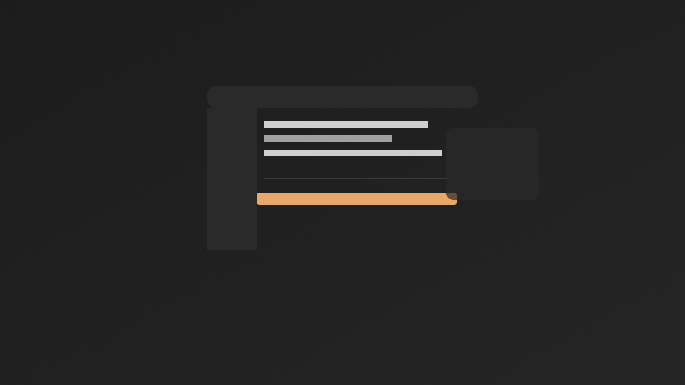
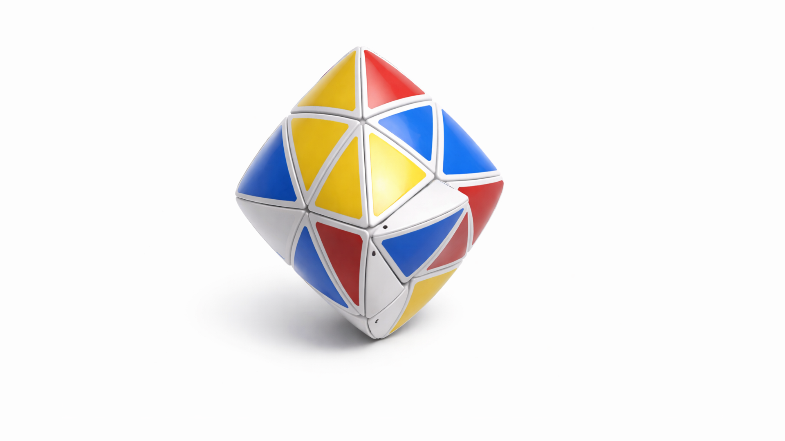
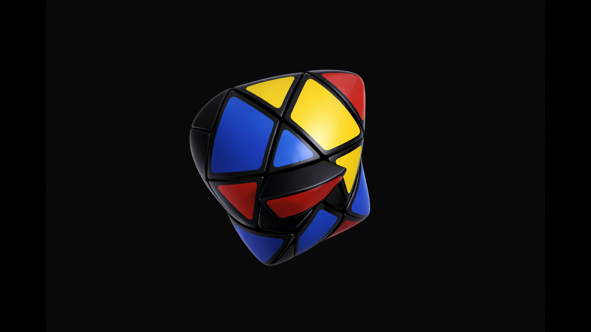

-   

    # 01. Áttekintés { #01-attekintes }

    > Szerző: Hegedüs Gábor (@hege-g) 
    > Licenc: [MIT (Kód) / CC BY-NC-ND 4.0 (Docs)] 
    > Frostwood Docs: v1.0.0 
    > Rendszerverzió / Állapot: v1.0.5 / Stabil 
    > Blokk:  Alapok

-   ## Tartalomkártyák

    * [:material-infinity: 1. A Frostwood nem dekoráció](#1-a-frostwood-nem-dekoracio)
    * [:material-infinity: 2. A rendszer nem beszél, hanem válaszol](#2-a-rendszer-nem-beszel-hanem-valaszol)
    * [:material-infinity: 3. Hierarchia a paletta helyett](#3-hierarchia-a-paletta-helyett)
    * [:material-infinity: 4. Két alapállapot: Karakter és WCAG](#4-ket-alapallapot-karakter-es-wcag)
        * [:material-infinity: 4.1 Állapotjelző ikonok (Izometrikus rendszer)](#41-allapotjelzo-ikonok-izometrikus-rendszer)
        * [:material-infinity: 4.2 Karakter mód](#42-karakter-mod)
        * [:material-infinity: 4.3 WCAG mód](#43-wcag-mod)
    * [:material-infinity: 5. Automatika csak ott, ahol értelme van](#5-automatika-csak-ott-ahol-ertelme-van)
    * [:material-infinity: 6. A felület térként viselkedik](#6-a-felulet-terkent-viselkedik)
    * [:material-infinity: 7. Akadálymentességi alapelv (Accessibility Principle)](#7-akadalymentessegi-alapelv-accessibility-principle)
        * [:material-infinity: 7.1 Elvi alapok](#71-elvi-alapok)
        * [:material-infinity: 7.2 Rendszerszint vs alkalmazásszint](#72-rendszerszint-vs-alkalmazasszint)
        * [:material-infinity: 7.3 Mit nem csinál a Frostwood](#73-mit-nem-csinal-a-frostwood)
    * [:material-infinity: 8. Mentális modell](#8-mentalis-modell)

## 1. A Frostwood nem dekoráció

A Frostwood nem skin.  
Nem témacsomag.  
Nem látványverseny.

A Frostwood egy rendszerszintű réteg, amely a Windows 11 felületét hosszú távon élhetőbbé teszi.

Célja:

* csökkenteni a vizuális zajt  
* stabil hierarchiát adni  
* kiszámítható viselkedést biztosítani  
* támogatni a hosszú, fókuszált munkát  

???+ abstract "Összefoglaló"
    > A Frostwood nem „szebb Windows”, hanem **nyugodtabb Windows**.

---

## 2. A rendszer nem beszél, hanem válaszol

??? info "Vizuális leírás akadálymentesítéshez"
    A kép egy sötét hangulatú, szélesvásznú Frostwood jelenet.

    A teljes háttér mélyszürke, nagy homogén felületként jelenik meg. A középpontban egy nagyméretű, lekerekített sarkú főablak látható. Az ablak tiszta és egyszerű, nem részletezett túl, inkább egy rendezett munkafelület benyomását kelti.

    A főablakban kevés elem szerepel: néhány sor, blokk vagy panel, amelyek a rendszer rendezettségét sugallják. Az egyik elem finom narancssárga hangsúlyt kap, ez jelzi az aktív fókuszt vagy kijelölést.

    A központi ablak mellett vagy mögött egy kisebb, másodlagos panel is megjelenhet, amely a rendszer rétegzettségét érzékelteti. A kép valamelyik szélén néhány egyszerű ikon vagy kis jelölés utal arra, hogy ez egy egységes ikonrendszert használó környezet.

    A kép összhatása nyugodt, sötét, fókuszált és professzionális. Nem zsúfolt, nem dekoratív, hanem csendes és rendezett.

???+ quote "Alapelv"
    > A felület nem vezet, hanem reagál.

Az accent szín nem dominál.  
Nem díszít.  
Nem hívja fel magára a figyelmet.

A jelzés csak akkor jelenik meg, ha annak jelentése van.

A rendszer válaszol:

* fókuszra  
* aktív műveletre  
* valódi figyelmeztetésre  

Nem reagál túlzó hoverre.  
Nem színez passzív állapotot.  
Nem animál öncélúan.

A Frostwood nem tilt minden többcsatornás visszajelzést, csak a versengő vagy túlzó jelzéskombinációkat.

???+ quote "Alapelv"
    > Egy eseményhez egy domináns jelzés tartozzon, és ne jelenjen meg egyszerre több, azonos típusú vagy azonos erejű figyelemkérés.

---

## 3. Hierarchia a paletta helyett

A Frostwood nem egy statikus palettát használ, hanem egy dinamikus jelentésrendszert. Minden szín egy konkrét állapotot vagy műveleti súlyt képvisel.

-   ### Meleg (Primary)

    * **Jelentés:** Aktív fókusz és műveleti horgony.
    * **Szerep:** Ez vonzza a tekintetet az elsődleges feladatra.

-   ### Kékes

    * **Jelentés:** Információ.
    * **Szerep:** Semleges tájékoztatás, amely nem igényel azonnali beavatkozást.

-   ### Szürkészöld

    * **Jelentés:** Siker és lezárás.
    * **Szerep:** Megnyugtató visszajelzés egy folyamat sikeres befejezéséről.

-   ### Tompa meleg

    * **Jelentés:** Figyelmeztetés.
    * **Szerep:** Óvatosságra int, de nem okoz vizuális pánikot.

Ezek nem dekorációs színek, hanem jelzés-színek.

??? info "Vizuális viselkedés"
    WCAG módban minden szín telítettsége csökken (halkabbak lesznek), hogy a tiszta olvashatóság maradjon az elsődleges szempont.

???+ quote "Alapelv"
    > A cél nem a kontraszt maximalizálása, hanem a kognitív terhelés minimalizálása.

---

## 4. Két alapállapot: Karakter és WCAG

A Frostwood két működési réteget ismer.

### 4.1 Állapotjelző ikonok (Izometrikus rendszer)

A Frostwood felületén a módváltó ikonok követik a háttérképek geometriáját és állapotait.

-   #### [:material-cube-outline: Világos mód](#)

    * **Ikon:** `material/cube-outline` (Vázas kocka)
    * **Háttér:** Dipyramid Cube (Fehér vázas puzzle)
    * **Logika:** Nyitottság, struktúra és nappali fényerő.

-   #### [:material-cube: Sötét mód](#)

    * **Ikon:** `material/cube` (Telt kocka)
    * **Háttér:** Pillowed Mastermorphix (Sötét, lekerekített test)
    * **Logika:** Sűrű koncentráció, csend és fókusz.

-   #### [:material-cube-scan: Rendszer mód](#)

    * **Ikon:** `material/cube-scan` (Röntgen kocka)
    * **Logika:** Technikai semlegesség és automatikus alkalmazkodás.

-   ### 4.2 Karakter mód
    
    * absztrakt háttér (Dypiramid / Mastermorphix)  
    * anyagszerű érzet  
    * finom kártya-hierarchia  
    * identitás  

    Ez a „pihenősebb” állapot.

    ### Frostwood háttérképpár: Karakter mód vizuális alapjai

    A Karakter mód két egymáshoz igazított háttérképre épül. Ezek nem dekorációként működnek, hanem a Frostwood vizuális állapotainak nyugodt, felismerhető hátterét adják.

    A háttérképpár célja, hogy Light és Dark használat között ne változzon meg hirtelen a rendszer térérzete. A központi objektum mindkét képen a kijelző geometriai középpontjához igazodik, hasonló vizuális súllyal jelenik meg, és nagy, üres háttérfelület veszi körül.

    A két kép nem tartalmaz szöveget, logót, UI-elemet, vízjelet vagy kattintható felületrészletet. A háttér szerepe az, hogy stabil vizuális alapot adjon, miközben nem versenyez az aktív ablakokkal, ikonokkal, fókuszjelzésekkel vagy képernyőolvasóval követett tartalommal.

    #### :material-cube-outline: Világos Karakter mód

    

    **Fájl:** `DipyramidCube_Light_1920x1080.png` 
    **Elérési út:** `%LocalAppData%\Frostwood\Payload\Visuals\Wallpapers\` 
    **Háttér:** `#FDFDFD`, Clean Paper 
    **Felbontás:** 1920×1080 pixel 
    **Formátum:** veszteségmentes PNG, sRGB, 8 bit / csatorna 
    **Szerep:** világos, tiszta, kreatív Karakter állapot

    A világos háttérkép egy fehér, tiszta, végtelenített térben lebegő Dypiramid Cube objektumot használ. A kompozíció friss, világos és nyitott érzetet ad, miközben nem tartalmaz olvasandó vagy kezelhető felületi elemet.

    Az objektum sok apró háromszög alakú panelből épül fel. A fehér váz és a világos háttér tiszta, „papírszerű” alapot ad, a sárga, vörös és kék panelek pedig megőrzik a logikai puzzle felismerhetőségét. Az alakzat alatt csak egy nagyon lágy, elmosódó árnyék jelenik meg, amely lebegő hatást ad, de nem hoz létre erős talpérzetet.

    #### :material-cube: Sötét Karakter / Fókusz mód

    

    **Fájl:** `PillowedMastermorphix_Dark_1920x1080.png` 
    **Elérési út:** `%LocalAppData%\Frostwood\Payload\Visuals\Wallpapers\` 
    **Háttér:** `#1C1C1C`, Deep Obsidian 
    **Felbontás:** 1920×1080 pixel 
    **Formátum:** veszteségmentes PNG, sRGB, 8 bit / csatorna 
    **Szerep:** sötét, zajmentes, fókuszált Karakter állapot

    A sötét háttérkép egy homogén antracit térben lebegő Pillowed Mastermorphix objektumot használ. A kép mélyebb, csendesebb és koncentráltabb hatású, de ugyanazt a középre rendezett vizuális logikát követi, mint a világos változat.

    A háttér nem teljes fekete, hanem mély, tompított szürke. Ez csökkenti a kemény fekete-fehér váltások érzetét, és hosszabb használatnál nyugodtabb vizuális alapot adhat. A tárgy nem kap fehér körvonalat, erős peremfényt, agresszív csillogást vagy kontaktárnyékot, ezért kevésbé zavarja az előtérben megjelenő ablakokat és ikonokat.

    ??? info "Frostwood háttérképpár – képernyőolvasós vizuális leírás"
        Ez a blokk a két Karakter módú Frostwood háttérképet írja le részletesen azoknak, akik képernyőolvasót, nagyítót, részleges látástámogatást vagy kombinált kisegítő technológiát használnak.

        A két kép nem információhordozó kezelőfelület. Nincs rajtuk gomb, menü, ikonfelirat, állapotjelző, rendszerüzenet vagy kattintható elem. A képek szerepe az, hogy a Windows 11 asztal mögött stabil, vizuálisan csendes hátteret adjanak.

        #### Közös rendszerlogika

        Mindkét háttérkép 16:9 képarányú, 1920×1080 pixeles, sRGB színprofilú, veszteségmentes PNG export. A képek digitális 3D renderek, nem fotók, nem stock képek és nem UI-makettek.

        A közös cél a Light és Dark állapot közötti folytonosság. Ez azt jelenti, hogy váltáskor nem egy teljesen más kompozíció jelenik meg, hanem ugyanannak a rendszerlogikának a világos és sötét változata. A fő objektum mindkét képen középen van, hasonló méretű, és nagy mennyiségű üres tér veszi körül.

        Ez a középre rendezett kompozíció vizuális horgonyként működik. A háttér nem „ugrik el” a felhasználó alól, nem változtat hirtelen irányt, és nem jelenít meg új, zavaró részleteket. Ez különösen fontos képernyőnagyító, perifériás látás vagy részleges látás esetén.

        #### Világos háttérkép: Dypiramid Cube

        A világos változat a Clean Paper nevű, majdnem fehér háttérre épül. A háttér színe `#FDFDFD`, vagyis nagyon világos, homogén törtfehér felület. Nincs textúra, nincs mintázat, nincs vignetta és nincs dekoratív grafikai elem.

        A kép közepén egy lebegő, módosított bipiramid jellegű logikai puzzle-objektum látható. Az objektum fehér vázzal rendelkezik, és sok kisebb háromszög alakú panelből épül fel. A panelek sárga, vörös és kék felületeket tartalmaznak. Az alakzat enyhén megdöntve helyezkedik el, ezért nem lapos jelként, hanem térbeli tárgyként érzékelhető.

        Az objektum alatt nagyon lágy, széles, elmosódott árnyék található. Ez az árnyék nem talp és nem kontaktfelület. Nem azt jelzi, hogy a tárgy egy asztalon áll, hanem azt, hogy könnyedén lebeg egy tiszta, világos térben. Az árnyék fokozatosan halványodik el, ezért nem hoz létre kemény vizuális határt.

        A világos kép hangulata tiszta, friss, kreatív és logikai rendszerezettséget sugalló. A sok kis háromszög részletgazdaggá teszi az objektumot, de a nagy fehér háttérfelület miatt a teljes kép nem válik zsúfolttá.

        #### Sötét háttérkép: Pillowed Mastermorphix

        A sötét változat a Deep Obsidian nevű, homogén mély antracit háttérre épül. A háttér színe `#1C1C1C`. Ez nem teljes fekete, hanem nagyon sötét szürke, amely kevésbé kemény, mint a tiszta fekete háttér.

        A kép közepén egy lekerekített, párnaszerű felületű Mastermorphix objektum lebeg. Az alakzat tetraéder-alapú, vagyis háromszögszerű logikai puzzle-tárgyként képzelhető el. A váza sötét, selyemfényű, a felületein pedig mély vörös, kék és sárga panelek jelennek meg.

        A sötét képen nincs talp, nincs horizont, nincs kontaktárnyék, nincs fehér körvonal és nincs peremfény. A tárgy nem egy látható padlón áll, hanem egy zajmentes, sötét térben lebeg. Ez csökkenti annak esélyét, hogy a háttér bármely része ikonként, ablakperemként vagy kezelőfelületi elemként legyen félreérthető.

        A világítás visszafogott. A cél nem az erős csillogás, hanem a forma olvasható, de nyugodt megjelenítése. A sötét háttér nem versenyez az előtérben lévő ablakokkal, ikonokkal vagy szövegekkel.

        #### Miért támogatja ez a képernyőolvasós használatot?

        Képernyőolvasóval a háttérkép önmagában nem ad át működési információt. Ez előny, mert nem keveredik össze a tényleges kezelőfelületi tartalommal. A Frostwood háttérképpár nem próbál üzenni, nem tartalmaz olvasandó feliratot, és nem használ olyan vizuális jelet, amelyet csak látással lehetne értelmezni.

        A képek akadálymentességi szerepe közvetett: csökkentik a vizuális zajt, stabilizálják a térérzetet, és segítik, hogy a felhasználó figyelme az aktív ablakokra, fókuszjelzésekre és valós rendszerállapotokra irányuljon.

        A tiltott elemek közé tartozik a logó, watermark, szöveg, UI-elem, erős vignetta, agresszív glow, stock-photo jelleg, zavaró peremfény és felesleges textúra. Ezek hiánya azért fontos, mert a háttér nem hoz létre hamis vizuális kapaszkodókat.

        A háttérképpár ezért nem egyszerű dekoráció, hanem a Frostwood Karakter mód vizuális alaprétege: nyugodt, középre rendezett, hosszú használatra alkalmas és kisegítő technológiákkal együtt is kiszámítható.

-   ### 4.3 WCAG mód

    * egyszínű háttér (#FAFAFA)  
    * minimális jelzés  
    * zajcsökkentés  
    * hosszú munkára optimalizált vizuális tér  

    A két mód nem versenyez egymással.  
    A felhasználó választ.

---

## 5. Automatika csak ott, ahol értelme van

Az automatika eszköz, nem cél.

A Frostwood automatizmusai:

* Light/Dark váltás (AutoDarkMode)  
* WCAG instant váltás  
* állapot alapú logika  

A Frostwood nem:

* nem figyel rejtetten  
* nem mozgat virtuális asztalokat  
* nem hoz létre önkényesen ikonokat  
* nem injektál alkalmazásokba  

???+ quote "Alapelv"
    > A stabilitás fontosabb, mint a „trükk”.

---

## 6. A felület térként viselkedik

Az érzet forrása:

* finom árnyék  
* kontraszt-hierarchia  
* levegős tipográfia  
* stabil margók  

A cél: **térérzet, nem mozgás**.

---

## 7. Akadálymentességi alapelv (Accessibility Principle)

-   ### 7.1 Elvi alapok

    * teljes használhatóság képernyőolvasóval  
    * nem kizárólag vizuális jelzés  
    * nincs animáció-függő információ  
    * jelzés redundáns (szín + szöveg)

    Ez nem ellentéte a zajcsökkentésnek.

    A Frostwood megengedi a jól indokolt, kisegítő kompatibilis kombinációkat, például:

    * szín + szöveg
    * szöveg + hang
    * ikon + szöveg

    Ami tiltott, az a túlkommunikálás, például:

    * több azonos erejű vizuális jelzés egyszerre
    * villogás + hang + színes háttér együtt
    * ugyanazon esemény több, egymással versengő hangsúlya

-   ### 7.2 Rendszerszint vs alkalmazásszint

    A digitális akadálymentesség egy többrétegű folyamat, ahol minden szereplőnek megvan a maga kritikus feladata.

    #### Felelősségi körök megosztása

    * [:material-microsoft-windows: **Windows szint (Alapréteg):**](#) Login accessibility, biztonság és globális szabályozások. A Frostwood itt nem avatkozik be.
    * [:material-application-cog: **Alkalmazás szint (Szoftverréteg):**](#) Egyedi appok belső viselkedése. A Frostwood itt profil-alapú finomhangolást végez.
    * [:material-web: **Böngésző szint (Felületi réteg):**](#) Zajcsökkentés, webhelyértesítések és fókuszvédelem.

-   ### 7.3 Mit nem csinál a Frostwood

    * nem ír Accessibility registry kulcsot  
    * nem erőltet kontraszt témát  
    * nem kapcsol be Narrátort  
    * nem manipulál login policy-t  

---

## 8. Mentális modell

???+ quote "Alapelv"
    > Az akadálymentesség nem extra funkció, hanem alapréteg.

A Frostwood célja:

???+ abstract "Összefoglaló"
    > Csökkenteni a kognitív terhelést még azelőtt, hogy segédeszköz kellene.
