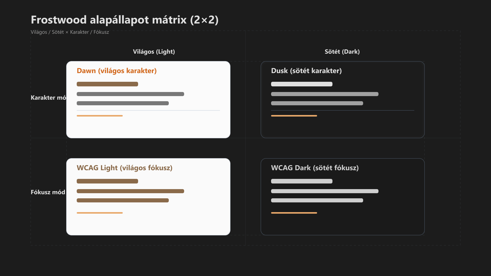

-   

    # 02. Rendszerleírás { #02-rendszerleiras }

    > Szerző: Hegedüs Gábor (@hege-g) 
    > Licenc: [MIT (Kód) / CC BY-NC-ND 4.0 (Docs)] 
    > Frostwood Docs: v1.0.0 
    > Rendszerverzió / Állapot: v1.0.5 / Stabil 
    > Blokk:  Alapok

-   ## Tartalomkártyák

    * [:material-infinity: 1. Frostwood mint állapotalapú rendszer](#1-frostwood-mint-allapotalapu-rendszer)
        * [:material-infinity: 1.1 Alapállapot mátrix (2 × 2 modell)](#11-alapallapot-matrix-2-2-modell)
    * [:material-infinity: 2. Állapotváltási logika](#2-allapotvaltasi-logika)
        * [:material-infinity: 2.1 Téma váltás (Light/Dark)](#21-tema-valtas-lightdark)
        * [:material-infinity: 2.2 Mód váltás (Karakter / WCAG)](#22-mod-valtas-karakter-wcag)
    * [:material-infinity: 3. Rendszer rétegezés](#3-rendszer-retegezes)
        * [:material-infinity: 3.1 Vizuális réteg](#31-vizualis-reteg)
        * [:material-infinity: 3.2 Állapotlogikai réteg](#32-allapotlogikai-reteg)
        * [:material-infinity: 3.3 Automatizációs réteg](#33-automatizacios-reteg)
        * [:material-infinity: 3.4 Alkalmazásprofil réteg](#34-alkalmazasprofil-reteg)
        * [:material-infinity: 3.5 Képernyőolvasó réteg](#35-kepernyoolvaso-reteg)
        * [:material-infinity: 3.6 Referencia réteg](#36-referencia-reteg)
    * [:material-infinity: 4. Travel Mode mint külön logikai ág](#4-travel-mode-mint-kulon-logikai-ag)
    * [:material-infinity: 5. Mit vezérel a Frostwood?](#5-mit-vezerel-a-frostwood)
        * [:material-infinity: 5.1 Rendszerszint](#51-rendszerszint)
        * [:material-infinity: 5.2 Alkalmazásszint](#52-alkalmazasszint)
        * [:material-infinity: 5.3 Mit nem vezérel](#53-mit-nem-vezerel)
    * [:material-infinity: 6. Telepítési filozófia](#6-telepitesi-filozofia)
    * [:material-infinity: 7. Stabilitás és visszafordíthatóság](#7-stabilitas-es-visszafordithatosag)
    * [:material-infinity: 8. Fejlesztési irányelvek (Future-proofing)](#8-fejlesztesi-iranyelvek-future-proofing)
    * [:material-infinity: 9. Frostwood mint rendszer](#9-frostwood-mint-rendszer)
    * [:material-infinity: 10. Zajszabályozási modell (Noise Control Model)](#10-zajszabalyozasi-modell-noise-control-model)
        * [:material-infinity: 10.1 Zaj típusok](#101-zaj-tipusok)
        * [:material-infinity: 10.2 Frostwood válasz a zajra](#102-frostwood-valasz-a-zajra)
        * [:material-infinity: 10.3 Zajszint csökkentési stratégia](#103-zajszint-csokkentesi-strategia)
        * [:material-infinity: 10.4 Gyakorlati példák](#104-gyakorlati-peldak)
        * [:material-infinity: 10.5 Kapcsolat a rendszerrel](#105-kapcsolat-a-rendszerrel)
    * [:material-infinity: 11. Alapelv](#11-alapelv)

## 1. Frostwood mint állapotalapú rendszer

A Frostwood :material-state-machine: nem „beállítások gyűjteménye”, hanem **állapotvezérelt rendszer**.

A rendszer mindig pontosan egy vizuális/logikai állapotban van.

### 1.1 Alapállapot mátrix (2 × 2 modell)

A Frostwood négy kombinált állapotot kezel, amelyek két dimenzió mentén jönnek létre:

* **Vizuális mód:** Karakter / WCAG 
* **Téma:** Világos / Sötét  

#### Állapotok listája

-   ##### 1. Karakter + Világos (Dawn)

    * identitás
    * kreatív / pihenő használat

-   ##### 2. Karakter + Sötét (Dusk)

    * esti karakter
    * kényelmes vizuális tér

-   ##### 3. WCAG + Világos (Focus White)

    * fókusz mód
    * hosszú munkára optimalizált

-   ##### 4. WCAG + Sötét (Deep Obsidian)

    * halk fókusz
    * esti koncentráció

??? info "Vizuális leírás akadálymentesítéshez"
    A kép négy cellából álló mátrix.

    1. **Bal felső (Dawn):** világos, lágy tónusok, enyhén karakteres, lágyabb másodlagos sorok.
    2. **Jobb felső (Dusk):** sötét, elegáns tónusok, enyhe mélységérzet, nem steril fekete.
    3. **Bal alsó (WCAG Light):** tisztább, egységesebb, minden sor közelebb tónusban egymáshoz.
    4. **Jobb alsó (WCAG Dark):** a legtisztább, a legkevesebb vizuális zaj és homogén sötét felület.

    Vízszintesen a világos és sötét mód, függőlegesen a karakter és fókusz mód jelenik meg.

    Minden cellában azonos szerkezetű mini felület látható, így a különbség a háttér, a kontraszt és a vizuális terhelés csökkenése alapján értelmezhető.

#### Összefoglaló a rendszerállapotokról

A Frostwood vizuális rendszere a felhasználói célokhoz igazodva két fő működési módot és azok napszakhoz illeszkedő változatait kínálja.

-   ##### Karakter mód (Dawn & Dusk)

    Az egyedi vizuális identitás és a kreatív környezet megteremtéséhez.

    * **Világos téma:** kreatív és pihenő fókusz (Dawn karakter)
    * **Sötét téma:** esti használatra optimalizált, nyugodt karakter (Dusk)

-   ##### WCAG mód (Akadálymentes fókusz)

    A maximális olvashatóság és a zavaró tényezők kiszűrése érdekében.

    * **Világos téma:** erős nappali fókusz, maximális kontraszt
    * **Sötét téma:** halk fókusz; alacsony fényterhelés mellett is magas olvashatóság

???+ note "Megjegyzés"
    Az ábrázolás nem a konkrét háttérképeket mutatja, hanem azok vizuális karakterére épülő rendszerállapotokat (Dawn, Dusk, WCAG módok) egyszerűsített, UI-alapú formában.

---

## 2. Állapotváltási logika

A Frostwood kétféle váltást kezel:

-   ### 2.1 Téma váltás (Light/Dark)

    * Napkelte / napnyugta szerint
    * AutoDarkMode vezérli
    * Nem a Frostwood számolja

-   ### 2.2 Mód váltás (Karakter / WCAG)

    * Manuális (WCAG_ON / WCAG_OFF)
    * Azonnali háttérváltás (Instant Switch)
    * Nem időzített

    ???+ note "Megjegyzés"
        A két réteg egymástól független, de kombinálható.

---

## 3. Rendszer rétegezés

???+ abstract "Összefoglaló"
    A Frostwood öt fő rétegből áll.

### 3.1 Vizuális réteg

* Háttérképek
* Árnyékok
* Áttetszőség
* Kontraszt
* Színjelzések

### 3.2 Állapotlogikai réteg

* 2x2 mátrix
* WCAG flag
* Karakter flag
* Travel flag (opcionális)

### 3.3 Automatizációs réteg

* AutoDarkMode integráció
* WCAG Instant
* SoftLock
* Travel Mode

### 3.4 Alkalmazásprofil réteg

A Frostwood alkalmazásszinten nem „skinez”, hanem **profil- és zajszabályozási elvet** alkalmaz.

Érintett alkalmazások:

-   * **Fájlkezelő (Windows Explorer)**  
    vizuális és használati stabilizálás (oszlopnézet, kontraszt, opcionális zebra nézet Windhawk-kal)

-   * **Total Commander**  
    két profil (Otthon / Munka), külön `ini` konfigurációval

-   * **Edge**  
    külön profil logika (Home / Work), Microsoft-integrált környezethez optimalizálva
-   * **Chrome**  
    külön user data dir (Home / Work), izolált profilhasználat

-   * **Firefox**  
    külön profil + külön példány (profil-szeparáció)

-   * **Office (Word / Excel)**  
    sablon- és workflow-alapú rendszer

-   * **Meta Chat réteg (Messenger / WhatsApp)**  
    értesítési és vizuális zaj csökkentése

-   * **Zoom**  
    meeting-fókusz optimalizáció (zaj és vizuális minimalizmus)

-   * **Narrátor (Windows Narrator)**  
    fallback képernyőolvasó, stabil alap működés biztosítása

-   * **JAWS**  
    tempó- és működésprofil (Normál / Lassúbb)

-   * **Insta360 Studio**  
    kizárólag Munka asztalon, külön workflow szerint

-   * **AI Platformok (ChatGPT / Gemini)**  
    profil-alapú használat (kontekstus szeparáció)

-   * **Lomtár (Recycle Bin)**  
    rendszerobjektum, de Frostwood szabályok szerint kezelve

#### Megjegyzés a Narrátorról

A Narrátor nem elsődleges képernyőolvasó, hanem:

* fallback megoldás
* rendszer-szintű alap hozzáférés biztosítása
* vészhelyzeti használat (pl. JAWS nem elérhető)

A Frostwood nem módosítja agresszíven a Narrátor működését, csak biztosítja, hogy a rendszer kompatibilis maradjon vele.

#### Megjegyzés a Lomtárról

A Lomtár rendszerszintű objektum, de:

* ikonelhelyezési szabály vonatkozik rá
* Munka asztalon is jelen lehet
* nem kap narancs vizuális jelzést
* nem dekorációs elem

Ezért szerepel az alkalmazásrétegben is, mint kezelési egység.

### 3.5 Képernyőolvasó réteg

A Frostwood külön rétegként kezeli a képernyőolvasókat, mivel ezek nem egyszerű alkalmazások, hanem **elsődleges interfészek** a rendszerhez.

A cél nem a képernyőolvasók „testreszabása”, hanem:

* stabil működés
* kiszámítható viselkedés
* alacsony zajszint
* gyors navigáció

-   #### Érintett rendszerek

    * **JAWS** — elsődleges képernyőolvasó
    * **Narrátor (Windows Narrator)** — rendszer fallback
    * **NVDA (opcionális)** — kompatibilitási referencia

-   #### JAWS (elsődleges működés)

    A Frostwood JAWS esetén:

    * két használati profilt különít el:
    * **Normál JAWS** — általános használat
    * **Lassúbb JAWS** — precíz munka, fókusz

    Funkció:

    * tempóvezérlés (nem hangszín módosítás)
    * gyors váltás parancsikonnal
    * konzisztens működés minden állapotban

    Elv:

    > A képernyőolvasó sebessége a feladat intenzitásához igazodik.

-   #### Narrátor (fallback réteg)

    A Narrátor szerepe:

    * rendszer-szintű alap hozzáférés
    * vészhelyzeti használat
    * telepítés/uninstall során fallback

    A Frostwood:

    * nem módosítja agresszíven a Narrátort
    * biztosítja a kompatibilis működést
    * elkerüli a konfliktusokat más olvasókkal

-   #### NVDA (kompatibilitás)

    Az NVDA nem célrendszer, de:

    * a Frostwood nem használ NVDA-specifikus hackeket
    * minden működés kompatibilis marad

-   #### Interfész elvek

    A Frostwood konzolos felülete:

    * nem használ dinamikus progress bart
    * nem ír felül sorokat
    * rövid, külön soros üzeneteket használ
    * nem generál felesleges kimenetet

    Ez biztosítja:

    * stabil felolvasást
    * determinisztikus működést
    * alacsony kognitív terhelést

-   #### Multimodális visszacsatolás

    A rendszer egyszerre használ:

    * szöveg (primer)
    * hang (kiegészítő)

    Ez:

    * redundáns információt ad
    * növeli a megbízhatóságot
    * csökkenti a hibázást

-   #### Mit nem csinál a Frostwood

    * nem hookolja a képernyőolvasót
    * nem ír át speech dictionary-t
    * nem módosít globális hangbeállítást
    * nem épít plugin függőséget

#### Összegzés

A képernyőolvasó réteg célja:

> A rendszer mindig **olvasható, hallható és kiszámítható** legyen.

### 3.6 Referencia réteg

* [91. Színkódok](91-szinkodok.md#91-hasznalt-szinkodok-vegleges)
* [92. Jelzés színek / viselkedés](92-jelzes-szinek.md#92-jelzes-szinek-es-jelzes-viselkedes)
* [93. Útiterv](93-utiterv.md#93-utiterv-utemterv)
* [94. Rendszer áttekintés](94-rendszer-attekintes.md#94-rendszer-attekintes)

---

## 4. Travel Mode mint külön logikai ág

A Travel Mode nem ötödik állapot.

Hanem egy felső szintű logikai kapcsoló.

Travel OFF → normál 2x2 működés  
Travel ON  → módosított működés:

* Karakter mód preferált  
* SoftLock OFF  
* WCAG manuális  
* állapot mentés  

A Travel:

* állapotot ment
* nem módosít rendszerszinten többet a szükségesnél
* visszafordítható

---

## 5. Mit vezérel a Frostwood?

-   ### 5.1 Rendszerszint

    * HKCU registry kulcsok
    * Téma váltás
    * Háttér
    * Jelzés-intenzitás
    * Árnyék és áttetszőség
    * Explorer zebra (opcionális Windhawk)

-   ### 5.2 Alkalmazásszint

    * Profil szeparáció
    * Indítási paraméterek
    * Értesítési zaj csökkentés
    * Sablonok

-   ### 5.3 Mit nem vezérel

    * Virtuális asztalok API nélkül
    * Alkalmazások belső nem támogatott részei
    * Policy injection
    * Kernel szintű módosítás
    * Rejtett monitorozás

---

## 6. Telepítési filozófia

A Frostwood tervezésekor a hordozhatóság és a biztonság volt az elsődleges szempont:

* **Felhasználói szintű (HKCU):** Nem módosít rendszerszintű beállításokat.
* **Admin nélküli:** Ahol a Windows engedi, nincs szükség emelt szintű jogosultságra.
* **Moduláris:** Az összetevők külön-külön is értelmezhetőek.
* **Visszafordítható:** Minden módosítás nyom nélkül eltávolítható.

### Elérhető telepítési modellek

-   ### Full Installer (Teljes telepítő)

    A standard eljárás az optimális élmény eléréséhez.

    * **Cél:** Tiszta Windows telepítésekre és elsődleges munkakörnyezetekre.
    * **Tartalom:** Tartalmazza az összes vizuális, viselkedési és integrációs modult.

-   ### Safe Mode (Biztonságos mód)

    Egy minimális, stabil alapállapotot biztosító réteg.

    * **Cél:** Fallback alap, hibakeresés vagy gyors tesztelés.
    * **Tartalom:** Csak a legszükségesebb core motor és a kritikus állapotkezelés fut le.

---

## 7. Stabilitás és visszafordíthatóság

A Frostwood minden módosítása:

* dokumentált
* visszaállítható
* nem rejtett
* nem automatikusan újrakonfiguráló

> A rendszer nem „fogva tart”.

---

## 8. Fejlesztési irányelvek (Future-proofing)

A Frostwood bővítésekor:

1. Nem vezetünk be új állapotot a 2x2 modellen kívül.
2. Nem növeljük a színpalettát.
3. Nem vezetünk be folyamatos háttérfigyelést.
4. Minden új modulnak illeszkednie kell a zajcsökkentési elvhez.
5. Az automatika mindig kikapcsolható legyen.
6. A dokumentáció elsődleges.

---

## 9. Frostwood mint rendszer

???+ quote "Alapelv"
    A Frostwood nem esztétikai csomag.

    Hanem egy:

    * állapotalapú
    * rétegzett
    * visszafordítható
    * moduláris
    * dokumentált

    Windows rendszerarchitektúra.

---

## 10. Zajszabályozási modell (Noise Control Model)

A Frostwood egyik alapelve a **digitális zaj minimalizálása**.

A „zaj” minden olyan elem, amely:

* megszakítja a fókuszt
* felesleges információt ad
* nem releváns a jelenlegi feladathoz

### 10.1 Zaj típusok

-   #### Vizuális zaj

    * túl sok szín
    * kontraszt nélküli elemek
    * zsúfolt felület
    * villogás / animáció

-   #### Akusztikus zaj

    * túl gyakori értesítések
    * ismétlődő hangok
    * nem kontextushoz kötött jelzések

-   #### Interakciós zaj

    * túl sok lépés egy feladathoz
    * inkonzisztens UI
    * váratlan viselkedés

-   #### Kognitív zaj

    * információ túlterhelés
    * nem egyértelmű állapotok
    * kevert jelentésű elemek

### 10.2 Frostwood válasz a zajra

A rendszer minden rétegben csökkenti a zajt.

-   #### Vizuális szinten

    * limitált színpaletta
    * WCAG mód fókuszhoz
    * árnyék és térérzet kontroll
    * jelzőszínek csak szükség esetén

-   #### Alkalmazás szinten

    * profil szeparáció (Home / Work)
    * külön konfigurációk
    * nem kevert környezet

-   #### Rendszer szinten

    * minimalizált automatikák
    * nincs háttérben „folyamatos okoskodás”
    * explicit vezérlés

-   #### Interfész szinten

    * rövid üzenetek
    * lineáris működés
    * nincs rejtett állapot

### 10.3 Zajszint csökkentési stratégia

A Frostwood három lépést használ:

-   #### 1. Szeparáció

    * Home / Work
    * Karakter / WCAG

- #### 2. Egyszerűsítés

    * kevesebb elem
    *  egyértelmű állapot

-   #### 3. Stabilizálás

    * nincs ugráló UI
    * nincs váratlan viselkedés

### 10.4 Gyakorlati példák

A Frostwood a mindennapi használat során fellépő kognitív és technikai zajt konkrét megoldásokkal kezeli:

#### Kommunikációs zaj (Chat appok)

* **Kihívás:** Folyamatos, zavaró értesítések és vizuális jelzések.
* **Frostwood megoldás:** Zajcsökkentett profil alkalmazása, amely csak a kritikus információkat engedi át.

#### Vizuális túlterhelés (Munka)

* **Kihívás:** Túl sok szín és zavaró grafikai elem a felületen.
* **Frostwood megoldás:** WCAG mód aktiválása, amely letisztultabb, magas kontrasztú és színsemleges környezetet teremt.

#### Adat-zsúfoltság (Fájlkezelés)

**Kihívás:** Átláthatatlan mappaszerkezet és zsúfolt listanézetek.
*Frostwood megoldás:** Strukturált layout és optimalizált sorközök használata a gyorsabb szkennelhetőségért.

#### Auditív zaj (Képernyőolvasó)

* **Kihívás:** A túl gyors beszédtempó miatt elvesző információk.
* **Frostwood megoldás:** Specifikus „Lassúbb JAWS” indítóikonok, amelyek azonnal érthetőbbé teszik a felolvasást.

### 10.5 Kapcsolat a rendszerrel

A zajszabályozás nem külön funkció, hanem:

* áthatja az összes réteget
* része a designnak
* nem opcionális

---

## 11. Alapelv

> Ami nem segíti a feladatot, az zaj.

A Frostwood célja:

> A rendszer csak azt mutassa és jelezze, ami **szükséges és értelmezhető**.