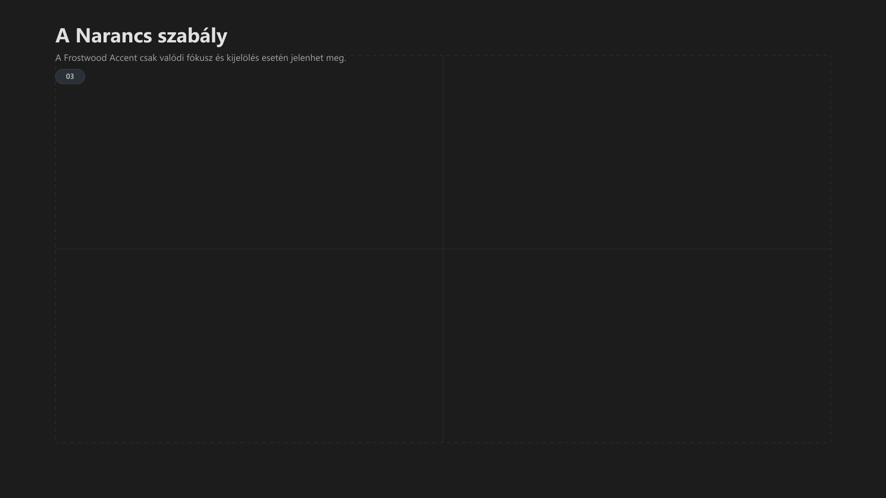

-   

    # 03. Szín rendszer { #03-szin-rendszer }

    > Szerző: Hegedüs Gábor (@hege-g) 
    > Licenc: [MIT (Kód) / CC BY-NC-ND 4.0 (Docs)] 
    > Frostwood Docs: v1.0.0 
    > Rendszerverzió / Állapot: v1.0.5 / Stabil 
    > Blokk:  Alapok

-   ## Tartalomkártyák

    * [:material-infinity: 1. Alapelv: Hierarchia, nem paletta](#1-alapelv-hierarchia-nem-paletta)
    * [:material-infinity: 2. A Narancs szabály (Primary / Horgony)](#2-a-narancs-szabaly-primary-horgony)
        * [:material-infinity: 2.1 Használható](#21-hasznalhato)
        * [:material-infinity: 2.2 Nem használható](#22-nem-hasznalhato)
        * [:material-infinity: 2.3 Hover és billentyűzetes fókusz különbsége](#23-hover-es-billentyuzetes-fokusz-kulonbsege)
    * [:material-infinity: 3. Jelzés-színek szerepe](#3-jelzes-szinek-szerepe)
    * [:material-infinity: 4. Karakter vs WCAG intenzitási szabály](#4-karakter-vs-wcag-intenzitasi-szabaly)
        * [:material-infinity: 4.1 Karakter mód](#41-karakter-mod)
        * [:material-infinity: 4.2 WCAG mód](#42-wcag-mod)
    * [:material-infinity: 5. Windows vs Alkalmazás szint](#5-windows-vs-alkalmazas-szint)
    * [:material-infinity: 6. Tiltólista](#6-tiltolista)
    * [:material-infinity: 7. Engedélylista](#7-engedelylista)
    * [:material-infinity: 8. Mentális terhelés modell](#8-mentalis-terheles-modell)

## 1. Alapelv: Hierarchia, nem paletta

A Frostwood nem „színvilágot” használ, hanem **jelentésalapú rendszert**.

A színek célja:

* információ közlése,
* fókusz kijelölése,
* mentális irányítás,
* nem dekoráció.

???+ quote "Alapelv"
    > A szín mindig funkcionális.

---

## 2. A Narancs szabály (Primary / Horgony)

??? info "Vizuális leírás akadálymentesítéshez"
    A kép két azonos méretű panelből áll, egymás mellett.

    A bal oldali panel címe „Helyes”, és egy pipával van jelölve. A jobb oldali panel címe „Helytelen”, és egy X jellel van jelölve.

    Mindkét panelben azonos szerkezetű lista látható öt sorral.

    A bal oldalon csak egyetlen sor kap narancssárga hangsúlyt, jelezve az aktív kijelölést vagy fókuszt. A többi sor semleges marad.

    A jobb oldalon a narancssárga hangsúly több helyen is megjelenik: több soron, kereteken és kisebb elemekben is. Emiatt a fókuszjelzés elveszíti egyértelműségét.

    Az ábra célja annak bemutatása, hogy a Frostwood Accent csak valódi fókuszra és kijelölésre használható.

???+ warning "Figyelem"
    A narancs **nem identitás-szín**.  
    Nem dekoráció.  
    Nem hangulati elem.

    A narancs kizárólag:

    > Aktív fókusz / aktív kijelölés jelzés.

-   ### 2.1 Használható

    * aktuális kijelölés
    * fókuszban lévő műveleti pont
    * billentyűvezérelt aktív elem

-   ### 2.2 Nem használható

    * hover
    * passzív kijelölés
    * lista alapállapot
    * ikon dekoráció
    * alkalmazásprofil kiemelés
    * branding-célú színezés

    A narancs jelentést hordoz.  
    Ha mindenhol jelen van, elveszíti jelentését.

-   ### 2.3 Hover és billentyűzetes fókusz különbsége

    A Frostwood szigorúan különválasztja az egérrel történő rámutatást és a billentyűzettel történő aktív fókuszt.

    Szabály:

    * az egér-hover nem lehet narancs
    * a billentyűzetes fókusz lehet narancs
    * a narancs kizárólag akkor jelenhet meg, ha az elem valóban aktív fókuszban van

    Ez különösen fontos:

    * billentyűzetes navigációnál
    * képernyőolvasó melletti használatnál
    * olyan helyzetekben, ahol a felhasználónak egyértelmű vizuális horgonyra van szüksége

---

## 3. Jelzés-színek szerepe

A Frostwood négy jelentéskategóriát használ a felhasználói visszacsatolás biztosítására.

-   ### Színkategóriák és jelentéstartalmak

    A rendszer a színeket nem dekorációként, hanem funkcionális jelzésként használja.

    * **Primary:** aktív fókusz jelölése (Közepes intenzitás)
    * **Információ:** általános tudnivalók közlése (Halk intenzitás)
    * **Siker:** folyamatok pozitív lezárása (Halk intenzitás)
    * **Figyelmeztetés:** lassítás és figyelemfelhívás (Mérsékelt, de tompa intenzitás)

    ???+ note "Fontos"
        A konkrét hex értékek a [91. Színkódok](91-szinkodok.md#91-hasznalt-szinkodok-vegleges) modulban találhatók. Itt a logikai szerep az elsődleges, nem a kód.

---

## 4. Karakter vs WCAG intenzitási szabály

A színintenzitás módonként eltér.

-   ### 4.1 Karakter mód

    **Cél:** identitás + stabil tér.

    * **Primary:** normál intenzitás
    * **Információ:** visszafogott
    * **Siker:** ritka
    * **Figyelmeztetés:** tompa, nem éles

    A rendszer itt „élőbb”, de nem harsány.

-   ### 4.2 WCAG mód

    **Cél:** mentális zaj minimalizálása.

    Szabályok:

    * Primary (narancs) megmarad — fókuszhoz szükséges  
    * Információ csak indokolt esetben  
    * Siker lehetőleg szöveges  
    * Figyelmeztetés kizárólag valódi eseményre  

    Tiltott:

    * dekoratív színezés  
    * háttérszínezett info-box  
    * több jelzés egy eseményre  

    ???+ quote "Alapelv"
        > A WCAG nem kontraszt maximalizálás, hanem inger minimalizálás.

---

## 5. Windows vs Alkalmazás szint

A Frostwood architektúra szigorúan elhatárolja a két vezérlési réteget az optimális rendszerstabilitás és felhasználói testreszabhatóság érdekében.

### Rétegzett vezérlési architektúra

* **Windows szint (Alapréteg)**
    * **Mire vonatkozik:** Rendszer színek, *hot tracking* (aktív elemek vizuális követése), valamint az alapvető háttérkonfigurációk.
    * **Filozófia:** Korlátozott globális vezérlés; a Frostwood nem kényszerít agresszív, rendszerszintű színmódosítást.

* **Alkalmazás szint (Profilréteg)**
    * **Mire vonatkozik:** Specifikus szoftverkörnyezetek, mint például a Total Commander (TC), Chrome, Firefox, Zoom és egyéb telepített alkalmazások.
    * **Filozófia:** Profilalapú, finomhangolt szabályozás; a hangsúly az egyedi alkalmazások optimális, testre szabott vizuális élményén van.

---

## 6. Tiltólista

???+ warning "Figyelem"
    A Frostwood rendszerben nem jelenhet meg:

    * Egérrel kiváltott hover narancs
    * Piros villogás
    * Passzív kijelölés színezése
    * Többszintű színezett státusz
    * Színes háttér + színes ikon + színes szöveg egyszerre
    * Figyelemfelkeltő animáció
    * Szín alapú információ ikon vagy szöveg nélkül

---

## 7. Engedélylista

Megengedett:

* Egy esemény = egy jelzés
* Szín + szöveg kombináció
* A fókusz színe csak valódi aktív fókuszállapotban jelenhet meg
* Billentyűzetes fókuszhoz narancs fókuszjelölés használható
* WCAG módban szöveg-alapú jelzés
* Semleges hover

---

## 8. Mentális terhelés modell

A Frostwood a mentális zaj csökkentésére épül.

A túl sok szín:

* verseng a figyelemért,
* csökkenti a fókuszt,
* növeli a kognitív terhelést.

A cél:

* Stabil alap
* Ritka, de jelentéssel bíró jelzés
* Fókusz egy ponton

A rendszer akkor működik jól, ha:

???+ quote "Alapelv"
    > A szín nem vezeti a felhasználót, csak válaszol neki. 
    > A fókusz vizuális jelölése ezért nem azonos a hoverrel. 
    > A hover csak irányérzékelés.

A fókusz viszont:

* orientációs pont
* műveleti horgony
* kisegítő használat mellett is fontos vizuális visszajelzés