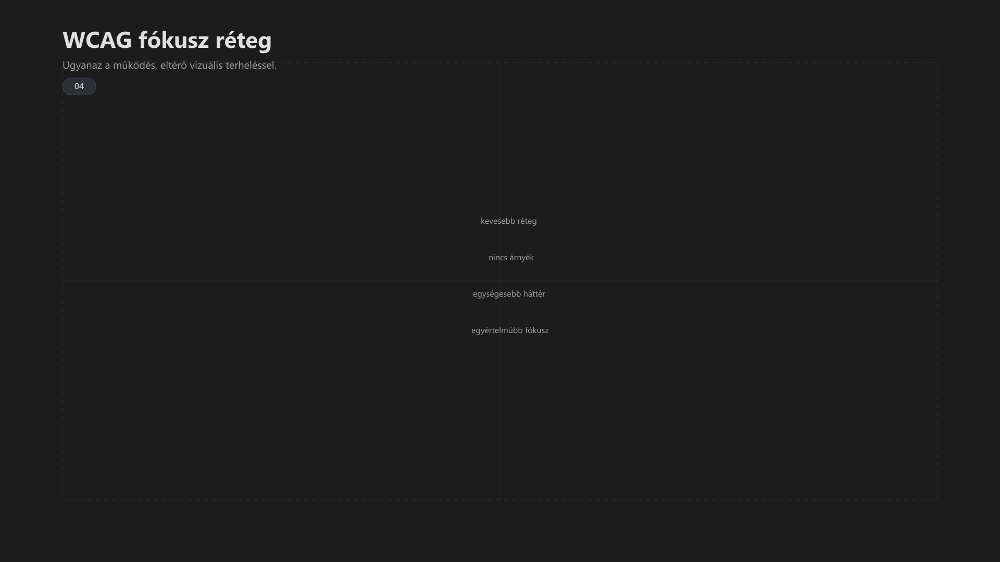

-   

    # 04. WCAG fókusz-réteg { #04-wcag-fokusz-reteg }

    > Szerző: Hegedüs Gábor (@hege-g) 
    > Licenc: [MIT (Kód) / CC BY-NC-ND 4.0 (Docs)] 
    > Frostwood Docs: v1.0.0 
    > Rendszerverzió / Állapot: v1.0.5 / Stabil 
    > Blokk:  Alapok 
    > Mód: :material-eye-check: WCAG / Kisegítő lehetőség

-   ## Tartalomkártyák

    * [:material-infinity: 1. Mi a WCAG mód a Frostwood rendszerben?](#1-mi-a-wcag-mod-a-frostwood-rendszerben)
    * [:material-infinity: 2. Állapotlogika](#2-allapotlogika)
        * [:material-infinity: 2.1 WCAG + Világos](#21-wcag-vilagos)
        * [:material-infinity: 2.2 WCAG + Sötét](#22-wcag-sotet)
    * [:material-infinity: 3. Mit változtat vizuálisan?](#3-mit-valtoztat-vizualisan)
    * [:material-infinity: 4. SignalColors viselkedés WCAG módban](#4-signalcolors-viselkedes-wcag-modban)
    * [:material-infinity: 5. Tiltólista (WCAG módban)](#5-tiltolista-wcag-modban)
    * [:material-infinity: 6. Alkalmazás-specifikus viselkedés](#6-alkalmazas-specifikus-viselkedes)
        * [:material-infinity: 6.1 Fájlkezelő (Windows Explorer)](#61-fajlkezelo-windows-explorer)
        * [:material-infinity: 6.2 Total Commander](#62-total-commander)
        * [:material-infinity: 6.3 Microsoft Edge](#63-microsoft-edge)
        * [:material-infinity: 6.4 Chrome / Firefox](#64-chrome-firefox)
        * [:material-infinity: 6.5 Microsoft Office](#65-microsoft-office)
        * [:material-infinity: 6.6 Meta Chat réteg](#66-meta-chat-reteg)
        * [:material-infinity: 6.7 Zoom](#67-zoom)
        * [:material-infinity: 6.8 Narrátor (Windows Narrator)](#68-narrator-windows-narrator)
        * [:material-infinity: 6.9 JAWS](#69-jaws)
        * [:material-infinity: 6.10 Insta360 Studio (Munka asztal)](#610-insta360-studio-munka-asztal)
        * [:material-infinity: 6.11 ChatGPT (webes használat)](#611-chatgpt-webes-hasznalat)
        * [:material-infinity: 6.12 Gemini (webes használat)](#612-gemini-webes-hasznalat)
        * [:material-infinity: 6.13 Lomtár (Recycle Bin)](#613-lomtar-recycle-bin)
    * [:material-infinity: 7. Vizuális ellenőrző lista](#7-vizualis-ellenorzo-lista)
        * [:material-infinity: 7.1 WCAG audit checklist (gyors ellenőrzés)](#71-wcag-audit-checklist-gyors-ellenorzes)
        * [:material-infinity: 7.2 WCAG hibák tipikus esetei](#72-wcag-hibak-tipikus-esetei)
            * [:material-infinity: 1. Rejtett színes jelzések aktívak maradnak](#1-rejtett-szines-jelzesek-aktivak-maradnak)
            * [:material-infinity: 2. Zebra vagy mintázat visszatér](#2-zebra-vagy-mintazat-visszater)
            * [:material-infinity: 3. Narancs túl sok helyen jelenik meg](#3-narancs-tul-sok-helyen-jelenik-meg)
            * [:material-infinity: 4. Felület „mozog” vagy ugrál](#4-felulet-mozog-vagy-ugral)
            * [:material-infinity: 5. Képernyőolvasó túl sok információt ad](#5-kepernyoolvaso-tul-sok-informaciot-ad)
        * [:material-infinity: 7.3 WCAG recovery lépések](#73-wcag-recovery-lepesek)
        * [:material-infinity: 7.4 WCAG gyors reset parancs](#74-wcag-gyors-reset-parancs)
    * [:material-infinity: 8. Ajánlott napi használati séma](#8-ajanlott-napi-hasznalati-sema)
    * [:material-infinity: 9. Pszichológiai indoklás](#9-pszichologiai-indoklas)
    * [:material-infinity: 10. Mi NEM a WCAG mód?](#10-mi-nem-a-wcag-mod)

## 1. Mi a WCAG mód a Frostwood rendszerben?

A WCAG mód :material-eye-check-outline: nem marketinges „akadálymentes mód”.

A Frostwood rendszerben a WCAG:

???+ abstract "Összefoglaló"
    > Egy fókusz-réteg, amely csökkenti a vizuális és mentális zajt hosszú munkához.

Célja:

* inger minimalizálás
* kontraszt stabilizálás
* jelzés-intenzitás csökkentés
* animációs zaj csökkentés
* képernyőolvasó melletti stabil fókusz

A WCAG mód nem új rendszerállapot.  
A 2x2 mátrix része.

---

## 2. Állapotlogika

A WCAG mód manuálisan kapcsolható:

* `WCAG_ON`
* `WCAG_OFF`
* `WCAG_TOGGLE`

A rendszer:

* azonnal vált háttérre (instant váltás)
* a Light/Dark váltást továbbra is az AutoDarkMode vezérli
* a WCAG flag csak a vizuális intenzitást módosít
* A WCAG mód nem külön állapot, hanem a meglévő 2×2 rendszer része.

-   ### 2.1 WCAG + Világos

    * **Háttér:** #FAFAFA  
    * **Zebra:** kikapcsolva  
    * **Jelzés:** minimalizált  
    * **Hover:** semleges  

-   ### 2.2 WCAG + Sötét

    * **Háttér:** Deep Obsidian (halkított, sötétszürke fókusz)  
    * **Kontraszt:** stabil, nem éles  
    * **Narancs:** csak aktív fókusz  

---

## 3. Mit változtat vizuálisan?

Amikor a **WCAG** mód aktív, a rendszer a kognitív terhelés csökkentése és a maximális olvashatóság érdekében az alábbi módosításokat eszközli:

-   ### Vizuális módosítások (WCAG ON)

    A felület letisztultabbá válik, előtérbe helyezve a tartalmat a dekorációval szemben.

    * **Háttér:** egyszínű (nincs gradiens vagy zavaró textúra)
    * **SignalColors:** kikapcsolva (alapértelmezett, a színhasználat nem hordoz kritikus információt)
    * **Zebra:** kikapcsolva (a sorok közötti váltakozó színezés megszűnik a tisztaság érdekében)
    * **Hover:** semleges (az egérrel való rámutatás nem vált ki agresszív színváltozást)
    * **Animáció:** minimalizált (a mozgásérzékenység és a figyelemelterelés elkerülése végett)
    * **Árnyék:** megmarad, de halk (a mélységérzet megmarad, de nem domináns)

---

## 4. SignalColors viselkedés WCAG módban

Alapértelmezés:

* **INFO:** kikapcsolva  
* **SUCCESS:** kikapcsolva  
* **WARNING:** kikapcsolva  
* **Primary (narancs):** aktív fókuszhoz megmarad  

Haladó (opcionális):

* INFO → szöveges formában  
* SUCCESS → szöveges formában  
* WARNING → csak valódi eseményre  

???+ quote "Alapelv"
    > A WCAG mód alapállapotban csendes.

---

## 5. Tiltólista (WCAG módban)

???+ warning "Figyelem"
    Nem jelenhet meg:

    * hover alapú narancs  
    * színes háttérdoboz  
    * több jelzés egy eseményre  
    * villogás  
    * animált figyelmeztetés  
    * telített figyelmeztető színek  
    * dekoratív színezett ikon  

---

## 6. Alkalmazás-specifikus viselkedés

-   ### 6.1 Fájlkezelő (Windows Explorer)

    WCAG módban:

    * Lista- és részletes nézet preferált (nem ikon alapú)
    * **Stabil oszlopok:** Nincs vízszintes ugrálás vagy dinamikus szélességváltás.
    * **Zebra OFF:** A sorok közötti váltakozó színezés megszűnik a mentális zaj csökkentése érdekében.
    * **Kijelölés:** kontrasztos, de nem telített
    * **Hover:** semleges (nem narancs)
    * **Navigáció:** lineáris és kiszámítható

    Opcionális (Windhawk):

    * Zebra csak akkor engedélyezett, ha nem zavarja a fókuszt

    ???+ note "Megjegyzés"
        A cél nem a vizuális „gazdagítás”, hanem a **strukturált, gyors olvashatóság**.

-   ### 6.2 Total Commander

    * **Világos WCAG:** nincs zebra
    * **Sötét WCAG:** narancs csak aktív kijelölés
    * **Passzív kijelölés:** semleges

-    ### 6.3 Microsoft Edge

    WCAG módban:

    * Profil-alapú használat (Home / Work)
    * Értesítések minimalizálva vagy tiltva
    * Oldalszintű popup értesítések OFF
    * System default téma használata
    * Nincs színes UI kiemelés (narancs nem dekoráció)
    * Oldalak közötti váltás nem okoz fókuszvesztést

    ???+ note "Megjegyzés"
        Az Edge gyakran integrált vállalati környezetben fut, ezért a cél:

        * stabil működés
        * minimális vizuális és értesítési zaj

-   ### 6.4 Chrome / Firefox

    * Értesítések minimalizálva
    * Oldalszintű értesítés tiltás
    * Nincs vizuális zaj

-   ### 6.5 Microsoft Office

    * Letisztult sablon
    * Fehér / törtfehér háttér
    * Nincs díszítő szín

-   ### 6.6 Meta Chat réteg

    * Preview OFF
    * Hang OFF
    * Badge OFF (ha lehetséges)

-   ### 6.7 Zoom

    * Csak kritikus értesítések
    * Nincs vizuális villogás
    * Billentyűvezérelt működés

-   ### 6.8 Narrátor (Windows Narrator)

    WCAG módban:

    * Stabil, alapértelmezett működés
    * Nincs agresszív konfiguráció módosítás
    * Nem növeljük a verbózítást
    * Nem módosítjuk a hang karakterisztikát

    Szerepe:

    * fallback képernyőolvasó
    * rendszer-szintű hozzáférés biztosítása
    * telepítés / hibahelyzet kezelése

    Elv:

    * a Narrátor mindig működjön
    * ne kerüljön konfliktusba JAWS-szal vagy más olvasóval

    ???+ note "Megjegyzés"
        A Frostwood nem optimalizál külön Narrátorra, hanem:

        > Biztosítja a zajmentes, kompatibilis környezetet.

-   ### 6.9 JAWS

    * Lassabb beszédtempó (Munka profil)
    * Verbózítás nem nő
    * Hang nem változik

-   ### 6.10 Insta360 Studio (Munka asztal)

    WCAG módban:

    * Nincs sötét, agresszív UI váltás erőltetve (System default).
    * Preview panelek ne maradjanak nyitva feleslegesen.
    * Timeline / vezérlőpanelek legyenek stabilan rögzítve (ne villogó auto-hide).
    * Nem kap narancs kiemelést UI-szinten.
    * Export státusz jelzés lehetőleg szöveges formában.

    ???+ note "Megjegyzés"
        Az Insta360 Studio vizuálisan intenzív alkalmazás, ezért WCAG módban a cél a környezeti zaj minimalizálása, nem a tartalom átalakítása.

-   ### 6.11 ChatGPT (webes használat)

    WCAG módban:

    * Böngésző értesítések tiltva.
    * Oldalszintű hangjelzés tiltva.
    * System default téma.
    * Nincs extra színkiemelés (narancs nem használható dekorációként).
    * Hosszú válasz esetén görgetési fókusz stabil (ne ugorjon automatikusan).

    ???+ note "Megjegyzés"
        A ChatGPT „elemző réteg”, nem vizuális ingerforrás.

-   ### 6.12 Gemini (webes használat)

    WCAG módban:

    * Azonos elv, mint ChatGPT.
    * Értesítések minimalizálva.
    * Nincs profil-szintű vizuális kiemelés.
    * Nem használunk színes bookmark vagy ikon kiemelést.

-   ### 6.13 Lomtár (Recycle Bin)

    WCAG módban:

    * Ikon változatlan (Nincs narancs overlay. Kivéve, ha a Lomtár aktív fókuszt kap (pl. Tab billentyűvel), ekkor a narancs fókuszkeret megjelenik.)
    * Nem kap vizuális státusz-színezést.
    * Nem kerül fókuszkiemelésre, kivéve aktív kijelölés esetén.

    A Lomtár rendszerobjektum, nem jelzéseszköz.

---

## 7. Vizuális ellenőrző lista

WCAG mód aktiválás után:

* Háttér egyszínű
* Zebra eltűnt
* Hover semleges
* Narancs csak aktív fókuszon
* Nincs villogás
* Nincs színes doboz

Ha bármelyik nem teljesül → nem valódi WCAG állapot.

### 7.1 WCAG audit checklist (gyors ellenőrzés)

1. Háttér egyszínű és stabil  
2. Narancs csak aktív fókuszon jelenik meg  
3. Nincs párhuzamos jelzés  
4. Nincs animáció vagy villogás  
5. A felület kiszámítható és nem ugrál  

Ha bármelyik nem teljesül:

> Az állapot nem tekinthető valódi WCAG módnak.

### 7.2 WCAG hibák tipikus esetei

Az alábbi esetek a leggyakoribb okai annak, hogy a WCAG mód nem működik megfelelően.

-   #### 1. Rejtett színes jelzések aktívak maradnak

    Tünet:

    * színes értesítések jelennek meg
    * narancs hover több elemen is látható

    Ok:

    * SignalColors nincs teljesen kikapcsolva
    * alkalmazás saját UI jelzést használ

    Megoldás:

    * SignalColors → OFF
    * alkalmazás értesítések csökkentése

-   #### 2. Zebra vagy mintázat visszatér

    Tünet:

    * fájllista csíkozott
    * háttér nem egyszínű

    Ok:

    * Explorer módosító (pl. Windhawk) aktív
    * egyéni téma felülírja a WCAG-ot

    Megoldás:

    * zebra kikapcsolása
    * WCAG háttér újra alkalmazása

-   #### 3. Narancs túl sok helyen jelenik meg

    Tünet:

    * nem csak fókuszon jelenik meg
    * több UI elem egyszerre kiemelt

    Ok:

    * hover kiemelés aktív
    * alkalmazás saját highlight rendszert használ

    Megoldás:

    * hover semlegesítése
    * fókusz-only kiemelés betartása

-   #### 4. Felület „mozog” vagy ugrál

    Tünet:

    * A tartalom betöltésekor az elemek eltolódnak (Layout Shift).
    * fókusz elugrik
    * scroll automatikusan módosul

    Ok:

    * dinamikus UI (web / app)
    * automatikus refresh vagy fókuszkezelés

    Megoldás:

    * A WCAG mód fixált elempozíciókat és tiltott auto-scroll funkciókat igényel.
    * automatikus frissítés minimalizálása
    * stabil nézet használata

-   #### 5. Képernyőolvasó túl sok információt ad

    Tünet:

    * túl gyors beszéd
    * túl sok ismétlődő információ

    Ok:

    * nem megfelelő JAWS profil
    * túl magas verbózítás

    Megoldás:

    * Lassúbb JAWS profil használata
    * verbózítás csökkentése

#### Összegzés

A legtöbb WCAG hiba oka:

* nem teljesen kikapcsolt vizuális jelzések
* külső alkalmazás felülírása
* túl sok párhuzamos információ

???+ quote "Alapelv"
    > Ha valami „túl soknak érződik”, akkor az már zaj.

-   ### 7.3 WCAG recovery lépések

    1. WCAG OFF → WCAG ON  
    2. SignalColors OFF  
    3. környezet ellenőrzése  

    Eredmény:

    * egyszínű háttér  
    * nincs villogás  
    * nincs többes jelzés  
    * stabil fókusz  

-   ### 7.4 WCAG gyors reset parancs

    A Frostwood tartalmaz egy gyors helyreállító parancsot:

    `WCAG_RESET.bat`

    Funkció:

    * WCAG réteg újraépítése
    * vizuális állapot tisztítása
    * jelzések eltávolítása

    Lépések:

    1. WCAG OFF
    2. WCAG ON
    3. SignalColors OFF

    Használat:

    * ha a rendszer „zajosnak” érződik
    * ha a WCAG állapot nem tiszta
    * gyors visszaállításhoz

    ???+ note "Megjegyzés"
        A reset nem módosít tartós konfigurációt.

        > Csak a fókuszréteget állítja vissza stabil állapotba.

??? info "Vizuális leírás akadálymentesítéshez"
    A kép két azonos méretű panelből áll egymás mellett.

    A bal oldali panel címe „Karakter mód”. Egy sötét Frostwood felületet mutat, amely több vizuális réteget tartalmaz: finom szegélyeket, enyhe mélységet és kissé gazdagabb felületi tagolást. A panelben egy egyszerű alkalmazásablak látható felső sávval, oldalsó navigációval és néhány tartalmi sorral vagy blokkal. Egyetlen aktív fókuszpont narancssárga hangsúlyt kap.

    A jobb oldali panel címe „Fókusz mód (WCAG)”. Ugyanannak a felületnek az egyszerűsített változatát mutatja. Az árnyékok és díszítő részletek hiányoznak vagy minimálisak, a háttér egységesebb, a szöveg és a fókusz tisztábban érvényesül. Az alapstruktúra azonos marad, de a vizuális zaj kisebb.

    A kép célja annak bemutatása, hogy a Frostwood fókusz mód nem új dizájn, hanem a meglévő felület csökkentett terhelésű, olvasásra és kisegítő használatra optimalizált változata.

---

## 8. Ajánlott napi használati séma

Reggel:

* Karakter + Light

Délelőtt fókusz:

* WCAG + Light

Délután:

* WCAG + Light vagy Dark (napállás szerint)

Este:

* Karakter + Dark (pihenő)

???+ tip "Tipp"
    A WCAG nem egész napos kényszer, hanem fókusz eszköz.

---

## 9. Pszichológiai indoklás

Hosszú munka során:

* Az erős kontraszt fáraszt.
* A túl sok jelzés csökkenti a döntési sebességet.
* A színes inger verseng a fókuszponttal.
* A szem mikro-mozgása nő vibráló háttérnél.

A WCAG mód célja:

* stabil vizuális tér
* csökkentett inger
* mentális zaj minimalizálás

Ez nem „színtelenítés”, hanem fókusz-architektúra.

---

## 10. Mi NEM a WCAG mód?

* Nem szigorú kontraszt-kényszer
* Nem „magas kontraszt” Windows mód
* Nem vizuális büntetés
* Nem funkciókorlátozás

A WCAG mód:

> Tudatosan halkított működési állapot.