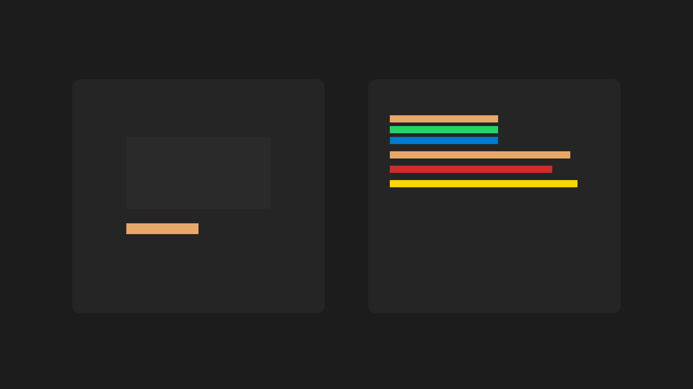

-   

    # 05. Jelzésmechanika { #05-jelzesmechanika }

    > Szerző: Hegedüs Gábor (@hege-g) 
    > Licenc: [MIT (Kód) / CC BY-NC-ND 4.0 (Docs)] 
    > Frostwood Docs: v1.0.0 
    > Rendszerverzió / Állapot: v1.0.5 / Stabil 
    > Blokk:  Alapok

-   ## Tartalomkártyák

    * [:material-infinity: 1. A Signal System célja](#1-a-signal-system-celja)
    * [:material-infinity: 2. Jelzés mint működési egység](#2-jelzes-mint-mukodesi-egyseg)
    * [:material-infinity: 3. Időbeliség modell](#3-idobeliseg-modell)
        * [:material-infinity: 3.1 Azonnali jelzés](#31-azonnali-jelzes)
        * [:material-infinity: 3.2 Állapotjelzés](#32-allapotjelzes)
        * [:material-infinity: 3.3 Tiltott jelzés](#33-tiltott-jelzes)
    * [:material-infinity: 4. Zajszint modell](#4-zajszint-modell)
        * [:material-infinity: 4.1 Karakter mód](#41-karakter-mod)
        * [:material-infinity: 4.2 WCAG mód](#42-wcag-mod)
    * [:material-infinity: 5. Multi-signal tilalom](#5-multi-signal-tilalom)
    * [:material-infinity: 6. Rendszerszint vs alkalmazásszint jelzések](#6-rendszerszint-vs-alkalmazasszint-jelzesek)
        * [:material-infinity: 6.1 Rendszerszint](#61-rendszerszint)
        * [:material-infinity: 6.2 Alkalmazásszint](#62-alkalmazasszint)
    * [:material-infinity: 7. Jelzés-intenzitás skála](#7-jelzes-intenzitas-skala)
        * [:material-infinity: 7.1 Alap skála](#71-alap-skala)
        * [:material-infinity: 7.2 Prioritási szabály](#72-prioritasi-szabaly)
        * [:material-infinity: 7.3 WCAG mód](#73-wcag-mod)
        * [:material-infinity: 7.4 Karakter mód](#74-karakter-mod)
    * [:material-infinity: 8. Jelzés-konfliktus kezelés](#8-jelzes-konfliktus-kezeles)
    * [:material-infinity: 9. Jelzés-tervezési checklist](#9-jelzes-tervezesi-checklist)
    * [:material-infinity: 10. Jelzés-hordozók prioritása](#10-jelzes-hordozok-prioritasa)
    * [:material-infinity: 11. Jelzés és képernyőolvasó](#11-jelzes-es-kepernyoolvaso)
    * [:material-infinity: 12. Záró alapelv](#12-zaro-alapelv)

## 1. A Signal System célja

??? info "Vizuális leírás akadálymentesítéshez"
    A kép két azonos méretű panelből áll.

    A bal oldali panel címe „Frostwood”. Egy tiszta, sötét felületet mutat kevés elemmel, nagy üres terekkel és egyetlen kiemelt fókuszponttal. A struktúra egyszerű, a színek visszafogottak.

    A jobb oldali panel címe „Túlterhelt”. Ugyanannak a felületnek a zsúfolt változatát mutatja. Több elem, több kiemelés és több szín jelenik meg, ami nehezebbé teszi a fókusz megtalálását.

    A kép célja annak bemutatása, hogy a Frostwood vizuális rendszer a redukcióra és az egyértelmű fókuszra épül.

A Frostwood jelzésrendszere nem dekoráció.

Célja:

* események egyértelmű jelzése  
* kognitív zaj minimalizálása  
* jelentés-alapú visszacsatolás  
* időben kontrollált megjelenés  

???+ quote "Alapelv"
    > A jelzés nem díszít, hanem reagál.

---

## 2. Jelzés mint működési egység

Egy jelzés három komponensből áll:

1. hordozó (szín / ikon / szöveg / felület)  
2. intenzitás (mennyire hangsúlyos)  
3. időbeliség (meddig aktív)  

Ha több komponens több csatornán egyszerre jelenik meg, a rendszer túlhangosodik.

---

## 3. Időbeliség modell

-   ### 3.1 Azonnali jelzés

    * rövid ideig jelenik meg  
    * feladat után eltűnik  

-   ### 3.2 Állapotjelzés

    * addig aktív, amíg az állapot fennáll  
    * **Példa:** aktív fókusz (narancs)  

-   ### 3.3 Tiltott jelzés

    * villogó vagy pulzáló jelzés  
    * tartós, indokolatlan színezés  

???+ warning "Figyelem"
    > A Frostwood nem használ időben agresszív jelzést.

---

## 4. Zajszint modell

-   ### 4.1 Karakter mód

    * közepes zajszint  
    * jelzések engedélyezettek  
    * Primary aktív  
    * INFO / SUCCESS megengedett  

-   ### 4.2 WCAG mód

    * alacsony zajszint  
    * SignalColors alapértelmezés szerint OFF  
    * Primary megmarad  
    * egy esemény = egy jelzés  

Cél:

> Mentális tér fenntartása.

---

## 5. Multi-signal tilalom

Alapszabály:

???+ warning "A 'Hármas-szabály' tiltása"
    > Szigorúan tilos egyetlen eseményt egyszerre három csatornán (pl. Piros szín + Veszély ikon + Hangjelzés) jelezni. 
    > A Frostwoodban a redundancia nem biztonság, hanem **zaj**.

Tiltott:

* szín + ikon + animáció egyszerre  
* szín + hang + popup egyszerre  
* több vizuális jelzés egy elemen  

Ha több jelzés jelenik meg:

> Az információ értéke csökken.

---

## 6. Rendszerszint vs alkalmazásszint jelzések

???+ quote "Alapelv"
    > A jelzéskezelés fő tere az alkalmazásszint, nem a rendszer.

-   ### 6.1 Rendszerszint

    Engedélyezett:

    * háttér és kontraszt változás  
    * aktív fókusz kiemelés  
    * minimális accent használat  

    Kerülendő:

    * globális SUCCESS / WARNING színezés  
    * tartós színes állapot  
    * több egyidejű vizuális jelzés  

-   ### 6.2 Alkalmazásszint

    Itt történik a tényleges jelzés-szabályozás:

    * értesítések csökkentése  
    * badge minimalizálás  
    * hangjelzés kontroll  
    * vizuális zaj csökkentés  
    * profil-szeparáció  

---

## 7. Jelzés-intenzitás skála

-   ### 7.1 Alap skála

    A Frostwood jelzései öt különböző intenzitási szintet különítenek el, biztosítva, hogy az információ ne váljon "zajjá" a felhasználó számára.

    #### 0. Szint – Nincs jelzés

    * **Jelentés:** teljes csend
    * **Leírás:** nincs sem vizuális, sem akusztikus visszacsatolás

    #### 1. Szint – Szöveges

    * **Jelentés:** minimális információ
    * **Leírás:** csak a legszükségesebb állapotüzenetek jelennek meg, vizuális hangsúly nélkül

    #### 2. Szint – Halk szín

    * **Jelentés:** nem domináns vizuális jelzés
    * **Leírás:** alacsonyabb kontrasztú vagy pasztell árnyalatok használata, amely nem zavarja a fő munkafolyamatot

    #### 3. Szint – Fókusz (Primary)

    * **Jelentés:** aktív kijelölés
    * **Leírás:** az aktuális fókuszt vagy sikeres műveletet jelölő standard Frostwood színkód

    #### 4. Szint – Figyelmeztetés

    * **Jelentés:** ritka, kritikus esemény
    * **Leírás:** magas intenzitású vizuális és hangjelzés, amely azonnali figyelmet igényel (például törlés előtt)

    > **Cél tartomány:** A rendszer a napi használat során elsősorban az **1–3** közötti szinteket használja a kognitív terhelés minimalizálása érdekében.

-   ### 7.2 Prioritási szabály

    ???+ info "Miért a beszéd az első?"
        A képernyőolvasót használó felhasználó számára a beszéd az elsődleges valóság. Ha a vizuális felület ekkor villog vagy ugrál, az kognitív disszonanciát okoz. A vizuális jelzésnek mindig a beszéd *alá* kell rendelődnie.

    Ha több jelzés jelenne meg:

    1. képernyőolvasó (beszéd)  
    2. szöveg  
    3. szín  
    4. ikon  

    ???+ note "Megjegyzés"
        > A rendszer mindig a legkisebb szükséges intenzitást választja.

-   ### 7.3 WCAG mód

    * **Max szint:** 2–3  
    * **SignalColors:** OFF  
    * **Figyelmeztetés:** ritka  
    * **Hover:** nem jelentéshordozó  

-   ### 7.4 Karakter mód

    * **Engedélyezett szint:** 1–3  
    * vizuális visszajelzés gazdagabb  
    * de kontrollált  

---

## 8. Jelzés-konfliktus kezelés

Jelzés-konfliktus akkor jön létre, ha több jelzés ugyanarra az eseményre reagál.

-   ### Konfliktus példák

    * popup + hang + szín egyszerre  
    * hover + fókusz + badge  
    * beszéd + erős vizuális jelzés  

-   ### Feloldási sorrend

    1. beszéd  
    2. szöveg  
    3. szín  
    4. ikon  

    A magasabb prioritású jelzés megmarad, az alacsonyabb megszűnik.

-   ### Csatorna szabály

    ???+ quote "Alapelv"
        > Egy esemény nem használhat több aktív csatornát egyszerre.

-   ### WCAG módban

    * intenzitás csökken  
    * párhuzamos jelzés megszűnik  
    * **Max:** 1 vizuális + 1 auditív  

---

## 9. Jelzés-tervezési checklist

1. :material-checkbox-blank-outline: Egy esemény = egy jelzés  
2. :material-checkbox-blank-outline: Minden jelzésnek oka van  
3. :material-checkbox-blank-outline: A legkisebb szükséges intenzitást használd  
4. :material-checkbox-blank-outline: A jelzés időben korlátozott  
5. :material-checkbox-blank-outline: Csatornák nem versenyeznek  
6. :material-checkbox-blank-outline: WCAG módban működik  
7. :material-checkbox-blank-outline: A fókusz mindig egyértelmű  

### Gyors önellenőrzés

1. :material-checkbox-blank-outline: Szükséges ez a jelzés?  
2. :material-checkbox-blank-outline: Segíti a megértést?  
3. :material-checkbox-blank-outline: Nem hoz létre zajt?  
 
Ha bármelyikre nem a válasz:

→ a jelzést el kell hagyni

---

## 10. Jelzés-hordozók prioritása

1. szöveg  
2. szín  
3. ikon  

Animáció nem ajánlott.

---

## 11. Jelzés és képernyőolvasó

Ha a rendszer beszél:

→ Auditív jelzés (beszéd) esetén a vizuális visszacsatolás intenzitása nem nő, elkerülve a párhuzamos ingereket.

A két csatorna nem versenyezhet.

---

## 12. Záró alapelv

???+ quote "Arany-szabály"
    > A tökéletes jelzés az, ami észrevétlen marad addig a pillanatig, amíg nincs rá szükség.

