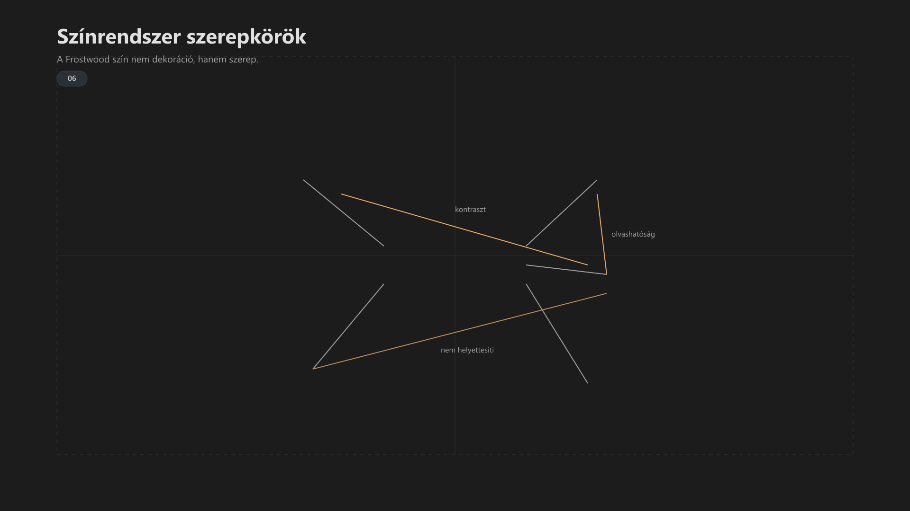

-   

    # 06. Rendszerszintű akadálymentességi alapelvek { #06-rendszerszintu-akadalymentessegi-alapelvek }

    > Szerző: Hegedüs Gábor (@hege-g) 
    > Licenc: [MIT (Kód) / CC BY-NC-ND 4.0 (Docs)] 
    > Frostwood Docs: v1.0.0 
    > Rendszerverzió / Állapot: v1.0.5 / Stabil 
    > Blokk:  Alapok 
    > Mód: :material-eye-check: WCAG / Kisegítő lehetőség

-   ## Tartalomkártyák

    * [:material-infinity: 1. Az akadálymentesség szerepe a Frostwood rendszerben](#1-az-akadalymentesseg-szerepe-a-frostwood-rendszerben)
    * [:material-infinity: 2. WCAG megfelelési célszint](#2-wcag-megfelelesi-celszint)
    * [:material-infinity: 3. Alapelv: perceivable / operable / understandable / robust](#3-alapelv-perceivable-operable-understandable-robust)
        * [:material-infinity: 3.1 Perceivable (észlelhető)](#31-perceivable-eszlelheto)
        * [:material-infinity: 3.2 Operable (kezelhető)](#32-operable-kezelheto)
        * [:material-infinity: 3.3 Understandable (érthető)](#33-understandable-ertheto)
        * [:material-infinity: 3.4 Robust (robosztus)](#34-robust-robosztus)
    * [:material-infinity: 4. Kontraszt és színhasználat](#4-kontraszt-es-szinhasznalat)
        * [:material-infinity: 4.1 Kontraszt szabály](#41-kontraszt-szabaly)
        * [:material-infinity: 4.2 Szín mint jelzés](#42-szin-mint-jelzes)
        * [:material-infinity: 4.3 WCAG mód viselkedés](#43-wcag-mod-viselkedes)
    * [:material-infinity: 5. Fókuszkezelés](#5-fokuszkezeles)
        * [:material-infinity: 5.1 Fókusz jelölése](#51-fokusz-jelolese)
    * [:material-infinity: 6. Mozgás és animáció](#6-mozgas-es-animacio)
    * [:material-infinity: 7. Időzítés és reakcióidő](#7-idozites-es-reakcioido)
    * [:material-infinity: 8. Képernyőolvasó kompatibilitás](#8-kepernyoolvaso-kompatibilitas)
        * [:material-infinity: 8.1 Alapelv](#81-alapelv)
        * [:material-infinity: 8.2 Viselkedés](#82-viselkedes)
        * [:material-infinity: 8.3 Stabilitás](#83-stabilitas)
    * [:material-infinity: 9. Jelzés és akadálymentesség](#9-jelzes-es-akadalymentesseg)
    * [:material-infinity: 10. Billentyűzet és vezérlés](#10-billentyuzet-es-vezerles)
    * [:material-infinity: 11. Rendszerhatárok](#11-rendszerhatarok)
    * [:material-infinity: 12. Visszafordíthatóság](#12-visszafordithatosag)
    * [:material-infinity: 13. Gyors ellenőrző lista](#13-gyors-ellenorzo-lista)
    * [:material-infinity: 14. Záró alapelv](#14-zaro-alapelv)

## 1. Az akadálymentesség szerepe a Frostwood rendszerben

A Frostwood nem külön „akadálymentes módot” kezel.

Az akadálymentesség:

> A rendszer működésének alaprétege.

Nem kiegészítés, nem opcionális modul.

---

## 2. WCAG megfelelési célszint

A Frostwood célja:

* **WCAG 2.1 AA – alap működés**
* **WCAG 2.1 AAA – fókusz és olvashatóság (ahol lehetséges)**

---

## 3. Alapelv: perceivable / operable / understandable / robust

???+ abstract "Összefoglaló"
    A rendszer a WCAG négy alapelvére épül.

-   ### 3.1 Perceivable (észlelhető)

    * stabil kontraszt  
    * nem vibráló felület  
    * szín nem hordoz kizárólagos jelentést  

-   ### 3.2 Operable (kezelhető)

    * teljes billentyűzet-vezérlés  
    * fókusz egyértelmű  
    * nincs időkritikus interakció  

-   ### 3.3 Understandable (érthető)

    * egy esemény = egy jelzés  
    * konzisztens viselkedés  
    * nincs rejtett állapot  

-   ### 3.4 Robust (robosztus)

    * kompatibilis képernyőolvasóval  
    * nem függ nem dokumentált API-tól  
    * visszafordítható működés  
    * A felület szemantikai struktúrája (fejlécek, listák) segítő technológia nélkül, vizuálisan is logikus marad.  

---

## 4. Kontraszt és színhasználat

??? info "Vizuális leírás akadálymentesítéshez"
    A kép közepén egy „Frostwood színrendszer” feliratú elem található.

    Körülötte öt blokk helyezkedik el:

    1. **Háttér / Felület:** sötét szürke árnyalatok, amelyek a vizuális alapot adják.
    2. **Szöveg:** világosabb színek, amelyek az olvashatóságot biztosítják.
    3. **Accent:** egyetlen narancssárga szín, amely csak fókuszra használható.
    4. **Állapotjelzők:** külön színek siker, figyelmeztetés és információ jelzésére.
    5. **Meta / Segéd:** szerkezeti elemekhez használt semleges színek.

    A blokkok a központhoz kapcsolódnak, jelezve, hogy mind a rendszer részei.

    A diagram hangsúlyozza, hogy a színek funkcionális szerepet töltenek be, nem dekorációs célúak.

-   ### 4.1 Kontraszt szabály

    * **Normál szöveg:** minimum 4.5:1 (AA)  
    * **Nagy szöveg és ui grafikai elemek:** minimum 3:1  
    * **célzott kritikus területek (pl. fókuszkeret):** ahol lehet → 7:1 (AAA)

-   ### 4.2 Szín mint jelzés

    A Frostwood-ban:

    > A szín nem lehet az egyetlen információhordozó.

    Minden színhez tartozik:

    * szöveg  
    * vagy állapot  
    * vagy fókusz  

-   ### 4.3 WCAG mód viselkedés

    WCAG módban:

    * SignalColors OFF  
    * szín szerepe minimalizált  
    * kontraszt stabilizált  
    * háttér egyszínű  

---

## 5. Fókuszkezelés

A fókusz a rendszer egyik legfontosabb eleme.

Szabályok:

* mindig látható  
* nem ugrál  
* nem többes  
* nem színfüggő  

### 5.1 Fókusz jelölése

???+ warning "Figyelem"
    * Primary (narancs) csak aktív fókusz  
    * nincs dekoratív használat  
    * nincs hover-alapú jelentés  

---

## 6. Mozgás és animáció

A Frostwood:

> Nem használ animációt jelzésre.

-   Tiltott:

    * villogás  
    * pulzálás  
    * figyelemfelkeltő mozgás  

-   Megengedett:

    * minimális UI átmenet (nem jelentéshordozó)

---

## 7. Időzítés és reakcióidő

A rendszer nem követel gyors reakciót.

* nincs időzített kényszer  
* jelzések eltűnnek vagy állapothoz kötöttek  
* felhasználó kontrollál  

---

## 8. Képernyőolvasó kompatibilitás

A Frostwood elsődlegesen együttműködik:

* JAWS  
* NVDA  

-   ### 8.1 Alapelv

    > Ha a rendszer beszél, a vizuális réteg halkodik.

    Ez a gyakorlatban azt jelenti, hogy az auditív információ (JAWS/NVDA) élvez prioritást; a vizuális effektek nem versenyezhetnek a figyelemért a hangzó tartalommal.

-   ### 8.2 Viselkedés

    * nincs redundáns hang + vizuális jelzés  
    * nincs vizuális túlhangosítás beszéd közben  
    * fókusz és beszéd összhangban  

-   ### 8.3 Stabilitás

    * nincs automatikus fókusz ugrás  
    * nincs rejtett UI változás  
    * nincs háttérben módosuló állapot  

---

## 9. Jelzés és akadálymentesség

A jelzésrendszer a WCAG alapelvek szerint működik:

* egy esemény = egy jelzés  
* intenzitás kontrollált  
* időbeliség szabályozott  

WCAG módban:

* jelzés minimalizált  
* zaj csökkentett  
* fókusz dominál  

---

## 10. Billentyűzet és vezérlés

A rendszer:

* :material-mouse-off: nem igényel egeret  
* minden funkció elérhető billentyűzetről  
* shortcut-alapú működés támogatott  
* **Nincsenek fókusz-csapdák:** a felhasználó bármely interaktív elemből kiléphet a billentyűzet segítségével.  

---

## 11. Rendszerhatárok

A Frostwood nem:

* módosít kernel szinten  
* injektál alkalmazásba  
* használ nem dokumentált hackeket  

Ez biztosítja:

* stabilitás  
* kompatibilitás  
* visszafordíthatóság  

---

## 12. Visszafordíthatóság

Minden módosítás:

* dokumentált  
* visszaállítható  
* nem rejtett  

---

## 13. Gyors ellenőrző lista

A rendszer akkor felel meg, ha:

* :material-checkbox-blank-outline: kontraszt stabil  
* :material-checkbox-blank-outline: fókusz egyértelmű  
* :material-checkbox-blank-outline: nincs villogás  
* :material-checkbox-blank-outline: nincs multi-signal  
* :material-checkbox-blank-outline: képernyőolvasóval stabil  
* :material-checkbox-blank-outline: **Szemantikus hierarchia:** A tartalom sorrendje logikus képernyőolvasóval is.  

---

## 14. Záró alapelv

> Az akadálymentesség nem külön mód, hanem a rendszer működésének alapja.