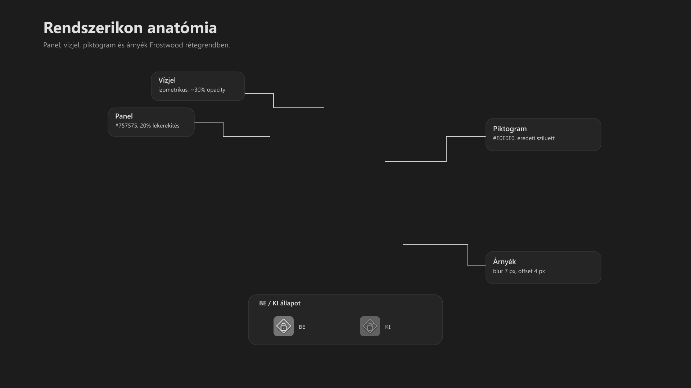
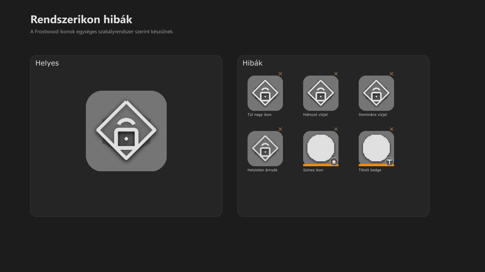

<div class="grid cards frostwood-header-cards" markdown>

-   <span class="fw-module-header-icon fw-module-08" aria-hidden="true"></span>

    # 08. Rendszer ikonok { #08-rendszer-ikonok }

    > Szerző: Hegedüs Gábor (@hege-g)<br>
    > Licenc: [MIT (Kód) / CC BY-NC-ND 4.0 (Docs)]<br>
    > Frostwood Docs: v1.0.0<br>
    > Rendszerverzió / Állapot: v1.0.5 / Stabil<br>
    > Blokk: <span class="fw-block-icon-main-alapok" aria-hidden="true"></span> Alapok

</div>

<div class="grid cards frostwood-toc-cards" markdown>

-   ## Tartalomkártyák

    * [:material-infinity: 1. Feldolgozott ikonok](#1-feldolgozott-ikonok)
    * [:material-infinity: 2. Piktogram integritás](#2-piktogram-integritas)
    * [:material-infinity: 3. Alkalmazott FrostWood design](#3-alkalmazott-frostwood-design)
        * [:material-infinity: 3.1 Panel](#31-panel)
        * [:material-infinity: 3.2 Vízjel](#32-vizjel)
        * [:material-infinity: 3.3 Fő alkalmazás ikon](#33-fo-alkalmazas-ikon)
            * [:material-infinity: 3.3.1 Árnyék](#331-arnyek)
        * [:material-infinity: 3.4 BE / KI állapot](#34-be-ki-allapot)
        * [:material-infinity: 3.5 Rendszer ikonok NEM kapnak](#35-rendszer-ikonok-nem-kapnak)
    * [:material-infinity: 4. A kész csomag struktúrája](#4-a-kesz-csomag-strukturaja)

        * [:material-infinity: A) Függelék: Rendszer ikonok (figurák) részletes vizuális elemzése](#a-fuggelek-rendszer-ikonok-figurak-reszletes-vizualis-elemzese)
        * [:material-infinity: A/1. Állapotjelzési protokoll (BE / KI)](#a1-allapotjelzesi-protokoll-be-ki)
        * [:material-infinity: A/2. Figurák részletes leírása](#a2-figurak-reszletes-leirasa)
            * [:material-infinity: A/2.1 JAWS vezérlés (Sebesség indikátorok)](#a21-jaws-vezerles-sebesseg-indikatorok)
            * [:material-infinity: A/2.2 WCAG és Vizualitás (Segédletek)](#a22-wcag-es-vizualitas-segedletek)
            * [:material-infinity: A/2.3 Rendszerbiztonság és Mobilitás](#a23-rendszerbiztonsag-es-mobilitas)
        * [:material-infinity: A/3. Vizuális rétegek (Stacking order)](#a3-vizualis-retegek-stacking-order)

</div>

## 1. Feldolgozott ikonok

??? example "Az eredeti csomag ikonjai"
    ```text title="Text"
    JAWS_Lassubb.ico
    JAWS_Normal.ico
    SignalColors_BIZTONSAGOS.ico
    SignalColors_KI.ico
    SignalColors_KONTRASZT.ico
    SoftLock_BE.ico
    SoftLock_KI.ico
    Travel_BE.ico
    Travel_KI.ico
    WCAG_BE.ico
    WCAG_KI.ico
    WCAG_RESET.ico
    ```


???+ note "Megjegyzés"
    A fájlnevek változatlanok maradnak.


---

## 2. Piktogram integritás

A Rendszer ikonok feldolgozásakor az eredeti piktogramok<br>
geometriája és sziluettje változatlan marad.

Az alkalmazott feldolgozás kizárólag:

* monokróm konverzió (#E0E0E0)
* Frostwood panel
* izometrikus kocka vízjel
* optikai méretezés (76%)
* árnyék

???+ warning "Figyelem"
    A piktogramok nem kerülnek újra rajzolásra.


???+ quote "Alapelv"
    > Ez biztosítja, hogy a felhasználó által korábban ismert vizuális jelentések változatlanok maradjanak.


---

## 3. Alkalmazott FrostWood design



??? info "Vizuális leírás akadálymentesítéshez"
    A kép közepén egy nagyított Frostwood rendszerikon látható.

    Az ikon alapja egy sötétszürke, lekerekített panel. A panelen egy halvány izometrikus kocka vízjel jelenik meg. A középpontban egy világosszürke fő ikon található, amely az eredeti alkalmazásikon monokróm változata.

    A panel alatt finom árnyék látható, amely enyhe mélységet ad.

    Az ikon körül mutatóvonalak jelölik a fő elemeket: panel, vízjel, fő ikon és árnyék.

    A kép alsó részén egy kisebb összehasonlítás mutatja a BE és KI állapotot. A KI állapot halványabb és enyhén szürkített.

    A kép azt szemlélteti, hogy a Frostwood rendszerikon több rétegből épül fel, és ezek együtt adják a végső megjelenést.


<div class="grid cards frostwood-section-cards frostwood-numbered-card" markdown>

-   ### 3.1 Panel

    * **Szín:** #757575
    * **Lekerekítés:** 20%

-   ### 3.2 Vízjel

    **Izometrikus kocka**

    lap színek:

    * **Felső:** #F0F0F0
    * **Jobb:** #D6D6D6
    * **Bal:** #BFBFBF

    * **Opacity:** ~30%
    * **Méret:** ~60%
 
-   ### 3.3 Fő alkalmazás ikon

    * **Méret:** 76%

    ???+ warning "Figyelem"
        > Az eredeti alkalmazásikon sziluettjének megőrzése kötelező.


-   #### 3.3.1 Árnyék

    * **Blur:** 7px
    * **Offset:** 4px
    * **Opacity:** ~55%

-   ### 3.4 BE / KI állapot

    A jóváhagyott módszer:

    * **Opacity:** 75%
    * **Desaturate:** 15%

    Így:

    * **BE (Aktív állapot)**
        * **Megjelenés:** normál
        * **Jellemző:** teljes kontraszt, és az adott módhoz rendelt standard színkészlet érvényesül
    * **KI (Inaktív állapot)**
        * **Megjelenés:** halvány és enyhén szürkített
        * **Jellemző:** Csökkentett vizuális súly, amely jelzi, hogy a funkció jelenleg nem hozzáférhető vagy nem releváns, megfelelve a **WCAG 1.4.3** kontraszt-elveinek az inaktív elemekre vonatkozóan

    ???+ note "Megjegyzés"
        Ez Windows 11 standard inaktív jelzéshez illeszkedik.


-   ### 3.5 Rendszer ikonok NEM kapnak

    ???+ warning "Figyelem"
        * kalapács badge
        * ház badge
        * kategória színcsík

        mert ezek csak Home és Work ikonok.


</div>

---

## 4. A kész csomag struktúrája



??? info "Vizuális leírás akadálymentesítéshez"
    A kép bal oldalán egy helyesen kialakított Frostwood ikon látható, amely tartalmazza a panelt, a halvány vízjelet, a központi piktogramot és a finom árnyékot.

    A jobb oldalon több kisebb ikon látható, amelyek mind egy-egy hibát szemléltetnek. Ezek között szerepel túl nagy piktogram, hiányzó vízjel, túl erős vízjel, hibás árnyék, színes ikon és tiltott badge használat.

    A kép célja annak bemutatása, hogy milyen hibák kerülendők az ikonok készítése során.


??? success "Kész Rendszer ikonok"
    ```text title="Text"
    JAWS_Lassubb.ico
    JAWS_Normal.ico
    SignalColors_BIZTONSAGOS.ico
    SignalColors_KI.ico
    SignalColors_KONTRASZT.ico
    SoftLock_BE.ico
    SoftLock_KI.ico
    Travel_BE.ico
    Travel_KI.ico
    WCAG_BE.ico
    WCAG_KI.ico
    WCAG_RESET.ico
    ```


??? success "Kész Rendszerikon méretek"
    ```text title="Text"
    16
    20
    24
    32
    40
    48
    64
    96
    128
    256
    ```


???+ quote "Alapelv"
    > A Frostwood Rendszerikon akkor helyes, ha minden réteg külön azonosítható, de együtt egyetlen vizuális egységet alkot.


---

<div class="grid cards frostwood-header-cards" markdown>

-   <span class="fw-appendix-header-icon fw-appendix-a" aria-hidden="true"></span>

    # A) Függelék: Rendszer ikonok (figurák) részletes vizuális elemzése { #a-fuggelek-rendszer-ikonok-figurak-reszletes-vizualis-elemzese }

    > Szerző: Hegedüs Gábor (@hege-g)<br>
    > Licenc: [MIT (Kód) / CC BY-NC-ND 4.0 (Docs)]<br>
    > Frostwood Docs: v1.0.0<br>
    > Rendszerverzió / Állapot: v1.0.5 / Stabil<br>
    > Blokk: <span class="fw-block-icon-main-alapok" aria-hidden="true"></span> Alapok<br>
    > Kiegészítő függelék a `08. Rendszer ikonok` modulhoz.

</div>

<div class="grid cards frostwood-toc-cards" markdown>

-   ## Tartalomkártyák

    * [:material-infinity: A/1. Állapotjelzési protokoll (BE / KI)](#a1-allapotjelzesi-protokoll-be-ki)
    * [:material-infinity: A/2. Figurák részletes leírása](#a2-figurak-reszletes-leirasa)
        * [:material-infinity: A/2.1 JAWS vezérlés (Sebesség indikátorok)](#a21-jaws-vezerles-sebesseg-indikatorok)
        * [:material-infinity: A/2.2 WCAG és Vizualitás (Segédletek)](#a22-wcag-es-vizualitas-segedletek)
        * [:material-infinity: A/2.3 Rendszerbiztonság és Mobilitás](#a23-rendszerbiztonsag-es-mobilitas)
    * [:material-infinity: A/3. Vizuális rétegek (Stacking order)](#a3-vizualis-retegek-stacking-order)

</div>

??? abstract "Összefoglaló"
    Ez a kiegészítés a FrostWood rendszerfunkcióit vezérlő ikonok ("figurák") geometriai felépítését és állapotjelzéseit részletezi. A rendszer ikonok közös jellemzője a #E0E0E0 (világosszürke) monokróm megjelenítés és a háttérben meghúzódó izometrikus kocka vízjel.


## A/1. Állapotjelzési protokoll (BE / KI)

???+ note "Megjegyzés"
    A rendszer ikonok vizuális visszacsatolása a Windows 11 standardjaihoz igazodik:

    * **Aktív (BE):** Teljesen átlátszatlan (#E0E0E0), határozott kontúrok, erős árnyékvetés.
    * **Inaktív (KI):** 75%-os átlátszóság (opacity) és 15%-os szürkítés (desaturate). A figura ilyenkor beleolvad a háttérpanelbe, jellezve a funkció kikapcsolt állapotát.


---

## A/2. Figurák részletes leírása

<div class="grid cards frostwood-section-cards frostwood-numbered-card" markdown>

-   ### A/2.1 JAWS vezérlés (Sebesség indikátorok)

    * **JAWS_Normal:** Egy balra néző / úszó, stilizált cápa profilja. Az orr rész hegyes, a hátuszony dinamikusan hátrahajlik. A figura a panel vízszintes felezővonalán helyezkedik el.
    * **JAWS_Lassubb:** Az alap cápa-sziluett alatt két párhuzamos, vízszintes vonal látható. Ezek a vonalak a mozgási energiát szimbolizáló "speed lines" ellentétei: a figura alatti statikus elhelyezkedésük a tempó csökkenését és a stabilitást hangsúlyozza.

-   ### A/2.2 WCAG és Vizualitás (Segédletek)

    * **WCAG (Emberalak):** Egy körívbe foglalt, kinyújtott karú, absztrakt emberi sziluett (a nemzetközi akadálymentességi logó alapján). A figura szimmetrikus, a panel mértani közepét foglalja el.
    * **WCAG RESET (Íves Nyíl és Emberalak):** A középpontban a jól ismert stilizált emberalak áll, amelyet egy 270 fokos, az óramutató járásával ellentétes irányba mutató íves nyíl ölel körbe. A nyíl hegye az emberalak feje felett végződik. (A klasszikus WCAG szimbólumot ötvözi a Windows-ból ismert reset/frissítés jellel.)
    * **SignalColors (Sávok):** Három egymás melletti, függőleges téglalap (oszlop). 
    * **BIZTONSÁGOS:** A középső oszlop magassága kiemelkedik a két szélső közül, egyfajta "védett csúcsot" formázva. (A középső oszlop magasabb, mint a két szélső, így egy piramis-szerű sziluettet alkot.)
    * **KONTRASZT:** Az oszlopok élei között éles, sötétszürke negatív tér (választóvonal) látható, hangsúlyozva az elkülöníthetőséget.

-   ### A/2.3 Rendszerbiztonság és Mobilitás

    * **SoftLock (Lakat):**
        * **BE:** Egy zömök, téglalap alakú lakat-test, felette egy zárt, félköríves kengyellel. A biztonság és a rögzített állapot szimbóluma.
        * **KI:** Ugyanez a forma, de a kengyel a jobb oldalon nyitott, és felfelé elforgatott pozícióban van, jelezve a rendszer nyitottságát.
    * **Travel (Repülőgép):** Egy felülnézetből ábrázolt, 45 fokos szögben felfelé mutató repülőgép sziluettje. A szárnyak és a vezérsík tiszta geometriai háromszögeket és trapézokat formáznak, a mobilitás dinamikáját sugallva.

</div>

---

## A/3. Vizuális rétegek (Stacking order)

A rendszer ikonok három rétegből épülnek fel, kategória-színcsík nélkül:

1.  **Alap:** #757575 színű, 20%-os lekerekítésű sötétszürke panel.
2.  **Vízjel:** Középen elhelyezkedő, ~30%-os átlátszóságú izometrikus kocka, melynek három oldala (felső, jobb, bal) eltérő szürke árnyalattal ad térhatást.
3.  **Figura:** A legfelső rétegen elhelyezkedő piktogram, amely 7 pixels sugarú blur árnyékkal emelkedik el a kocka felett, mélységet adva a 2D-s ikonnak.