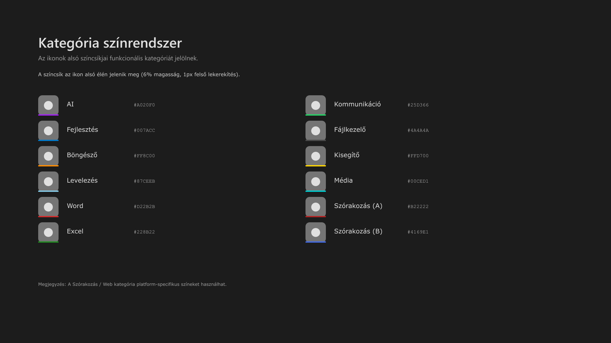
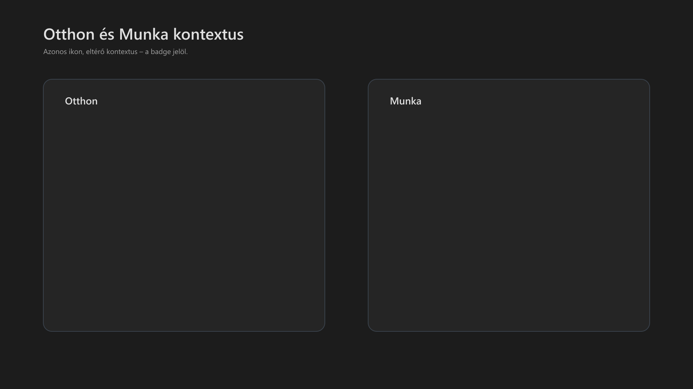

<div class="grid cards frostwood-header-cards" markdown>

-   <span class="fw-module-header-icon fw-module-09" aria-hidden="true"></span>

    # 09. Otthon és Munka ikonok { #09-otthon-es-munka-ikonok }

    > Szerző: Hegedüs Gábor (@hege-g)<br>
    > Licenc: [MIT (Kód) / CC BY-NC-ND 4.0 (Docs)]<br>
    > Frostwood Docs: v1.0.0<br>
    > Rendszerverzió / Állapot: v1.0.5 / Stabil<br>
    > Blokk: <span class="fw-block-icon-main-alapok" aria-hidden="true"></span> Alapok

</div>

<div class="grid cards frostwood-toc-cards" markdown>

-   ## Tartalomkártyák

    * [:material-infinity: 1. Frostwood design elvek](#1-frostwood-design-elvek)
        * [:material-infinity: 1.1 Vizuális memória stabilitás](#11-vizualis-memoria-stabilitas)
    * [:material-infinity: 2. Alkalmazott FrostWood design](#2-alkalmazott-frostwood-design)
        * [:material-infinity: 2.1 Panel](#21-panel)
        * [:material-infinity: 2.2 Vízjel](#22-vizjel)
        * [:material-infinity: 2.3 Fő alkalmazás ikon](#23-fo-alkalmazas-ikon)
            * [:material-infinity: 2.3.1 Árnyék](#231-arnyek)
        * [:material-infinity: 2.4 Otthon és Munka Badge](#24-otthon-es-munka-badge)
            * [:material-infinity: 2.4.1 Badge forma](#241-badge-forma)
            * [:material-infinity: 2.4.2 Belső háttér](#242-belso-hatter)
            * [:material-infinity: 2.4.3 Ház és Kalapács](#243-haz-es-kalapacs)
            * [:material-infinity: 2.4.4 Árnyékolás](#244-arnyekolas)
            * [:material-infinity: 2.4.5 Külső gyűrű](#245-kulso-gyuru)
            * [:material-infinity: 2.4.6 Összkép](#246-osszkep)
        * [:material-infinity: 2.5 Kategória színcsík](#25-kategoria-szincsik)
            * [:material-infinity: 2.5.1 Kategória színek](#251-kategoria-szinek)
    * [:material-infinity: 3. Alkalmazások kategóriái](#3-alkalmazasok-kategoriai)
        * [:material-infinity: 3.1 AI](#31-ai)
        * [:material-infinity: 3.2 Fejlesztés](#32-fejlesztes)
        * [:material-infinity: 3.3 Böngésző](#33-bongeszo)
        * [:material-infinity: 3.4 Levelezés](#34-levelezes)
        * [:material-infinity: 3.5  Word](#35-word)
        * [:material-infinity: 3.6 Excel](#36-excel)
        * [:material-infinity: 3.7 Kommunikáció](#37-kommunikacio)
        * [:material-infinity: 3.8 Fájlkezelő](#38-fajlkezelo)
        * [:material-infinity: 3.9 Kisegítő](#39-kisegito)
        * [:material-infinity: 3.10 Média](#310-media)
        * [:material-infinity: 3.11 Szórakozás / Web](#311-szorakozas-web)
    * [:material-infinity: 4. Ikonok listája](#4-ikonok-listaja)
        * [:material-infinity: 4.1 Otthon ikonok](#41-otthon-ikonok)
        * [:material-infinity: 4.2 Munka ikonok](#42-munka-ikonok)
        * [:material-infinity: 4.3 ICO méretek](#43-ico-meretek)

    * [:material-infinity: A) Függelék: Piktogramok (figurák) részletes vizuális elemzése](#a-fuggelek-piktogramok-figurak-reszletes-vizualis-elemzese)
        * [:material-infinity: A/1. Általános megjelenítési szabályok](#a1-altalanos-megjelenitesi-szabalyok)
        * [:material-infinity: A/2. Kiemelt figura-leírások (Monokróm változatok)](#a2-kiemelt-figura-leirasok-monokrom-valtozatok)
            * [:material-infinity: A/2.1 Böngésző, Fejlesztés és Iroda (Geometrikus formák)](#a21-bongeszo-fejlesztes-es-iroda-geometrikus-formak)
            * [:material-infinity: A/2.2 Kommunikáció és Web (Íves sziluettek)](#a22-kommunikacio-es-web-ives-sziluettek)
            * [:material-infinity: A/2.3 Mesterséges Intelligencia (Absztrakt formák)](#a23-mesterseges-intelligencia-absztrakt-formak)
            * [:material-infinity: A/2.4 Rendszer és Segédeszközök](#a24-rendszer-es-segedeszkozok)
        * [:material-infinity: A/3. Kontextus-integráció (Badge viszony)](#a3-kontextus-integracio-badge-viszony)
    * [:material-infinity: B) Függelék: Kategória-színcsíkok vizuális specifikációja](#b-fuggelek-kategoria-szincsikok-vizualis-specifikacioja)
        * [:material-infinity: B/1. Böngészők és Webes eszközök](#b1-bongeszok-es-webes-eszkozok)
        * [:material-infinity: B/2. Mesterséges Intelligencia (AI)](#b2-mesterseges-intelligencia-ai)
        * [:material-infinity: B/3. Levelezés és Üzenetküldés](#b3-levelezes-es-uzenetkuldes)
        * [:material-infinity: B/4. Irodai alkalmazások](#b4-irodai-alkalmazasok)
        * [:material-infinity: B/5. Fejlesztés és Szerkesztés](#b5-fejlesztes-es-szerkesztes)
        * [:material-infinity: B/6. Kommunikáció](#b6-kommunikacio)
        * [:material-infinity: B/7. Média és Tartalomgyártás](#b7-media-es-tartalomgyartas)
        * [:material-infinity: B/8. Rendszer és Kisegítő eszközök](#b8-rendszer-es-kisegito-eszkozok)
        * [:material-infinity: B/9. Vizuális hierarchia (WCAG szempontok)](#b9-vizualis-hierarchia-wcag-szempontok)

</div>

## 1. Frostwood design elvek

<div class="grid cards frostwood-section-cards frostwood-numbered-card" markdown>

-   ### Egységes panel

    Minden ikon azonos `#757575` háttérpanelen jelenik meg, ami stabil vizuális alapot biztosít.

-   ### Piktogram integritás

    Az eredeti alkalmazásikonok:

    * formája,
    * sziluettje,
    * arányai,

    változatlan maradnak; a rendszer csak monokróm konverziót alkalmaz.

    ???+ warning "Figyelem"
        A rendszer nem rajzol új ikonokat.


-   ### Gyors felismerhetőség

    A felismerés három rétegben történik:

    1. forma (alkalmazás),
    2. badge (környezet),
    3. színcsík (kategória).

    A kategóriát az ikon alsó élén futó színcsík jelöli, így kis méretben is azonnal azonosítható.

-   ### Kontextusjelzés

    ???+ warning "Figyelem"
        A jobb alsó sarokban lévő badge mutatja a környezetet:

        * ház = Home, otthoni környezet,
        * kalapács = Work, munka környezet.


-   ### Vizuális stabilitás

    A rendszerikonok és alkalmazásikonok egységes méretezést, árnyékolást és elrendezést használnak,  
    így a felhasználó vizuális memóriája gyorsan megtanulja az ikonok jelentését.

</div>

### 1.1 Vizuális memória stabilitás

???+ quote "Alapelv"
    > A Frostwood ikonrendszer egyik alapelve a vizuális memória stabilitása.<br>

    > Az ikonok formája és sziluettje minden feldolgozás során változatlan marad,<br>
    > így a felhasználó hosszú távon ugyanazokat a vizuális jeleket tanulja meg felismerni.


---

## 2. Alkalmazott FrostWood design

<div class="grid cards frostwood-section-cards frostwood-numbered-card" markdown>

-   ### 2.1 Panel

    * s**Zín:** #757575
    * **Lekerekítés:** 20%

-   ### 2.2 Vízjel

    **Izometrikus kocka**

    lap színek:

    * **Felső:** #F0F0F0
    * **Jobb:** #D6D6D6
    * **Bal:** #BFBFBF

    * **Opacity:** ~30%
    * **Méret:** ~60%

-   ### 2.3 Fő alkalmazás ikon

    * **Méret:** 76%

    > Eredeti alkalmazásikon használata.

    #### 2.3.1 Árnyék

    * **Blur:** 7px
    * **Offset:** 4px
    * **Opacity:** ~55%

</div>

### 2.4 Otthon és Munka Badge

<div class="grid cards frostwood-section-cards frostwood-numbered-card" markdown>

-   #### 2.4.1 Badge forma

    * kör alakú
    * **Pozíció:** jobb alsó sarok
    * **Méret:** panel 22% + 2 px

-   #### 2.4.2 Belső háttér

    **Radial gradient**

    * **Középpont:** #5A5A5A
    * **Szél:** #3F3F3F

    Ez:

    * jól elkülöníti a badge-et a `#757575` paneltől
    * mégsem túl kontrasztos.

-   #### 2.4.3 Ház és Kalapács

    * **Szín:** #E0E0E0

    ???+ note "Megjegyzés"
        Stílus: platina / brushed metal hatás.


    jellemzők:

    * **1 px lekerekítés**
    * minimalista sziluett
    * egységes vastagság

-   #### 2.4.4 Árnyékolás

    **Soft Drop Shadow**

    * **Offset:** 1–2 px
    * **Blur:** 2–3 px
    * **Opacity:** ~35%
    * **Szín:** #000000

    ???+ note "Megjegyzés"
        Ez ad egy finom lebegő hatást, de nem lesz túl hangsúlyos.


-   #### 2.4.5 Külső gyűrű

    * **Szín:** #FFFFFF
    * **Vastagság:** 2 px

    Ez:

    * jól kirajzolja a badge-et
    * kis ikonméretben is tiszta marad.

-   #### 2.4.6 Összkép

    A badge így:

    * külön rétegen ül
    * jól olvasható 16 px ikonméretnél is
    * illeszkedik a Windows 11 Fluent stílushoz.

</div>

### 2.5 Kategória színcsík



??? info "Vizuális leírás akadálymentesítéshez"
    A kép egy kétoszlopos listát mutat, amelyben minden sor egy kategóriát reprezentál.

    Minden sor bal oldalán egy azonos felépítésű ikonrészlet látható, amelynek alján egy színes csík található. Ez a csík jelöli a kategóriát.

    A sor közepén a kategória neve, jobb oldalán a hozzá tartozó hex színkód szerepel.

    A lista több kategóriát tartalmaz, például AI, fejlesztés, böngésző, kommunikáció és média.

    A „Szórakozás / Web” kategória két külön sorban jelenik meg, két külön színnel, jelezve a platformfüggő eltérést.

    A kép célja a kategória-alapú vizuális azonosítás bemutatása.


* **Elhelyezkedés:** panel alsó él
* **Szélesség:** teljes
* **Vastagság:** 6%
* **Felső sarkok:** 1 px lekerekítés

???+ note "Megjegyzés"
    Ez ad egy finom Fluent UI jellegű ívet.


#### 2.5.1 Kategória színek

<div class="grid cards frostwood-section-cards frostwood-numbered-card" markdown>

-   ##### AI

    * **Hex:** `#A020F0`
    * **Megnevezés:** középlila

-   ##### Fejlesztés

    * **Hex:** `#007ACC`
    * **Megnevezés:** középkék

-   ##### Böngésző

    * **Hex:** `#FF8C00`
    * **Megnevezés:** sötétnarancs

-   ##### Levelezés

    * **Hex:** `#87CEEB`
    * **Megnevezés:** égszínkék

-   ##### Word

    * **Hex:** `#D22B2B`
    * **Megnevezés:** téglavörös

-   ##### Excel

    * **Hex:** `#228B22`
    * **Megnevezés:** sötétzöld

-   ##### Kommunikáció

    * **Hex:** `#25D366`
    * **Megnevezés:** világoszöld

-   ##### Fájlkezelő

    * **Hex:** `#4A4A4A`
    * **Megnevezés:** sötétszürke

-   ##### Kisegítő

    * **Hex:** `#FFD700`
    * **Megnevezés:** aranysárga

-   ##### Média

    * **Hex:** `#00CED1`
    * **Megnevezés:** sötét türkiz

-   ##### Szórakozás / Web 1.

    * **Hex:** `#B22222`
    * **Megnevezés:** sötétvörös

-   ##### Szórakozás / Web 2.

    * **Hex:** `#4169E1`
    * **Megnevezés:** királykék

</div>

---

## 3. Alkalmazások kategóriái

<div class="grid cards frostwood-section-cards frostwood-numbered-card" markdown>

-   ### 3.1 AI

    * ChatGPT
    * Gemini
    * **Csík:** középlila (#A020F0)

-   ### 3.2 Fejlesztés

    * Visual Studio Code
    * **Csík:** középkék (#007ACC)

-   ### 3.3 Böngésző

    * Google Chrome
    * Mozilla Firefox
    * Brave
    * **Csík:** sötétnarancs (#FF8C00)

-   ### 3.4 Levelezés

    * Thunderbird
    * **Csík:** égszínkék (#87CEEB)

-   ### 3.5  Word

    * Microsoft Word
    * **Csík:** téglavörös (#D22B2B)

-   ### 3.6 Excel

    * Microsoft Excel
    * **Csík:** sötétzöld (#228B22)

-   ### 3.7 Kommunikáció

    * WhatsApp
    * Zoom
    * **Csík:** világoszöld (#25D366)

-   ### 3.8 Fájlkezelő

    * Total Commander
    * **Csík:** sötétszürke (#4A4A4A)

-   ### 3.9 Kisegítő

    * JAWS
    * **Csík:** aranysárga (#FFD700)

-   ### 3.10 Média

    * VLC media player
    * Insta360 Studio
    * **Csík:** sötét türkiz (#00CED1)

-   ### 3.11 Szórakozás / Web

    * YouTube
    * Facebook

    * **YouTube csík:** sötétvörös (#B22222)
    * **Facebook csík:** királykék (#4169E1)

    Ez a két szín a FrostWood rendszerben külön kategóriajelölésként használható, hogy vizuálisan is elkülönüljön a tartalomfogyasztás a munkától és az általános kommunikációtól.

</div>

#### Fontos

???+ success "Ez a paletta mostantól"
    * Munka ikonok
    * Otthon ikonok
    * jövőbeli Frostwood ikonok

    mindegyiknél változatlanul használható.


---

## 4. Ikonok listája



??? info "Vizuális leírás akadálymentesítéshez"
    A kép két azonos méretű panelből áll egymás mellett.

    A bal oldali panel címe „Otthon”. Közepén egy nagyított alkalmazásikon látható, amely egy szürke, lekerekített panelen jelenik meg, alján egy kategóriajelző színcsíkkal. A jobb alsó sarokban egy kör alakú badge található, benne egy ház piktogrammal.

    A jobb oldali panel címe „Munka”. Az ikon felépítése ugyanaz: azonos panel, azonos fő piktogram, azonos alsó színcsík. A különbség a jobb alsó sarokban lévő badge, amely itt egy kalapács piktogramot tartalmaz.

    Mindkét badge külön rétegen ül, kör alakú, sötétszürke belső gradienssel, fehér külső gyűrűvel és finom árnyékkal. A kép célja annak bemutatása, hogy a Frostwood rendszerben a kontextust a badge változása jelzi, miközben az alkalmazás alapikonja azonos marad.


<div class="grid cards frostwood-section-cards frostwood-numbered-card" markdown>

-    ### 4.1 Otthon ikonok

    ??? success "Kész Otthon ikonok"
        ```text title="Text"
        Home_TotalCommander.ico
        Home_Chrome.ico
        Home_Firefox.ico
        Home_Brave.ico
        Home_Thunderbird.ico
        Home_Word.ico
        Home_Excel.ico
        Home_WhatsApp.ico
        Home_Zoom.ico
        Home_JAWS.ico
        Home_ChatGPT.ico
        Home_Gemini.ico
        Home_VLC.ico
        Home_YouTube.ico
        Home_Facebook.ico
        ```


-   ### 4.2 Munka ikonok

    ??? success "Kész Munka ikonok"
        ```text title="Text"
        Work_TotalCommander.ico
        Work_Chrome.ico
        Work_Firefox.ico
        Work_Brave.ico
        Work_Thunderbird.ico
        Work_Word.ico
        Work_Excel.ico
        Work_WhatsApp.ico
        Work_Zoom.ico
        Work_JAWS.ico
        Work_Insta360.ico
        Work_ChatGPT.ico
        Work_Gemini.ico
        Work_VSCode.ico
        ```


-   ### 4.3 ICO méretek

    ??? success "Kész Otthon / Munka ikon méretek"
        ```text title="Text"
        16
        20
        24
        32
        40
        48
        64
        96
        128
        256
        ```


</div>

---

<div class="grid cards frostwood-header-cards" markdown>

-   <span class="fw-appendix-header-icon fw-appendix-a" aria-hidden="true"></span>

    # A) Függelék: Piktogramok (figurák) részletes vizuális elemzése { #a-fuggelek-piktogramok-figurak-reszletes-vizualis-elemzese }

    > Szerző: Hegedüs Gábor (@hege-g)<br>
    > Licenc: [MIT (Kód) / CC BY-NC-ND 4.0 (Docs)]<br>
    > Frostwood Docs: v1.0.0<br>
    > Rendszerverzió / Állapot: v1.0.5 / Stabil<br>
    > Blokk: <span class="fw-block-icon-main-alapok" aria-hidden="true"></span> Alapok<br>
    > Kiegészítő függelék a `09. Otthon és Munka ikonok` modulhoz.

</div>

<div class="grid cards frostwood-toc-cards" markdown>

-   ## Tartalomkártyák

    * [:material-infinity: A/1. Általános megjelenítési szabályok](#a1-altalanos-megjelenitesi-szabalyok)
    * [:material-infinity: A/2. Kiemelt figura-leírások (Monokróm változatok)](#a2-kiemelt-figura-leirasok-monokrom-valtozatok)
        * [:material-infinity: A/2.1 Böngésző, Fejlesztés és Iroda (Geometrikus formák)](#a21-bongeszo-fejlesztes-es-iroda-geometrikus-formak)
        * [:material-infinity: A/2.2 Kommunikáció és Web (Íves sziluettek)](#a22-kommunikacio-es-web-ives-sziluettek)
        * [:material-infinity: A/2.3 Mesterséges Intelligencia (Absztrakt formák)](#a23-mesterseges-intelligencia-absztrakt-formak)
        * [:material-infinity: A/2.4 Rendszer és Segédeszközök](#a24-rendszer-es-segedeszkozok)
    * [:material-infinity: A/3. Kontextus-integráció (Badge viszony)](#a3-kontextus-integracio-badge-viszony)

</div>

??? abstract "Összefoglaló"
    Ez a dokumentáció a Frostwood rendszerben használt szoftverlogók ("figurák") monokróm megjelenítését részletezi, segítve az akadálymentes használatot és a vizuális azonosítást.


## A/1. Általános megjelenítési szabályok

Minden figura a panel közepén, a terület 76%-át kitöltő képzeletbeli négyzetben helyezkedik el. A figurák színe egységesen tiszta fehér (#FFFFFF), ami maximális kontrasztot biztosít a sötétszürke (#757575) alapon.

---

## A/2. Kiemelt figura-leírások (Monokróm változatok)

<div class="grid cards frostwood-section-cards frostwood-numbered-card" markdown>

-   ### A/2.1 Böngésző, Fejlesztés és Iroda (Geometrikus formák)

    * **Brave:** Egy stilizált, geometrikus oroszlánfej szemből nézve. A sörényét éles, háromszögletű formák alkotják, amelyek modern, pajzsszerű sziluettet adnak a fehér piktogramnak.
    * **VS Code:** Egy stilizált, végtelenített masni-forma (Infinity), amelynek a jobb oldali szárai élesebben metszettek, dinamikus, technikai hatást keltve.
    * **Word:** Egy hangsúlyos, vastag szárú "W" betű, amely egy lekerekített sarkú négyzet előtt lebeg. A fehér kitöltés miatt a betű sziluettje élesen elválik a háttértől.
    * **Excel:** Egy dőlt szárú, tiszta "X" betű, amelynek szárai azonos vastagságúak, a monokróm kivitelben egy precíz rácsszerkezet központi elemének hat.

-   ### A/2.2 Kommunikáció és Web (Íves sziluettek)

    * **Chrome:** Egy központi kör, amelyet három, egymásba fonódó, ívelt szegmens vesz körül. A monokróm változatban a szegmensek közötti vékony negatív tér (sötétszürke elválasztó vonal) adja meg a logó jellegzetes "lencse" formáját.
    * **Firefox:** Egy stilizált róka sziluettje, amely egy központi gömböt ölel körbe. A figura ívei folyamatosak, a monokróm fehér szín kiemeli a farokrész jellegzetes kanyarulatát.
    * **Thunderbird:** Egy profilból ábrázolt viharmadár, amely kiterjesztett, íves szárnyakkal ölel körbe egy kerekített boríték szimbólumot. A szárnyak tollazatát finom negatív terek jelzik.
    * **WhatsApp:** Egy klasszikus telefonkagyló körvonala, amely egy buborék-szerű (beszédpanel) keretben helyezkedik el. A buborék bal alsó sarkában lévő kis "csőr" segít az irányultság felismerésében.

-   ### A/2.3 Mesterséges Intelligencia (Absztrakt formák)

    * **ChatGPT:** Egy hatágú, fonott csomóhoz hasonló alakzat (Vortex), amely szimmetrikus és koncentrikus. A fehér monokróm kivitelben egy bonyolult, mégis tiszta matematikai alakzatot formáz.
    * **Gemini:** Egy négyágú, ragyogó csillag-szimbólum, amelynek szárai homorúan íveltek. A szimbólum a panel mértani közepén helyezkedik el, tiszta és éles fókuszt adva az ikonnak.

-   ### A/2.4 Rendszer és Segédeszközök

    * **Total Commander:** Egy stilizált floppy lemez sziluettje, amely a klasszikus fájlkezelést szimbolizálja. A téglalap alapú formát a felső részen lévő írásvédő fül és a központi mágneslemez nyílásának sziluettje teszi egyedivé.
    * **JAWS:** Egy nyitott cápafogsor profilnézetből. A monokróm fehér kivitelben a fogak fűrészfogas éle adja meg a figura agresszív, mégis könnyen felismerhető karakterét.

</div>

---

## A/3. Kontextus-integráció (Badge viszony)

A "Work" (Munka) környezetben a figurák balra tolódnak el minimálisan (optikai középpont), hogy a jobb alsó sarokban elhelyezett **kalapács** badge ne takarja ki a logó lényegi részeit. A monokróm figura és a fehér kontúros badge vizuálisan azonos súlyú, így egységes grafikai rendszert alkotnak.

---

<div class="grid cards frostwood-header-cards" markdown>

-   <span class="fw-appendix-header-icon fw-appendix-b" aria-hidden="true"></span>

    # B) Függelék: Kategória-színcsíkok vizuális specifikációja { #b-fuggelek-kategoria-szincsikok-vizualis-specifikacioja }

    > Szerző: Hegedüs Gábor (@hege-g)<br>
    > Licenc: [MIT (Kód) / CC BY-NC-ND 4.0 (Docs)]<br>
    > Frostwood Docs: v1.0.0<br>
    > Rendszerverzió / Állapot: v1.0.5 / Stabil<br>
    > Blokk: <span class="fw-block-icon-main-alapok" aria-hidden="true"></span> Alapok<br>
    > Kiegészítő függelék a `09. Otthon és Munka ikonok` modulhoz.

</div>

<div class="grid cards frostwood-toc-cards" markdown>

-   ## Tartalomkártyák

    * [:material-infinity: B/1. Böngészők és Webes eszközök](#b1-bongeszok-es-webes-eszkozok)
    * [:material-infinity: B/2. Mesterséges Intelligencia (AI)](#b2-mesterseges-intelligencia-ai)
    * [:material-infinity: B/3. Levelezés és Üzenetküldés](#b3-levelezes-es-uzenetkuldes)
    * [:material-infinity: B/4. Irodai alkalmazások](#b4-irodai-alkalmazasok)
    * [:material-infinity: B/5. Fejlesztés és Szerkesztés](#b5-fejlesztes-es-szerkesztes)
    * [:material-infinity: B/6. Kommunikáció](#b6-kommunikacio)
    * [:material-infinity: B/7. Média és Tartalomgyártás](#b7-media-es-tartalomgyartas)
    * [:material-infinity: B/8. Rendszer és Kisegítő eszközök](#b8-rendszer-es-kisegito-eszkozok)
    * [:material-infinity: B/9. Vizuális hierarchia (WCAG szempontok)](#b9-vizualis-hierarchia-wcag-szempontok)

</div>

??? abstract "Összefoglaló"
    A FrostWood ikonok alsó 6%-át elfoglaló vízszintes sávok (színcsíkok) a szoftverek funkcionális csoportosítását szolgálják. A sávok minden esetben a sötétszürke panel legalsó élére illeszkednek, telt, matt színezetet kapva.


<div class="grid cards frostwood-section-cards frostwood-numbered-card" markdown>

-   ## B/1. Böngészők és Webes eszközök

    * **Szín:** Sötétnarancs (#FF8C00)
    * **Vizuális szerep:** Energikus, figyelemfelkeltő sáv. A monokróm fehér logó (pl. Chrome, Firefox) alatt stabilitást ad, és jelzi az internet-kapcsolódási pontokat.

-   ## B/2. Mesterséges Intelligencia (AI)

    * **Szín:** Középlila (#A020F0)
    * **Vizuális szerep:** Modern, futurisztikus tónus. Ez a szín különíti el a kognitív segédeszközöket (ChatGPT, Gemini) a hagyományos szoftverektől. A lila sáv mélységet ad a fehér piktogramoknak.

-   ## B/3. Levelezés és Üzenetküldés

    * **Szín:** Égszínkék (#87CEEB)
    * **Vizuális szerep:** Friss, légies tónus. A Thunderbird ikon alatt az égszínkék sáv a szabadságot és a gyors, felhőalapú kommunikációt szimbolizálja, miközben tökéletes vizuális egyensúlyt tart a szürke panel és a fehér madár-piktogram között.  
Ez a szín nem "kiabál", hanem "lélegzik" a képernyőn.

-   ## B/4. Irodai alkalmazások

    * **Színcsoport:** Téglavörös (#D22B2B - Word) és Sötétzöld (#228B22 - Excel)
    * **Vizuális szerep:** A hagyományos irodai csomag színeinek mélyített, kontrasztos változatai. Segítik a gyors dokumentumkezelési fókuszváltást; a sötétzöld sáv az Excelnél például azonnal azonosítja a táblázatkezelőt, még mielőtt a felhasználó az "X" figurát felismerné.

-   ## B/5. Fejlesztés és Szerkesztés

    * **Szín:** Középkék (#007ACC)
    * **Vizuális szerep:** Professzionális, nyugodt tónus. A Visual Studio Code (VS Code) vagy más szerkesztők alatt a kék sáv a technikai precizitást és a munkakörnyezetet szimbolizálja.

-   ## B/6. Kommunikáció

    * **Szín:** Világoszöld (#25D366)
    * **Vizuális szerep:** Friss, üde sáv. Elsősorban a WhatsApp és Zoom platformoknál használatos, a közvetlen kapcsolattartás vizuális jele.

-   ## B/7. Média és Tartalomgyártás

    * **Szín:** Sötét türkiz (#00CED1)
    * **Vizuális szerep:** Kreatív, élénk sáv. Az Insta360 Studio vagy VLC ikonok alatt jelzi a multimédiás tartalmak kezelését. A monokróm fehér figura alatt ez a sáv adja a legmodernebb kontrasztot.

-   ## B/8. Rendszer és Kisegítő eszközök

    * **Szín:** Sötétszürke (#4A4A4A - Total Commander) és Aranysárga (#FFD700 - JAWS)
    * **Vizuális szerep:** * A **sötétszürke** sáv a rendszereszközöknél a háttérpanelbe simulva a stabilitást és az alapfunkciókat jelzi.
    * Az **aranysárga** sáv (JAWS) a "High Contrast" igényekre utal, a legmagasabb vizuális prioritást kapva az asztalon.

</div>

---

## B/9. Vizuális hierarchia (WCAG szempontok)

A színcsíkok telítettsége úgy lett megválasztva, hogy a sötétszürke háttérpanelen (#757575) és az éjszakai üzemmódú kijelzőkön is megőrizzék karakterüket. A sávok nemcsak díszítőelemek, hanem a JAWS vizuális leírásában (Alt Text) kategória-azonosítóként is szolgálnak.