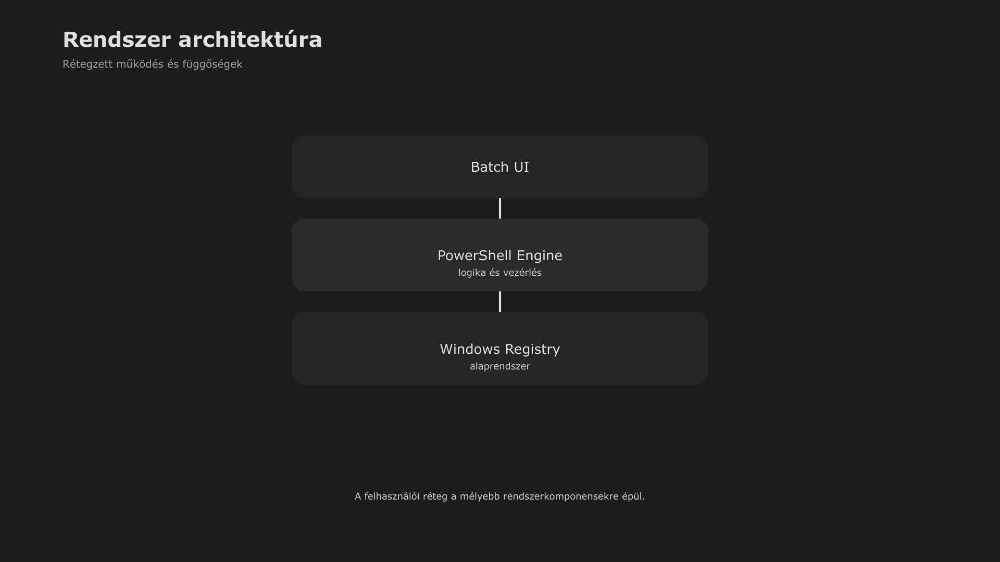

-   

    # 11. Munka asztal modell { #11-munka-asztal-modell }

    > Szerző: Hegedüs Gábor (@hege-g) 
    > Licenc: [MIT (Kód) / CC BY-NC-ND 4.0 (Docs)] 
    > Frostwood Docs: v1.0.0 
    > Rendszerverzió / Állapot: v1.0.5 / Stabil 
    > Blokk:  Rendszer

-   ## Tartalomkártyák

    * [:material-infinity: 1. A Munka asztal definíciója](#1-a-munka-asztal-definicioja)
    * [:material-infinity: 2. Kötelező működési feltételek](#2-kotelezo-mukodesi-feltetelek)
        * [:material-infinity: 2.1 Hibrid állapot és helyreállítás](#21-hibrid-allapot-es-helyreallitas)
    * [:material-infinity: 3. Virtuális asztal modell](#3-virtualis-asztal-modell)
    * [:material-infinity: 4. Alkalmazáslogika](#4-alkalmazaslogika)
    * [:material-infinity: 5. Mi nem kerülhet a Munka asztalra](#5-mi-nem-kerulhet-a-munka-asztalra)
    * [:material-infinity: 6. Ikonelrendezés](#6-ikonelrendezes)
    * [:material-infinity: 7. Zajforrás audit lista](#7-zajforras-audit-lista)
    * [:material-infinity: 8. Kapcsolat a WCAG móddal](#8-kapcsolat-a-wcag-moddal)
    * [:material-infinity: 9. Kapcsolat a Travel Mode-dal](#9-kapcsolat-a-travel-mode-dal)
        * [:material-infinity: 9.1 Travel ON](#91-travel-on)
        * [:material-infinity: 9.2 Travel OFF](#92-travel-off)
    * [:material-infinity: 10. A Munka asztal mint mentális tér](#10-a-munka-asztal-mint-mentalis-ter)
    * [:material-infinity: 11. Munka asztal életciklus](#11-munka-asztal-eletciklus)
        * [:material-infinity: 11.1 Indulás](#111-indulas)
        * [:material-infinity: 11.2 Fókusz szakasz](#112-fokusz-szakasz)
        * [:material-infinity: 11.3 Szünet](#113-szunet)
        * [:material-infinity: 11.4 Travel ON](#114-travel-on)
        * [:material-infinity: 11.5 Travel OFF](#115-travel-off)
        * [:material-infinity: 11.6 Kilépés](#116-kilepes)
    * [:material-infinity: 12. Rövid ellenőrző lista](#12-rovid-ellenorzo-lista)
    * [:material-infinity: 13. Alapelv](#13-alapelv)

## 1. A Munka asztal definíciója

A Frostwood rendszerben a „Munka asztal” :material-monitor-screenshot: nem egyszerű virtuális asztal.

Ez egy:

???+ quote "Alapelv"
    > Dedikált fókusztér, amely WCAG-alapú működésre van fenntartva.

A Munka asztal:

* külön virtuális asztal
* nem esztétikai variáns
* nem pihenő nézet
* nem köztes állapot

Ez a koncentráció tere.

---

## 2. Kötelező működési feltételek

A Munka asztal csak akkor tekinthető valódi Munka állapotnak, ha az alábbi feltételek teljesülnek:

* WCAG mód be van kapcsolva
* SignalColors kikapcsolt vagy minimalizált
* a háttér egyszínű
* zebra nincs (A felesleges mozgás és sor-kiemelés kiiktatása csökkenti a kognitív terhelést a hosszú idejű fókusz során.)
* hover semleges

???+ warning "Figyelem"
    Ha ezek közül bármelyik nem teljesül, az állapot nem tekinthető valódi Munka asztalnak.

### 2.1 Hibrid állapot és helyreállítás

Előfordulhat, hogy a Munka asztal fizikailag még létezik, de valamely kötelező feltétel részben sérül.

Ilyen lehet például:

* a háttér manuálisan megváltozik
* a WCAG mód kikapcsol
* dekoratív elem jelenik meg
* a hover vagy zebra nem a várt állapotot követi

Ezekben az esetekben az állapot:

???+ warning "Figyelem"
    > Nem tekinthető teljes értékű Munka állapotnak, hanem hibrid / eltérő állapotnak.

A Frostwood ilyenkor nem új állapotot definiál, hanem:

* eltérést jelez
* helyreállítható állapotként kezeli
* szükség esetén a SoftLock / helyreállító logikára támaszkodik

???+ warning "Fontos"
    > A Munka asztal definíciója logikai, nem pusztán vizuális.

---

## 3. Virtuális asztal modell

A Frostwood SoftLock modellje szerint legalább két virtuális asztal létezik:

1. Otthon
2. Munka

A Munka asztal:

* különálló logikai tér
* SoftLock aktív esetén nem tűnhet el tartósan
* nem olvad össze más asztallal
* nem keveri az alkalmazásprofilokat

???+ quote "Alapelv"
    > A cél nem a tiltás, hanem a strukturális stabilitás.

??? info "Vizuális leírás akadálymentesítéshez"
    A kép közepén egy „Frostwood rendszer” feliratú központi elem található.

    Körülötte négy fő blokk helyezkedik el:

    1. Vizuális réteg – a felhasználó által látott elemek, például felületek, ikonok és színek.
    2. Állapotlogika – a rendszer működési állapotai, például világos és sötét mód, valamint karakter és WCAG mód.
    3. Automatika – a rendszer reakciói és automatikus váltásai.
    4. Alkalmazás profil – az egyes alkalmazásokhoz tartozó eltérő viselkedések.

    Az elemek között vonalak jelzik a kapcsolatokat, például hogy az állapotlogika hatással van a vizuális rétegre, és az automatika képes állapotváltást kezdeményezni.

    A kép célja annak bemutatása, hogy a Frostwood több egymásra épülő rétegből álló rendszer.

---

## 4. Alkalmazáslogika

A Munka asztalon kétféle alkalmazás jelenhet meg:

* kifejezetten Munka profilú alkalmazás
* közös alkalmazás, de Munka konfigurációban

Ez például a következőket jelenti:

* **Total Commander** — Fókusz profil
* **Chrome** — Work user-data-dir
* **Firefox** — Work profil
* **Word / Excel** — Munka sablon
* **WhatsApp / Messenger** — Munka konfiguráció (preview OFF, hang OFF)
* **Zoom** — Munka konfiguráció (minimalizált értesítés)
* **JAWS** — Munka tempó
* **Insta360 Studio** — kizárólag itt
* **ChatGPT** — Work böngésző profil
* **Gemini** — Work böngésző profil

A döntő nem az alkalmazás neve, hanem a futó profil.

---

## 5. Mi nem kerülhet a Munka asztalra

A Munka asztalra nem kerülhet:

* játék
* nem munka célú közösségi média
* dekoratív widget
* animált háttér
* színes, dekoratív ikoncsomag
* felesleges értesítési kliens
* hangos státuszalkalmazás
* narancs dekoráció

A Munka asztal nem identitást hordoz.

> Csak fókuszt.

---

## 6. Ikonelrendezés

A Frostwood nem szabályozza az ikonok pontos pozícióját.

Az ikonelrendezés:

* felhasználói döntés
* nem része a rendszerlogikának

A rendszer szempontjából a lényeg:

* alacsony zajszint
* gyors felismerhetőség
* tiszta működési környezet

---

## 7. Zajforrás audit lista

A Munka asztal rendszeres ellenőrzése:

* :material-checkbox-blank-outline: Van hangjelzés munka közben?
* :material-checkbox-blank-outline: Van badge értesítés?
* :material-checkbox-blank-outline: Van villogó elem?
* :material-checkbox-blank-outline: Van színes dekoráció?
* :material-checkbox-blank-outline: Van felesleges háttéralkalmazás?
* :material-checkbox-blank-outline: Van felesleges ikon?

Ha ezek közül bármelyik igen, a Munka asztal zajos.

???+ quote "Alapelv"
    > A Munka asztal célja a csend.

---

## 8. Kapcsolat a WCAG móddal

A Munka asztal nem létezik WCAG logika nélkül.

Ez azt jelenti:

* nem Karakter alternatíva
* nem időszakos vizuális választás
* nem hangulati mód

Kivétel:

A Munka asztal alapértelmezése a WCAG, kivéve, ha az adott Munka-profilú alkalmazás (pl. képszerkesztő) vizuális validációt igényel.

???+ warning "Figyelem"
    Ha a WCAG mód kikapcsol, a Munka asztal fizikailag még létezhet, de logikailag már nem tekinthető aktív Munka állapotnak.

Ilyenkor a rendszer:

* nem tekinti teljes értékű fókusztérnek
* eltérő / hibrid állapotként értelmezi
* szükség esetén helyreállítható szerkezeti állapotként kezeli

---

## 9. Kapcsolat a Travel Mode-dal

A Travel Mode külön logikai ág.

-   ### 9.1 Travel ON

    Travel ON esetén:

    * a Munka asztal nem aktív
    * a Munka asztal és a rajta nyitott alkalmazások állapota menthető
    * a Munka asztal nem látható fókuszban
    * a WCAG nem aktiválódik automatikusan
    * szükség esetén manuálisan visszakapcsolható

    A Travel nem törli a Munka asztalt.

    > Csak szünetelteti.

    ???+ note "Megjegyzés"
        Travel ON esetén a fókusz a mobilitáson van, ezért az asztal alapértelmezetten Karakter-módba vált a hardveres erőforrások és a láthatóság védelmében, de a Munka-specifikus profilok megmaradnak.

-   ### 9.2 Travel OFF

    Travel OFF esetén:

    * a Munka asztal újra elérhető
    * a korábbi állapot visszaállítható
    * a SoftLock újra biztosítja a szerkezetet
    * a WCAG visszakapcsolható az előző állapot szerint

    A Travel nem új állapot, hanem átmeneti működési ág.

---

## 10. A Munka asztal mint mentális tér

A Munka asztal:

* nem vizuális projekt
* nem személyes identitás
* nem inspirációs tér

Ez egy:

???+ quote "Alapelv"
    > Stabil, csendes, visszafordítható fókusztér. 
    > A cél nem az, hogy „szép” legyen, hanem az, hogy ne zavarjon.

---

## 11. Munka asztal életciklus

A Munka asztal nem statikus, hanem vezérelt működési ciklus része.

-   ### 11.1 Indulás

    * a felhasználó átvált a Munka virtuális asztalra
    * a WCAG mód aktív
    * a Munka profilú alkalmazások elindulnak
    * a zajszint alacsony

    ???+ success "Állapot"
        Aktív fókusz.

-   ### 11.2 Fókusz szakasz

    * egyszínű háttér
    * jelzés minimalizált
    * nincs dekoráció
    * profil-alapú működés

    ???+ success "Állapot"
        :material-brain: Stabil koncentráció.

-   ### 11.3 Szünet

    * a felhasználó átvált Otthon asztalra
    * a Munka asztal érintetlen marad
    * a WCAG állapot nem változik önkényesen

    ???+ success "Állapot"
        Inaktív, de megőrzött.

-   ### 11.4 Travel ON

    * a Munka asztal és az alkalmazásállapot menthető
    * a Munka asztal nem aktív
    * a rendszer Karakter-orientált működésre vált

    ???+ success "Állapot"
        Szüneteltetett.

-   ### 11.5 Travel OFF

    * a Munka asztal újra elérhető
    * a korábbi munkakörnyezet helyreállítható
    * a fókuszállapot rekonstruálható

    ???+ success "Állapot"
        Újraindított fókusz.

-   ### 11.6 Kilépés

    * a felhasználó döntése alapján a WCAG kikapcsolható
    * a Munka asztal továbbra is létezhet
    * de aktív fókusztérként már nem működik

    ???+ success "A Munka asztal"
        * nem törlődik
        * nem keveredik
        * nem rendeződik át önkényesen
        * visszafordítható marad

---

## 12. Rövid ellenőrző lista

A Munka asztal akkor működik jól, ha:

* :material-checkbox-blank-outline: WCAG aktív?
* :material-checkbox-blank-outline: A háttér egyszínű?
* :material-checkbox-blank-outline: A jelzések halkak?
* :material-checkbox-blank-outline: Az alkalmazások Munka profilban futnak?
* :material-checkbox-blank-outline: Nincs dekoratív vizuális zaj?
* :material-checkbox-blank-outline: A rendszer csendes és kiszámítható?

---

## 13. Alapelv

> A Munka asztal nem egy második látványvilág, 
> hanem egy stabil, dedikált fókusz-környezet.