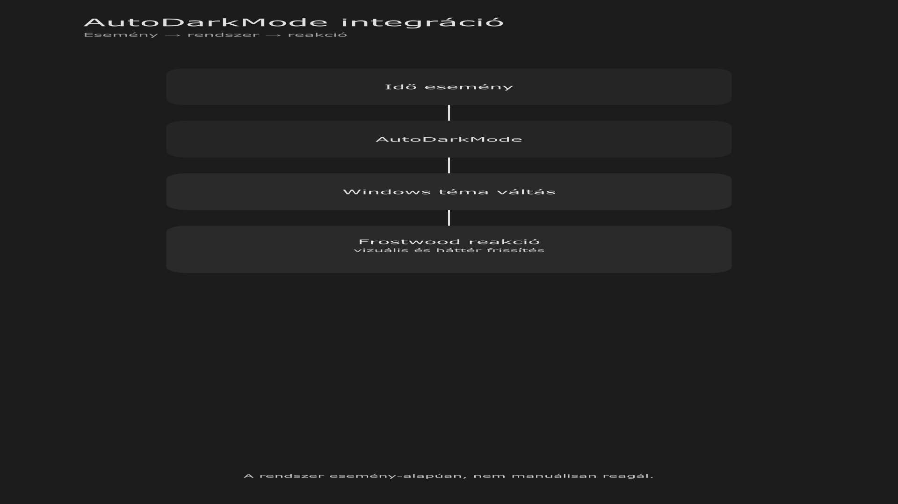

<div class="grid cards frostwood-header-cards" markdown>

-   <span class="fw-module-header-icon fw-module-12" aria-hidden="true"></span>

    # 12. AutoDarkMode technikai és működési integráció { #12-autodarkmode-technikai-es-mukodesi-integracio }

    > Szerző: Hegedüs Gábor (@hege-g)<br>
    > Licenc: [MIT (Kód) / CC BY-NC-ND 4.0 (Docs)]<br>
    > Frostwood Docs: v1.0.0<br>
    > Rendszerverzió / Állapot: v1.0.5 / Stabil<br>
    > Blokk: <span class="fw-block-icon-main-rendszer" aria-hidden="true"></span> Rendszer

</div>

<div class="grid cards frostwood-toc-cards" markdown>

-   ## Tartalomkártyák

    * [:material-infinity: 1. Integrációs cél](#1-integracios-cel)
    * [:material-infinity: 2. Hivatalos forrás](#2-hivatalos-forras)
    * [:material-infinity: 3. Telepítés (alap lépések)](#3-telepites-alap-lepesek)
        * [:material-infinity: 3.1 Függőségi és elérhetőségi ellenőrzés](#31-fuggosegi-es-elerhetosegi-ellenorzes)
    * [:material-infinity: 4. Beállítás (ajánlott konfiguráció)](#4-beallitas-ajanlott-konfiguracio)
        * [:material-infinity: 4.1 Mód](#41-mod)
        * [:material-infinity: 4.2 Helymeghatározás](#42-helymeghatarozas)
    * [:material-infinity: 5. Működési logika Frostwood-ban](#5-mukodesi-logika-frostwood-ban)
    * [:material-infinity: 6. Állapotmodell (egyszerűsített)](#6-allapotmodell-egyszerusitett)
    * [:material-infinity: 7. Windows Registry kulcsok](#7-windows-registry-kulcsok)
    * [:material-infinity: 8. Háttér frissítés (Frostwood)](#8-hatter-frissites-frostwood)
    * [:material-infinity: 9. Config fájl (AutoDarkMode)](#9-config-fajl-autodarkmode)
    * [:material-infinity: 10. Haladó konfiguráció](#10-halado-konfiguracio)
        * [:material-infinity: 10.1 Offset](#101-offset)
        * [:material-infinity: 10.2 Fix koordináta](#102-fix-koordinata)
        * [:material-infinity: 10.3 Dinamikus (utazás közbeni) működés](#103-dinamikus-utazas-kozbeni-mukodes)
    * [:material-infinity: 11. Travel Mode kapcsolat](#11-travel-mode-kapcsolat)
        * [:material-infinity: 11.1 Travel ON](#111-travel-on)
        * [:material-infinity: 11.2 Travel OFF](#112-travel-off)
    * [:material-infinity: 12. Hibakeresési lista](#12-hibakeresesi-lista)
    * [:material-infinity: 13. Stabilitási elv](#13-stabilitasi-elv)
    * [:material-infinity: 14. Alapelv](#14-alapelv)

</div>

## 1. Integrációs cél

Az AutoDarkMode :material-theme-light-dark: a Frostwood rendszer külső eseményforrása.

Feladata:

* Windows világos / sötét mód váltása
* időzített működés (napkelte / napnyugta)
* rendszeres állapotváltozás generálása

A Frostwood feladata:

* az állapot értelmezése
* a WCAG flag figyelembevétele
* a háttér azonnali frissítése
* a jelzés-intenzitás módosítása

???+ quote "Alapelv"
    > A Frostwood reagál, nem vezérel.




??? info "Vizuális leírás akadálymentesítéshez"
    A kép egy függőleges irányú folyamatábrát mutat, egymás alá rendezett blokkokkal.

    A legfelső blokk az „Idő”, amely az esemény kiváltását jelzi. Innen egy lefelé mutató nyíl vezet az „AutoDarkMode” blokkhoz, amely a rendszer számára jelzést ad.

    A következő lépés a „Windows” blokk, ahol a tényleges témaváltás történik. Innen egy kiemeltebb nyíl vezet a „Frostwood” blokkhoz, amely a rendszer reakcióját mutatja.

    A Frostwood blokk több reakciót sorol fel: háttér frissítés, ikonállapot módosítás, valamint a vizuális és kontextus-réteg újrarendezése.

    A legalsó összegző blokk jelzi, hogy a folyamat egyirányú: Idő → AutoDarkMode → Windows → Frostwood.


---

## 2. Hivatalos forrás

AutoDarkMode GitHub:

[:material-github: https://github.com/AutoDarkMode/Windows-Auto-Night-Mode](https://github.com/AutoDarkMode/Windows-Auto-Night-Mode)

Ajánlott:

* a Releases oldalról letölteni
* telepítés után automatikus indítás engedélyezése

---

## 3. Telepítés (alap lépések)

1. Töltsd le a telepítőt
2. Futtasd a telepítőt
3. Indítsd el az alkalmazást
4. Engedélyezd az automatikus indítást Windowszal

???+ note "Megjegyzés"
    Admin jogosultság általában nem szükséges.


### 3.1 Függőségi és elérhetőségi ellenőrzés

A Frostwood nem feltételezheti vakon az AutoDarkMode belső struktúráját.

Ezért a kapcsolódó scriptnek minden esetben ellenőriznie kell:

* létezik-e az AutoDarkMode felhasználói mappája
* elérhető-e a szükséges konfigurációs vagy állapotfájl
* értelmezhető-e a várt konfigurációs struktúra

??? tip "Minimum ellenőrzési pont"
    ```text title="Text"
    %AppData%\AutoDarkMode\
    ```


---

## 4. Beállítás (ajánlott konfiguráció)

<div class="grid cards frostwood-section-cards frostwood-numbered-card" markdown>

-   ### 4.1 Mód

    * Automatikus váltás → BE
    * Napkelte / napnyugta alapján → BE

-   ### 4.2 Helymeghatározás

    Windows:

    Beállítások → Adatvédelem és biztonság → Hely → Engedélyezve

    AutoDarkMode:

    * automatikus helymeghatározás → BE

</div>

---

## 5. Működési logika Frostwood-ban

Amikor az AutoDarkMode Light/Dark váltást hajt végre:

1. Windows témakulcs frissül
2. Frostwood ThemeSwitcher lefut
3. a rendszer ellenőrzi a WCAG állapotot
4. kiválasztja az aktuális állapotot (Light/Dark + WCAG)
5. frissíti a háttérképet
6. módosítja a jelzés-intenzitást

???+ warning "Fontos"
    * az AutoDarkMode nem ismeri a WCAG logikát
    * ezt teljes mértékben a Frostwood kezeli


---

## 6. Állapotmodell (egyszerűsített)

A Frostwood a következő két tényezőt kombinálja:

* **Rendszer téma:** Light / Dark
* **WCAG állapot:** ON / OFF

Ez egy 2×2 állapotteret ad:

* Light + WCAG OFF → Karakter világos
* Dark + WCAG OFF → Karakter sötét
* Light + WCAG ON → WCAG világos
* Dark + WCAG ON → WCAG sötét

???+ warning "Figyelem"
    Az AutoDarkMode csak a Light/Dark tengelyt módosítja.


---

## 7. Windows Registry kulcsok

??? success "Az AutoDarkMode az alábbi kulcsokat módosítja"
    ```reg title="Reg"
    HKCU\Software\Microsoft\Windows\CurrentVersion\Themes\Personalize
    ```


Fontos értékek:

* AppsUseLightTheme
  * 1 = világos
  * 0 = sötét

* SystemUsesLightTheme
  * 1 = világos
  * 0 = sötét

A Frostwood:

* figyeli ezeket a változásokat
* nem írja felül az AutoDarkMode működését

---

## 8. Háttér frissítés (Frostwood)

??? tip "A háttér módosítása ezen a kulcson történik"
    ```reg title="Reg"
    HKCU\Control Panel\Desktop
    ```


Kulcs:

* Wallpaper

??? success "Frissítés után"
    ```text title="Text"
    RUNDLL32.EXE user32.dll,UpdatePerUserSystemParameters
    ```


Ez biztosítja, hogy a háttér azonnal frissüljön.

---

## 9. Config fájl (AutoDarkMode)

??? tip "Elérési út"
    ```text title="Text"
    C:\Users[Felhasználó]\AppData\Roaming\AutoDarkMode\config.json
    ```


Fontos mezők:

* locationMode
* useGeolocation
* sunriseOffsetMinutes
* sunsetOffsetMinutes
* latitude
* longitude

???+ warning "Figyelem"
    A Frostwood nem módosítja ezt a fájlt automatikusan.


---

## 10. Haladó konfiguráció

<div class="grid cards frostwood-section-cards frostwood-numbered-card" markdown>

-   ### 10.1 Offset

    Lehetőség:

    * sunriseOffsetMinutes
    * sunsetOffsetMinutes

    Példa:

    * -15 → 15 perccel korábban
    * +15 → 15 perccel később

-   ### 10.2 Fix koordináta

    Ha a helymeghatározás nem stabil:

    ```json title="JSON"
    useGeolocation: false
    latitude: XX.XXXX
    longitude: YY.YYYY
    ```

-   ### 10.3 Dinamikus (utazás közbeni) működés

    ```json title="JSON"
    useGeolocation: true
    locationMode: Automatic
    ```

</div>

---

## 11. Travel Mode kapcsolat

<div class="grid cards frostwood-section-cards frostwood-numbered-card" markdown>

-   ### 11.1 Travel ON

    * az AutoDarkMode tovább működik
    * Light/Dark váltás megtörténik
    * a Munka asztal nem aktiválódik
    * a WCAG nem lép életbe automatikusan
    * az állapot mentve marad

-   ### 11.2 Travel OFF

    * a Munka asztal újra elérhető
    * a korábbi állapot visszaállítható

    ???+ note "Megjegyzés"
        Travel mód csak a Frostwood belső logikát módosítja, nem az AutoDarkMode működését.


</div>

---

## 12. Hibakeresési lista

Ha a rendszer nem viselkedik megfelelően:

* :material-checkbox-blank-outline: Működik a Light/Dark váltás?
* :material-checkbox-blank-outline: Változik az AppsUseLightTheme érték?
* :material-checkbox-blank-outline: Frissül a háttér?
* :material-checkbox-blank-outline: WCAG ON esetén egyszínű háttér jelenik meg?
* :material-checkbox-blank-outline: A config.json nem sérült?
* :material-checkbox-blank-outline: Témaváltás után a Jaws/NVDA fókusza megmaradt az aktív ablakon?

---

## 13. Stabilitási elv

Az AutoDarkMode:

* külső komponens
* nem része a Frostwood telepítőnek
* nem módosítjuk a működését

A Frostwood:

* reagál az állapotváltozásra
* nem veszi át az irányítást

---

## 14. Alapelv

> A rendszeridő és a környezet változhat,<br>
> de a működés logikája stabil marad.