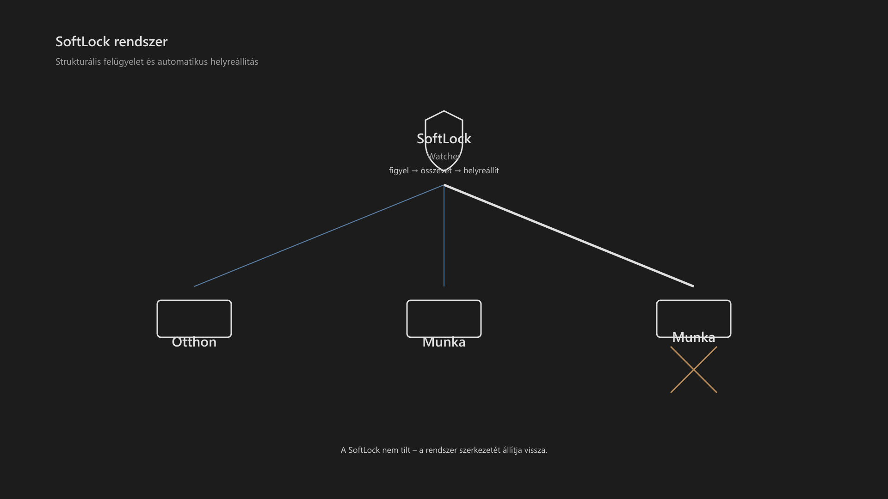

<div class="grid cards frostwood-header-cards" markdown>

-   <span class="fw-module-header-icon fw-module-13" aria-hidden="true"></span>

    # 13. SoftLock rendszer { #13-softlock-rendszer }

    > Szerző: Hegedüs Gábor (@hege-g)<br>
    > Licenc: [MIT (Kód) / CC BY-NC-ND 4.0 (Docs)]<br>
    > Frostwood Docs: v1.0.0<br>
    > Rendszerverzió / Állapot: v1.0.5 / Stabil<br>
    > Blokk: <span class="fw-block-icon-main-rendszer" aria-hidden="true"></span> Rendszer

</div>

<div class="grid cards frostwood-toc-cards" markdown>

-   ## Tartalomkártyák

    * [:material-infinity: 1. A SoftLock célja](#1-a-softlock-celja)
    * [:material-infinity: 2. Alapelv](#2-alapelv)
    * [:material-infinity: 3. Működési modell](#3-mukodesi-modell)
        * [:material-infinity: 3.1 Polling intervallum és erőforrás-terhelés](#31-polling-intervallum-es-eroforras-terheles)
    * [:material-infinity: 4. Mit figyel a SoftLock](#4-mit-figyel-a-softlock)
    * [:material-infinity: 5. Mit csinál eltérés esetén](#5-mit-csinal-elteres-eseten)
    * [:material-infinity: 6. SoftLock állapotok](#6-softlock-allapotok)
        * [:material-infinity: 6.1 SoftLock ON](#61-softlock-on)
        * [:material-infinity: 6.2 SoftLock OFF](#62-softlock-off)
        * [:material-infinity: 6.3 SoftLock TOGGLE](#63-softlock-toggle)
    * [:material-infinity: 7. Technikai megvalósítás](#7-technikai-megvalositas)
    * [:material-infinity: 8. Működési ciklus](#8-mukodesi-ciklus)
    * [:material-infinity: 9. Kapcsolat a Munka asztallal](#9-kapcsolat-a-munka-asztallal)
    * [:material-infinity: 10. Kapcsolat a Travel Mode-dal](#10-kapcsolat-a-travel-mode-dal)
        * [:material-infinity: 10.1 Travel ON](#101-travel-on)
        * [:material-infinity: 10.2 Travel OFF](#102-travel-off)
    * [:material-infinity: 11. Mit NEM csinál a SoftLock](#11-mit-nem-csinal-a-softlock)
    * [:material-infinity: 12. Stabilitási elv](#12-stabilitasi-elv)
    * [:material-infinity: 13. Hibaelhárítás](#13-hibaelharitas)
    * [:material-infinity: 14. Rövid ellenőrző lista](#14-rovid-ellenorzo-lista)
    * [:material-infinity: 15. Alapelv](#15-alapelv)

</div>

## 1. A SoftLock célja

A SoftLock :material-lock-cog: nem biztonsági mechanizmus.

Ez egy:

> Szerkezeti stabilizáló réteg a virtuális asztalok között.

Feladata:

* a Munka asztal megőrzése
* az asztalok számának stabilizálása
* a fókusztér véletlen szétesésének megelőzése

???+ warning "Fontos"
    > A SoftLock nem tilt.<br>
    > A SoftLock helyreállít.


---

## 2. Alapelv

A Windows virtuális asztal kezelése:

* dinamikus
* nem determinisztikus
* felhasználói és rendszeresemények hatására változhat

Ez problémát okoz:

* a Munka asztal eltűnhet
* új asztalok keletkezhetnek
* a struktúra széteshet

A SoftLock válasza:

???+ quote "Alapelv"
    > Nem megakadályozni a változást,<br>
    > hanem visszaállítani az elvárt szerkezetet.


---

## 3. Működési modell

A SoftLock egy háttérben futó watcher folyamat.

Feladata:

1. figyeli a virtuális asztalok számát
2. figyeli a struktúra változását
3. ha eltérés van → visszaállítja az alapállapotot

Az azonosítás elsődlegesen sorszám (Desktop 2), másodlagosan név (Munka) alapján történik a stabilitás érdekében.

Alapállapot:

* legalább 2 virtuális asztal
  * Otthon
  * Munka



??? info "Vizuális leírás akadálymentesítéshez"
    A kép közepén felül egy „SoftLock” blokk látható, amely a rendszer felügyeleti elemét jelöli.

    Innen három kapcsolat vezet lefelé három különböző asztalhoz. Két asztal normál állapotú, míg a harmadik hibát jelez egy diszkrét X jelöléssel és enyhébb kontraszttal.

    A SoftLock és a hibás asztal között egy vastagabb, hangsúlyosabb vonal látható, amely az automatikus helyreállítást jelzi.

    A többi kapcsolat vékonyabb, semleges vonalakkal jelenik meg.

    A kép célja annak bemutatása, hogy a rendszer folyamatosan figyeli az állapotokat, és hiba esetén automatikusan beavatkozik, anélkül hogy külön felhasználói interakcióra lenne szükség.


### 3.1 Polling intervallum és erőforrás-terhelés

A watcher működésének egyik kritikus paramétere a mintavételezési gyakoriság.

???+ tip "Ajánlott polling-intervallum"
    2–5 másodperc


Ennek oka:

* alacsonyabb processzorterhelés
* kisebb kognitív és auditív zavarás
* jobb együttműködés képernyőolvasóval
* kevesebb felesleges állapotellenőrzés

Nem ajánlott:

* 1 másodperc alatti túl sűrű polling
* agresszív, folyamatos újraellenőrzés
* olyan működés, amely észrevehető rendszerzajt okoz

A SoftLock célja nem a folyamatos aktivitás, hanem:

> Az alacsony zajú, ritka, de megbízható szerkezeti helyreállítás.

---

## 4. Mit figyel a SoftLock

A watcher az alábbi állapotokat ellenőrzi:

* virtuális asztalok száma
* asztalok megléte
* extrém eltérések (pl. túl sok asztal)

???+ note "Megjegyzés"
    Nem figyel:

    * alkalmazásokat
    * ablakokat
    * tartalmat
    * felhasználói munkát

    A watcher megfigyelése ezért legyen:

    * ritkított
    * célzott
    * strukturális
    * nem valós idejű mikroszintű követés


---

## 5. Mit csinál eltérés esetén

Ha a rendszer eltér az alapállapottól:

* létrehozza a hiányzó asztalt
* csökkenti a túl sok asztalt (ha szükséges)
* visszaállítja a minimális struktúrát

???+ note "Megjegyzés"
    A SoftLock csak az üres, felesleges asztalokat zárja be, vagy csak jelzést ad, de soha nem zár be olyan asztalt, amelyen aktív alkalmazásablak található.


Nem csinál:

* nem zár be alkalmazásokat
* nem mozgat ablakokat
* nem avatkozik bele a munkába

---

## 6. SoftLock állapotok

A SoftLock három módon létezhet:

* `SoftLock_ON`
* `SoftLock_OFF`
* `SoftLock_TOGGLE`

<div class="grid cards frostwood-section-cards frostwood-numbered-card" markdown>

-   ### 6.1 SoftLock ON

    * watcher aktív
    * struktúra stabilizált
    * Munka asztal védett logikailag

-   ### 6.2 SoftLock OFF

    * watcher nem fut
    * a rendszer visszatér natív Windows működéshez

-   ### 6.3 SoftLock TOGGLE

    * gyors váltás ON és OFF között

</div>

---

## 7. Technikai megvalósítás

??? success "A SoftLock watcher indítása"
    ```text title="Text"
    Modes\Install_SoftLock_Watcher.bat
    ```


??? failure "A SoftLock watcher eltávolítása"
    ```text title="Text"
    Modes\Uninstall_SoftLock_Watcher.bat
    ```


A watcher:

* háttérben fut
* no-admin módban működik
* nem módosít rendszer policy-t
* nem igényel kernel szintű hozzáférést

---

## 8. Működési ciklus

A watcher ciklikusan fut:

1. állapot lekérdezés
2. összehasonlítás az elvárt struktúrával
3. szükség esetén korrekció
4. várakozás
5. ismétlés

Fontos:

* nem valós idejű kényszerítés
* nem agresszív polling
* alacsony erőforrás használat

---

## 9. Kapcsolat a Munka asztallal

A SoftLock biztosítja, hogy:

* a Munka asztal létezzen
* ne tűnjön el véletlenül
* visszaállítható legyen

Nem biztosítja:

* hogy a Munka asztal aktív legyen
* hogy a WCAG mód be legyen kapcsolva

A SoftLock csak a struktúrát kezeli.

---

## 10. Kapcsolat a Travel Mode-dal

<div class="grid cards frostwood-section-cards frostwood-numbered-card" markdown>

-   ### 10.1 Travel ON

    * SoftLock logika háttérben maradhat
    * de nem erőlteti a Munka asztal használatát
    * a rendszer Karakter módra vált

-   ### 10.2 Travel OFF

    * SoftLock újra biztosítja a struktúrát
    * a Munka asztal újra elérhető

    ???+ warning "Fontos"
        > Travel mód nem kapcsolja ki kötelezően a SoftLock-ot,<br>
        > csak a használati kontextust módosítja.


</div>

---

## 11. Mit NEM csinál a SoftLock

A SoftLock nem:

* biztonsági védelem
* hozzáférés-korlátozás
* policy motor
* alkalmazás-kezelő
* ablakkezelő

Nem tilt:

* új asztal létrehozást
* asztal törlést
* felhasználói interakciót

---

## 12. Stabilitási elv

A SoftLock működése:

* visszafordítható
* kikapcsolható
* nem destruktív

???+ warning "Ha a watcher leáll"
    A rendszer normál Windows viselkedésre tér vissza.


---

## 13. Hibaelhárítás

Ha a SoftLock nem működik megfelelően:

* :material-checkbox-blank-outline: Fut a watcher?
* :material-checkbox-blank-outline: Létezik a Modes mappa?
* :material-checkbox-blank-outline: Nincs blokkolva a PowerShell?
* :material-checkbox-blank-outline: Nem tiltja vállalati környezet?

Gyors megoldás:

* `SoftLock_OFF`
* majd `SoftLock_ON`

---

## 14. Rövid ellenőrző lista

A SoftLock akkor működik jól, ha:

* :material-checkbox-blank-outline: legalább 2 virtuális asztal létezik
* :material-checkbox-blank-outline: a Munka asztal nem tűnik el
* :material-checkbox-blank-outline: a rendszer nem hoz létre végtelen számú asztalt
* :material-checkbox-blank-outline: nincs beavatkozás a felhasználói munkába

---

## 15. Alapelv

> A SoftLock nem kontrollál,<br>
> hanem stabilizál.

> Nem tilt,<br>
> hanem helyreállít.