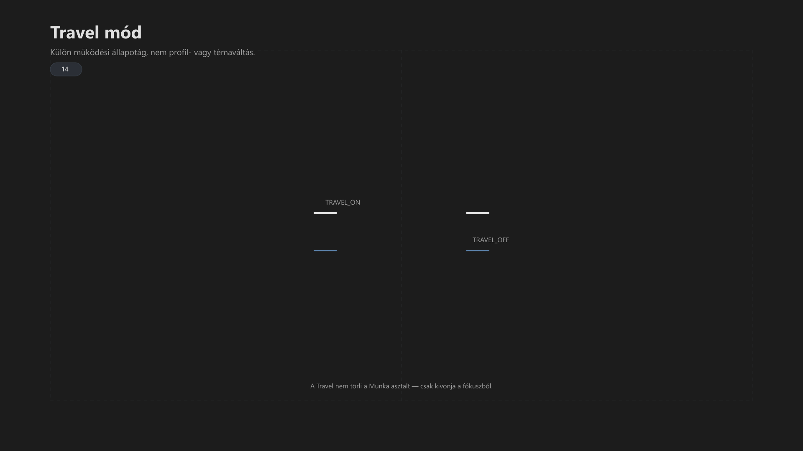

-   

    # 14. Travel mód (opcionális modul) { #14-travel-mod-opcionalis-modul }

    > Szerző: Hegedüs Gábor (@hege-g) 
    > Licenc: [MIT (Kód) / CC BY-NC-ND 4.0 (Docs)] 
    > Frostwood Docs: v1.0.0 
    > Rendszerverzió / Állapot: v1.0.5 / Stabil 
    > Blokk:  Rendszer

-   ## Tartalomkártyák

    * [:material-infinity: 1. A Travel mód célja](#1-a-travel-mod-celja)
    * [:material-infinity: 2. Alapelv](#2-alapelv)
    * [:material-infinity: 3. Állapotlogika](#3-allapotlogika)
        * [:material-infinity: 3.1 TRAVEL ON](#31-travel-on)
        * [:material-infinity: 3.2 TRAVEL OFF](#32-travel-off)
    * [:material-infinity: 4. Travel mint állapotág (nem profilváltás)](#4-travel-mint-allapotag-nem-profilvaltas)
        * [:material-infinity: 4.1 Nem profilváltás](#41-nem-profilvaltas)
        * [:material-infinity: 4.2 Valódi működés](#42-valodi-mukodes)
    * [:material-infinity: 5. Kapcsolat a Munka asztallal](#5-kapcsolat-a-munka-asztallal)
    * [:material-infinity: 6. Kapcsolat a WCAG móddal](#6-kapcsolat-a-wcag-moddal)
    * [:material-infinity: 7. Kapcsolat a SoftLock-kal](#7-kapcsolat-a-softlock-kal)
    * [:material-infinity: 8. Jelzés- és zajszint viselkedés](#8-jelzes-es-zajszint-viselkedes)
    * [:material-infinity: 9. Tipikus használati helyzetek](#9-tipikus-hasznalati-helyzetek)
    * [:material-infinity: 10. Működési ciklus](#10-mukodesi-ciklus)
        * [:material-infinity: 10.1 Aktiválás](#101-aktivalas)
        * [:material-infinity: 10.2 Használat](#102-hasznalat)
        * [:material-infinity: 10.3 Visszatérés](#103-visszateres)
    * [:material-infinity: 11. Mit NEM csinál a Travel mód](#11-mit-nem-csinal-a-travel-mod)
    * [:material-infinity: 12. Stabilitási elv](#12-stabilitasi-elv)
    * [:material-infinity: 13. Rövid ellenőrző lista](#13-rovid-ellenorzo-lista)
    * [:material-infinity: 14. Alapelv](#14-alapelv)

## 1. A Travel mód célja

A Travel mód :material-airplane-takeoff: nem vizuális mód.

Ez egy:

> Alternatív működési állapotág, amely megszakítja a Munka fókuszlogikát.

Célja:

* mobil / utazási helyzet kezelése
* gyors, rugalmas használat biztosítása
* a fókuszstruktúra ideiglenes felfüggesztése

???+ warning "Fontos"
    > A Travel nem „gyengített WCAG”. 
    > A Travel egy külön működési kontextus.

---

## 2. Alapelv

A Frostwood két fő működési ágat használ:

1. Fókusz ág (Munka + WCAG)
2. Rugalmas ág (Travel)

A Travel:

* nem a Munka asztal variánsa
* nem profil finomhangolás
* nem vizuális preset

Hanem:

> Működési kontextus váltás.

??? info "Vizuális leírás akadálymentesítéshez"
    A kép két fő működési ágat és egy középső váltási elemet mutat.

    A bal oldalon a „Fókusz ág” látható. Ez azt jelzi, hogy a Munka asztal aktív, a WCAG logika elérhető vagy domináns, a zajszint alacsony, és a rendszer stabil fókuszstruktúrában működik.

    Középen a „Travel váltás” blokk helyezkedik el. Ebben két állapotjelölés szerepel: `TRAVEL_ON` és `TRAVEL_OFF`. Ez a rész azt mutatja, hogy a rendszer át tud lépni a Travel ágba, majd onnan vissza tud térni a fókuszlogikához.

    A jobb oldalon a „Travel ág” látható. Itt a Munka asztal nem aktív fókusztér, a WCAG nem domináns, a működés rugalmasabb, és a jelzések enyhén erősebbek lehetnek. A rendszer azonban nem válik zajossá, és nem veszít el tartós állapotot.

    A kép célja annak bemutatása, hogy a Travel mód külön működési ág, nem pedig a fókusz mód gyengített változata.

---

## 3. Állapotlogika

A Travel mód állapotai:

* `TRAVEL_ON`
* `TRAVEL_OFF`

-   ### 3.1 TRAVEL ON

    * a rendszer kilép a fókusz-centrikus működésből
    * a Munka asztal nem aktív
    * a WCAG nem aktiválódik automatikusan
    * a jelzés-intenzitás enyhén növekedhet
    * a rendszer Karakter működéshez közelít

    TRAVEL ON esetén az AutoDarkMode és a Windows adaptív fényerő-szabályozása kiemelt szerepet kap a környezeti változások lekövetésére.

-   ### 3.2 TRAVEL OFF

    * a fókuszlogika újra elérhető
    * a Munka asztal visszaállítható
    * a WCAG újra aktiválható

---

## 4. Travel mint állapotág (nem profilváltás)

-   ### 4.1 Nem profilváltás

    A Travel:

    * nem cseréli le az alkalmazásprofilokat
    * nem hoz létre külön „Travel profilt”
    * nem módosít tartós konfigurációt

-   ### 4.2 Valódi működés

    A Travel:

    * ideiglenesen módosítja a rendszer viselkedését
    * nem írja felül az alapállapotot
    * visszafordítható

    Ez azt jelenti:

    * a Work Chrome profil nem tűnik el
    * a Munka asztal nem törlődik
    * a SoftLock nem szűnik meg véglegesen

---

## 5. Kapcsolat a Munka asztallal

Travel ON esetén:

* a Munka asztal nem aktív fókusztér
* az ott futó alkalmazások állapota megmarad
* a rendszer nem kényszerít visszalépést

Travel OFF esetén:

* a Munka asztal újra használható
* a korábbi állapot visszatölthető

???+ warning "Fontos"
    > A Travel nem törli a Munka asztalt, 
    > csak kivonja a fókuszból.

---

## 6. Kapcsolat a WCAG móddal

Travel ON:

* WCAG nem kapcsol be automatikusan
* ha aktív volt, nem garantált a fenntartása
* a rendszer Karakter működéshez közelít

A Travel mód nem kényszeríti a WCAG-t, de kérésre (manuálisan) fenntartható.  
A váltás célja nem a láthatóság rontása, hanem a fókusz-kényszer feloldása.

Travel OFF:

* WCAG visszakapcsolható
* a korábbi állapot rekonstruálható

???+ warning "Fontos"
    > A Travel nem WCAG mód. 
    > A kettő egymástól független logika.

---

## 7. Kapcsolat a SoftLock-kal

Travel ON:

* SoftLock működhet a háttérben
* nem erőlteti a Munka asztal használatát
* nem avatkozik be aktívan a fókuszba

Travel OFF:

* SoftLock újra biztosítja a struktúrát
* a Munka asztal stabilan visszatér

---

## 8. Jelzés- és zajszint viselkedés

Travel módban:

* a jelzések enyhén erősebbek lehetnek
* SignalColors részben visszatérhet
* értesítések megjelenhetnek

De:

* nincs agresszív vizuális zaj
* nincs villogás
* nincs jelzéshalmozás

Ez:

> Kontrollált rugalmasság.

---

## 9. Tipikus használati helyzetek

A Travel mód ajánlott:

* utazás közben
* idegen környezetben
* rövid, megszakított munkánál
* nem dedikált fókuszidőben

Nem ajánlott:

* hosszú koncentrált munkára
* mély fókuszra
* WCAG-alapú munkafolyamatokra

---

## 10. Működési ciklus

-   ### 10.1 Aktiválás

    * `TRAVEL_ON`
    * a rendszer kilép a fókuszállapotból
    * a Munka asztal háttérbe kerül

-   ### 10.2 Használat

    * rugalmas működés
    * több inger megengedett
    * gyors váltások

-   ### 10.3 Visszatérés

    * `TRAVEL_OFF`
    * a rendszer visszatér fókuszlogikára
    * a Munka asztal újra elérhető

---

## 11. Mit NEM csinál a Travel mód

A Travel nem:

* külön téma
* külön színrendszer
* külön alkalmazáskészlet
* permanens állapot
* automatizált profilváltó

---

## 12. Stabilitási elv

A Travel mód:

* teljesen visszafordítható
* nem ír át tartós állapotot
* nem módosít registry-t destruktívan

A rendszer:

* megőrzi az eredeti struktúrát
* nem veszít adatot
* nem törli a munkakörnyezetet

---

## 13. Rövid ellenőrző lista

Travel mód aktív, ha:

* :material-checkbox-blank-outline: A Munka asztal nem aktív?
* :material-checkbox-blank-outline: A WCAG nem domináns?
* :material-checkbox-blank-outline: A rendszer rugalmasabb?
* :material-checkbox-blank-outline: A jelzések enyhén erősebbek?

---

## 14. Alapelv

> A Travel nem egy „gyengébb mód”, 
> hanem egy másik működési ág.

> Nem fókuszra készült, 
> hanem mozgásra.