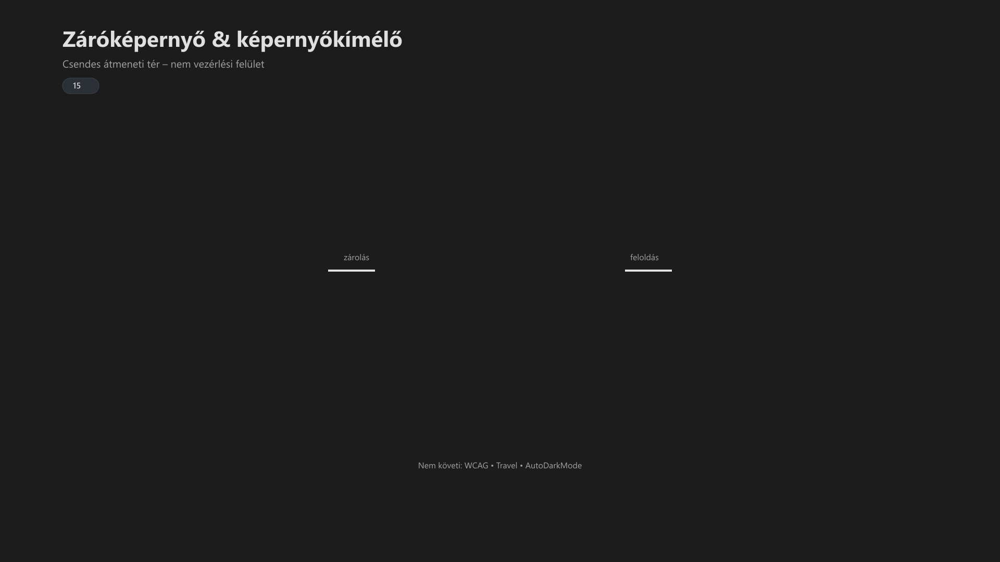

<div class="grid cards frostwood-header-cards" markdown>

-   <span class="fw-module-header-icon fw-module-15" aria-hidden="true"></span>

    # 15. Záróképernyő & Képernyőkímélő { #15-zarokepernyo-es-kepernyokimelo }

    > Szerző: Hegedüs Gábor (@hege-g)<br>
    > Licenc: [MIT (Kód) / CC BY-NC-ND 4.0 (Docs)]<br>
    > Frostwood Docs: v1.0.0<br>
    > Rendszerverzió / Állapot: v1.0.5 / Stabil<br>
    > Blokk: <span class="fw-block-icon-main-rendszer" aria-hidden="true"></span> Rendszer

</div>

<div class="grid cards frostwood-toc-cards" markdown>

-   ## Tartalomkártyák

    * [:material-infinity: 1. Cél](#1-cel)
    * [:material-infinity: 2. Tervezési alapelv](#2-tervezesi-alapelv)
    * [:material-infinity: 3. LockScreen képek](#3-lockscreen-kepek)
    * [:material-infinity: 4. Beállítás (kézi, stabil módszer)](#4-beallitas-kezi-stabil-modszer)
    * [:material-infinity: 5. Működési viselkedés](#5-mukodesi-viselkedes)
        * [:material-infinity: 5.1 Platformkorlát: Windows Spotlight](#51-platformkorlat-windows-spotlight)
    * [:material-infinity: 6. Screensaver modul](#6-screensaver-modul)
    * [:material-infinity: 7. Screensaver filozófia](#7-screensaver-filozofia)
    * [:material-infinity: 8. Jelszókezelési elv](#8-jelszokezelesi-elv)
    * [:material-infinity: 9. Mentális modell](#9-mentalis-modell)
    * [:material-infinity: 10. Rendszer- és Frostwood felelősség](#10-rendszer-es-frostwood-felelosseg)
    * [:material-infinity: 11. Ellenőrző lista](#11-ellenorzo-lista)
    * [:material-infinity: 12. Login képernyő – akadálymentesség](#12-login-kepernyo-akadalymentesseg)
        * [:material-infinity: 12.1 Elérés (billentyűzettel)](#121-eleres-billentyuzettel)
        * [:material-infinity: 12.2 Elérhető funkciók](#122-elerheto-funkciok)
        * [:material-infinity: 12.3 WCAG vonatkozás](#123-wcag-vonatkozas)
        * [:material-infinity: 12.4 Frostwood álláspont](#124-frostwood-allaspont)
    * [:material-infinity: 13. Képernyőolvasó viselkedés](#13-kepernyoolvaso-viselkedes)
    * [:material-infinity: 14. Stabilitási elv](#14-stabilitasi-elv)
    * [:material-infinity: 15. Alapelv](#15-alapelv)

</div>

## 1. Cél

A LockScreen és Screensaver modul célja:

> Egységes, halk, Frostwood-kompatibilis zárolási élmény.<br>
> Admin jogosultság és rendszerkényszer nélkül.

Ez a modul:

* nem biztonsági rendszer
* nem policy motor
* nem automatizált vezérlő

Ez:

> Vizuális és mentális konzisztencia.


---

## 2. Tervezési alapelv

A Windows 11 korlátai:

* LockScreen nem vezérelhető stabilan logikai állapot alapján (user szinten)
* nincs natív WCAG-alapú automatikus váltás
* registry-alapú megoldások instabilak vagy policy-ütközésesek

???+ quote "Alapelv"
    Frostwood döntés:

    > Amit a rendszer nem támogat stabilan, azt nem erőltetjük.


Ezért a megoldás:

* kézi kiválasztás
* előkészített képek
* zéró hack
* zéró registry kockázat

---

## 3. LockScreen képek



??? info "Vizuális leírás akadálymentesítéshez"
    A kép három egymás melletti blokkból áll.

    A bal oldalon az „Aktív rendszer” látható, amely az alkalmazásokkal és a működő asztallal rendelkező állapotot jelöli.

    Középen a „LockScreen” blokk található. Ez egy homogén, minimális vizuális tartalommal rendelkező felület, amely nem tartalmaz aktív információt vagy vezérlést. A célja a csendes átmenet biztosítása az állapotok között.

    A jobb oldalon a „Visszatérés” blokk jelenik meg, amely a rendszerbe való belépést jelöli.

    A diagram azt is jelzi, hogy a LockScreen nem követi a WCAG, Travel vagy más dinamikus rendszerállapotokat.


A telepítőcsomagban a LockScreen képek az alábbi útvonalon találhatók:

```text title="Text"
Payload\LockScreen\
```

Tipikus tartalom:

```text title="Text"
Frostwood_Lock_Character_Light.png
Frostwood_Lock_Character_Dark.png
Frostwood_Lock_WCAG_Light.png
Frostwood_Lock_WCAG_Dark.png
```

Cél:

* konzisztens vizuális horgony
* halk, nem zavaró háttér
* WCAG-kompatibilis (egyszínű / alacsony ingerű) megjelenés

???+ note "Megjegyzés"
    A képek a 1920x1080 pixel (16:9-es képarány) natív felbontáshoz igazodnak a torzításmentes megjelenítés érdekében.


---

## 4. Beállítás (kézi, stabil módszer)

??? success "Beállításhoz futtasd"
    ```text title="Text"
    Open_LockScreen_Settings.bat
    ```


Lépések:

1. Background → Picture
2. Tallózás
3. Frostwood kép kiválasztása

Ez a módszer:

* stabil
* visszafordítható
* rendszerkompatibilis

---

## 5. Működési viselkedés

A LockScreen:

* nem követi a WCAG állapotot
* nem követi a Travel módot
* nem vált automatikusan Light/Dark szerint

Ez tudatos döntés.

A LockScreen:

???+ quote "Alapelv"
    > Nem dinamikus felület,<br>
    > hanem stabil vizuális horgony.


### 5.1 Platformkorlát: Windows Spotlight

A Windows 11 bizonyos környezetekben felülírhatja a felhasználó által beállított záróképernyő-képet.

Tipikus külső zajforrás:

* Windows Spotlight tartalom

Ez nem Frostwood-hiba, hanem platformszintű felülírási viselkedés.

Következmény:

* a beállított kép időszakosan lecserélődhet
* a vizuális konzisztencia részben sérülhet
* a rendszer logikája ettől még nem változik meg

A Frostwood ezt így kezeli:

* ismert külső korlátnak tekinti
* nem ígér teljes platformszintű vizuális kényszerítést
* a stabilitást a működési logikában, nem a teljes képi kontrollban biztosítja

??? tip "Windows Spotlight kikapcsolása"
    Ha zavarónak érzed a véletlenszerű tájképeket a Frostwood minimál design helyett.

    A Windows 11 magyar nyelvű felületén ez a beállítás a következő helyen található:

    **Gépház** > **Személyre szabás** > **Zárolási képernyő** menüpont alatt:

    **„Érdekességek, tippek és egyéb információk megjelenítése a zárolási képernyőn”**

    **Hogyan találd meg pontosan**

    1. Nyisd meg a **Gépházat** (vagy nyomd meg a `Windows + I` billentyűkombinációt).
    2. A bal oldali menüben válaszd a **Személyre szabás** lehetőséget.
    3. Kattints a **Zárolási képernyő** csempére.
    4. Győződj meg róla, hogy a **Zárolási képernyő személyre szabása** opciónál a **Kép** vagy a **Diavetítés** van kiválasztva (mivel a *Windows reflektorfény* esetén ez a funkció fixen be van kapcsolva).
    5. Ezután lentebb megjelenik az említett jelölőnégyzet, amit a zavartalan Frostwood-élmény érdekében érdemes **kikapcsolni**.


---

## 6. Screensaver modul

A Screensaver opcionális.

??? success "Elérhető Screensaver fájlok"
    ```text title="Text"
    Open_LockScreen_Settings.bat
    Open_Screensaver_Settings.bat
    Screensaver_Frostwood_OFF.bat
    Screensaver_Frostwood_ON_NoPassword.bat
    ```


---

## 7. Screensaver filozófia

A Frostwood nem használ:

* animált screensavert
* villogó mintát
* információs overlayt

Ajánlott beállítás:

* Blank screensaver (A Screensaver ne csak üres képernyőt mutasson, hanem a "Turn off display" Windows beállítással szinkronban működjön az energiatakarékosság és a teljes vizuális sterilitás érdekében.)
* 10–15 perc timeout
* nincs jelszókérés visszatéréskor

A screensaver szerepe:

> Nem információ, nem dekoráció, hanem szünet.

---

## 8. Jelszókezelési elv

A Frostwood:

* nem ír jelszó policy-t
* nem módosít Winlogon kulcsokat
* nem kényszerít zárolást

A döntés a felhasználóé.

---

## 9. Mentális modell

A LockScreen:

* nem riaszt
* nem sürget
* nem figyelmeztet

Hanem:

> Halk, anyagszerű, stabil felület.

A Screensaver:

* nem kommunikál
* nem informál
* nem animál

Hanem:

> Vizuális csend.

---

## 10. Rendszer- és Frostwood felelősség

A Frostwood nem helyettesíti a Windows alapvető funkcióit, hanem kiegészíti azokat. A felelősségi körök éles elválasztása garantálja a rendszerbiztonságot és a vizuális stabilitást.

<div class="grid cards frostwood-section-cards frostwood-numbered-card" markdown>

-   ### Windows (Operációs rendszer)

    Az alapvető infrastruktúra és biztonság rétege.

    * **Kezeli:** Login folyamat, rendszerbiztonság, csoportszabályok (Policy)
    * **Nem kezeli:** a Frostwood-specifikus vizuális logikát és egyedi témaváltásokat

-   ### LockScreen (Zárolási képernyő)

    A felhasználói munkamenet előtti statikus kapu.

    * **Kezeli:** a kijelölt háttérkép megjelenítése
    * **Nem kezeli:** a dinamikus WCAG szinteket vagy a Travel-mód változóit

-   ### Screensaver (Képernyővédő)

    Az inaktív (idle) állapotok kezelője.

    * **Kezeli:** az üresjárati viselkedés és az átmeneti vizuális védelem
    * **Nem kezeli:** a rendszerbiztonság fenntartását vagy a hitelesítést

-   ### Frostwood (Keretrendszer)

    A vizuális és akadálymentességi réteg.

    * **Kezeli:** a teljes vizuális konzisztenciát és a módok közötti váltást
    * **Nem kezeli:** a biztonsági kényszerítéseket (security enforcement) vagy a Windows belső kernel-szintű folyamatait

</div>

---

## 11. Ellenőrző lista

A konfiguráció megfelelő, ha:

* :material-checkbox-blank-outline: LockScreen kép Frostwood-kompatibilis
* :material-checkbox-blank-outline: Nincs automatizált hack
* :material-checkbox-blank-outline: Screensaver nem villog
* :material-checkbox-blank-outline: Timeout 10–15 perc
* :material-checkbox-blank-outline: Nincs zavaró vizuális inger

---

## 12. Login képernyő – akadálymentesség

???+ note "Megjegyzés"
    A Windows 11 login képernyőjén natív akadálymentességi panel érhető el.


<div class="grid cards frostwood-section-cards frostwood-numbered-card" markdown>

-   ### 12.1 Elérés (billentyűzettel)

    1. TAB → „Akadálymentesség” gomb
    2. ENTER
    3. TAB → funkció kiválasztása
    4. SZÓKÖZ → kapcsolás

    ???+ note "Megjegyzés"
        A Windows Login képernyőn az akadálymentességi kapcsolók ENTER-rel is aktiválhatók, de a SZÓKÖZ a standard.

        **Billentyűparancs a gyorsabb eléréshez:** Windows + U


-   ### 12.2 Elérhető funkciók

    * Narrátor
    * Nagyító
    * Kontrasztos témák
    * Hanghozzáférés
    * Képernyő-billentyűzet
    * Beragadó billentyűk
    * Billentyűszűrés
    * Hangfelismerés

-   ### 12.3 WCAG vonatkozás

    A login képernyő:

    * támogatja a billentyűzetes használatot (2.1.1)
    * nem csak vizuális információt használ (1.3.3)
    * kontrasztos témákat biztosít (1.4.3)

-   ### 12.4 Frostwood álláspont

    A Frostwood:

    * nem módosítja registry-ből a login viselkedést
    * nem automatizál accessibility funkciókat
    * nem írja felül a Windows natív működését

    Indok:

    > A login réteg a rendszer felelőssége,<br>
    > nem a Frostwoodé.

</div>

---

## 13. Képernyőolvasó viselkedés

A LockScreen és login esetén:

* a Narrátor a domináns
* JAWS nem minden esetben aktív

Ezért:

* a Frostwood nem épít saját hanglogikát ide
* nem próbálja „felülírni” a rendszert

Elv:

> A rendszer beszél, a Frostwood nem versenyez vele.

---

## 14. Stabilitási elv

Ez a modul:

* nem automatizál
* nem hackel
* nem kényszerít

Ezért:

* stabil
* kiszámítható
* kompatibilis

---

## 15. Alapelv

> A záróképernyő nem vezérlési felület,<br>
> hanem állapot közötti csendes átmenet.