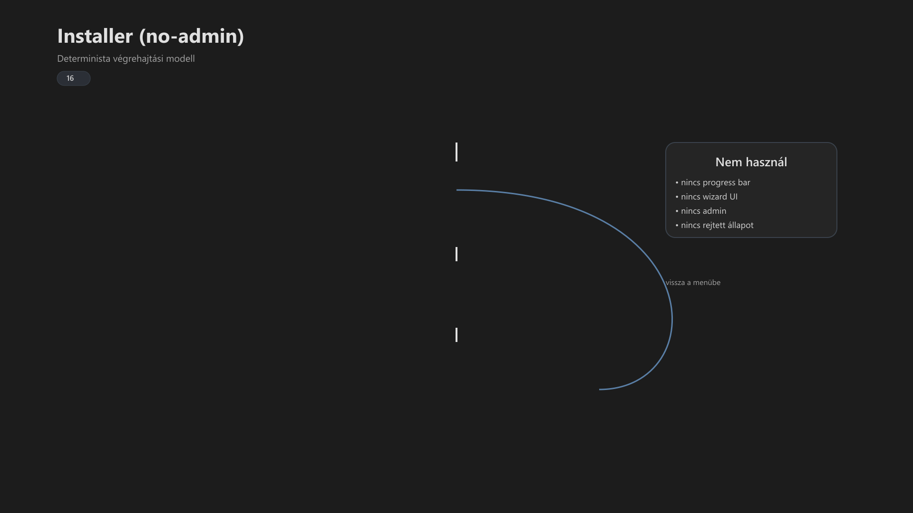

<div class="grid cards frostwood-header-cards" markdown>

-   <span class="fw-module-header-icon fw-module-16" aria-hidden="true"></span>

    # 16. Frostwood — Installer specifikáció (no-admin) { #16-frostwood-installer-specifikacio-no-admin }

    > Szerző: Hegedüs Gábor (@hege-g)<br>
    > Licenc: [MIT (Kód) / CC BY-NC-ND 4.0 (Docs)]<br>
    > Frostwood Docs: v1.0.0<br>
    > Rendszerverzió / Állapot: v1.0.5 / Stabil<br>
    > Blokk: <span class="fw-block-icon-main-rendszer" aria-hidden="true"></span> Rendszer<br>
    > Cél: egyszerű, determinisztikus, képernyőolvasó-barát telepítés<br>
    > Telepítő: `INSTALL_FROSTWOOD.bat` + belső motor: `Payload\Core\InstallerEngine.ps1`<br>
    > Cél útvonal (telepítve): `%LocalAppData%\Frostwood\`<br>
    > Logok: `INSTALL.log`, `UNINSTALL.log`, + teszt: `TEST_LOG.txt`

</div>

<div class="grid cards frostwood-toc-cards" markdown>

-   ## Tartalomkártyák

    * [:material-infinity: 1. Cél](#1-cel)
    * [:material-infinity: 2. Alapelvek](#2-alapelvek)
    * [:material-infinity: 3. Futtatható komponensek](#3-futtathato-komponensek)
    * [:material-infinity: 4. Konzol és visszajelzés](#4-konzol-es-visszajelzes)
        * [:material-infinity: 4.1 Szín](#41-szin)
        * [:material-infinity: 4.2 Hang](#42-hang)
    * [:material-infinity: 5. Indítás előtti megerősítés](#5-inditas-elotti-megerosites)
    * [:material-infinity: 6. Menü (képernyőolvasó-barát forma)](#6-menu-kepernyoolvaso-barat-forma)
    * [:material-infinity: 7. Menü működés (determinista)](#7-menu-mukodes-determinista)
    * [:material-infinity: 8. Menü pontok (funkcionális bontás)](#8-menu-pontok-funkcionalis-bontas)
        * [:material-infinity: 8.1 0 — Log teszt](#81-0-log-teszt)
        * [:material-infinity: 8.2 1 — Teljes telepítés](#82-1-teljes-telepites)
        * [:material-infinity: 8.3 2 — Safe Mode telepítés](#83-2-safe-mode-telepites)
        * [:material-infinity: 8.4 3 — Base Elevation](#84-3-base-elevation)
        * [:material-infinity: 8.5 4 — Parancsikonok](#85-4-parancsikonok)
        * [:material-infinity: 8.6 5 — SoftLock watcher](#86-5-softlock-watcher)
        * [:material-infinity: 8.7 6 — Location settings](#87-6-location-settings)
        * [:material-infinity: 8.8 7 — Windhawk](#88-7-windhawk)
        * [:material-infinity: 8.9 8 — Total Commander Sync](#89-8-total-commander-sync)
    * [:material-infinity: 9. Telepítés közbeni állapotüzenetek](#9-telepites-kozbeni-allapotuzenetek)
    * [:material-infinity: 10. Logolás](#10-logolas)
    * [:material-infinity: 11. Mit NEM csinál a telepítő](#11-mit-nem-csinal-a-telepito)
    * [:material-infinity: 12. Ellenőrző lista](#12-ellenorzo-lista)
    * [:material-infinity: 13. Képernyőolvasó viselkedés](#13-kepernyoolvaso-viselkedes)
    * [:material-infinity: 14. Alapelv](#14-alapelv)

</div>

## 1. Cél

A Frostwood telepítő:

* nem varázsló
* nem vizuális UI
* nem dekoráció

Ez egy:

> Determinisztikus, akadálymentesített végrehajtó felület.

Feladata:

* fájlok másolása
* registry inicializálása
* rendszerállapot létrehozása
* visszajelzés adása



??? info "Vizuális leírás akadálymentesítéshez"
    A kép egy függőleges, ciklikus folyamatot mutat.

    A folyamat az „Indítás” blokkal kezdődik, ahol a telepítő elindul és megerősítést kér.

    Ezután a „Determinista menü” blokk következik, amely lineáris, számozott opciókat tartalmaz.

    A kiválasztás után a „Végrehajtás” blokk jelenik meg, ahol a telepítő konkrét lépéseket hajt végre, például fájlmásolást és registry inicializálást.

    A „Log + visszajelzés” blokk egy terminál jellegű felületet mutat, ahol soronként jelennek meg az állapotüzenetek.

    A folyamat végén egy visszamutató nyíl jelzi, hogy a rendszer visszatér a menübe, és újabb művelet indítható.

    A jobb oldalon egy külön blokk mutatja, hogy a telepítő nem használ vizuális UI elemeket, például progress bart vagy wizard felületet.


---

## 2. Alapelvek

A telepítő:

* nem kér admin jogot
* nem telepít külső komponenst
* nem használ hamis progress bart
* nem támaszkodik csak színre

A telepítő:

* megerősítést kér
* soronként kommunikál
* logol
* valós állapotot jelez

---

## 3. Futtatható komponensek

??? tip "Telepítő indító"
    ```text title="Text"
    INSTALL_FROSTWOOD.bat
    ```


??? info "Telepítő motor"
    ```text title="Text"
    Payload\Core\InstallerEngine.ps1
    ```


??? success "Telepítés után"
    ```text title="Text"
    %LocalAppData%\Frostwood\Core\InstallerEngine.ps1
    ```


### Telepítési útvonal – no-admin modell

A Frostwood no-admin telepítési modellje felhasználói szintű írási útvonalat használ.

??? success "Telepítési célmappa"
    ```text title="Text"
    %LocalAppData%\Frostwood\
    ```


A telepítő nem rendszer-szintű telepítést végez, hanem:

> Felhasználói szintű inicializálást és környezet-előkészítést.

Ennek oka:

* nem igényel rendszergazdai jogosultságot
* felhasználói szinten visszafordítható
* összhangban van a Frostwood HKCU-alapú filozófiájával

???+ warning "Fontos"
    > A %ProgramData% írása tipikusan admin jogot igényel, ezért no-admin telepítőnél nem tekinthető elsődleges célútnak.


---

## 4. Konzol és visszajelzés

<div class="grid cards frostwood-section-cards frostwood-numbered-card" markdown>

-   ### 4.1 Szín

    ```bat title="Bat"
    color 0B
    ```

    A Frostwood telepítő vizuális identitásának alapja a `0B` (fekete háttér, világoskék szöveg) és az egyedi ANSI színek kombinációja:

    ```html title="HTML"
    <pre style="background-color: #000000; padding: 15px; border-radius: 5px; font-family: monospace; line-height: 1.2; overflow-x: auto;">
    <span style="color: #00FFFF;">       ________________ </span>
    <span style="color: #00FFFF;">      /               /\ </span>
    <span style="color: #00FFFF;">     /      </span><span style="color: #E67E22;">⚡</span><span style="color: #00FFFF;">       /  \ </span>
    <span style="color: #00FFFF;">    /_______________/    \ </span>
    <span style="color: #00FFFF;">    \               \    / </span>
    <span style="color: #00FFFF;">     \    </span><span style="color: #E67E22;">FROSTWOOD</span><span style="color: #00FFFF;">  \  /  </span>
    <span style="color: #00FFFF;">      \_______________\/   </span>
    </pre>
    ```

    ??? info "Vizuális leírás akadálymentesítéshez"
        A képen egy izometrikus kocka látható ASCII karakterekből felépítve.

        A kocka felső lapján egy narancssárga villám ikon, az elülső oldalán pedig a "FROSTWOOD" felirat olvasható. A háttér fekete (0), a vonalak világoskék/aqua színűek (B), a felirat és a villám pedig narancssárga kiemelést kapott.

        Ez a színösszeállítás hűen tükrözi a Frostwood konzolos color 0B megjelenését.


    * **Fekete háttér:** Stabil alapot ad a vibrálásmentes munkához.
    * **Világoskék szöveg:** Pihentető a szemnek, kiváló kontrasztot alkot.
    * **Narancs (⚡):** Kiemeli a fontos akciókat és a márkát.

    Cél:

    * Stabil kontraszt.
    * Vizuális elkülönülés a rendszer többi ablakától.
    * Hosszú távú olvashatóság fókuszált munka során.

-   ### 4.2 Hang

    A hangjelzés:

    * nem dekoráció
    * nem UI elem

    Hanem:

    > Állapot-visszacsatolás.

    Használat:

    * rövid hang → lépés
    * magas hang → siker

    WCAG:

    * nem kizárólagos információforrás
    * csak kiegészítés

</div>

---

## 5. Indítás előtti megerősítés

??? question "A telepítő kérdez"
    ```text title="Text"
    Biztosan el akarod indítani?  
    (I = Igen, N = Nem)
    ```


Viselkedés:

* N → kilép
* I → indul

Ez kritikus:

* véletlen indítás ellen
* screen reader használatnál

---

## 6. Menü (képernyőolvasó-barát forma)

??? success "A menü **lineáris és rövid**"
    ```text title="Text"
    0 - Log írás teszt
    1 - Teljes telepítés / frissítés
    2 - Biztonságos telepítés
    3 - Base Elevation
    4 - Parancsikonok létrehozása
    5 - SoftLock watcher telepítése
    6 - Windows Hely beállítás
    7 - Windhawk oldalak
    8 - Total Commander Sync
    X - Kilépés
    ```


???+ note "Megjegyzés"
    A kilépéshez használt X karakter a magyar billentyűzetkiosztás mellett is azonos helyen és funkcióval bír, biztosítva a gyors leállítást.


Tulajdonságok:

* minden sor külön olvasható
* nincs vizuális csoportfüggés
* nincs többjelentésű szám

---

## 7. Menü működés (determinista)

A menü:

1. vár inputra
2. végrehajt
3. visszatér

Nincs:

* automatikus továbblépés
* időlimit
* rejtett állapot

---

## 8. Menü pontok (funkcionális bontás)

<div class="grid cards frostwood-section-cards frostwood-numbered-card" markdown>

-   ### 8.1 0 — Log teszt

    ??? tip "Teszt indító "
        ```text title="Text"
        00_TEST_WRITE_LOG.bat
        ```


    * Ha a log teszt sikertelen, ellenőrizd a mappa-hozzáférési jogosultságokat vagy az antivírus védelmét.


    ??? success "Létrehozza"
        ```text title="Text"
        TEST_LOG.txt
        ```


    Cél:

    * írás ellenőrzés
    * gyors diagnosztika

-   ### 8.2 1 — Teljes telepítés

    Mi történik:

    1. fájlok másolása → `%LocalAppData%\Frostwood\`
    2. registry létrehozás
    3. háttér beállítás
    4. ThemeSwitcher fut

    ??? success "Registry telepítési hely"
        ```reg title="Reg"
        HKCU\Software\FrostwoodTheme
        ```


    Kulcsok:

    * WCAG = 0
    * SignalColors = 0
    * SoftLock = 0
    * Travel = 0

-   ### 8.3 2 — Safe Mode telepítés

    Csak:

    * Core
    * Wallpapers

    Nem:

    * Modes
    * Icons
    * Tools

    Cél:

    * hibakeresés
    * minimál rendszer

    ??? note "Megjegyzés"
        Ez a telepítési mód megtartja a korábbi beállításokat, csak a binárisokat frissíti.


-   ### 8.4 3 — Base Elevation

    Beállít:

    * áttetszőség
    * árnyék
    * vizuális effektek

    ???+ note "Megjegyzés"
        Lehet újraindítás szükséges.


-   ### 8.5 4 — Parancsikonok

    ??? success "Létrejövő célmappa"
        ```text title="Text"
        Desktop\Frostwood (Munka)
        ```


    ??? tip "Ikonforrás"
        ```text title="Text"
        %LocalAppData%\Frostwood\Visuals\Icons\System\
        ```


    Fontos:

    * ikon + szöveg együtt
    * nincs vizuális függés

-   ### 8.6 5 — SoftLock watcher

    ??? tip "SoftLock watcher telepítő"
        ```text title="Text"
        Modes\Install_SoftLock_Watcher.bat
        ```


    Feladat:

    * virtuális asztal stabilizálás

-   ### 8.7 6 — Location settings

    ??? tip "Helybeállítások"
        ```text title="Text"
        ms-settings:privacy-location
        ```


    Itt szabályozhatod, hogy az eszközöd (GPS, Wi-Fi, mobilhálózat segítségével) hozzáférjen-e a fizikai tartózkodási helyedhez, és azt megossza-e a különböző alkalmazásokkal.

    * **Alkalmazások hozzáférése:** Itt engedélyezheted vagy tilthatod le, hogy pl. a térkép, az időjárás vagy a böngésző megtudja, hol vagy.

    Cél:

    * AutoDarkMode támogatás

-   ### 8.8 7 — Windhawk

    Csak megnyit:

    * weboldalak

    Nem telepít.

-   ### 8.9 8 — Total Commander Sync

    Bekéri:

    * `exe`
    * `ini` fájlok


    ??? note "Megjegyzés"
        A szinkronizáció akkor a legstabilabb, ha a Total Commander az `ini` fájljait a %AppData%\GHISLER\ mappában tárolja.


    ??? success "Registry tárolási hely"
        ```reg title="Reg"
        HKCU\Software\FrostwoodTheme
        ```


</div>

---

## 9. Telepítés közbeni állapotüzenetek

Minden lépés külön sor:

* Telepítés indul
* Fájlok másolása
* Registry inicializálás
* Háttér beállítás
* Kész

Ez biztosítja:

* stabil felolvasást
* követhető működést

---

## 10. Logolás

??? success "Log fájlok"
    ```text title="Text"
    INSTALL.log  
    UNINSTALL.log
    ```


Tartalom:

* időbélyeg
* lépések
* hibák

---

## 11. Mit NEM csinál a telepítő 

???+ warning "Figyelem"
    Nem:

    * nem telepít appokat
    * nem módosít policy-t
    * nem használ adminot
    * nem manipulál rendszert rejtetten


---

## 12. Ellenőrző lista

Telepítés után:

* :material-checkbox-blank-outline: `%LocalAppData%\Frostwood\` létezik?
* :material-checkbox-blank-outline: Registry kulcs létezik?
* :material-checkbox-blank-outline: Háttér beállítva?
* :material-checkbox-blank-outline: Shortcutok létrejöttek?
* :material-checkbox-blank-outline: Log létrejött?

---

## 13. Képernyőolvasó viselkedés

A telepítő:

* nem ír felül sorokat
* nem használ progress bart
* nem ugrál

Ez biztosítja:

* JAWS / NVDA kompatibilitást
* stabil felolvasást

---

## 14. Alapelv

> A telepítő nem látványos,<br>
> hanem megbízható.

> Nem gyorsnak tűnik,<br>
> hanem valójában követhető.