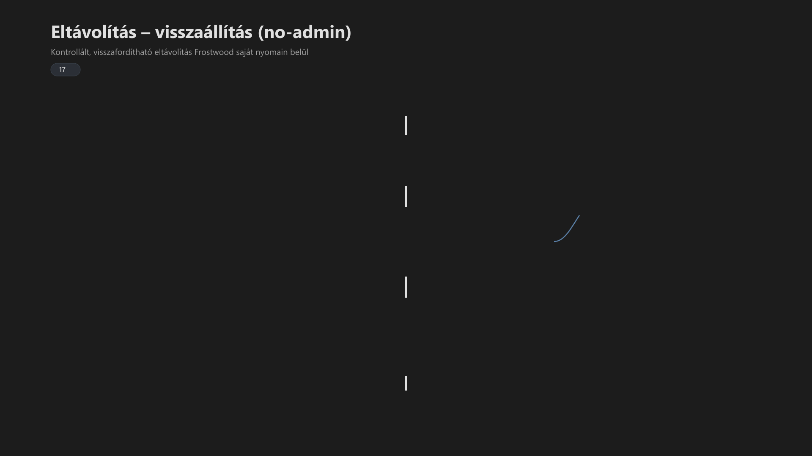

<div class="grid cards frostwood-header-cards" markdown>

-   <span class="fw-module-header-icon fw-module-17" aria-hidden="true"></span>

    # 17. Frostwood — Eltávolítás-Visszaállítás (no-admin) { #17-frostwood-eltavolitas-visszaallitas-no-admin }

    > Szerző: Hegedüs Gábor (@hege-g)<br>
    > Licenc: [MIT (Kód) / CC BY-NC-ND 4.0 (Docs)]<br>
    > Frostwood Docs: v1.0.0<br>
    > Rendszerverzió / Állapot: v1.0.5 / Stabil<br>
    > Blokk: <span class="fw-block-icon-main-rendszer" aria-hidden="true"></span> Rendszer<br>
    > Cél: kulturált, visszafordítható eltávolítás admin jog nélkül

</div>

<div class="grid cards frostwood-toc-cards" markdown>

-   ## Tartalomkártyák

    * [:material-infinity: 1. Cél](#1-cel)
    * [:material-infinity: 2. Alapelvek](#2-alapelvek)
    * [:material-infinity: 3. Futtatható komponens](#3-futtathato-komponens)
    * [:material-infinity: 4. Konzol és visszajelzés](#4-konzol-es-visszajelzes)
        * [:material-infinity: 4.1 Szín](#41-szin)
        * [:material-infinity: 4.2 Hang](#42-hang)
    * [:material-infinity: 5. Indítás előtti megerősítés](#5-inditas-elotti-megerosites)
    * [:material-infinity: 6. Működési modell](#6-mukodesi-modell)
    * [:material-infinity: 7. Mit távolít el](#7-mit-tavolit-el)
        * [:material-infinity: 7.1 Telepített mappa](#71-telepitett-mappa)
        * [:material-infinity: 7.2 Registry](#72-registry)
        * [:material-infinity: 7.3 SoftLock watcher](#73-softlock-watcher)
        * [:material-infinity: 7.4 Parancsikonok](#74-parancsikonok)
    * [:material-infinity: 8. Parancsikonok (determinista lista)](#8-parancsikonok-determinista-lista)
        * [:material-infinity: 8.1 Desktop](#81-desktop)
        * [:material-infinity: 8.2 Munka mappa](#82-munka-mappa)
        * [:material-infinity: 8.3 Mappa törlés](#83-mappa-torles)
    * [:material-infinity: 9. Lépésenkénti állapotüzenetek](#9-lepesenkenti-allapotuzenetek)
    * [:material-infinity: 10. Elsődleges és fallback út](#10-elsodleges-es-fallback-ut)
        * [:material-infinity: 10.1 Elsődleges (engine)](#101-elsodleges-engine)
        * [:material-infinity: 10.2 Fallback](#102-fallback)
    * [:material-infinity: 11. Logolás](#11-logolas)
    * [:material-infinity: 12. Mit NEM töröl](#12-mit-nem-torol)
    * [:material-infinity: 13. Hibahelyzetek](#13-hibahelyzetek)
        * [:material-infinity: 13.1 Nem törölhető fájl](#131-nem-torolheto-fajl)
        * [:material-infinity: 13.2 Munka mappa megmarad](#132-munka-mappa-megmarad)
        * [:material-infinity: 13.3 Engine hiányzik](#133-engine-hianyzik)
    * [:material-infinity: 14. Képernyőolvasó viselkedés](#14-kepernyoolvaso-viselkedes)
    * [:material-infinity: 15. Ellenőrző lista](#15-ellenorzo-lista)
    * [:material-infinity: 16. Alapelv](#16-alapelv)

</div>

## 1. Cél

Az uninstall célja:

* Frostwood eltávolítása
* rendszer tisztán hagyása
* visszafordíthatóság biztosítása

Ez nem:

* Windows reset
* rendszer tisztítás
* külső elemek törlése

Hanem:

> Kizárólag a Frostwood saját nyomainak eltávolítása.

---

## 2. Alapelvek



??? info "Vizuális leírás akadálymentesítéshez"
    A kép egy függőleges, lépésről lépésre haladó eltávolítási modellt mutat.

    A folyamat a megerősítéssel indul, ahol a felhasználó eldönti, hogy valóban el akarja-e távolítani a Frostwoodot.

    Ezután egy ellenőrzési blokk következik, amely azt mutatja, hogy a rendszer megnézi az eltávolításhoz szükséges elemek elérhetőségét, például az uninstall engine-t vagy a watcher meglétét.

    A fő eltávolítási blokk csak a Frostwood saját elemeit törli: a telepített mappát, a registry kulcsot, a parancsikonokat és a SoftLock komponenseket.

    Egy külön blokk jelzi, hogy a rendszer mit nem töröl, például böngészőprofilokat, dokumentumokat vagy más külső alkalmazásokat.

    A log és fallback blokk naplózást és tartalék eltávolítási útvonalat mutat, ha a fő motor nem érhető el.

    A folyamat végén a rendszer tiszta lezárással fejeződik be.


Az uninstall:

* nem kér admin jogot
* megerősítést kér
* soronként kommunikál
* logol
* determinisztikus

Nem:

* nem fut csendben
* nem töröl rejtetten
* nem használ agresszív módszert

---

## 3. Futtatható komponens

??? tip "Eltávolító indító"
    ```text title="Text"
    UNINSTALL_FROSTWOOD.bat
    ```


??? info "Eltávolító motor (ha elérhető)"
    ```text title="Text"
    %LocalAppData%\Frostwood\Core\InstallerEngine.ps1
    ```


---

## 4. Konzol és visszajelzés

<div class="grid cards frostwood-section-cards frostwood-numbered-card" markdown>

-   ### 4.1 Szín

    ```bat title="Bat"
    color 0C
    ```

    A Frostwood eltávolító vizuális identitása a destruktív műveletekre figyelmeztető `0C` (fekete háttér, világosvörös szöveg) és az egyedi ANSI színek kombinációja:

    ```html title="HTML"
    \<pre style="background-color: \#000000; padding: 15px; border-radius: 5px; font-family: monospace; line-height: 1.2; overflow-x: auto;"\>
    \<span style="color: \#FF5555;"\>       \_\_\_\_\_\_\_\_\_\_\_\_\_\_\_\_ \</span\>
    \<span style="color: \#FF5555;"\>      /               /\\ \</span\>
    \<span style="color: \#FF5555;"\>     /      \</span\>\<span style="color: \#E67E22;"\>⚡\</span\>\<span style="color: \#FF5555;"\>       /  \\ \</span\>
    \<span style="color: \#FF5555;"\>    /\_**/    \\ \</span\>
    \<span style="color: \#FF5555;"\>    \\               \\    / \</span\>
    \<span style="color: \#FF5555;"\>     \\    \</span\>\<span style="color: \#E67E22;"\>UNINSTALL\</span\>\<span style="color: \#FF5555;"\>  \\  /  \</span\>
    \<span style="color: \#FF5555;"\>      \_**/   \</span\>
\</pre\>
    ```

    ??? info "Vizuális leírás akadálymentesítéshez"
        Az eltávolító izometrikus kocka logója ASCII karakterekből felépítve.

        A háttér fekete (0), a vonalak világosvörös színűek (C), jelképezve a rendszer módosítását és a fájlok törlését.

        A felső lapon a narancssárga villám, az elülső oldalon pedig az "UNINSTALL" felirat látható, biztosítva a vizuális folytonosságot a telepítővel, de egyértelműen elkülönítve a funkciót.


    * **Fekete háttér:** Konzisztens a telepítővel, fókuszált környezetet biztosít.
    * **Világosvörös szöveg:** Azonnali pszichológiai jelzés a destruktív (törlési) folyamatról.
    * **Narancs (⚡):** A Frostwood identitás megtartása a figyelmeztető környezetben is.

    Cél:

    * azonnali vizuális különbség az installhoz képest
    * destruktív művelet jelzése

    > Egyértelmű állapotközlés: A színkód már a script indulásakor rögzíti a folyamat jellegét.

-   ### 4.2 Hang

    A hang:

    * figyelmeztet
    * nem dekorál

    Használat:

    * mély hang → indulás (figyelmeztetés)
    * rövid hang → lépések
    * magas hang → siker

    WCAG:

    * nem kizárólagos információ
    * szöveggel együtt értelmezhető

</div>

---

## 5. Indítás előtti megerősítés

??? tip " Eltávolító megerősítése"
    ```text title="Text"
    Biztosan el akarod távolítani?
    (I = Igen, N = Nem)
    ```


Viselkedés:

* N → kilép
* I → folytatás

???+ warning "Figyelem"
    Ez kritikus:

    * véletlen törlés ellen
    * képernyőolvasó használatnál


---

## 6. Működési modell

Az uninstall:

1. ellenőriz
2. töröl
3. naplóz
4. lezár

Nincs:

* automatikus ismétlés
* rejtett lépés
* háttérben futó törlés

A determinisztikus visszaállítás célja:

* a Frostwood saját nyomainak eltávolítása
* az eredeti felhasználói állapot lehetőség szerinti helyreállítása
* admin jogosultság nélküli lezárás

---

## 7. Mit távolít el

<div class="grid cards frostwood-section-cards frostwood-numbered-card" markdown>

-   ### 7.1 Telepített mappa

    ??? tip "Frostwood telepítési hely"
        ```text title="Text"
        %LocalAppData%\Frostwood\
        ```


    #### Visszaállítás és no-admin összhang

    Az uninstall ugyanazon a felhasználói szintű útvonalon dolgozik, mint a telepítő.

    ??? tip "Ajánlott eltávolítási célmappa"
        ```text title="Text"
        %LocalAppData%\Frostwood\
        ```


    Ez biztosítja, hogy:

    * a no-admin ígéret tartható maradjon
    * a telepítés és eltávolítás szimmetrikus legyen
    * a rendszer visszafordítható maradjon felhasználói szinten

    ???+ warning "Fontos"
        > Az uninstall nem támaszkodhat admin jogot igénylő írási vagy törlési útvonalra.


-   ### 7.2 Registry

    ??? tip "Registry eltávolítás"
        ```reg title="Reg"
        HKCU\Software\FrostwoodTheme
        ```


    * Windows natív regisztrációs adatbázisa nem sérül

-   ### 7.3 SoftLock watcher

    ??? tip "SoftLock watcher eltávolító (ha létezik)"
        ```text title="Text"
        Modes\Uninstall_SoftLock_Watcher.bat
        ```


    A folyamat első lépése a futó watcher taskok leállítása a zárolt fájlok elkerülése érdekében.


-   ### 7.4 Parancsikonok

    Törlés helye:

    * User Desktop
    * Public Desktop  
    (Az uninstall csak a felhasználói szintű (%UserProfile%) parancsikonokat törli garantáltan. A Public Desktop elemei csak jelzés szintjén szerepelnek a listában, ha no-admin módban futunk.)
    * Munka mappa

</div>

---

## 8. Parancsikonok (determinista lista)

<div class="grid cards frostwood-section-cards frostwood-numbered-card" markdown>

-   ### 8.1 Desktop

    ??? success "Eltávolított Desktop parancsikonok"
        ```text title="Text"
        WCAG KI
        Travel BE
        Travel KI
        SoftLock BE
        SoftLock KI
        SignalColors KI
        Normál JAWS
        ```


-   ### 8.2 Munka mappa

    ??? success "Eltávolított Munka mappa"
        ```text title="Text"
        Desktop\Frostwood (Munka)
        ```


    ??? info "Munka mappa tartalom"
        ```text title="Text"
        WCAG BE
        WCAG RESET
        Travel BE
        SoftLock BE
        SignalColors BIZTONSÁGOS
        SignalColors KONTRASZT
        Normál JAWS
        Lassúbb JAWS
        ```


-   ### 8.3 Mappa törlés

    Ha üres:

    * a mappa törlődik

    Ha nem:

    * biztonság érdekében megmarad.

</div>

---

## 9. Lépésenkénti állapotüzenetek

Minden külön sor:

* Eltávolítás indul
* Parancsikonok törlése
* Munka mappa tisztítása
* Frostwood fájlok törlése
* Registry törlése
* Kész

Ez biztosítja:

* stabil felolvasást
* követhető működést

---

## 10. Elsődleges és fallback út

<div class="grid cards frostwood-section-cards frostwood-numbered-card" markdown>

-   ### 10.1 Elsődleges (engine)

    ??? tip "Ha elérhető"
        ```text title="Text"
        InstallerEngine.ps1 -Action Uninstall
        ```


    Ez kezeli:

    * watcher uninstall
    * registry törlés
    * fájl törlés

-   ### 10.2 Fallback

    Ha nincs engine:

    * watcher uninstall külön
    * registry törlés külön
    * mappa törlés külön

    Cél:

    > Sérült telepítés is eltávolítható legyen.

</div>

---

## 11. Logolás

??? tip "Log fájl"
    ```text title="Text"
    UNINSTALL.log
    ```


Tartalom:

* időbélyeg
* lépések
* hibák
* fallback használat

---

## 12. Mit NEM töröl

Nem töröl:

* böngésző profilok
* dokumentumok
* Office fájlok
* Windhawk
* AutoDarkMode
* Windows rendszerkulcsok

???+ quote "Alapelv"
    > Csak Frostwood.


---

## 13. Hibahelyzetek

<div class="grid cards frostwood-section-cards frostwood-numbered-card" markdown>

-   ### 13.1 Nem törölhető fájl

    Ok:

    * zárolt fájl

    Teendő:

    * zárd be az alkalmazást
    * futtasd újra

-   ### 13.2 Munka mappa megmarad

    Ok:

    * van benne felhasználói fájl

    Viselkedés:

    * nem törlődik

-   ### 13.3 Engine hiányzik

    Viselkedés:

    * fallback indul

</div>

---

## 14. Képernyőolvasó viselkedés

Az uninstall:

* nem ír felül sorokat
* nem használ progress bart
* nem ugrál

Ez biztosítja:

* stabil JAWS / NVDA működés
* egyértelmű felolvasás

??? note "Megjegyzés"
    A megerősítő kérdés (I/N) az érintőképernyős beviteltől függetlenül csak fizikai billentyűzetről bevitt karaktert fogad el, elkerülve a véletlen érintésből fakadó törlést.


---

## 15. Ellenőrző lista

Eltávolítás után:

* :material-checkbox-blank-outline: `%LocalAppData%\Frostwood\` törölve?
* :material-checkbox-blank-outline: Registry kulcs törölve?
* :material-checkbox-blank-outline: Parancsikonok törölve?
* :material-checkbox-blank-outline: Munka mappa törölve (ha üres)?
* :material-checkbox-blank-outline: Log létrejött?

---

## 16. Alapelv

> Az uninstall nem agresszív,<br>
> hanem kontrollált.

> Nem rejtett,<br>
> hanem követhető.

> Nem töröl mindent,<br>
> csak amihez joga van.