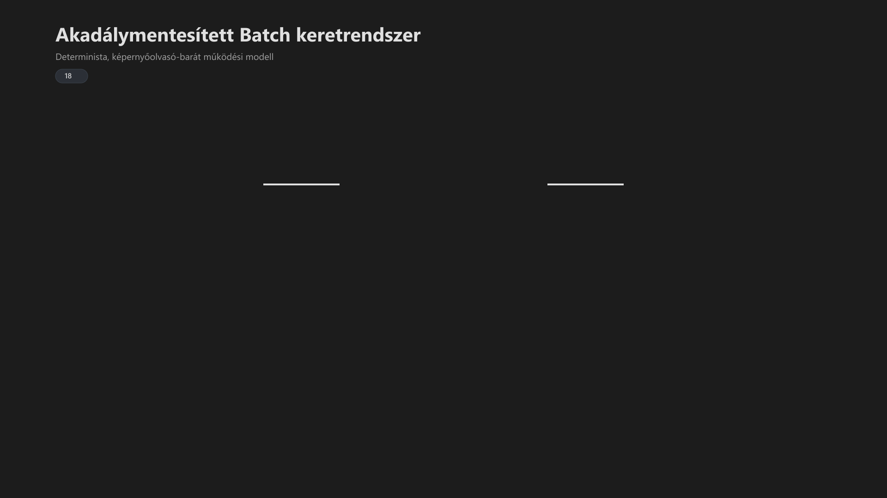

<div class="grid cards frostwood-header-cards" markdown>

-   <span class="fw-module-header-icon fw-module-18" aria-hidden="true"></span>

    # 18. Akadálymentesített Batch Keretrendszer { #18-akadalymentesitett-batch-keretrendszer }

    > Szerző: Hegedüs Gábor (@hege-g)<br>
    > Licenc: [MIT (Kód) / CC BY-NC-ND 4.0 (Docs)]<br>
    > Frostwood Docs: v1.0.0<br>
    > Rendszerverzió / Állapot: v1.0.5 / Stabil<br>
    > Blokk: <span class="fw-block-icon-main-rendszer" aria-hidden="true"></span> Rendszer<br>
    > Cél: a telepítő és eltávolító működésének technikai, akadálymentességi és tervezési modellje

</div>

<div class="grid cards frostwood-toc-cards" markdown>

-   ## Tartalomkártyák

    * [:material-infinity: 1. Áttekintés](#1-attekintes)
    * [:material-infinity: 2. Alap architektúra](#2-alap-architektura)
        * [:material-infinity: 2.1 Batch réteg (vezérlés)](#21-batch-reteg-vezerles)
        * [:material-infinity: 2.2 PowerShell réteg (végrehajtás)](#22-powershell-reteg-vegrehajtas)
    * [:material-infinity: 3. Determinisztikus működés](#3-determinisztikus-mukodes)
    * [:material-infinity: 4. Konzol viselkedés és megjelenítés](#4-konzol-viselkedes-es-megjelenites)
        * [:material-infinity: 4.1 Miért nincs progress bar?](#41-miert-nincs-progress-bar)
        * [:material-infinity: 4.2 Sor-alapú kommunikáció](#42-sor-alapu-kommunikacio)
        * [:material-infinity: 4.3 Tiltott konzolműveletek képernyőolvasó mellett](#43-tiltott-konzolmuveletek-kepernyoolvaso-mellett)
    * [:material-infinity: 5. Színhasználat és WCAG](#5-szinhasznalat-es-wcag)
        * [:material-infinity: 5.1 Nem kizárólagos információ](#51-nem-kizarolagos-informacio)
        * [:material-infinity: 5.2 Install / Uninstall színlogika](#52-install-uninstall-szinlogika)
        * [:material-infinity: 5.3 Kontraszt (WCAG 2.1)](#53-kontraszt-wcag-21)
    * [:material-infinity: 6. Akusztikus visszajelzés](#6-akusztikus-visszajelzes)
        * [:material-infinity: 6.1 Miért van hang?](#61-miert-van-hang)
        * [:material-infinity: 6.2 Frekvencia alapú jelentés](#62-frekvencia-alapu-jelentes)
        * [:material-infinity: 6.3 WCAG megfelelés](#63-wcag-megfeleles)
    * [:material-infinity: 7. Menü rendszer](#7-menu-rendszer)
        * [:material-infinity: 7.1 Tervezési elv](#71-tervezesi-elv)
        * [:material-infinity: 7.2 Miért szám + X?](#72-miert-szam-x)
    * [:material-infinity: 8. Parancsikon rendszer](#8-parancsikon-rendszer)
        * [:material-infinity: 8.1 Ikon + szöveg együtt](#81-ikon-szoveg-egyutt)
        * [:material-infinity: 8.2 Névlogika](#82-nevlogika)
    * [:material-infinity: 9. Registry modell](#9-registry-modell)
    * [:material-infinity: 10. Safe Mode filozófia](#10-safe-mode-filozofia)
    * [:material-infinity: 11. Uninstall architektúra](#11-uninstall-architektura)
        * [:material-infinity: 11.1 Engine alapú](#111-engine-alapu)
        * [:material-infinity: 11.2 Fallback](#112-fallback)
    * [:material-infinity: 12. Képernyőolvasó viselkedés (kritikus blokk)](#12-kepernyoolvaso-viselkedes-kritikus-blokk)
        * [:material-infinity: 12.1 Stabil olvasási modell](#121-stabil-olvasasi-modell)
        * [:material-infinity: 12.2 Multimodális működés](#122-multimodalis-mukodes)
    * [:material-infinity: 13. Hibaérzékelés és diagnosztika](#13-hibaerzekeles-es-diagnosztika)
        * [:material-infinity: 13.1 Log fájlok](#131-log-fajlok)
        * [:material-infinity: 13.2 Miért fontos?](#132-miert-fontos)
    * [:material-infinity: 14. Miért nincs automatizmus?](#14-miert-nincs-automatizmus)
    * [:material-infinity: 15. Összegzés](#15-osszegzes)
    * [:material-infinity: 16. Alapelv](#16-alapelv)

</div>

## 1. Áttekintés

Ez a dokumentum nem használati útmutató, hanem **rendszerszintű magyarázat**.

Leírja:

* hogyan működik a Frostwood Install / Uninstall
* miért ilyen a viselkedése
* milyen WCAG elvek mentén készült

Ez a dokumentum különösen fontos:

* képernyőolvasó felhasználóknak
* auditálóknak
* fejlesztőknek

---

## 2. Alap architektúra

A Frostwood keretrendszer **két rétegből áll**, amelyek szigorúan külön szerepet töltenek be.

<div class="grid cards frostwood-section-cards frostwood-numbered-card" markdown>

-   ### 2.1 Batch réteg (vezérlés)

    ??? success "Install és Uninstall Batch fájlok"
        ```text title="Text"
        INSTALL_FROSTWOOD.bat
        UNINSTALL_FROSTWOOD.bat
        ```


    Feladata:

    * felhasználói interakció kezelése
    * megerősítés bekérése
    * menü megjelenítése
    * végrehajtás indítása

    A Batch **nem végez komplex logikát**, mert:

    > A túl összetett Batch viselkedés nehezen követhető képernyőolvasóval.

-   ### 2.2 PowerShell réteg (végrehajtás)

    ??? success "PowerShell motor"
        ```text title="Text"
        InstallerEngine.ps1
        ```


    Feladata:

    * fájlműveletek
    * registry kezelés
    * shortcut létrehozás
    * uninstall logika
    * logolás

    Ez a szétválasztás biztosítja, hogy:

    > A felhasználói felület egyszerű marad, a logika pedig karbantartható.

</div>

---

## 3. Determinisztikus működés

A Frostwood egyik legfontosabb tervezési elve:

> Minden művelet előre kiszámítható és lineáris.

Ez azt jelenti:

* nincs rejtett állapot
* nincs háttérfolyamat
* nincs „okos” automatikus döntés

Minden lépés:

1. elindul
2. lefut
3. visszajelzést ad

Ez különösen fontos:

* képernyőolvasó használatnál
* audit környezetben
* hibakeresésnél

A lineáris működés része az is, hogy a korábban kiírt állapotinformációk nem tűnnek el önkényesen a képernyőről.

---

## 4. Konzol viselkedés és megjelenítés

<div class="grid cards frostwood-section-cards frostwood-numbered-card" markdown>

-   ### 4.1 Miért nincs progress bar?

    A Frostwood tudatosan nem használ progress bart.

    Ennek oka:

    * a klasszikus progress bar gyakran nem valós
    * sok esetben csak időalapú becslés
    * képernyőolvasóval nehezen követhető
    * sorfelülírást használ (instabil felolvasás)

    Ehelyett:

    > Minden lépés külön sorban jelenik meg

    Ez biztosítja:

    * stabil felolvasást
    * visszakereshetőséget
    * pontos állapotkövetést

-   ### 4.2 Sor-alapú kommunikáció

    A Frostwood minden állapotot **külön sorban ír ki**, például:

    * Telepítés indul
    * Fájlok másolása
    * Registry inicializálás
    * Kész

    Ez azért kritikus, mert:

    > A képernyőolvasók soronként dolgoznak, nem képernyőnként.

-   ### 4.3 Tiltott konzolműveletek képernyőolvasó mellett

    A Frostwood keretrendszer tudatosan kerüli azokat a konzolműveleteket, amelyek a képernyőolvasó követhetőségét rontják.

    Tiltott vagy erősen kerülendő:

    * sorfelülírás
    * visszalépéses progress-megjelenítés
    * gyorsan eltűnő állapotsorok
    * `CLS` képernyőtörlés

    A `CLS` különösen problémás lehet, mert:

    * a JAWS elveszítheti a korábbi kontextust
    * a felhasználó nem tud visszaolvasni
    * a lineáris, auditálható kimenet megszakad

    A Frostwood ezért:

    > Törlés helyett folyamatos, soronként bővülő konzolkimenetet használ.

</div>

---

## 5. Színhasználat és WCAG

<div class="grid cards frostwood-section-cards frostwood-numbered-card" markdown>

-   ### 5.1 Nem kizárólagos információ

    A Frostwood soha nem használ színt egyetlen információforrásként.

    Ez megfelel:

    * **WCAG 1.4.1 Use of Color:** A szín nem az egyetlen módja az üzenetközlésnek.
    * **WCAG 1.3.3 Sensory Characteristics:** Az utasítások nem csak vizuális jellemzőkre (pl. "a piros gomb") támaszkodnak.

-   ### 5.2 Install / Uninstall színlogika

    #### Install (Telepítés)

    * **Színkód:** `color 0B` (Világoskék).
    * **Jelentés:** Semleges, stabil munkakörnyezet.
    * **Vizuális cél:** A biztonságos építés és inicializálás jelzése.

    #### Uninstall (Eltávolítás)

    * **Színkód:** `color 0C` (Világosvörös).
    * **Jelentés:** Figyelmeztető, destruktív folyamat.
    * **Vizuális cél:** A törlési művelet és a rendszermódosítás azonnali jelzése.

    ???+ warning "Fontos"
        A Frostwood filozófiájának megfelelően:

        * a szín csak kiegészítés; a képernyőolvasó számára a szöveges állapotüzenet az elsődleges
        * a szöveg mindig elsődleges
        * a hangjelzések (mély/magas) tovább erősítik a színek által közvetített állapotot


-   ### 5.3 Kontraszt (WCAG 2.1)

    A választott színek célja:

    * legalább AA szint megközelítése
    * sok környezetben AAA közeli érzet

    ???+ note "Megjegyzés"
        > Mivel a konzol színei a terminál (például a Windows Console Host vagy Windows Terminal) renderelésétől függenek, a Frostwood a robusztus olvashatóságra és a tiszta betűtípus-megjelenítésre törekszik.


</div>

---

## 6. Akusztikus visszajelzés

<div class="grid cards frostwood-section-cards frostwood-numbered-card" markdown>

-   ### 6.1 Miért van hang?

    A hang nem UX extra, hanem:

    > másodlagos visszacsatolási csatorna

    Használat:

    * folyamat követése
    * lefagyás felismerése
    * vizuális csatorna kiváltása

-   ### 6.2 Frekvencia alapú jelentés

    #### Mély tartomány (300–400 Hz)

    * **Jelentés:** figyelmeztetés vagy indulás
    * **Funkció:** destruktív műveletek (pl. Uninstall) kezdőhangja, vagy olyan pontok, ahol a felhasználó megerősítése szükséges

    #### Közepes tartomány (~600 Hz)

    * **Jelentés:** folyamat / Lépés
    * **Funkció:** egy-egy részfeladat (pl. fájlmásolás, registry írás) sikeres lefutását jelző semleges visszacsatolás

    #### Magas tartomány (800–1000 Hz)

    * **Jelentés:** siker
    * **Funkció:** a teljes folyamat (Install vagy Uninstall) hiba nélküli lezárását jelző pozitív akusztikus jelzés

    Ez tudatos:

    > a hang nem dallam, hanem jelzés

-   ### 6.3 WCAG megfelelés

    A hang:

    * nem kötelező
    * nem kizárólagos
    * nem blokkoló

    Megfelel:

    * WCAG 1.4.2 Audio Control
    * WCAG 2.2.1 Timing Adjustable

</div>

---

## 7. Menü rendszer

<div class="grid cards frostwood-section-cards frostwood-numbered-card" markdown>

-   ### 7.1 Tervezési elv

    A menü:

    * lineáris
    * rövid
    * egyértelmű

    Nem:

    * hierarchikus
    * több szintű
    * vizuális grouping függő

-   ### 7.2 Miért szám + X?

    A választás oka:

    * gyors billentyűzet input
    * könnyű felolvasás
    * nincs ambiguitás

</div>

---

## 8. Parancsikon rendszer

<div class="grid cards frostwood-section-cards frostwood-numbered-card" markdown>

-   ### 8.1 Ikon + szöveg együtt

    A Frostwood nem támaszkodik csak ikonokra.

    Minden shortcut:

    * egyedi ikon
    * egyértelmű név

    Ez megfelel:

    * WCAG 1.1.1 Non-text Content

-   ### 8.2 Névlogika

    Példa:

    * Normál JAWS
    * Lassúbb JAWS

    Ez tudatos:

    * rövid
    * beszédes
    * könnyen felolvasható

</div>

---

## 9. Registry modell

A Frostwood minden beállítást a felhasználói szintű regisztrációs adatbázisban tárol, biztosítva a no-admin kompatibilitást és a könnyű hordozhatóságot.

??? success "Alapútvonal"
    ```reg title="Reg"
    HKCU\Software\FrostwoodTheme
    ```


### Kulcsok és Funkciók

A rendszer négy fő állapotjelző kulcsot használ a környezet vezérléséhez:

#### 1. WCAG

* **Funkció:** kontraszt mód vezérlése
* **Leírás:** meghatározza a vizuális elemek (háttér, szövegszín) akadálymentességi szintjét és a kontrasztarányokat

#### 2. SignalColors

* **Funkció:** jelzésrendszer (színkódolás)
* **Leírás:** a rendszerszintű visszajelzések és állapotjelző színek (pl. biztonságos/veszélyes) logikáját tárolja

#### 3. SoftLock

* **Funkció:** Watcher modul állapota
* **Leírás:** a virtuális asztalok és a zárolási folyamatok stabilitásáért felelős figyelő szolgáltatás konfigurációja

#### 4. Travel

* **Funkció:** állapotág (mobilitási profil)
* **Leírás:** a hordozható üzemmódhoz kapcsolódó specifikus beállítások és környezeti változók tárolója

???+ success "Átláthatóság"
    A Frostwood filozófiájának megfelelően:

    * **Nincs rejtett kulcs:** minden adat a fenti útvonalon belül található
    * **Nincs obfuszkáció:** a kulcsnevek és értékek emberi (és képernyőolvasó) számára is értelmezhetőek, így a diagnosztika bármikor elvégezhető


---

## 10. Safe Mode filozófia

A Safe Mode nem “hibás” telepítés, hanem:

> Tudatosan minimalizált környezet.

Cél:

* izolált teszt
* gyors hibakeresés
* fallback alap

---

## 11. Uninstall architektúra

Két réteg:

<div class="grid cards frostwood-section-cards frostwood-numbered-card" markdown>

-   ### 11.1 Engine alapú

    * teljes logika
    * kontrollált törlés

-   ### 11.2 Fallback

    * redundáns eltávolítás
    * sérült állapot kezelése

    Ez biztosítja:

    > Mindig eltávolítható legyen.

</div>

---

## 12. Képernyőolvasó viselkedés (kritikus blokk)

A Frostwood tudatosan kerüli:

* sorfelülírást
* animált UI-t
* dinamikus frissítést

Ez azért fontos, mert:

> A képernyőolvasók nem a képet, hanem a szövegfolyamot értelmezik.



??? info "Vizuális leírás akadálymentesítéshez"
    A kép három fő blokkot és egy külön tiltási blokkot mutat.

    A bal oldalon a „Batch vezérlés” blokk látható. Ez a felhasználói interakciós réteget jelöli, ahol a megerősítés, a menü és a végrehajtás indítása történik. A blokk azt hangsúlyozza, hogy ez a réteg egyszerű marad.

    Középen a „PowerShell végrehajtás” blokk helyezkedik el. Ez tartalmazza a komplexebb műveleteket, például a fájlműveleteket, registry-kezelést, parancsikonok létrehozását és az uninstall logikát.

    A jobb oldalon a „Stabil kimenet” blokk jelenik meg. Itt három visszajelzési csatorna szerepel: szöveg, hang és szín. A szöveg az elsődleges csatorna, a hang kiegészítő, a szín pedig segédjelzés.

    Egy külön blokk mutatja a kerülendő konzolműveleteket, például a sorfelülírást, a progress bart, a `CLS` képernyőtörlést és az animált UI-szerű viselkedést.

    A kép célja annak bemutatása, hogy a Frostwood batch keretrendszer az egyszerű felhasználói vezérlést elválasztja a végrehajtási logikától, miközben stabil, képernyőolvasó-barát kimenetet biztosít.


<div class="grid cards frostwood-section-cards frostwood-numbered-card" markdown>

-   ### 12.1 Stabil olvasási modell

    A rendszer:

    * soronként ír
    * nem módosít vissza
    * nem töröl kiírt tartalmat

    Ez biztosítja:

    * JAWS kompatibilitás
    * NVDA kompatibilitás
    * Narrátor kompatibilitás
    * kiszámítható navigáció

-   ### 12.2 Multimodális működés

    A Frostwood három csatornát használ:

    1. :material-text-box-outline: szöveg (elsődleges)
    2. :material-volume-high: hang (kiegészítő)
    3. :material-palette-swatch-outline: szín (vizuális támasz)

    Ez együtt:

    > Redundáns, de nem zavaró információ.

</div>

---

## 13. Hibaérzékelés és diagnosztika

<div class="grid cards frostwood-section-cards frostwood-numbered-card" markdown>

-   ### 13.1 Log fájlok

    * `INSTALL.log`
    * `UNINSTALL.log`
    * `TEST_LOG.txt`

-   ### 13.2 Miért fontos?

    A log:

    * visszanézhető
    * auditálható
    * megosztható

</div>

---

## 14. Miért nincs automatizmus?

A Frostwood szándékosan nem:

* auto-repair rendszer
* háttérfigyelő minden modulhoz
* önjavító mechanizmus

Indok:

> A rejtett automatizmus csökkenti az átláthatóságot.

---

## 15. Összegzés

A Frostwood Batch keretrendszer:

* determinisztikus
* auditálható
* képernyőolvasó-barát
* moduláris
* no-admin

---

## 16. Alapelv

> A rendszer nem próbál okos lenni.<br>
> A rendszer próbál egyértelmű lenni.

> Nem varázsol,<br>
> nem rejt el semmit.

> Amit csinál, azt kimondja,<br>
> amit kimond, azt tényleg megcsinál.