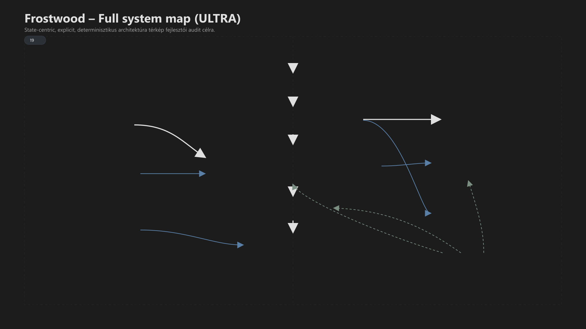

<div class="grid cards frostwood-header-cards" markdown>

-   <span class="fw-module-header-icon fw-module-19" aria-hidden="true"></span>

    # 19. Rendszer blokk – Architektúra térkép (DEV AUDIT) { #19-rendszer-blokk-architektura-terkep-dev-audit }

    > Szerző: Hegedüs Gábor (@hege-g)<br>
    > Licenc: [MIT (Kód) / CC BY-NC-ND 4.0 (Docs)]<br>
    > Frostwood Docs: v1.0.0<br>
    > Rendszerverzió / Állapot: v1.0.5 / Fejlesztői<br>
    > Blokk: <span class="fw-block-icon-main-rendszer" aria-hidden="true"></span> Rendszer<br>
    > Belső fejlesztői dokumentum<br>
    > Nem publikációs célra

</div>

<div class="grid cards frostwood-toc-cards" markdown>

-   ## Tartalomkártyák

    * [:material-infinity: 1. Cél](#1-cel)
    * [:material-infinity: 2. Rendszer szintű felépítés](#2-rendszer-szintu-felepites)
    * [:material-infinity: 3. Fő komponensek](#3-fo-komponensek)
        * [:material-infinity: 3.1 Belépési pontok](#31-belepesi-pontok)
        * [:material-infinity: 3.2 Core motor](#32-core-motor)
        * [:material-infinity: 3.3 Állapot tárolás](#33-allapot-tarolas)
        * [:material-infinity: 3.4 Fájlstruktúra (telepítés után)](#34-fajlstruktura-telepites-utan)
        * [:material-infinity: 3.5 Fallback és biztonságos alapállapot](#35-fallback-es-biztonsagos-alapallapot)
    * [:material-infinity: 4. Modul térkép (01–19 logikai bontás)](#4-modul-terkep-0119-logikai-bontas)
        * [:material-infinity: 4.1 Core modulok](#41-core-modulok)
        * [:material-infinity: 4.2 Vizuális modulok](#42-vizualis-modulok)
        * [:material-infinity: 4.3 Viselkedési modulok](#43-viselkedesi-modulok)
        * [:material-infinity: 4.4 Integrációs modulok](#44-integracios-modulok)
    * [:material-infinity: 5. Adatáramlás (kritikus blokk)](#5-adataramlas-kritikus-blokk)
        * [:material-infinity: 5.1 Telepítés](#51-telepites)
        * [:material-infinity: 5.2 Mód váltás (pl. WCAG)](#52-mod-valtas-pl-wcag)
        * [:material-infinity: 5.3 SoftLock](#53-softlock)
        * [:material-infinity: 5.4 Uninstall](#54-uninstall)
    * [:material-infinity: 6. Függőségi térkép](#6-fuggosegi-terkep)
        * [:material-infinity: 6.1 Kritikus függések](#61-kritikus-fuggesek)
        * [:material-infinity: 6.2 Lazán csatolt modulok](#62-lazan-csatolt-modulok)
    * [:material-infinity: 7. Állapotmodell (fontos különbség)](#7-allapotmodell-fontos-kulonbseg)
        * [:material-infinity: 7.1 Példa](#71-pelda)
        * [:material-infinity: 7.2 Következmény](#72-kovetkezmeny)
    * [:material-infinity: 8. Konfliktus kezelés](#8-konfliktus-kezeles)
        * [:material-infinity: 8.1 Példa](#81-pelda)
        * [:material-infinity: 8.2 Jelzés konfliktus](#82-jelzes-konfliktus)
    * [:material-infinity: 9. Ikon rendszer kapcsolata](#9-ikon-rendszer-kapcsolata)
    * [:material-infinity: 10. Batch ↔ PowerShell kapcsolat](#10-batch-powershell-kapcsolat)
        * [:material-infinity: 10.1 Batch](#101-batch)
        * [:material-infinity: 10.2 PowerShell](#102-powershell)
        * [:material-infinity: 10.3 Elválasztás oka](#103-elvalasztas-oka)
    * [:material-infinity: 11. WCAG architektúra szint](#11-wcag-architektura-szint)
        * [:material-infinity: 11.1 Mit jelent ez](#111-mit-jelent-ez)
        * [:material-infinity: 11.2 Következmény](#112-kovetkezmeny)
    * [:material-infinity: 12. Kockázati pontok (DEV)](#12-kockazati-pontok-dev)
        * [:material-infinity: 12.1 Registry hiány](#121-registry-hiany)
        * [:material-infinity: 12.2 Engine hiány](#122-engine-hiany)
        * [:material-infinity: 12.3 Ikon cache](#123-ikon-cache)
        * [:material-infinity: 12.4 SoftLock watcher](#124-softlock-watcher)
    * [:material-infinity: 13. Bővíthetőség](#13-bovithetoseg)
    * [:material-infinity: 14. Hiányzó blokkok (következő lépések)](#14-hianyzo-blokkok-kovetkezo-lepesek)
    * [:material-infinity: 15. Összegzés](#15-osszegzes)
    * [:material-infinity: 16. Alapelv (DEV)](#16-alapelv-dev)

</div>

## 1. Cél

Ez a dokumentum a Frostwood rendszer **belső működési térképét** írja le.

Nem:

* nem felhasználói útmutató
* nem telepítési leírás

Hanem:

> Fejlesztői szintű összefüggés-rendszer.

Cél:

* modulkapcsolatok tisztázása
* adatáramlás megértése
* rejtett függések feltárása
* jövőbeli bővítés megalapozása

---

## 2. Rendszer szintű felépítés



??? info "Vizuális leírás akadálymentesítéshez"
    A kép egy teljes Frostwood architektúra térképet mutat, központi állapothub köré szervezve.

    Felül a felhasználó látható, alatta a Batch vezérlési réteg, majd a PowerShell Engine. Ezek lefelé vezetnek a központi „STATE HUB” blokkhoz, amely a registry alapú állapotkezelést jelenti. Ebben a WCAG, SignalColors, SoftLock és Travel állapotok szerepelnek.

    A központi állapothub alatt a ThemeSwitcher és a Windows UI jelenik meg, jelezve, hogy a vizuális változások az állapotból következnek.

    Bal oldalon a Shortcuts triggerként kapcsolódik a registry állapothoz. Alatta az Icons és a vizuális modulok jelennek meg, amelyek a megjelenítést támogatják, de nem hordoznak önálló logikát.

    Jobb oldalon a Filesystem, a SoftLock watcher és az integrációk láthatók. A SoftLock külön viselkedési ágként jelenik meg. Az integrációk között a JAWS, a Total Commander és az opcionális Windhawk szerepel.

    Legalul egy külön fallback blokk látható, amely azt mutatja, hogy hiányzó komponensek esetén a rendszer stabil, olvasható alapállapotra esik vissza.

    Az alsó összegző blokk az explicit adatáramlást írja le: a felhasználótól a Batch és az Engine rétegen át a registry állapoton keresztül a ThemeSwitcherig és a felhasználói felületig.


??? success "A Frostwood három fő rétegből áll"
    ```text title="Text"
    [ FELHASZNÁLÓ ]
    ↓
    [ Batch (vezérlés) ]
    ↓
    [ PowerShell Engine (logika) ]
    ↓
    [ Rendszer (Windows + fájlok + registry) ]
    ```


---

## 3. Fő komponensek

<div class="grid cards frostwood-section-cards frostwood-numbered-card" markdown>

-   ### 3.1 Belépési pontok

    * `INSTALL_FROSTWOOD.bat`
    * `UNINSTALL_FROSTWOOD.bat`

    Feladat:

    * interakció
    * megerősítés
    * vezérlés

-   ### 3.2 Core motor

    * `Core\InstallerEngine.ps1`
    * `Core\ThemeSwitcher.ps1`

    Feladat:

    * állapotkezelés
    * registry műveletek
    * telepítés / uninstall

-   ### 3.3 Állapot tárolás

    * `HKCU\Software\FrostwoodTheme`

    Kulcsok:

    * WCAG (DWORD: 0/1)
    * SignalColors (DWORD: 0/1)
    * SoftLock (DWORD: 0/1)
    * Travel (DWORD: 0/1)

-    ### 3.4 Fájlstruktúra (telepítés után)

    * `%LocalAppData%\Frostwood\`

    Fő mappák:

    * Core\
    * Docs\
    * ExplorerStyler\
    * LockScreen\
    * Modes\
    * Templates\
    * Tools\
    * Visuals\

-   ### 3.5 Fallback és biztonságos alapállapot

    Ha valamely külső vagy opcionális komponens hiányzik, a Frostwoodnak olvasható és stabil alapállapotban kell maradnia.

    Tipikus esetek:

    * hiányzó registry kulcs
    * hiányzó AutoDarkMode komponens
    * hiányzó opcionális vizuális elem
    * részleges telepítés

    Ilyenkor a rendszer nem agresszív hibamódra vált, hanem:

    * semleges, olvasható fallback állapotot tart
    * nem aktivál dekoratív vagy bizonytalan jelzéseket
    * a minimum stabil működésre törekszik

    Ez nem külön „Safe Mode”, hanem:

    > Biztonságos visszaesési alapállapot.

</div>

---

## 4. Modul térkép (01–19 logikai bontás) { #4-modul-terkep-0119-logikai-bontas }

A rendszer moduljai nem izoláltak — egymásra épülnek.

<div class="grid cards frostwood-section-cards frostwood-numbered-card" markdown>

-   ### 4.1 Core modulok

    A rendszer alapvető működéséért felelős réteg.

    * **Installer:** A rendszerbe való belépési pont.
    * **Engine:** A tényleges műveleti végrehajtásért felelős motor.
    * **Registry:** Az aktuális állapotok és beállítások tárolója.
    * **ThemeSwitcher:** Az alkalmazásspecifikus témaváltások vezérlője.

-   ### 4.2 Vizuális modulok

    A megjelenésért és az esztétikai visszacsatolásért felelős elemek.

    * **Wallpapers:** Háttérképek kezelése és váltása.
    * **Icons:** Vizuális jelölések és egyedi ikonrendszer.
    * **LockScreen:** Statikus horgonyként funkcionáló zárolási képernyő.

-   ### 4.3 Viselkedési modulok

    A dinamikus működést és a stabilitást biztosító összetevők.

    * **SoftLock:** A desktop környezet stabilizációja és védelme.
    * **Travel:** A mobilitási állapotágak kezelése.
    * **SignalColors:** A vizuális visszacsatolás (feedback) rendszere.

-   ### 4.4 Integrációs modulok

    Külső szoftverek és munkafolyamatok illesztése.

    * **JAWS:** Képernyőolvasó specifikus optimalizációk.
    * **Total Commander:** Fájlkezelési munkafolyamatok integrációja.
    * **Windhawk:** Opcionális rendszerszintű kiegészítések és tweak-ek.

</div>

---

## 5. Adatáramlás (kritikus blokk)

A Frostwood nem esemény-alapú rendszer, hanem:

> Explicit állapot → explicit végrehajtás.

<div class="grid cards frostwood-section-cards frostwood-numbered-card" markdown>

-   ### 5.1 Telepítés

    ```text title="Text"
    User → INSTALL.bat
    → Engine.ps1
    → fájlmásolás
    → registry inicializálás
    → ThemeSwitcher
    → rendszer állapot létrejön
    ```

-   ### 5.2 Mód váltás (pl. WCAG)

    ```text title="Text"
    Shortcut / script
    → registry kulcs módosítás
    → ThemeSwitcher fut
    → UI frissül
    ```

-   ### 5.3 SoftLock

    ```text title="Text"
    Watcher
    → desktop állapot figyelés
    → eltérés esetén
    → visszaállítás
    ```

-   ### 5.4 Uninstall

    ```text title="Text"
    UNINSTALL.bat
    → Engine (ha van)
    → fallback (ha nincs)
    → fájl törlés
    → registry törlés
    ```

</div>

---

## 6. Függőségi térkép

A rendszer stabilitását a modulok közötti pontos kapcsolatok adják. Az alábbi struktúra mutatja, mely összetevők igényelnek más modulokat a működésükhöz.

<div class="grid cards frostwood-section-cards frostwood-numbered-card" markdown>

-   ### 6.1 Kritikus függések

    Ezek a kapcsolatok elengedhetetlenek a rendszer integritásához.

    * **Installer** $\rightarrow$ Engine (a telepítő a motort hívja meg)
    * **Engine** $\rightarrow$ Registry (a motor a regisztrációs adatbázisba ír)
    * **ThemeSwitcher** $\rightarrow$ Registry (az állapotot a regisztrációs adatbázisból olvassa)
    * **Shortcuts** $\rightarrow$ Icons (a parancsikonoknak szükségük van a vizuális csomagra)
    * **SoftLock** $\rightarrow$ Modes (a stabilizáció a definiált üzemmódokra épül)
    * **Visuals** $\rightarrow$ Fájlok (a vizuális réteg a fizikai erőforrásoktól függ)

-   ### 6.2 Lazán csatolt modulok

    Ezek a modulok javítják az élményt, de hiányuk nem gátolja az alapműködést.

    * **Windhawk** — *Opcionális:* Rendszerszintű tweak-ek, egyedileg konfigurálható.
    * **Total Commander** — *Opcionális:* Fájlkezelési munkafolyamat-gyorsító.
    * **JAWS** — *Külső:* Külső szoftveres integráció az akadálymentesítéshez.

</div>

---

## 7. Állapotmodell (fontos különbség)

A Frostwood nem profil rendszer.

Hanem:

> Állapot-alapú rendszer.

<div class="grid cards frostwood-section-cards frostwood-numbered-card" markdown>

-   ### 7.1 Példa

    ```text title="Text"
    WCAG = 1
    Travel = 0
    SoftLock = 1
    ```

    Ez nem egy „profil”, hanem:

    > Több független flag kombinációja.

-   ### 7.2 Következmény

    * nincs globális „mode”
    * nincs profilváltás
    * nincs konfliktus felülírás

</div>

---

## 8. Konfliktus kezelés

A rendszer nem tilt:

> Hanem helyreállít.

<div class="grid cards frostwood-section-cards frostwood-numbered-card" markdown>

-   ### 8.1 Példa

    SoftLock:

    * nem tilt desktop váltást
    * hanem visszaállít

-   ### 8.2 Jelzés konfliktus

    Ha több jelzés keletkezik:

    * nincs priorizálás
    * nincs összevonás

    Hanem:

    > Sorosan jelennek meg.

</div>

---

## 9. Ikon rendszer kapcsolata

```text title="Text"
Icons → Shortcuts → Felhasználó
```

???+ warning "Fontos"
    A Frostwood filozófiájának megfelelően:

    * ikon nem logika
    * csak vizuális jelölés


---

## 10. Batch ↔ PowerShell kapcsolat

<div class="grid cards frostwood-section-cards frostwood-numbered-card" markdown>

-   ### 10.1 Batch

    * input
    * menü
    * flow

-   ### 10.2 PowerShell

    * végrehajtás
    * állapotkezelés

-   ### 10.3 Elválasztás oka

    > Batch = UI<br>
    > PowerShell = motor

    Ez:

    * tisztább
    * tesztelhetőbb
    * bővíthetőbb

</div>

---

## 11. WCAG architektúra szint

A Frostwood nem UI szinten, hanem:

> Architektúra szinten akadálymentes.

<div class="grid cards frostwood-section-cards frostwood-numbered-card" markdown>

-   ### 11.1 Mit jelent ez

    * nincs rejtett állapot
    * nincs időzített lépés
    * nincs animáció
    * nincs sorfelülírás

-   ### 11.2 Következmény

    * screen reader stabil
    * auditálható működés
    * determinisztikus viselkedés

</div>

---

## 12. Kockázati pontok (DEV)

<div class="grid cards frostwood-section-cards frostwood-numbered-card" markdown>

-   ### 12.1 Registry hiány

    → ThemeSwitcher nem működik

-   ### 12.2 Engine hiány

    → fallback indul

-   ### 12.3 Ikon cache

    → vizuális eltérés

-  ### 12.4 SoftLock watcher

    → desktop nem stabil

</div>

---

## 13. Bővíthetőség

Új modul csak akkor adható hozzá, ha:

* nem tör meg determinisztikát
* nem vezet be rejtett állapotot
* nem igényel admin jogot
* nem okoz végtelen ciklust a SoftLock watcherrel

---

## 14. Hiányzó blokkok (következő lépések)

Ez a dokumentum szándékosan nem tartalmaz:

* Alkalmazások blokk
* Referenciák blokk

Ezek később kapcsolódnak ide.

---

## 15. Összegzés

A Frostwood:

* nem profil rendszer
* nem UI rendszer
* nem automatizmus rendszer

Hanem:

???+ abstract "Összefoglaló"
    > egy explicit, állapot-alapú, determinisztikus működésű réteg a Windows fölött


---

## 16. Alapelv (DEV)

> Amit a rendszer csinál, az látható.<br>
> Amit látsz, az történik.

> Nincs varázslat,<br>
> csak állapot és végrehajtás.