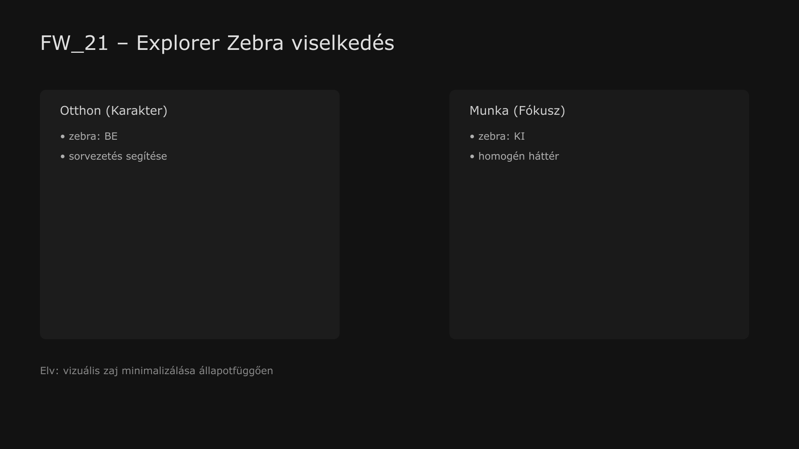

-   

    # 21. Windows 11 Fájlkezelő (Opcionális Windhawk Zebra támogatással) { #21-windows-11-fajlkezelo-opcionalis-windhawk-zebra-tamogatassal }

    > Szerző: Hegedüs Gábor (@hege-g) 
    > Licenc: [MIT (Kód) / CC BY-NC-ND 4.0 (Docs)] 
    > Frostwood Docs: v1.0.0 
    > Rendszerverzió / Állapot: v1.0.5 / Stabil 
    > Blokk:  Alkalmazások

-   ## Tartalomkártyák

    * [:material-infinity: 1. Cél](#1-cel)
    * [:material-infinity: 2. Alapelv](#2-alapelv)
    * [:material-infinity: 3. Explorer Zebra (Windhawk – opcionális)](#3-explorer-zebra-windhawk-opcionalis)
        * [:material-infinity: 3.1 Mi ez?](#31-mi-ez)
        * [:material-infinity: 3.2 Használt eszköz](#32-hasznalt-eszkoz)
        * [:material-infinity: 3.3 Világos mód (Frostwood profil)](#33-vilagos-mod-frostwood-profil)
        * [:material-infinity: 3.4 Sötét mód (Frostwood profil)](#34-sotet-mod-frostwood-profil)
        * [:material-infinity: 3.5 Zebra és állapotfüggő viselkedés (Auditált logika)](#35-zebra-es-allapotfuggo-viselkedes-auditalt-logika)
    * [:material-infinity: 4. Installer és környezeti változók](#4-installer-es-kornyezeti-valtozok)
    * [:material-infinity: 5. WCAG és Akadálymentesség](#5-wcag-es-akadalymentesseg)
    * [:material-infinity: 6. Munkaasztal kapcsolat (Work mód ajánlás)](#6-munkaasztal-kapcsolat-work-mod-ajanlas)
    * [:material-infinity: 7. Összefoglalás](#7-osszefoglalas)

## 1. Cél

A Windows File Explorer :material-folder-network: a Frostwood rendszerben:

* rendszerszintű fájlkezelő alapréteg.
* párhuzamosan működik a Total Commanderrel.
* halk, konzisztens vizuális környezetet biztosít.
* opcionálisan finom „zebra” struktúrával bővíthető a sorvezetés segítésére.

A Frostwood nem kiváltja az Explorert, hanem **finomítja és stabilizálja a használatát**.

---

## 2. Alapelv

A Windows 11 Explorer natív működése:

* nem tartalmaz valódi zebra csíkozást.
* Fluent / WinUI alapú megjelenítést használ.
* rendszer-accent színek vezérlik a hangsúlyokat.

A Frostwood megközelítése:

* nem használ agresszív skin vagy theme engine-t.
* nem injektál alternatív renderelési réteget.
* nem bontja meg a rendszer UI stabilitását.

Az opcionális zebra:

???+ warning "Figyelem"
    > Kiegészítő vizuális réteg, nem alapfunkció.

??? info "Vizuális leírás akadálymentesítéshez"
    Az ábra a Windows 11 Fájlkezelő részletes lista nézetét szemlélteti.

    A fájlok sorokba rendezve jelennek meg. Minden második sor enyhén eltérő háttérszínt kap, míg a köztes sorok az alap háttérszínt használják.

    Ez a váltakozó mintázat segíti a szem számára a sorok követését, különösen hosszabb listák esetén. A vizuális különbség visszafogott, nem használ erős kontrasztot vagy élénk színeket.

    Munka (WCAG) módban ez a mintázat nem jelenik meg, a háttér egységes, ezzel csökkentve a vizuális zajt és támogatva a tartós fókuszt.

---

## 3. Explorer Zebra (Windhawk – opcionális)

-   ### 3.1 Mi ez?

    ???+ tip "Tipp"
        A Frostwood Explorer Zebra egy vizuális konfiguráció, amely Windhawk alapú Explorer Styler profilt használ. Teljesen opcionális komponens, nem része a core működésnek, bármikor eltávolítható.

-   ### 3.2 Használt eszköz

    * **Windhawk** (nyílt forráskódú rendszerfinomító)
    * **Mod:** *Windows 11 File Explorer Styler*

    :material-download: Letöltés: [windhawk.net](https://windhawk.net/)

-   ### 3.3 Világos mód (Frostwood profil)

    Tiszta olvashatóságot és a finom kontrasztokat előtérbe helyező profil.  
    A felület a `#FBFBFB` alapszínre épít, biztosítva a szemkímélő munkát.

    * **Alapsor:** `#FBFBFB` a fő tartalmi terület háttérszíne.
    * **Alternáló sor:** `#F5F5F5` Sávos kiemelés,segít a sorok követésében listanézetben.
    * **Hover:** Hideg neutrális árnyalat, amely jelzi az interakciót, de nem domináns.
    * **Aktív kijelölés:** Követi a Windows alapértelmezett beállításait a rendszerkonzisztencia érdekében.

-   ### 3.4 Sötét mód (Frostwood profil)

    Alacsony fényterhelésre optimalizált, mély tónusú profil.  
    A profil a `#1C1C1C` bázisra épül, elkerülve a vakító fekete-fehér kontrasztot.

    * **Alapsor:** `#1C1C1C` Mélyszürke alap a vakítás csökkentésére.
    * **Alternáló sor:** `#252525` Finoman elkülönülő sötétebb sávok.
    * **Hover:** Enyhén világosabb neutrális szürke, jól látható, de tompa visszajelzés.
    * **Aktív kijelölés:** Windows alapértelmezett, kivéve fókusz esetén, ahol a rendszer narancs jelzést használ a figyelemfelhívásért.

-   ### 3.5 Zebra és állapotfüggő viselkedés (Auditált logika)

    A zebra (váltakozó sorháttér) használatát a Frostwood a mentális terhelés függvényében szabályozza:

    * **Karakter mód / Otthon:** Engedélyezett és ajánlott (segíti a sorvezetést böngészés közben).
    * **WCAG / Munka mód:** **Kikapcsolása javasolt** (egységes háttér, `BackColor` = `BackColor2`). 

    **Indok:** Hosszú idejű, mély fókuszmunka során a váltakozó mintázat felesleges vizuális ritmust (zajt) kényszerít az agyra. A cél a "csendes", homogén munkatér.

---

## 4. Installer és környezeti változók

Az Installer nem teszi kötelezővé a Windhawk jelenlétét. Az útvonalak kezelésekor a rendszer a `%AppData%` és `%LocalAppData%` változókat preferálja a fix elérési utakkal szemben.

??? note "Megjegyzés"
    Amennyiben a Windhawk nem elérhető, a rendszer az alapértelmezett Explorer megjelenítésre esik vissza, de a Registry alapú színbeállítások (accent colors) továbbra is érvényesülnek.

---

## 5. WCAG és Akadálymentesség

* **Kontraszt:** A zebra nem csökkenti a szöveg olvashatóságát (min. 4.5:1 arány fenntartva).
* **Narancs szabály:** Narancs kizárólag aktív fókusz/kijelölés esetén jelenhet meg.
* **Képernyőolvasó:** A Windhawk módosítások nem érintik az objektummodellt, így a JAWS és NVDA stabilan olvassa a listát.

---

## 6. Munkaasztal kapcsolat (Work mód ajánlás)

Ajánlott beállítások a maximális fókuszhoz:

* **Nézet:** Details (Részletek) nézet.
* **Zebra:** KI (Munka módban a homogenitás az elsődleges).
* **Navigációs panel:** Minimalizált, statikus elemekkel.
* **Konzisztencia:** A beállításoknak tükrözniük kell a Total Commander (22. modul) "halk" profilját.

---

## 7. Összefoglalás

> Az Explorer a Frostwoodban egy stabil fallback réteg, amelynek vizuális zajszintje a fókuszállapottól függően skálázható. 
> Karakter módban segíti a tájékozódást, Munka módban pedig visszahúzódik a háttérbe.