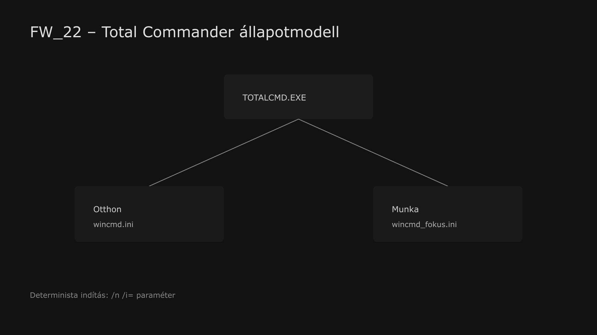

<div class="grid cards frostwood-header-cards" markdown>

-   <span class="fw-module-header-icon fw-module-22" aria-hidden="true"></span>

    # 22. Total Commander (TC Sync modul) { #22-total-commander-tc-sync-modul }

    > Szerző: Hegedüs Gábor (@hege-g)<br>
    > Licenc: [MIT (Kód) / CC BY-NC-ND 4.0 (Docs)]<br>
    > Frostwood Docs: v1.0.0<br>
    > Rendszerverzió / Állapot: v1.0.5 / Stabil<br>
    > Blokk: <span class="fw-block-icon-main-alkalmazasok" aria-hidden="true"></span> Alkalmazások

</div>

<div class="grid cards frostwood-toc-cards" markdown>

-   ## Tartalomkártyák

    * [:material-infinity: 1. Cél](#1-cel)
    * [:material-infinity: 2. Profil architektúra (Otthon / Munka)](#2-profil-architektura-otthon-munka)
        * [:material-infinity: 2.1 A színállapot a TC-ben](#21-a-szinallapot-a-tc-ben)
        * [:material-infinity: 2.2 Narancs fókusz használata](#22-narancs-fokusz-hasznalata)
    * [:material-infinity: 3. Indítás parancsikonnal (garantált profil)](#3-inditas-parancsikonnal-garantalt-profil)
        * [:material-infinity: 3.1 Miért szükséges?](#31-miert-szukseges)
        * [:material-infinity: 3.2 A két kulcs paraméter: `/n` és `/i=`](#32-a-ket-kulcs-parameter-n-es-i)
        * [:material-infinity: 3.3 Parancsikon — konkrét beállítás](#33-parancsikon-konkret-beallitas)
        * [:material-infinity: 3.4 Létrehozás lépései](#34-letrehozas-lepesei)
        * [:material-infinity: 3.5 Ikon (opcionális)](#35-ikon-opcionalis)
    * [:material-infinity: 4. TC Sync modul (opcionális)](#4-tc-sync-modul-opcionalis)
        * [:material-infinity: 4.1 Mit csinál?](#41-mit-csinal)
        * [:material-infinity: 4.2 Registry konfiguráció (HKCU)](#42-registry-konfiguracio-hkcu)
        * [:material-infinity: 4.3 TC elérési út kezelése](#43-tc-eleresi-ut-kezelese)
    * [:material-infinity: 5. „Közép + Határozott” logika](#5-kozep-hatarozott-logika)
        * [:material-infinity: 5.1 Közép (soft control)](#51-kozep-soft-control)
        * [:material-infinity: 5.2 Határozott (fallback control)](#52-hatarozott-fallback-control)
    * [:material-infinity: 6. „Apply now” vs „Soft restart”](#6-apply-now-vs-soft-restart)
        * [:material-infinity: 6.1 Miért nem TC belső parancs?](#61-miert-nem-tc-belso-parancs)
        * [:material-infinity: 6.2 Soft restart (determinisztikus folyamat)](#62-soft-restart-determinisztikus-folyamat)
        * [:material-infinity: 6.3 Miért elfogadható?](#63-miert-elfogadhato)
    * [:material-infinity: 7. Viselkedési mátrix (Otthon vs Munka)](#7-viselkedesi-matrix-otthon-vs-munka)
    * [:material-infinity: 8. WCAG megfelelés](#8-wcag-megfeleles)
    * [:material-infinity: 9. Függelékek](#9-fuggelekek)
    * [:material-infinity: 10. Mi NEM része ennek a modulnak](#10-mi-nem-resze-ennek-a-modulnak)
    * [:material-infinity: 11. Gyors ellenőrző lista](#11-gyors-ellenorzo-lista)

    * [:material-infinity: A) Függelék: Total Commander `wincmd.ini` konfigurációs dokumentáció](#a-fuggelek-total-commander-wincmdini-konfiguracios-dokumentacio)
        * [:material-infinity: A/1. Másolható beállítások (`wincmd.ini`)](#a1-masolhato-beallitasok-wincmdini)
        * [:material-infinity: A/2. Részletes magyarázat a beállításokhoz](#a2-reszletes-magyarazat-a-beallitasokhoz)
            * [:material-infinity: A/2.1 Sötét mód és modern felület](#a21-sotet-mod-es-modern-felulet)
            * [:material-infinity: A/2.2 Ikonok és listázás](#a22-ikonok-es-listazas)
            * [:material-infinity: A/2.3 Tipográfia és olvashatóság](#a23-tipografia-es-olvashatosag)
            * [:material-infinity: A/2.4 Információs sávok és segédfunkciók](#a24-informacios-savok-es-segedfunkciok)
        * [:material-infinity: A/3. Színprofil: standard mód `[Colors]` és `[ColorsDark]`](#a3-szinprofil-standard-mod-colors-es-colorsdark)
        * [:material-infinity: A/4. Frostwood értelmezés](#a4-frostwood-ertelmezes)
    * [:material-infinity: B) Függelék: Total Commander `wincmd_fokus.ini` konfigurációs dokumentáció](#b-fuggelek-total-commander-wincmd-fokusini-konfiguracios-dokumentacio)
        * [:material-infinity: B/1. Másolható beállítások (`wincmd_fokus.ini`)](#b1-masolhato-beallitasok-wincmd_fokusini)
        * [:material-infinity: B/2. Részletes magyarázat a beállításokhoz](#b2-reszletes-magyarazat-a-beallitasokhoz)
            * [:material-infinity: B/2.1 Sötét mód és modern felület](#b21-sotet-mod-es-modern-felulet)
            * [:material-infinity: B/2.2 Ikonok és listázás](#b22-ikonok-es-listazas)
            * [:material-infinity: B/2.3 Tipográfia és olvashatóság](#b23-tipografia-es-olvashatosag)
            * [:material-infinity: B/2.4 Információs sávok és segédfunkciók](#b24-informacios-savok-es-segedfunkciok)
        * [:material-infinity: B/3. Színprofil: fókuszált mód `[Colors]` és `[ColorsDark]`](#b3-szinprofil-fokuszalt-mod-colors-es-colorsdark)
        * [:material-infinity: B/4. Frostwood értelmezés](#b4-frostwood-ertelmezes)
    * [:material-infinity: C) Függelék: Vizuális értelmező és Útmutató a beállítások alkalmazásához](#c-fuggelek-vizualis-ertelmezo-es-utmutato-a-beallitasok-alkalmazasahoz)
        * [:material-infinity: C/1. Vizualizáció: Sávos vs. Fókuszált mód](#c1-vizualizacio-savos-vs-fokuszalt-mod)
        * [:material-infinity: C/2. A konfiguráció alkalmazása](#c2-a-konfiguracio-alkalmazasa)
        * [:material-infinity: C/3. Összehasonlító táblázat a két profilhoz](#c3-osszehasonlito-tablazat-a-ket-profilhoz)
        * [:material-infinity: C/4. Technikai és Akadálymentességi Megjegyzések](#c4-technikai-es-akadalymentessegi-megjegyzesek)

</div>

## 1. Cél

A Total Commander :material-folder-multiple-outline: a Frostwood rendszerben **referencia-alkalmazás**.

Itt jelenik meg a teljes Frostwood működési logika egyik legtisztább, legjobban kontrollálható formája:

???+ quote "Alapelv"
    > **Profil + állapot + zajcsökkentés + determinisztikus váltás.**


A cél:

* Otthon / Munka profilok tiszta szétválasztása
* Light / Dark állapot egységes kezelése
* Frostwood állapotváltásokhoz igazodó működés (opcionális TC Sync)
* stabil, verziófüggetlen és visszafordítható működés

A Total Commander a Frostwoodban nem „dizájnelem”, hanem **munkaréteg**.  
A megjelenés itt nem öncélú, hanem a fókuszt, a sorvezetést, a vizuális nyugalmat és a kiszámítható működést szolgálja.

---

## 2. Profil architektúra (Otthon / Munka)

A Frostwood két, teljesen különálló TC konfigurációt kezel:

* **Otthon profil**
  * `wincmd.ini`
  * `usercmd.ini`

* **Munka profil**
  * `wincmd_fokus.ini`
  * `usercmd_fokus.ini`

> A `usercmd.ini` mindig ugyanabban a mappában legyen, mint a hozzá tartozó `wincmd*.ini`.

Ez biztosítja:

* teljes izoláció
* nincs „átfolyás” a profilok között
* determinisztikus működés
* könnyebb hibakeresés
* egyszerűbb mentés és visszaállítás

A Frostwood ebben a modulban nem bonyolítja túl a Total Commander működését. Nem épít pluginfüggő megoldásra, nem használ verzióérzékeny hackeket, hanem két világosan elkülönülő konfigurációs fájlra támaszkodik.



??? info "Vizuális leírás akadálymentesítéshez"
    Az ábra a Total Commander Frostwoodon belüli profilarchitektúráját mutatja.

    A központi elem a Total Commander indítása. Innen a működés két különálló irányba ágazik.

    Az egyik ág az Otthon profil, amely a `wincmd.ini` és `usercmd.ini` fájlokat használja. Ez a konfiguráció strukturáltabb, enyhén sávosabb vizuális megjelenést enged meg.

    A másik ág a Munka profil, amely a `wincmd_fokus.ini` és `usercmd_fokus.ini` fájlokra épül. Ez a konfiguráció halkabb, homogénebb és fókuszáltabb munkafelületet biztosít.

    A két profil között nincs átfolyás, mindkettő külön konfigurációs állapotként működik.

    Az ábra jelzi azt is, hogy a megfelelő profil parancsikonnal és `/n` valamint `/i=` paraméterekkel garantáltan külön példányban indul.

    A kép célja annak bemutatása, hogy a Total Commander a Frostwood rendszerben nem díszítő elem, hanem stabil, determinisztikus munkaréteg, amely világosan szétválasztott profilokkal működik.


<div class="grid cards frostwood-section-cards frostwood-numbered-card" markdown>

-   ### 2.1 A színállapot a TC-ben

    A Frostwood dokumentáció ebben a modulban a Total Commander színkezelését kizárólag a következő két szekcióval kezeli:

    * **Light:** `[Colors]`
    * **Dark:** `[ColorsDark]`

    Ez a modul **nem** épít külön:

    * `[ColorsWCAG]`
    * `[ColorsDarkWCAG]`

    szekciókra.

    A hozzáférhetőségi, zajcsökkentési és fókusz-elvek ettől még teljes mértékben érvényesek, de azokat itt nem külön TC-s szekciónevekkel választjuk szét, hanem:

    * a tényleges színhasználattal
    * a tipográfiával
    * a sorközzel
    * a kijelölési logikával
    * és a vizuális zaj mértékével

    kezeljük.

    A Frostwood célja itt az, hogy:

    > A rendszerállapot-váltás és a Total Commander-ben használt profil logikája maradjon tiszta, egyszerű és stabil.

-   ### 2.2 Narancs fókusz használata

    A Total Commanderben a kijelölés narancs színnel történik.

    Szabály:

    * csak aktív fókusz
    * nem dekoráció
    * nem passzív állapot

    A szín a [91. Színkódok](91-szinkodok.md#91-hasznalt-szinkodok-vegleges) modul ajánlása alapján történjen.

</div>

---

## 3. Indítás parancsikonnal (garantált profil)

<div class="grid cards frostwood-section-cards frostwood-numbered-card" markdown>

-   ### 3.1 Miért szükséges?

    A parancsikon biztosítja, hogy:

    * mindig a megfelelő profil töltődik be
    * nincs „véletlen” konfiguráció
    * nincs korábbi példányra ráülés
    * a felhasználó pontosan tudja, melyik működési állapotot indította el

    Ez a Frostwood modellben a:

    ???+ tip "Tipp"
        > **„Közép” = induláskor garantált állapot** logikának felel meg.


-   ### 3.2 A két kulcs paraméter: `/n` és `/i=`

    #### `/i=...` — ini fájl megadása

    ```text title="Text"
        /i="teljes\ut\wincmd.ini"
    ```


    Ezzel:

    * külön konfigurációk használhatók
    * külön parancsikonok készíthetők
    * teljes kontroll marad a betöltött profil felett

    #### `/n` — új példány

    Az `/n` kapcsoló:

    * új TC példányt indít
    * nem használ meglévő session-t
    * elkerüli az állapotkeveredést
    * tisztább szeparációt ad több konfiguráció között

-   ### 3.3 Parancsikon — konkrét beállítás

    #### Otthon (Karakter)

    ??? tip "Otthon parancsikon elérési út"
        ```text title="Text"
            "C:\Program Files\totalcmd\TOTALCMD64.EXE" /n /i="C:\Users\Felhasználónév\AppData\Roaming\GHISLER\wincmd.ini"
        ```


    #### Munka (Fókusz)

    ??? tip "Munka parancsikon elérési út"
        ```text title="Text"
        "C:\Program Files\totalcmd\TOTALCMD64.EXE" /n /i="C:\Users\Felhasználónév\AppData\Roaming\GHISLER\wincmd_fokus.ini"
        ```


-   ### 3.4 Létrehozás lépései

    1. Asztal → jobb klikk → **Új → Parancsikon**
    2. Cél mezőbe: a megfelelő parancssor
    3. **Tovább**
    4. Név:

        * `Total Commander — Otthon`
        * `Total Commander — Munka`

    5. Befejezés

-   ### 3.5 Ikon (opcionális)

    ??? tip "Hivatalos elérési út"
        ```text title="Text"
        C:\Program Files\totalcmd\TOTALCMD64.EXE
        ```


    vagy opcionális Frostwood ikon:

    ??? tip "Frostwood elérési út"
        ```text title="Text"
        %LocalAppData%\Frostwood\Payload\Visuals\Icons\Home\Home_TotalCommander.ico
        %LocalAppData%\Frostwood\Payload\Visuals\Icons\Work\Work_TotalCommander.ico
        ```


    Szabály:

    * nincs külön Frostwood színezés
    * nincs narancs branding
    * a különbség a működésben van, nem a díszítésben

    Ez tudatos Frostwood-elv:

    ???+ quote "Alapelv"
        > A narancs jelentés-szín, nem alkalmazás-branding.


</div>

---

## 4. TC Sync modul (opcionális)

<div class="grid cards frostwood-section-cards frostwood-numbered-card" markdown>

-   ### 4.1 Mit csinál?

    A TC Sync :material-sync: modul:

    ???+ warning "Fontos"
        > A Frostwood rendszer állapotát szinkronizálja a TC profillal.


    * **Otthon →** `wincmd.ini`
    * **Munka →** `wincmd_fokus.ini`

    A szinkron célja nem az, hogy a Total Commander önálló állapotgéppé váljon, hanem az, hogy kövesse a Frostwood munkalogikát.

-   ### 4.2 Registry konfiguráció (HKCU)

    Kulcsok:

    * `HKCU\Software\FrostwoodTheme\TCSyncEnabled` (DWORD 0/1)
    * `HKCU\Software\FrostwoodTheme\TC_HomeIni` (SZTRING)
    * `HKCU\Software\FrostwoodTheme\TC_FocusIni` (SZTRING)
    * `HKCU\Software\FrostwoodTheme\TC_Exe` (SZTRING, opcionális)

-   ### 4.3 TC elérési út kezelése

    Ha `TC_Exe` nincs megadva, a Frostwood keres:

    * App Paths registry bejegyzések között
    * tipikus telepítési útvonalakon
    * egyszerű fallback logikával

    A cél itt is a stabilitás:

    * nincs kemény függés egyetlen útvonaltól
    * nincs agresszív rendszerbeavatkozás
    * nincs rejtett, nehezen követhető automatikus javítás

</div>

---

## 5. „Közép + Határozott” logika

Ez a Frostwood egyik kulcsmechanizmusa.

<div class="grid cards frostwood-section-cards frostwood-numbered-card" markdown>

-   ### 5.1 Közép (soft control)

    1. **Induláskor garantált állapot**

        * a parancsikon megfelelő ini-vel indít

    2. **Váltáskor “apply now”**

        * a futó TC próbál alkalmazkodni az új állapothoz

    Ez a modell kulturált és minimálisan invazív.

-   ### 5.2 Határozott (fallback control)

    Ha az élő frissítés nem megbízható:

    > **Soft Restart történik.**

    Ez biztosítja:

    * konzisztens állapot
    * nincs „félváltott” UI
    * nincs bizonytalan, részben frissült felület

    A Frostwood számára a biztos, kiszámítható működés fontosabb, mint a látszólag elegáns, de instabil élő frissítés.

</div>

---

## 6. „Apply now” vs „Soft restart”

<div class="grid cards frostwood-section-cards frostwood-numbered-card" markdown>

-   ### 6.1 Miért nem TC belső parancs?

    A TC internal command rendszer:

    * verziófüggő lehet
    * nem minden esetben hívható kívülről stabilan
    * nem minden konfigurációban determinisztikus

    A Frostwood ezért:

    ???+ note "Megjegyzés"
        > OS-szintű vezérlést használ.


    Ez egyszerűbb, érthetőbb és jobban visszakövethető.

-   ### 6.2 Soft restart (determinisztikus folyamat)

    1. Futó TC példány keresése
    2. **CloseMainWindow** — kulturált bezárási kísérlet
    3. rövid várakozás
    4. ha szükséges → **Kill**
    5. újraindítás:

        * TOTALCMD64.EXE /n /i="..."

-   ### 6.3 Miért elfogadható?

    * a Total Commander gyorsan újraindul
    * a profilváltás ritkább esemény, mint a napi fájllista-navigáció
    * a garantált állapot fontosabb, mint a bizonytalan élő frissítés

</div>

---

## 7. Viselkedési mátrix (Otthon vs Munka)

A Total Commander konfigurációja a Frostwood aktuális állapotához igazodik, biztosítva a zökkenőmentes váltást a kreatív és a fókuszált munkavégzés között.

<div class="grid cards frostwood-section-cards frostwood-numbered-card" markdown>

-   ### Otthoni mód (Karakter)

    A vizuális identitást és a kényelmes böngészést támogató beállítások.

    * **Profil:** `wincmd.ini`
    * **Színszekció:** `[Colors]`
    * **Vizuális karakter:** Finom sávosság (zebra) megengedett a sorvezetés segítésére.
    * **PRIMARY (Narancs):** Csak aktív fókusz esetén jelenik meg.
    * **Interakció:** Semleges hover, visszafogott jelzés-színek.

-   ### Munka mód (Fókusz)

    A kognitív terhelés minimalizálása és a mély koncentráció támogatása.

    * **Profil:** `wincmd_fokus.ini`
    * **Színszekció:** `[ColorsDark]` vagy a célprofil saját beállítása.
    * **Vizuális karakter:** Nyugodtabb, homogén háttér; a sávosság kikapcsolva.
    * **PRIMARY (Narancs):** Szigorúan csak fókusz esetén, figyelemfelhívás céljából.
    * **Interakció:** Semleges hover, minimálisra csökkentett jelzés-szint.

</div>

???+ note "Technikai háttér"
    A Frostwood nem hoz létre külön „TC-specifikus WCAG szekciókat”, hanem a Total Commander natív `[Colors]` és `[ColorsDark]` szekcióit paraméterezi fel a rendszerszintű állapotoknak megfelelően.


---

## 8. WCAG megfelelés

A TC konfiguráció Frostwood szemléletben akkor megfelelő, ha:

* nem használ színt információ kizárólagos hordozására
* a kijelölés egyértelmű
* a fókusz nem keveredik hover-rel
* a színrendszer halk, de jól követhető
* hosszú használat közben sem termel fölösleges vizuális zajt
* a tipográfia és sorköz segíti a sorvezetést
* képernyőolvasó melletti vizuális kontroll esetén is stabil marad a lista

Vagyis a WCAG-elv ebben a modulban:

> Nem külön szekcióneveken, hanem a tényleges színhasználati, tipográfiai és fókuszkezelési szabályokon keresztül jelenik meg.

---

## 9. Függelékek

Ehhez a modulhoz külön függelékek készültek a kapcsolódó `.ini` beállításokról.

<div class="grid cards frostwood-section-cards frostwood-numbered-card" markdown>

-   ### A) Függelék

    ???+ tip "Tipp"
        A standard `wincmd.ini` dokumentációja.  
        Klasszikus, finoman sávos, zebra-jellegű megjelenést használ.


-   ### B) Függelék

    ???+ tip "Tipp"
        A `wincmd_fokus.ini` dokumentációja.  
        Egységesebb, sávmentesebb, halkabb fókuszfelületet használ.


    > A függelékek a fő modul értelmezését támogatják, és a kapcsolódó `.ini` beállítások részletes dokumentációját adják.

-   ### C) Függelék

    ???+ tip "Tipp"
        Segít értelmezni a Klasszikus (Sávos) és a Fókuszált (Sávmentes) módokat, valamint útmutatást ad a beállítások alkalmazásához.


    ### Zebra kikapcsolás indoka

    Munka módban a zebra kikapcsolása ajánlott.

    Indok:

    * vizuális zajt okoz
    * a fókusz jelölése elsődleges

    > TC-ben a fókusz fontosabb, mint a sorvezetés.

</div>

---

## 10. Mi NEM része ennek a modulnak

* teljes `wincmd.ini` kulcslista a főtörzsben
* TC plugin telepítés
* DLL injektálás
* verziófüggő hackek
* külön `[ColorsWCAG]` és `[ColorsDarkWCAG]` szekciókra épülő modell

---

## 11. Gyors ellenőrző lista

1. :material-checkbox-blank-outline: Otthon parancsikon → megfelelő ini?
2. :material-checkbox-blank-outline: Munka parancsikon → megfelelő ini?
3. :material-checkbox-blank-outline: TC Sync aktív → állapotváltás követi?
4. :material-checkbox-blank-outline: Apply now működik? 
5. :material-checkbox-blank-outline: Ha nem → soft restart történik?
6. :material-checkbox-blank-outline: A színkezelés csak a `[Colors]` és `[ColorsDark]` szekciókra épül?
7. :material-checkbox-blank-outline: Narancs csak fókusz esetén jelenik meg?

---

<div class="grid cards frostwood-header-cards" markdown>

-   <span class="fw-appendix-header-icon fw-appendix-a" aria-hidden="true"></span>

    # A) Függelék: Total Commander `wincmd.ini` konfigurációs dokumentáció { #a-fuggelek-total-commander-wincmdini-konfiguracios-dokumentacio }

    > Szerző: Hegedüs Gábor (@hege-g)<br>
    > Licenc: [MIT (Kód) / CC BY-NC-ND 4.0 (Docs)]<br>
    > Frostwood Docs: v1.0.0<br>
    > Rendszerverzió / Állapot: v1.0.5 / Stabil<br>
    > Blokk: <span class="fw-block-icon-main-alkalmazasok" aria-hidden="true"></span> Alkalmazások<br>
    > Kiegészítő függelék a `22. Total Commander (TC Sync)` modulhoz.<br>
    > Ez a dokumentáció a standard `wincmd.ini` fájlhoz tartozó beállításokat és azok részletes magyarázatát tartalmazza.

</div>

<div class="grid cards frostwood-toc-cards" markdown>

-   ## Tartalomkártyák

    * [:material-infinity: A/1. Másolható beállítások (`wincmd.ini`)](#a1-masolhato-beallitasok-wincmdini)
    * [:material-infinity: A/2. Részletes magyarázat a beállításokhoz](#a2-reszletes-magyarazat-a-beallitasokhoz)
        * [:material-infinity: A/2.1 Sötét mód és modern felület](#a21-sotet-mod-es-modern-felulet)
        * [:material-infinity: A/2.2 Ikonok és listázás](#a22-ikonok-es-listazas)
        * [:material-infinity: A/2.3 Tipográfia és olvashatóság](#a23-tipografia-es-olvashatosag)
        * [:material-infinity: A/2.4 Információs sávok és segédfunkciók](#a24-informacios-savok-es-segedfunkciok)
    * [:material-infinity: A/3. Színprofil: standard mód `[Colors]` és `[ColorsDark]`](#a3-szinprofil-standard-mod-colors-es-colorsdark)
    * [:material-infinity: A/4. Frostwood értelmezés](#a4-frostwood-ertelmezes)

</div>

??? abstract "Összefoglaló"
    Ez a változat a klasszikusabb, **sávos (zebra-mintás)** megjelenést használja, ahol a sorok háttere váltakozik. Ennek célja, hogy hosszabb fájllistákban segítse a vízszintes követést és vizuálisan könnyebbé tegye a sorok elkülönítését.


## A/1. Másolható beállítások (`wincmd.ini`)

Az alábbi blokkok közvetlenül beilleszthetők az alapértelmezett konfigurációs fájlba.

??? example "`[Configuration]` szakasz"
    ```ini title="Ini"
    [Configuration]
    DarkMode=1
    DarkModeContrast=70
    DarkModeIcons=1
    FlatInterface=1
    FlatIcons=1
    VisualTheming=1
    IconLib=wciconex.dll
    IconsSpecialFolder=1
    IconSpacing=4
    ThemedCursor=1
    CloudOverlayIcons=1
    ExtraLineSpacing=4
    FullRowSelect=1
    DirBrackets=0
    ShowDirSize=1
    ShowHiddenSystem=0
    DividerLabels=0
    DividerColor=-1
    FontName=Consolas
    FontSize=11
    FontWeight=400
    FontNameListView=Consolas
    FontSizeListView=11
    UseNewDefFont=1
    ShowDriveFreeSpace=1
    ShowSpace=1
    ShowStatusLine=1
    DriveComboShowFreeSpace=1
    Tips=1
    Win32Tips=1
    TooltipCustomColumn=%S %D %T
    ToolTipDelay=500
    ```


??? example "`[Colors]` és `[ColorsDark]` szakaszok (standard, sávos megjelenés)"
    ```ini title="Ini"
    [Colors]
    BackColor=$FBFBFB
    ForeColor=$D2691E
    BackColor2=$F5F5F5
    InverseCursor=1
    InverseSelection=1

    [ColorsDark]
    BackColor=$1C1C1C
    ForeColor=$E0E0E0
    BackColor2=$252525
    MarkColor=$2A5AB0
    InverseCursor=1
    InverseSelection=1
    ```


---

## A/2. Részletes magyarázat a beállításokhoz

Az alábbi szakaszok azt mutatják be, hogy az egyes sorok hogyan hatnak a Total Commander működésére és megjelenésére. A magyarázatok célja nem csak az, hogy tudd, mit csinál egy adott kulcs, hanem az is, hogy könnyebben átlásd a Frostwood által követett vizuális és használhatósági logikát.

<div class="grid cards frostwood-section-cards frostwood-numbered-card" markdown>

-   ### A/2.1 Sötét mód és modern felület

    Ezek a beállítások felelnek azért, hogy a Total Commander ne egy elavult szoftvernek, hanem a Frostwood ökoszisztémába illeszkedő, modern és szemkímélő eszköznek érződjön.

    * **DarkMode** `1`
        Aktiválja a sötét módot. Általánosan: `0=Ki`, `1=Be`, `2=Rendszerkövető`.
    * **DarkModeContrast** `70`
        Meghatározza a sötét felület kontrasztérzetét, különösen a panelek és határvonalak között.
    * **DarkModeIcons** `1`
        Olyan ikonmegjelenítést használ, amely sötét háttéren jobban olvasható.
    * **FlatInterface** `1`
        Kikapcsolja a régebbi, térhatású kezelőfelületi megjelenést, és modernebb, sík felületet (Flat UI) eredményez.
    * **FlatIcons** `1`
        Az eszköztár ikonjainál is laposabb, korszerűbb megjelenést használ.
    * **VisualTheming** `1`
        Engedélyezi, hogy a Total Commander a Windows vizuális stílusaihoz igazodjon.
    * **ThemedCursor** `1`
        A kijelölő sáv és a kurzor megjelenését a téma logikájához igazítja.

-   ### A/2.2 Ikonok és listázás

    Az alábbi konfigurációk a fájllista vizuális tagoltságát és az ikonok információs sűrűségét optimalizálják a gyorsabb felismerhetőség és a letisztultabb munkaterület érdekében.

    * **IconLib** `wciconex.dll`
        Meghatározza, hogy a program melyik ikonkészletet használja az egységes kinézetért.
    * **IconsSpecialFolder** `1`
        A speciális mappák (pl. Letöltések, Képek) saját, könnyebben felismerhető ikonnal jelennek meg.
    * **IconSpacing** `4`
        Az ikonok és a szöveg közötti távolságot szabályozza (szellősebb elrendezés).
    * **CloudOverlayIcons** `1`
        Megjeleníti a felhőszolgáltatások állapotjelzéseit (OneDrive, Dropbox) az ikonokon.
    * **FullRowSelect** `1`
        Kijelöléskor nem csak a fájlnév, hanem a teljes sor hangsúlyt kap.
    * **DirBrackets** `0`
        Kikapcsolja a mappanevek körüli szögletes zárójeleket a vizuális zaj csökkentése érdekében.
    * **ShowDirSize** `1`
        Lehetővé teszi, hogy a könyvtárméret megjelenjen, ha ezt lekéred.
    * **ShowHiddenSystem** `0`
        A rejtett és rendszerfájlokat nem jeleníti meg alapértelmezés szerint, tisztább listanézetet biztosítva.

-   ### A/2.3 Tipográfia és olvashatóság

    A betűtípusok és a sorközök tudatos megválasztása biztosítja, hogy a fájllista hosszú távú használat esetén is könnyen olvasható maradjon, miközben a fix szélességű karakterek segítik a fájlnevek és adatok precíz vizuális igazítását.

    * **`FontName` = `Consolas`**
        A kezelőfelület fő betűtípusa (modern, jól olvasható monospaced font).
    * **`FontNameListView` = `Consolas`**
        A fájllista betűtípusa; a fix szélesség segít az adatok oszlopszerű követésében.
    * **`FontSize` = `11`**
        A feliratok és az általános kezelőfelületi elemek alapértelmezett betűmérete.
    * **`FontWeight` = `400`**
        A normál betűvastagság, amely elkerüli a karakterek elmosódását sötét háttéren.
    * **`FontSizeListView` = `11`**
        A fájllista betűmérete, amely egyensúlyt teremt az információsűrűség és a szem kényelme között.
    * **`ExtraLineSpacing` = `4`**
        Plusz függőleges tér a sorok között, ami drasztikusan csökkenti a vizuális összefolyást.
    * **`UseNewDefFont` = `1`**
        A modernebb Windows-betűkezelési technológiát alkalmazza a simább karakterekért.

    ??? note "WCAG és képernyőolvasós megjegyzés"
        A **Consolas** fix szélességű betűtípus. Ennek előnye, hogy a fájllista vizuálisan rendezettebb, az oszlopok stabilabban követhetők, és a látó kontroll vagy részleges látás mellett is pontosabb sorvezetést adhat.

        Az `ExtraLineSpacing=4` beállítás tovább javítja a vizuális elkülönülést. Ez különösen hasznos lehet akkor, ha a Total Commander képernyőolvasóval együtt használva időnként vizuálisan is ellenőrzött munkafelület marad.

-   ### A/2.4 Információs sávok és segédfunkciók

    Ezek a beállítások a kritikus rendszeradatok (például a szabad tárhely és a fájlinformációk) azonnali elérhetőségét biztosítják, miközben minimalizálják a felületen megjelenő felesleges grafikai elválasztóelemeket.

    * **`ShowDriveFreeSpace` = `1`**
        A meghajtók neve mellett közvetlenül látható a szabad hely mennyisége.
    * **`ShowSpace` = `1`**
        Általános tárhelyinformációk megjelenítése a fájlpanelek felett.
    * **`ShowStatusLine` = `1`**
        Az alsó állapotsor aktiválása, amely mutatja a kijelölt elemek számát és összméretét.
    * **`DriveComboShowFreeSpace` = `1`**
        A legördülő meghajtóválasztó listában is feltünteti a szabad kapacitást.
    * **`DividerLabels` = `0`**
        Eltávolítja a funkció nélküli feliratokat az elválasztókról a vizuális tisztaságért.
    * **`DividerColor` = `-1`**
        A színeket a rendszer alapértelmezett logikájára bízza, elkerülve az ütközéseket.
    * **`Tips` / `Win32Tips` = `1`**
        Engedélyezi a standard információs buborékok (tooltipek) megjelenítését.
    * **`TooltipCustomColumn` = `%S %D %T`**
        Egyedi tooltip tartalom: méret (`%S`), dátum (`%D`) és idő (`%T`) kijelzése.
    * **`ToolTipDelay` = `500`**
        Fél másodperces várakozás a súgó megjelenítése előtt, megelőzve a villódzást.

</div>

---

## A/3. Színprofil: standard mód `[Colors]` és `[ColorsDark]`

A standard mód alapgondolata a váltakozó sorháttér, amelyet a `BackColor` és a `BackColor2` közötti finom eltérés ad meg. Ez nem egy erős kontrasztú zebra, hanem egy halk, rendező jellegű sávosság, amely segíti a szemnek a sorok követését.

<div class="grid cards frostwood-section-cards frostwood-numbered-card" markdown>

-   ### Elsődleges háttér (`BackColor`)

Az alapértelmezett sorháttér színe a listapanelekben.

    * **Sötét mód:** `$1C1C1C`
    * **Világos mód:** `$FBFBFB`

-   ### Másodlagos háttér (`BackColor2`)

    Az alternáló sorháttér, amely a finom sávos (zebra) hatást biztosítja.

    * **Sötét mód:** `$252525`
    * **Világos mód:** `$F5F5F5`

-   ### Szövegszín (`ForeColor`)

    A fájlnevek és listaelemek elsődleges olvashatóságáért felelős árnyalat.

    * **Sötét mód:** `$E0E0E0` (enyhén törtfehér)
    * **Világos mód:** `$D2691E` (karakteres, meleg tónus)

-   ### Kijelölés és Kurzor

    Az aktív elemek és a fókusz vizuális visszajelzései.

    * **Kijelölés:** Sötétben `$2A5AB0`, Világosban invertált megjelenítés.
    * **Kurzor:** Mindkét módban `Inverse` (a háttér és előtér megfordításával jelöl).

</div>

---

## A/4. Frostwood értelmezés

Ez a konfiguráció azoknak kedvez, akik:

* szeretnek finom sávos vezetést látni hosszabb listákban
* értékelik a hagyományosabb, kissé strukturáltabb fájllista-képet
* vizuálisan is szeretnék könnyebben követni a sorokat

Ez a változat tehát:

> Nem harsány zebra, hanem halk, strukturáló sávosság.

??? tip "Tipp képernyőolvasó használóknak"
    Ha JAWS vagy NVDA mellett időnként vizuálisan is ellenőrzöd a fájllistát, a sávos háttér segíthet a sorok elkülönítésében. Ha viszont a lehető legnyugodtabb, legegységesebb felületet szeretnéd, akkor a `wincmd_fokus.ini` fókuszált változata lehet a jobb választás.


---

<div class="grid cards frostwood-header-cards" markdown>

-   <span class="fw-appendix-header-icon fw-appendix-b" aria-hidden="true"></span>

    # B) Függelék: Total Commander `wincmd_fokus.ini` konfigurációs dokumentáció { #b-fuggelek-total-commander-wincmd-fokusini-konfiguracios-dokumentacio }

    > Szerző: Hegedüs Gábor (@hege-g)<br>
    > Licenc: [MIT (Kód) / CC BY-NC-ND 4.0 (Docs)]<br>
    > Frostwood Docs: v1.0.0<br>
    > Rendszerverzió / Állapot: v1.0.5 / Stabil<br>
    > Blokk: <span class="fw-block-icon-main-alkalmazasok" aria-hidden="true"></span> Alkalmazások<br>
    > Kiegészítő függelék a `22. Total Commander (TC Sync)` modulhoz.<br>
> Ez a dokumentáció a `wincmd_fokus.ini` fájl felépítését és a hozzá tartozó vizuális beállítások részletes magyarázatát tartalmazza.

</div>

<div class="grid cards frostwood-toc-cards" markdown>

-   ## Tartalomkártyák

    * [:material-infinity: B/1. Másolható beállítások (`wincmd_fokus.ini`)](#b1-masolhato-beallitasok-wincmd_fokusini)
    * [:material-infinity: B/2. Részletes magyarázat a beállításokhoz](#b2-reszletes-magyarazat-a-beallitasokhoz)
        * [:material-infinity: B/2.1 Sötét mód és modern felület](#b21-sotet-mod-es-modern-felulet)
        * [:material-infinity: B/2.2 Ikonok és listázás](#b22-ikonok-es-listazas)
        * [:material-infinity: B/2.3 Tipográfia és olvashatóság](#b23-tipografia-es-olvashatosag)
        * [:material-infinity: B/2.4 Információs sávok és segédfunkciók](#b24-informacios-savok-es-segedfunkciok)
    * [:material-infinity: B/3. Színprofil: fókuszált mód `[Colors]` és `[ColorsDark]`](#b3-szinprofil-fokuszalt-mod-colors-es-colorsdark)
    * [:material-infinity: B/4. Frostwood értelmezés](#b4-frostwood-ertelmezes)

</div>

??? abstract "Összefoglaló"
    A konfiguráció alapja a standard `wincmd.ini` logikája. Az eltérés főként a színsémában jelenik meg: itt a cél nem a sávos tagolás, hanem az **egységes, sávmentes, nyugodt fókuszfelület**.


## B/1. Másolható beállítások (`wincmd_fokus.ini`) { #b1-masolhato-beallitasok-wincmd_fokusini }

Az alábbi blokkok közvetlenül beilleszthetők a konfigurációs fájlba.

??? example "`[Configuration]` szakasz"
    ```ini title="Ini"
    [Configuration]
    DarkMode=1
    DarkModeContrast=70
    DarkModeIcons=1
    FlatInterface=1
    FlatIcons=1
    VisualTheming=1
    IconLib=wciconex.dll
    IconsSpecialFolder=1
    IconSpacing=4
    ThemedCursor=1
    CloudOverlayIcons=1
    ExtraLineSpacing=4
    FullRowSelect=1
    DirBrackets=0
    ShowDirSize=1
    ShowHiddenSystem=0
    DividerLabels=0
    DividerColor=-1
    FontName=Consolas
    FontSize=11
    FontWeight=400
    FontNameListView=Consolas
    FontSizeListView=11
    UseNewDefFont=1
    ShowDriveFreeSpace=1
    ShowSpace=1
    ShowStatusLine=1
    DriveComboShowFreeSpace=1
    Tips=1
    Win32Tips=1
    TooltipCustomColumn=%S %D %T
    ToolTipDelay=500
    ```


??? example "`[Colors]` és `[ColorsDark]` szakaszok (fókuszált, sávmentes megjelenés)"
    ```ini title="Ini"
    [Colors]
    BackColor=$FAFAFA
    ForeColor=$8A6A4A
    BackColor2=$FAFAFA
    InverseCursor=1
    InverseSelection=1

    [ColorsDark]
    BackColor=$1A1A1A
    ForeColor=$CFCFCF
    BackColor2=$1A1A1A
    MarkColor=$2A5AB0
    InverseCursor=1
    InverseSelection=1
    ```


---

## B/2. Részletes magyarázat a beállításokhoz

A legtöbb működési paraméter megegyezik a standard `wincmd.ini` változattal. A fókuszált verzió célja nem új rendszer építése, hanem ugyanannak a Total Commander környezetnek egy nyugodtabb, vizuálisan halkabb változata.

<div class="grid cards frostwood-section-cards frostwood-numbered-card" markdown>

-   ### B/2.1 Sötét mód és modern felület

    Ezek a paraméterek biztosítják, hogy a Total Commander alapértelmezett sötét megjelenése ne csak egy színcsere legyen, hanem egy koherens, modern és vizuálisan integrált munkafelület.

    * **`DarkMode` = `1`**
        Kényszeríti a sötét üzemmód használatát a teljes szoftverfelületen.
    * **`DarkModeContrast` = `70`**
        A panelek közti elválasztóvonalak és keretek kontrasztmélységét állítja be a lágyabb átmenetekért.
    * **`DarkModeIcons` = `1`**
        A sötét tónusú hátterekhez optimalizált, nagyobb olvashatóságú ikonszettet aktiválja.
    * **`FlatInterface` = `1`**
        Megszünteti a klasszikus Windows-stílusú 3D-s kereteket a letisztultabb hatás érdekében.
    * **`FlatIcons` = `1`**
        Az eszköztárak grafikai elemeit modern, árnyékmentes stílusúra váltja.
    * **`VisualTheming` = `1`**
        Összehangolja a program belső vezérlőit a Windows aktuális vizuális motorjával.
    * **`ThemedCursor` = `1`**
        Garantálja, hogy a kurzorsáv stílusa és színe követi a választott sötét téma logikáját.

-   ### B/2.2 Ikonok és listázás

    Ezek a beállítások finomhangolják a fájlok és könyvtárak azonosítását, biztosítva, hogy a vizuális visszajelzések (ikonok és kijelölések) segítsék, ne pedig nehezítsék a gyors navigációt.

    * **`IconLib` = `wciconex.dll`**
        Kijelöli az egységesített, Frostwood-kompatibilis ikonkészlet forrásfájlját.
    * **`IconsSpecialFolder` = `1`**
        Segíti az orientációt azáltal, hogy egyedi szimbólumokat rendel a rendszermappákhoz.
    * **`IconSpacing` = `4`**
        Több horizontális teret hagy a grafika és a szöveg között, javítva a szkennelhetőséget.
    * **`CloudOverlayIcons` = `1`**
        Vizuális indikátorokat biztosít a felhőben tárolt fájlok aktuális szinkronállapotáról.
    * **`FullRowSelect` = `1`**
        Garantálja, hogy az aktív sor a panel teljes szélességében vizuális visszajelzést adjon.
    * **`DirBrackets` = `0`**
        Eltávolítja a mappák körüli kereteket, így a szöveges lista letisztultabb és modernebb marad.
    * **`ShowDirSize` = `1`**
        Lehetőséget ad a mappák kiterjedésének ellenőrzésére közvetlenül a listanézetben.
    * **`ShowHiddenSystem` = `0`**
        A szükségtelen rendszerfájlok elrejtésével drasztikusan csökkenti a kognitív terhelést.

-   ### B/2.3 Tipográfia és olvashatóság

    A karakterkészlet és a térközök precíz beállítása minimalizálja a szem kifáradását, biztosítva, hogy a komplex adatstruktúrák és fájllisták gyorsan, értelmezési hiba nélkül szkennelhetők legyenek.

    * **`FontName` = `Consolas`**
        A teljes GUI-ra kiterjedő, modern monospaced karakterkészletet alkalmazza.
    * **`FontNameListView` = `Consolas`**
        Garantálja a fájllista oszlopainak tökéletes vertikális igazodását a fix szélességű karakterekkel.
    * **`FontSize` = `11`**
        Optimális betűmagasság, amely egyensúlyt teremt a láthatóság és a képernyő kihasználtsága között.
    * **`FontWeight` = `400`**
        Standard vonalvastagság, amely sötét és világos háttér előtt is tiszta kontúrokat biztosít.
    * **`FontSizeListView` = `11`**
        A listanézet elemeinek egységesített méretezése a zavartalan olvasási folyamatért.
    * **`ExtraLineSpacing` = `4`**
        Megnövelt függőleges csatornát hoz létre a sorok között, drasztikusan javítva a sorvezetést.
    * **`UseNewDefFont` = `1`**
        A Windows korszerűbb font-renderelési motorját használja a simább élek és jobb olvashatóság érdekében.

    ??? note "WCAG és képernyőolvasós megjegyzés"
        Itt is ugyanaz az elv érvényesül: a **Consolas** és a megnövelt sorköz együtt stabilabb vizuális sorvezetést adhat. Ez különösen hasznos, ha a képernyőolvasós munka mellé időnként vizuális kontroll is társul.


-   ### B/2.4 Információs sávok és segédfunkciók

    A kezelőfelület kiegészítő elemei kritikus visszajelzést adnak a rendszer erőforrásairól és a kijelölt objektumok metaadatairól, anélkül, hogy megtörnék a szoftver vizuális egységét.

    * **`ShowDriveFreeSpace` = `1`**
        Direkt rálátást biztosít az elérhető kapacitásra a meghajtó-indikátoroknál.
    * **`ShowSpace` = `1`**
        Aktiválja a panelek feletti horizontális sávot a kötetinformációk gyors ellenőrzéséhez.
    * **`ShowStatusLine` = `1`**
        Folyamatos monitorozást tesz lehetővé a kijelölt fájlmennyiség és méret felett az alsó sávban.
    * **`DriveComboShowFreeSpace` = `1`**
        Integrálja a szabad hely adatait a meghajtóválasztó listába a hatékonyabb forráskezelésért.
    * **`DividerLabels` = `0`**
        Minimalizálja a felületi fragmentációt a szükségtelen feliratok elhagyásával az oszlopelválasztókon.
    * **`DividerColor` = `-1`**
        Biztosítja a határolóvonalak automatikus, rendszerszintű illeszkedését az aktuális témához.
    * **`Tips` / `Win32Tips` = `1`**
        Engedélyezi a dinamikus információs réteget (Tooltips) az objektumok felett.
    * **`TooltipCustomColumn` = `%S %D %T`**
        Definiálja a buboréksúgó tartalmát: méret (`%S`), módosítási dátum (`%D`) és időpont (`%T`).
    * **`ToolTipDelay` = `500`**
        Szabályozza az információs ablak megjelenési idejét, megelőzve az akaratlan vizuális felugrókat.

</div>

---

## B/3. Színprofil: fókuszált mód `[Colors]` és `[ColorsDark]`

A fókuszált mód alapvetése a vizuális nyugalom megteremtése. Ebben a profilban a `BackColor` és a `BackColor2` értékei szinkronizálva vannak, így a váltakozó sorháttér megszűnik. Az eredmény egy homogén, sávmentes felület, amely segíti a mély koncentrációt és csökkenti az agyra nehezedő ingerterhelést.

<div class="grid cards frostwood-section-cards frostwood-numbered-card" markdown>

-   ### Egységes háttér (`BackColor` & `2`)

    A panelek bázisszíne, amely a sávmentes, folytonos hátteret biztosítja.

    * **Sötét mód:** `$1A1A1A` (mélyebb tónus a fókuszért)
    * **Világos mód:** `$FAFAFA` (tiszta, semleges alap)

-   ### Elsődleges szövegszín (`ForeColor`)

    A fájllista karaktereinek árnyalata, amely meghatározza az olvashatóságot.

    * **Sötét mód:** `$CFCFCF` (visszafogott, nem vakító szürke)
    * **Világos mód:** `$8A6A4A` (földszínű, tompa tónus a szem kímélése érdekében)

-   ### Kijelölés és Fókusz

    Az aktív elemek megkülönböztetésére szolgáló vizuális jelzések.

    * **Kijelölés:** Sötétben `$2A5AB0` (narancs-alapú kiemelés), Világosban klasszikus invertált mód.
    * **Kurzor:** Mindkét profilban `Inverse` logikát alkalmaz, megfordítva az érintett pixelek színértékét a pontos követhetőségért.

</div>

---

## B/4. Frostwood értelmezés

Ez a konfiguráció azoknak kedvez, akik:

* minimális vizuális mintázatot szeretnének
* hosszú fókuszmunkánál kerülnek a sávos tagolást
* egységesebb, halkabb felületet keresnek
* a Total Commandert inkább munkapanelként, mint vizuális listaként használják

Ez a változat tehát:

> Nem kontrasztosabb, hanem csendesebb.

---

???+ note "Megjegyzés"
    A színek a Windowsban használatos `$BBGGRR` formátumban vannak megadva. A `Consolas` betűtípus ebben a konfigurációban is tudatos választás: jól tartja az oszloprendet, és képernyőolvasó melletti vizuális ellenőrzésnél is kiszámíthatóbb képet ad.


---

<div class="grid cards frostwood-header-cards" markdown>

-   <span class="fw-appendix-header-icon fw-appendix-c" aria-hidden="true"></span>

    # C) Függelék: Vizuális értelmező és Útmutató a beállítások alkalmazásához { #c-fuggelek-vizualis-ertelmezo-es-utmutato-a-beallitasok-alkalmazasahoz }

    > Szerző: Hegedüs Gábor (@hege-g)<br>
    > Licenc: [MIT (Kód) / CC BY-NC-ND 4.0 (Docs)]<br>
    > Frostwood Docs: v1.0.0<br>
    > Rendszerverzió / Állapot: v1.0.5 / Stabil<br>
    > Blokk: <span class="fw-block-icon-main-alkalmazasok" aria-hidden="true"></span> Alkalmazások<br>
    > Kiegészítő függelék a `22. Total Commander (TC Sync)` modulhoz.

</div>

<div class="grid cards frostwood-toc-cards" markdown>

-   ## Tartalomkártyák

    * [:material-infinity: C/1. Vizualizáció: Sávos vs. Fókuszált mód](#c1-vizualizacio-savos-vs-fokuszalt-mod)
    * [:material-infinity: C/2. A konfiguráció alkalmazása](#c2-a-konfiguracio-alkalmazasa)
    * [:material-infinity: C/3. Összehasonlító táblázat a két profilhoz](#c3-osszehasonlito-tablazat-a-ket-profilhoz)
    * [:material-infinity: C/4. Technikai és Akadálymentességi Megjegyzések](#c4-technikai-es-akadalymentessegi-megjegyzesek)

</div>

??? abstract "Összefoglaló"
    Ez a dokumentáció a Total Commander két különböző vizuális megközelítését mutatja be a Frostwood rendszeren belül. Az alábbi összefoglaló segít értelmezni a **Klasszikus (Sávos)** és a **Fókuszált (Sávmentes)** módok közötti különbségeket, valamint útmutatást ad a beállítások alkalmazásához.


## C/1. Vizualizáció: Sávos vs. Fókuszált mód

A két mód közötti legfőbb különbség a listázási élményben rejlik. Míg a sávos mód a vízszintes szemmozgást segíti, a fókuszált mód a vizuális zajt minimalizálja.

---

## C/2. A konfiguráció alkalmazása

A beállítások érvényesítéséhez kövesd az alábbi lépéseket:

1.  Keresd meg a Total Commander konfigurációs fájlját (alapértelmezés szerint: `c:\Users\Felhasználónév\AppData\Roaming\GHISLER\wincmd.ini`).
2.  Készíts biztonsági mentést az eredeti fájlról.
3.  Nyisd meg a fájlt egy szövegszerkesztővel (pl. Jegyzettömb).
4.  Másold be a választott szakaszokat (`[Configuration]`, `[Colors]`, `[ColorsDark]`).
5.  Mentsd el a fájlt és indítsd újra a Total Commandert.

---

## C/3. Összehasonlító táblázat a két profilhoz

A Frostwood két különböző vizuális stratégiát kínál a Total Commander használatához, attól függően, hogy a gyors tájékozódás vagy a zavartalan elmélyülés az elsődleges szempont.

<div class="grid cards frostwood-section-cards frostwood-numbered-card" markdown>

-   ### Standard profil (`wincmd.ini`)

    A navigációt és a gyors vizuális feldolgozást támogató beállítások gyűjteménye.

    * **Vizuális struktúra:** Váltakozó sorháttér (Zebra-hatás), amely fizikai sorvezetést ad a szemnek.
    * **Célterület:** Ideális hosszú fájllistákban való böngészéshez és gyakori keresési feladatokhoz.
    * **Sötét szöveg:** `$E0E0E0` – magasabb kontraszt a karakterek határozottabb elkülönítéséért.
    * **Sötét háttér (Másodlagos):** `$252525` – tudatosan eltér az alapszíntől a sávosság megteremtése érdekében.

-   ### Fókuszált profil (`wincmd_fokus.ini`)

    A kognitív terhelés minimalizálására és a "csendes" munkakörnyezet megteremtésére optimalizálva.

    * **Vizuális struktúra:** Egységes, sík és sávmentes háttér, amely nem kényszerít ritmust a figyelemre.
    * **Célterület:** Hosszabb idejű, mély fókuszmunka, ahol a cél a vizuális ingerek radikális csökkentése.
    * **Sötét szöveg:** `$CFCFCF` – finomabb, "halkabb" árnyalat a szem kímélése érdekében.
    * **Sötét háttér (Másodlagos):** `$1A1A1A` – megegyezik az alappal, így teljesen homogenizálja a paneleket.

</div>

---

## C/4. Technikai és Akadálymentességi Megjegyzések

A Frostwood architektúra mindkét esetben az alábbi elveket követi az akadálymentes és hatékony használat érdekében:

* **Fix szélességű betűtípus (Consolas):** Biztosítja, hogy a fájlméretek, dátumok és nevek oszlopai vizuálisan is mindig egymás alá essenek, megkönnyítve a tájékozódást.
* **Extra sorköz (`ExtraLineSpacing=4`):** Megakadályozza a betűk függőleges "összefolyását", ami kritikus a gyengénlátó vagy diszlexiás felhasználók számára.
* **Inverz kurzor:** A kijelölés nem egy fix színt használ, hanem megfordítja az eredeti színeket, így a szöveg mindig olvasható marad a kurzor alatt is.
* **Példa a színkód felépítésére (Windows $BBGGRR formátum):**

* $1A1A1A = Nagyon sötét szürke (Sötét mód háttér)
* $2A5AB0 = Frostwood Narancs (Kijelölés/MarkColor)

> Mindkét konfiguráció teljes mértékben kompatibilis a **JAWS** és **NVDA** képernyőolvasókkal, mivel a vizuális módosítások nem érintik a Total Commander szöveges kimeneti rétegét.