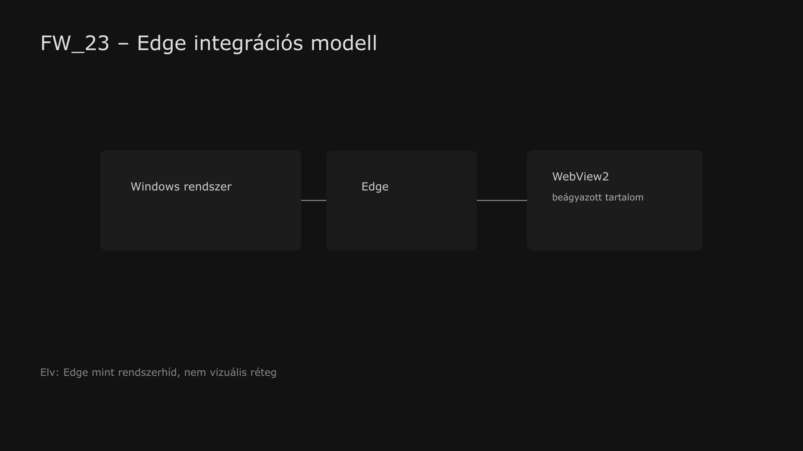

<div class="grid cards frostwood-header-cards" markdown>

-   <span class="fw-module-header-icon fw-module-23" aria-hidden="true"></span>

    # 23. Microsoft Edge { #23-microsoft-edge }

    > Szerző: Hegedüs Gábor (@hege-g)<br>
    > Licenc: [MIT (Kód) / CC BY-NC-ND 4.0 (Docs)]<br>
    > Frostwood Docs: v1.0.0<br>
    > Rendszerverzió / Állapot: v1.0.5 / Stabil<br>
    > Blokk: <span class="fw-block-icon-main-alkalmazasok" aria-hidden="true"></span> Alkalmazások

</div>

<div class="grid cards frostwood-toc-cards" markdown>

-   ## Tartalomkártyák

    * [:material-infinity: 1. Cél](#1-cel)
    * [:material-infinity: 2. Frostwood álláspont](#2-frostwood-allaspont)
    * [:material-infinity: 3. Profilkezelés](#3-profilkezeles)
    * [:material-infinity: 4. Téma beállítás (kötelező alap)](#4-tema-beallitas-kotelezo-alap)
    * [:material-infinity: 5. Értesítési zaj kontroll](#5-ertesitesi-zaj-kontroll)
    * [:material-infinity: 6. Indítási paraméterek (opcionális szeparáció)](#6-inditasi-parameterek-opcionalis-szeparacio)
    * [:material-infinity: 7. Dark Reader Edge-ben](#7-dark-reader-edge-ben)
        * [:material-infinity: 7.1 Telepítés](#71-telepites)
        * [:material-infinity: 7.2 Frostwood szabály](#72-frostwood-szabaly)
    * [:material-infinity: 8. Edge szerepe a Munka asztalon](#8-edge-szerepe-a-munka-asztalon)
    * [:material-infinity: 9. WCAG kompatibilitás](#9-wcag-kompatibilitas)
    * [:material-infinity: 10. Mit nem csinálunk](#10-mit-nem-csinalunk)
    * [:material-infinity: 11. Mentális terhelés modell](#11-mentalis-terheles-modell)
    * [:material-infinity: 12. Gyors ellenőrző lista](#12-gyors-ellenorzo-lista)

</div>

## 1. Cél

A Microsoft Edge :material-microsoft-edge: a Frostwood rendszerben:

* rendszerintegrált böngésző
* Windows-kompatibilitási réteg
* PDF-megjelenítő és fallback böngésző
* nem elsődleges Munka böngésző

A Frostwood az Edge-et:

* nem színezi át
* nem brandeli külön
* nem választja le agresszíven a rendszertől
* hanem kontrollált, halk működésre hangolja

???+ abstract "Összefoglaló"
    Az Edge szerepe tehát nem az, hogy külön Frostwood-identitást kapjon, hanem az, hogy **stabil, kiszámítható rendszerközeli böngésző maradjon**.


---

## 2. Frostwood álláspont



??? info "Vizuális leírás akadálymentesítéshez"
    Az ábra a Microsoft Edge szerepét mutatja a Frostwood rendszerben.

    A központi elem az Edge böngésző, amely nem elszigetelt alkalmazásként, hanem a Windows rendszerrel szorosan összekapcsolódó rétegként jelenik meg.

    Az egyik kapcsolat a natív böngészőhasználatot jelzi, ahol az Edge közvetlen felhasználói alkalmazásként működik.

    Egy másik, külön kiemelt kapcsolat a WebView2 irányába mutat. Ez azt szemlélteti, hogy az Edge nemcsak önálló böngésző, hanem más alkalmazások és beágyazott webes felületek megjelenítésében is szerepet kap.

    A diagram a Windows rendszer és az Edge közti szoros kapcsolatot hangsúlyozza, és azt mutatja, hogy az Edge a Frostwood értelmezésében részben infrastruktúra-szerepet is betölt.

    A kép célja annak bemutatása, hogy az Edge nem pusztán egy böngésző, hanem olyan rendszerintegrációs réteg, amely hatással van más alkalmazások működésére és megjelenítésére is.


Az Edge a Frostwoodban:

* megmarad rendszerböngészőnek
* nem kap teljes Home / Work identitásszétválasztást
* nem lesz elsődleges fókuszmunka-eszköz

Ennek oka, hogy az Edge:

* mélyen integrált a Windowsba
* WebView2 komponenseken keresztül sok rendszer- és alkalmazásréteget kiszolgál
* Office, Teams és egyes Microsoft-szolgáltatások által közvetve is használatba kerülhet

A Frostwood ezért nem akar „második Chrome-ot” vagy „második Firefoxot” építeni belőle.

---

## 3. Profilkezelés

Az Edge natívan profilalapú böngésző, de a Frostwood szemlélet szerint itt **nem szükséges túlbonyolítani** a profilműködést.

Ajánlott:

* 1 profil általában elegendő
* szükség esetén kialakítható 2 profil is, például:

  * `Frostwood-Default`
  * `Frostwood-Work`

Fontos azonban:

> Az Edge nem elsődleges Munka böngésző, ezért a teljes Home / Work szeparációt nem itt érdemes maximalizálni.

Munka környezethez továbbra is inkább:

* Chrome Work
* Firefox Work

az ajánlott.

---

## 4. Téma beállítás (kötelező alap)

Edge útvonal:

**Beállítások → Megjelenés → Téma**

Ajánlott választás:

> **Rendszer alapértelmezett.**

Ez biztosítja:

* Windows Light / Dark követés
* AutoDarkMode kompatibilitás
* egységes viselkedés a Frostwood állapotokkal
* kevesebb vizuális eltérés más rendszeralkalmazásokhoz képest

A Frostwoodnál az Edge esetében a rendszerhez igazodás fontosabb, mint az egyedi megjelenés.

---

## 5. Értesítési zaj kontroll

???+ tip "Tipp"
    Az Edge könnyen válhat háttérzaj-forrássá, ezért a webes értesítéseket érdemes tudatosan visszafogni.


Útvonal:

**Beállítások → Cookie-k és webhelyengedélyek → Értesítések**

Ajánlott működés:

<div class="grid cards frostwood-section-cards frostwood-numbered-card" markdown>

-   ### Munka esetén

    * globálisan tiltott vagy erősen korlátozott értesítések
    * push értesítések csak kivételesen
    * nincs felesleges háttérjelzés

-   ### Otthon esetén

    * manuális kontroll
    * csak tudatosan engedélyezett oldalak
    * felesleges push kérdések visszautasítása

</div>

A Frostwood cél itt nem a teljes tiltás minden helyzetben, hanem az, hogy az Edge **ne termeljen önálló figyelemelvonó réteget**.

---

## 6. Indítási paraméterek (opcionális szeparáció)

Ha mégis külön Edge-profilt szeretnél célzottan indítani, használható a:

??? tip "Edge indító paraméter"
    ```text title="Text"
    --profile-directory="Profile 2"
    ```


Példa:

??? tip "Parancsikon célmező"
    ```text title="Text"
    "C:\Program Files (x86)\Microsoft\Edge\Application\msedge.exe" --profile-directory="Profile 2"
    ```


Ez azonban Frostwood nézőpontból:

* opcionális
* nem alapkövetelmény
* nem a fő szeparációs stratégia

Az Edge-et nem erre a szerepre optimalizáljuk.

---

## 7. Dark Reader Edge-ben

Mivel az Edge Chromium-alapú, kompatibilis a Chrome Web Store-ból származó bővítményekkel.

<div class="grid cards frostwood-section-cards frostwood-numbered-card" markdown>

-   ### 7.1 Telepítés

    1. Edge → **Bővítmények**
    2. Engedélyezd: **Más áruházakból származó bővítmények**
    3. Telepítsd a Dark Reader-t

-   ### 7.2 Frostwood szabály

    Az Edge-ben a Dark Reader:

    * nem kötelező
    * nem alapértelmezett
    * nem globális vizuális réteg
    * csak célzott webhelyekre ajánlott

    Az Edge szerepe inkább:

    * rendszer webapp
    * PDF és Microsoft-függő tartalom megnyitó
    * alkalmi ellenőrző böngésző

</div>

Nem hosszú fókuszmunkára optimalizált fő böngésző.

---

## 8. Edge szerepe a Munka asztalon

Az Edge a Munka asztalon jelen lehet, de korlátozott szerepben.

Tipikus feladatok:

* PDF megnyitás
* gyors webes ellenőrzés
* Microsoft-függő szolgáltatások elérése
* WebView2-höz közeli kompatibilitási ellenőrzés

De:

* nem elsődleges AI platform
* nem elsődleges hosszú böngészési felület
* nem a fő fókuszböngésző

---

## 9. WCAG kompatibilitás

WCAG módban az Edge használata akkor ideális, ha:

* rendszer témát követ
* nincs rajta felesleges extension-réteg
* nincs agresszív sötétítés
* minimális a vizuális inger
* a fókuszjelzések nem keverednek egyedi színszabályokkal

A Frostwood itt is azt tartja szem előtt, hogy:

> A hozzáférhetőség ne külön „effekt” legyen, hanem nyugodt, kiszámítható működés.

---

## 10. Mit nem csinálunk

* Nem hackeljük a WebView2 működését
* Nem bontjuk meg a rendszerintegrációt
* Nem kényszerítünk policy-szintű vállalati szabályokat
* Nem injektálunk registry-alapú vizuális módosításokat
* Nem próbáljuk Edge-ből elsődleges Frostwood-böngészőt csinálni
* Nem engedjük a lebegő AI-segédek és írási javaslatok globális megjelenését, ha azok zavarják a PDF olvasást

---

## 11. Mentális terhelés modell

???+ note "Megjegyzés"
    Az Edge:

    * rendszerközeli alkalmazás
    * sok háttérfolyamattal él együtt
    * több más komponenssel közös ökoszisztémában működik

    A Frostwood cél ezért:

    * ne legyen túlépített
    * ne legyen „második Chrome”
    * ne kapjon extra vizuális szerepet
    * maradjon halk fallback eszköz


---

## 12. Gyors ellenőrző lista

* :material-checkbox-blank-outline: Rendszer téma aktív?
* :material-checkbox-blank-outline: Értesítések kontroll alatt vannak?
* :material-checkbox-blank-outline: Nem használod elsődleges Munka böngészőként?
* :material-checkbox-blank-outline: Nincs felesleges Dark Reader globális használat?
* :material-checkbox-blank-outline:Az Edge megmaradt halk, rendszerközeli eszköznek?