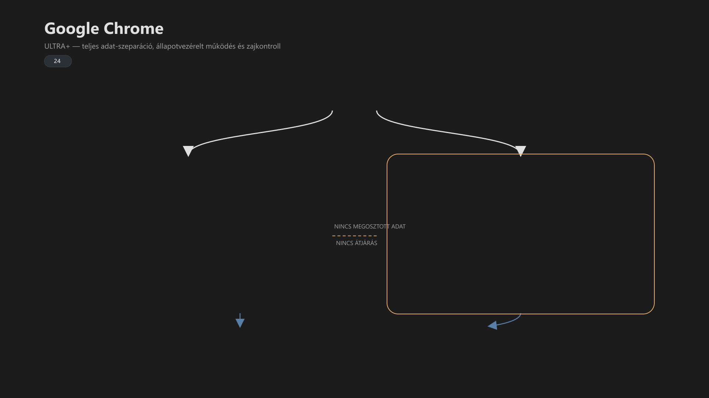

<div class="grid cards frostwood-header-cards" markdown>

-   <span class="fw-module-header-icon fw-module-24" aria-hidden="true"></span>

    # 24. Google Chrome (Home / Work teljes szeparáció) { #24-google-chrome-home-work-teljes-szeparacio }

    > Szerző: Hegedüs Gábor (@hege-g)<br>
    > Licenc: [MIT (Kód) / CC BY-NC-ND 4.0 (Docs)]<br>
    > Frostwood Docs: v1.0.0<br>
    > Rendszerverzió / Állapot: v1.0.5 / Stabil<br>
    > Blokk: <span class="fw-block-icon-main-alkalmazasok" aria-hidden="true"></span> Alkalmazások

</div>

<div class="grid cards frostwood-toc-cards" markdown>

-   ## Tartalomkártyák

    * [:material-infinity: 1. Cél](#1-cel)
    * [:material-infinity: 2. Architektúra — teljes szeparáció (B modell)](#2-architektura-teljes-szeparacio-b-modell)
    * [:material-infinity: 3. Parancsikon létrehozás (magyar Windows)](#3-parancsikon-letrehozas-magyar-windows)
        * [:material-infinity: 3.1 Elérési utak](#31-eleresi-utak)
        * [:material-infinity: 3.2 Létrehozás lépései](#32-letrehozas-lepesei)
        * [:material-infinity: 3.3 Ikon beállítás](#33-ikon-beallitas)
    * [:material-infinity: 4. Mit jelent a `--user-data-dir`?](#4-mit-jelent-a-user-data-dir)
    * [:material-infinity: 5. Értesítési zaj modell](#5-ertesitesi-zaj-modell)
        * [:material-infinity: 5.1 Munka profil](#51-munka-profil)
        * [:material-infinity: 5.2 Otthon profil](#52-otthon-profil)
    * [:material-infinity: 6. Dark Reader — Frostwood állapot-alapú modell](#6-dark-reader-frostwood-allapot-alapu-modell)
        * [:material-infinity: 6.1 Beszerzés](#61-beszerzes)
        * [:material-infinity: 6.2 Miért nem rendszer-szintű sötétítés?](#62-miert-nem-rendszer-szintu-sotetites)
        * [:material-infinity: 6.3 Dark Reader beállítás — Frostwood ajánlás](#63-dark-reader-beallitas-frostwood-ajanlas)
            * [:material-infinity: 6.3.1 Otthon (Karakter mód)](#631-otthon-karakter-mod)
            * [:material-infinity: 6.3.2 Munka (WCAG fókusz)](#632-munka-wcag-fokusz)
        * [:material-infinity: 6.4 Fontos elv](#64-fontos-elv)
        * [:material-infinity: 6.5 Mit nem csinálunk](#65-mit-nem-csinalunk)
    * [:material-infinity: 7. Frostwood és a narancs kérdése](#7-frostwood-es-a-narancs-kerdese)
    * [:material-infinity: 8. AI platformok előszobája](#8-ai-platformok-eloszobaja)
    * [:material-infinity: 9. WCAG kompatibilitás](#9-wcag-kompatibilitas)
    * [:material-infinity: 10. Mi nem része a modulnak](#10-mi-nem-resze-a-modulnak)
    * [:material-infinity: 11. Mentális terhelés modell](#11-mentalis-terheles-modell)
    * [:material-infinity: 12. Gyors ellenőrző lista](#12-gyors-ellenorzo-lista)

</div>

## 1. Cél

A Google Chrome :material-google-chrome: a Frostwood rendszerben:

* teljes értékű böngészőréteg
* kommunikációs és AI platformok hordozója
* potenciális értesítési és figyelmi zajforrás
* profil- és adat-szintű szeparációs eszköz

A cél:

* **teljes adat-szeparáció Otthon és Munka között**
* értesítési zaj kontroll
* Dark Reader tudatos, állapotfüggő használata
* Frostwood állapotokhoz illeszkedő működés
* verziófüggetlen, stabil, egyszerűen újraépíthető modell

---

## 2. Architektúra — teljes szeparáció (B modell)

Frostwood a Chrome esetén a külön `user-data-dir` :material-folder-account: modellt használja.



??? info "Vizuális leírás akadálymentesítéshez"
    A diagram két elkülönített Chrome környezetet mutat: „Home” és „Work”.

    Mindkettő saját adatkönyvtárból fut a felhasználói profil alatt:

    - Home: %LocalAppData%\Frostwood\Chrome\Home\
    - Work: %LocalAppData%\Frostwood\Chrome\Work\

    A két környezet között nincs adatmegosztás:

    - külön cookie-k
    - külön gyorsítótár
    - külön bővítményállapot

    A Work környezet fölött külön jelölés mutatja: „notifications OFF” és „no noise”.

    A két blokk felett egy központi „STATE” réteg látható, amely meghatározza, hogy melyik környezet indul el.

    A diagram hangsúlyozza, hogy nincs átjárás a két profil között („NO CROSS FLOW”), így a szeparáció teljes és determinisztikus.


### Mappák

??? tip "Profil mappák"
    ```text title="Text"
    %LocalAppData%\Frostwood\Chrome\Home\
    %LocalAppData%\Frostwood\Chrome\Work\
    ```


Ez nem egyszerű Chrome-profil, hanem **külön teljes adatkönyvtár**.

Előnyei:

* teljes cookie-szeparáció
* teljes cache-szeparáció
* külön bővítményállapot
* külön munkamenet-logika
* nem zavar be a Chrome saját profilkezelője
* verziófüggetlen és determinisztikus

???+ note "Megjegyzés"
    Ez a Frostwood egyik legtisztább elválasztási modellje.


---

## 3. Parancsikon létrehozás (magyar Windows)

<div class="grid cards frostwood-section-cards frostwood-numbered-card" markdown>

-   ### 3.1 Elérési utak

    ??? tip "Chrome tipikus elérési út"
        ```text title="Text"
        C:\Program Files\Google\Chrome\Application\chrome.exe
        ```


    #### Otthon (Karakter)

    ??? tip "Otthon parancsikon elérési út"
        ```text title="Text"
        "C:\Program Files\Google\Chrome\Application\chrome.exe" --user-data-dir="%LocalAppData%\Frostwood\Chrome\Home" --no-first-run
        ```


    #### Munka (Fókusz)

    ??? tip "Munka parancsikon elérési út"
        ```text title="Text"
        "C:\Program Files\Google\Chrome\Application\chrome.exe" --user-data-dir="%LocalAppData%\Frostwood\Chrome\Work" --no-first-run
        ```


-   ### 3.2 Létrehozás lépései

    1. Asztalon jobb klikk → **Új → Parancsikon**
    2. Másold be a megfelelő célsort
    3. Adj nevet:

    * `Chrome – Otthon`
    * `Chrome – Munka`

    4. Befejezés

-   ### 3.3 Ikon beállítás

    1. Parancsikon → Tulajdonságok
    2. **Ikoncsere**
    3. Tallózd be:

    ??? tip "Hivatalos elérési út"
        ```text title="Text"
        C:\Program Files\Google\Chrome\Application\chrome.exe
        ```


    vagy opcionális Frostwood ikon:

    ??? tip "Frostwood elérési út"
        ```text title="Text"
        %LocalAppData%\Frostwood\Payload\Visuals\Icons\Home\Home_Chrome.ico
        %LocalAppData%\Frostwood\Payload\Visuals\Icons\Work\Work_Chrome.ico
        ```


    ???+ Note "Megjegyzés"
        Ha a Windows hibaüzenetet ad, cseréld le a `%LocalAppData%` részt a valódi útvonalra.


    Szabály:

    * nincs külön Frostwood-színezés
    * nincs narancsos branding
    * a különbség a működésben van, nem az ikonfestésben

</div>

---

## 4. Mit jelent a `--user-data-dir`?

A `--user-data-dir` azt jelenti, hogy a Chrome:

* külön teljes adatkönyvtárat használ
* nem látja a másik környezet cookie-it
* nem osztja meg a cache-t
* nem keveri a bővítménylistát
* nem húzza össze automatikusan a két használati réteget

Ez a Frostwood „kristálytiszta szeparáció” modellje.

???+ quote "Alapelv"
    > Otthon és Munka így nem csak vizuálisan, hanem **valódi működési szinten** különül el.


---

## 5. Értesítési zaj modell

A Chrome a Frostwood rendszerben az egyik legerősebb potenciális zajforrás, ezért itt a kontroll különösen fontos.

<div class="grid cards frostwood-section-cards frostwood-numbered-card" markdown>

-   ### 5.1 Munka profil

    Ajánlott:

    * **Értesítések:** **globálisan tiltva**

    Útvonal:

    **Beállítások → Adatvédelem és biztonság → Webhelybeállítások → Értesítések → Ne engedélyezze a webhelyeknek értesítések küldését**

    Továbbá ajánlott:

    * webhelyhangok visszafogása vagy tiltása
    * automatikus indulás tiltása
    * minimális háttérjelenlét
    * jelszómentési felugró ablakok tudatos kezelése

-   ### 5.2 Otthon profil

    * értesítések opcionálisak
    * kézi kontroll javasolt
    * csak ténylegesen hasznos oldalak kapjanak jogosultságot

    ???+ quote "Alapelv"
        > A Frostwood itt is a zajcsökkentést tartja elsődlegesnek.


</div>

---

## 6. Dark Reader — Frostwood állapot-alapú modell

A Dark Reader a Frostwood Chrome-setupban nem „mindig sötét” megoldás, hanem **állapotfüggő segédréteg**.

<div class="grid cards frostwood-section-cards frostwood-numbered-card" markdown>

-   ### 6.1 Beszerzés

    1. Nyisd meg a Chrome Web Store-t
    2. Keresés: **Dark Reader**
    3. Telepítés

    Ajánlott ellenőrzés:

    * **Fejlesztő:** Dark Reader Ltd
    * széles körben használt, stabil bővítmény

-   ### 6.2 Miért nem rendszer-szintű sötétítés?

    Mert:

    * sok weboldal nem követi jól a rendszer dark módját
    * a böngésző saját sötétítése gyakran durva vagy pontatlan
    * a Dark Reader oldalspecifikusan, finomabban kezelhető

    ???+ quote "Alapelv"
        > A Frostwood nem akar minden oldalt mesterségesen egyszínűvé tenni.


</div>

### 6.3 Dark Reader beállítás — Frostwood ajánlás

Kapcsolódó referencia:

* [03. Szín rendszer](03-szin-rendszer.md#03-szin-rendszer)

<div class="grid cards frostwood-section-cards frostwood-numbered-card" markdown>

-   #### 6.3.1 Otthon (Karakter mód)

    Ajánlott beállítások:

    * **Mód:** Dinamikus
    * **Fényerő:** 100%
    * **Kontraszt:** 100%
    * **Szépia:** 0%
    * **Betűk módosítása:** KI
    * **Képek invertálása:** KI

    Cél:

    * ne torzítsa az oldal karakterét
    * ne legyen művi szűrőérzet
    * csak ott avatkozzon be, ahol tényleg segít

-   #### 6.3.2 Munka (WCAG fókusz)

    ##### Világos WCAG esetén

    **Dark Reader:** **KI**

    Indok:

    * a WCAG Light már eleve optimalizált
    * nincs szükség plusz kontrasztmanipulációra
    * csökken a hibás oldalinvertálás esélye

    ##### Sötét WCAG esetén

    **Dark Reader:** BE, ha szükséges

    Ajánlott paraméterek:

    * **Fényerő:** ~95%
    * **Kontraszt:** ~105%
    * **Szépia:** ~5%
    * **Képek invertálása:** KI
    * **Betűk módosítása:** KI
    * **Only for specific sites:** opcionálisan használható

    Cél:

    * ne legyen túl kemény fehér-fekete kontraszt
    * ne vakítson a szöveg
    * ne torzuljanak a képek
    * hosszú munkára stabil tónust adjon

</div>

<div class="grid cards frostwood-section-cards frostwood-numbered-card" markdown>

-   ### 6.4 Fontos elv

    A Dark Reader:

    * nem identitáselem
    * nem dekoráció
    * nem helyettesíti a WCAG módot
    * nem kötelező minden oldalon

    Csak ott használjuk, ahol:

    * az oldal nem követi a rendszer sötét módját
    * túl világos vagy túl agresszív
    * hosszú olvasásnál fárasztó

-   ### 6.5 Mit nem csinálunk

    * Nem használunk extrém kontrasztot
    * Nem sárgítjuk túl az oldalt
    * Nem invertálunk képeket
    * Nem írjuk át a tipográfiát
    * Nem alkalmazunk látványalapú „effekt sötétítést”

</div>

---

## 7. Frostwood és a narancs kérdése

A Chrome:

* nem kap narancs UI-díszítést
* nem lesz Frostwoodra „festve”
* nem válik jelentéshordozó felületté

Ennek oka, hogy a narancs a Frostwoodban:

> Jelentés-szín, elsősorban fókusz- és aktív állapotjelzés.

A Chrome ezzel szemben:

* hordozó alkalmazás
* tartalom- és szolgáltatáskapu
* nem elsődleges vizuális identitáselem

---

## 8. AI platformok előszobája

A Chrome Munka profil tipikusan alkalmas:

* ChatGPT
* Gemini
* egyéb webes AI és kommunikációs felületek

Azonos fiók használata Otthon és Munka között technikailag lehetséges, de a Frostwood számára itt a fontosabb szempont:

* értesítések Work módban tiltva
* nincs felesleges vizuális zaj
* nincs extra színezés vagy tematikus díszítés

---

## 9. WCAG kompatibilitás

WCAG módban a Chrome akkor illeszkedik jól a Frostwoodhoz, ha:

* az értesítések minimalizáltak
* a Dark Reader visszafogott
* nincs villogó vagy vizuálisan agresszív bővítmény
* a fókuszjelzések világosak maradnak
* a böngésző nem épít plusz ingerterhelést a munkára

---

## 10. Mi nem része a modulnak

* Nem telepít Chrome-ot
* Nem módosít vállalati vagy registry policy-t
* Nem erőlteti a Google-szinkront
* Nem ír át belső JSON konfigurációkat
* Nem injektál bővítményeket automatikusan
* Nem tiltjuk a frissítéseket, de javasoljuk azok Munkaidőn kívüli elvégzését a folyamatosság érdekében.

---

## 11. Mentális terhelés modell

A Chrome:

* sok szolgáltatás belépési pontja
* sok fiók és értesítés gyűjtőhelye
* könnyen válik túlterhelő eszközzé

:material-brain: A Frostwood cél:

* tiszta szeparáció
* kontrollált háttérviselkedés
* minimális inger
* hosszú munkánál kiszámítható használat

---

## 12. Gyors ellenőrző lista

* :material-checkbox-blank-outline: Az Otthon Chrome külön adatkönyvtárból fut?
* :material-checkbox-blank-outline: A Munka Chrome külön adatkönyvtárból fut?
* :material-checkbox-blank-outline: A Munka profil értesítései tiltva vannak?
* :material-checkbox-blank-outline: A Munka profilban a Pocket és az ajánlók ki vannak kapcsolva?
* :material-checkbox-blank-outline: A Dark Reader csak visszafogottan, szükség esetén működik?
* :material-checkbox-blank-outline: Nincs narancs dekoráció és felesleges Frostwood-branding?