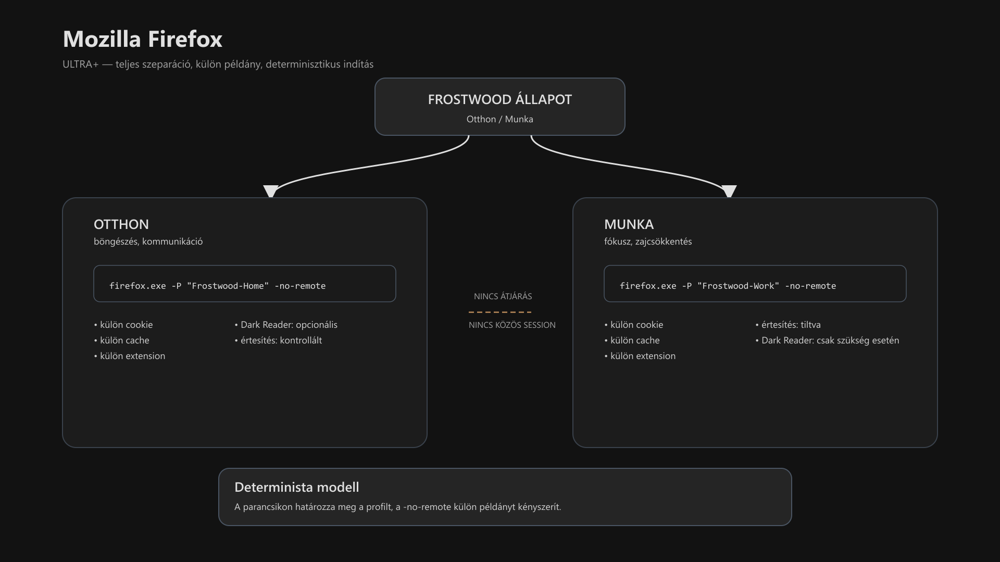

<div class="grid cards frostwood-header-cards" markdown>

-   <span class="fw-module-header-icon fw-module-25" aria-hidden="true"></span>

    # 25. Mozilla Firefox (Home / Work teljes szeparáció) { #25-mozilla-firefox-home-work-teljes-szeparacio }

    > Szerző: Hegedüs Gábor (@hege-g)<br>
    > Licenc: [MIT (Kód) / CC BY-NC-ND 4.0 (Docs)]<br>
    > Frostwood Docs: v1.0.0<br>
    > Rendszerverzió / Állapot: v1.0.5 / Stabil<br>
    > Blokk: <span class="fw-block-icon-main-alkalmazasok" aria-hidden="true"></span> Alkalmazások

</div>

<div class="grid cards frostwood-toc-cards" markdown>

-   ## Tartalomkártyák

    * [:material-infinity: 1. Cél](#1-cel)
    * [:material-infinity: 2. Architektúra — profil + külön példány modell](#2-architektura-profil-kulon-peldany-modell)
    * [:material-infinity: 3. Profilok létrehozása (magyar Windows)](#3-profilok-letrehozasa-magyar-windows)
        * [:material-infinity: 3.1 Profilkezelő indítása](#31-profilkezelo-inditasa)
        * [:material-infinity: 3.2 Két profil létrehozása](#32-ket-profil-letrehozasa)
    * [:material-infinity: 4. Parancsikonok létrehozása (magyar Windows)](#4-parancsikonok-letrehozasa-magyar-windows)
        * [:material-infinity: 4.1 Elérési utak](#41-eleresi-utak)
        * [:material-infinity: 4.2 Mit csinál a `-P`?](#42-mit-csinal-a-p)
        * [:material-infinity: 4.3 Mit csinál a `-no-remote`?](#43-mit-csinal-a-no-remote)
    * [:material-infinity: 5. Ikon beállítás](#5-ikon-beallitas)
    * [:material-infinity: 6. Windows Light / Dark követés](#6-windows-light-dark-kovetes)
    * [:material-infinity: 7. Értesítési zaj modell](#7-ertesitesi-zaj-modell)
        * [:material-infinity: 7.1 Munka profil](#71-munka-profil)
        * [:material-infinity: 7.2 Otthon profil](#72-otthon-profil)
    * [:material-infinity: 8. Dark Reader — Frostwood állapot-alapú modell](#8-dark-reader-frostwood-allapot-alapu-modell)
        * [:material-infinity: 8.1 Beszerzés](#81-beszerzes)
        * [:material-infinity: 8.2 Frostwood állapotfüggő használat](#82-frostwood-allapotfuggo-hasznalat)
    * [:material-infinity: 9. AI platformok előszobája](#9-ai-platformok-eloszobaja)
    * [:material-infinity: 10. Szabályok és tiltólista](#10-szabalyok-es-tiltolista)
    * [:material-infinity: 11. Mentális terhelés modell](#11-mentalis-terheles-modell)
    * [:material-infinity: 12. Gyors ellenőrző lista](#12-gyors-ellenorzo-lista)

</div>

## 1. Cél

A Mozilla Firefox :material-firefox: a Frostwood rendszerben:

* stabil alternatív böngészőréteg
* teljesen szeparált Otthon / Munka környezet
* rendszer témát követő, halk megjelenésű böngésző
* opcionálisan Dark Reader-rel finomhangolható munkaeszköz

A Firefox a Frostwoodban nem külön dizájnvilág, hanem:

> **Kontrollált, kiszámítható alkalmazásréteg.**

---

## 2. Architektúra — profil + külön példány modell



??? info "Vizuális leírás akadálymentesítéshez"
    Az ábra a Mozilla Firefox Frostwood-alapú működési modelljét mutatja.

    A felső szinten a Frostwood állapot jelenik meg, amely meghatározza, hogy Otthon vagy Munka környezet indul.

    A középső szinten két külön indítási ág látható.

    - Az egyik a „firefox.exe -P Frostwood-Home -no-remote”, 
    - a másik a „firefox.exe -P Frostwood-Work -no-remote” parancsot használja.

    Az alsó szinten a két külön profil jelenik meg. Mindkettő saját cookie, gyorsítótár és bővítmény állapottal rendelkezik.

    A két profil között nincs adatkapcsolat, amit a „nincs átjárás” jelölés mutat.

    Kiegészítő rétegként az Otthon oldalon a Dark Reader opcionális használata, a Munka oldalon az értesítések tiltása jelenik meg.

    Az ábra lényege, hogy a Firefox két külön példányban, teljesen elkülönített állapotban működik.


A Frostwood Firefox modellje:

* két külön profil:

    * `Frostwood-Home`
    * `Frostwood-Work`

* indítási paraméterek:

     * `-P "Profilnév"`
    * `-no-remote`

??? note "Megjegyzés"
    Bár a Firefox Containers jó eszköz a tab-szintű szeparációra, a Frostwood a teljes profil-izolációt (-P) alkalmazza, mert ez garantálja a külön bővítmény-állapotokat és a teljes értesítési kontrollt.


Ez biztosítja:

* teljes session-szeparáció
* külön cookie / cache / extension állapot
* nem keveredő példányok
* determinisztikus viselkedés

???+ note "Megjegyzés"
    A Firefoxnál ez a legegyszerűbb és legtisztább stabil modell.


---

## 3. Profilok létrehozása (magyar Windows)

<div class="grid cards frostwood-section-cards frostwood-numbered-card" markdown>

-   ### 3.1 Profilkezelő indítása

    1. **Windows + R**
    2. Írd be:

    ???+ tip "Tipp"
        ```text title="Text"
        firefox.exe -P
        ```


    3. **ENTER**

-   ### 3.2 Két profil létrehozása

    ??? tip "Hozd létre (Home / Work)"
        ```text title="Text"
        Frostwood-Home
        Frostwood-Work
        ```


    ??? tip "Ellenőrzés"
        ```text title="Text"
        %AppData%\Mozilla\Firefox\profiles.ini
        ```


    Fontos szabály:

    * egyik se legyen alapértelmezett profil
    * mindig a parancsikon döntse el, melyik indul

    Ez a Frostwoodnál ugyanazt a logikát követi, mint a Total Commander külön ini-s indítása vagy a Chrome külön adatkönyvtára.

</div>

---

## 4. Parancsikonok létrehozása (magyar Windows)

<div class="grid cards frostwood-section-cards frostwood-numbered-card" markdown>

-   ### 4.1 Elérési utak

    ??? tip " tipikus elérési út"
        ```text title="Text"
        C:\Program Files\Mozilla Firefox\firefox.exe
        ```


    #### Otthon (Karakter)

    ??? tip "Otthon parancsikon elérési út"
        ```text title="Text"
        "C:\Program Files\Mozilla Firefox\firefox.exe" -P "Frostwood-Home" -no-remote
        ```


    #### Munka (Fókusz)

    ??? tip "Munka parancsikon elérési út"
        ```text title="Text"
        "C:\Program Files\Mozilla Firefox\firefox.exe" -P "Frostwood-Work" -no-remote
        ```


-   ### 4.2 Mit csinál a `-P`?

    A `-P`:

    * megadja az indítandó profilt
    * biztosítja, hogy ne a véletlenül utoljára használt profil töltődjön be
    * determinisztikussá teszi az indítást

-   ### 4.3 Mit csinál a `-no-remote`?

    ???+ warning "Ez a kapcsoló kritikus"
        A `-no-remote` biztosítja, hogy:

        * ha már fut egy Firefox példány,
        * a másik parancsikon ne csak azt aktiválja,
        * hanem külön példány induljon a saját profiljával.


    Ez Firefoxban ugyanazt a szerepet tölti be, mint:

    * Total Commanderben a `/n`
    * Chrome-nál a külön `--user-data-dir`

</div>

---

## 5. Ikon beállítás

1. Parancsikon → Tulajdonságok
2. **Ikoncsere**
3. Tallózd be:

??? tip "Hivatalos elérési út"
    ```text title="Text"
    C:\Program Files\Mozilla Firefox\firefox.exe
    ```


vagy opcionális Frostwood ikon:

??? tip "Frostwood elérési út"
    ```text title="Text"
    %LocalAppData%\Frostwood\Payload\Visuals\Icons\Home\Home_Firefox.ico
    %LocalAppData%\Frostwood\Payload\Visuals\Icons\Work\Work_Firefox.ico
    ```


???+ Note "Megjegyzés"
    Ha a Windows hibaüzenetet ad, cseréld le a `%LocalAppData%` részt a valódi útvonalra.


Szabály:

* nincs narancsos branding
* nincs külön Frostwood-színezés
* a különbség a működésben van, nem a külső díszítésben

---

## 6. Windows Light / Dark követés

Útvonal:

**Beállítások → Általános → Nyelv és megjelenés → Téma**

Választás:

> **Rendszer téma.**

Ezzel a Firefox:

* követi a Windows Light / Dark váltást
* AutoDarkMode esetén automatikusan igazodik
* konzisztens marad más Frostwood-alkalmazásokkal

??? tip "Tipp"
    Ha a weboldalak nem követik a sötét módot, ellenőrizd az **about:config** alatt a **layout.css.prefers-color-scheme.content-override** értéket `(legyen 3 a rendszer követéséhez)`.


---

## 7. Értesítési zaj modell

A Firefox kevésbé agresszív, mint a Chrome, de a Frostwood itt is tudatos zajcsökkentést használ.

<div class="grid cards frostwood-section-cards frostwood-numbered-card" markdown>

-   ### 7.1 Munka profil

    Útvonal:

    **Beállítások → Adatvédelem és biztonság → Engedélyek → Értesítések**

    Ajánlott:

    * kapcsold ki a webhelyértesítések engedélyezését
    * minimalizáld a hangjelzéseket
    * push értesítések legyenek tiltva

-   ### 7.2 Otthon profil

    * értesítések opcionálisak
    * kézi kontroll javasolt
    * csak ténylegesen szükséges webhelyek kapjanak engedélyt

</div>

---

## 8. Dark Reader — Frostwood állapot-alapú modell

A Firefoxban a Dark Reader a Mozilla Add-ons oldalról telepíthető.

<div class="grid cards frostwood-section-cards frostwood-numbered-card" markdown>

-   ### 8.1 Beszerzés

    1. Nyisd meg a Mozilla Add-ons oldalt
    2. Keresés: **Dark Reader**
    3. **Hozzáadás Firefoxhoz**
    4. Engedélyezés

    Ajánlott ellenőrzés:

    * **Fejlesztő:** Dark Reader Ltd

-   ### 8.2 Frostwood állapotfüggő használat

    Kapcsolódó referencia:

    * [03. Szín rendszer](03-szin-rendszer.md#03-szin-rendszer)

-   #### Otthon (Karakter mód)

    Ajánlott beállítások:

    * **Mód:** Dinamikus
    * **Fényerő:** 100%
    * **Kontraszt:** 100%
    * **Szépia:** 0%
    * **Betűk módosítása:** KI
    * **Képek invertálása:** KI

    Cél:

    * ne torzítsa a weboldal karakterét
    * halk, természetes sötétítés
    * ne váljon külön vizuális réteggé

-   #### Munka (WCAG fókusz)

    ##### Világos WCAG

    **Dark Reader:** KI

    Indok:

    * a WCAG Light már optimalizált
    * nem szükséges további kontrasztmanipuláció

    ##### Sötét WCAG

    **Dark Reader:** BE, ha szükséges

    Ajánlott:

    * **Fényerő:** 95%
    * **Kontraszt:** 105%
    * **Szépia:** 5%
    * **Képek invertálása:** KI
    * **Betűk módosítása:** KI

    Cél:

    * ne legyen vakító fehér szöveg
    * ne legyen túl kemény kontraszt
    * hosszú munkához stabil, nyugodt tónust adjon

</div>

---

## 9. AI platformok előszobája

A Firefox Munka profil hordozhatja:

* ChatGPT
* Gemini
* egyéb webes munkaeszközök

Szabály:

* Work módban értesítések tiltva
* csak szükséges pin-ek maradjanak
* nincs külön UI-színezés
* nincs extension-túlterhelés

---

## 10. Szabályok és tiltólista

<div class="grid cards frostwood-section-cards frostwood-numbered-card" markdown>

-   ### Kötelező

    * :material-check-decagram-outline: profil + `-no-remote`
    * :material-palette-outline: rendszer téma
    * Munka módban minimális értesítés
* Pocket kikapcsolása, szponzorált gyorshivatkozások eltávolítása az új lapról (Munka profilban különösen fontos a fókusz miatt).

-   ### Tiltott

    * branding theme
    * narancsos egyedi skin
    * profilkeverés
    * extension-túlterhelés Munka profilban

</div>

---

## 11. Mentális terhelés modell

A Mozilla Firefox:

* tartalomintenzív alkalmazás
* sok tab esetén jelentős kognitív terhelést okozhat
* könnyen válhat „második munkaasztallá”
* Munka módban a feleslegesen nyitva hagyott tabok nemcsak a mentális fókuszt, hanem a gép erőforrásait is merítik.

A Frostwood cél ezért:

* stabil UI
* kevés vizuális zaj
* nem villogó értesítések
* Dark Reader csak szükség esetén
* kiszámítható, nyugodt böngészési tér

Munka módban az alapelv:

???+ quote "Alapelv"
    > A böngésző nem vizuális tér, hanem információs csatorna.


---

## 12. Gyors ellenőrző lista

* :material-checkbox-blank-outline: Külön Firefox-profilok futnak?
* :material-checkbox-blank-outline: A `-no-remote` miatt nem keverednek a példányok?
* :material-checkbox-blank-outline: Rendszer téma aktív?
* :material-checkbox-blank-outline: Munka profilban az értesítések tiltva vannak?
* :material-checkbox-blank-outline: A Dark Reader csak állapotfüggően, visszafogottan működik?
* :material-checkbox-blank-outline: A Munka profilban a Pocket és az ajánlók ki vannak kapcsolva?