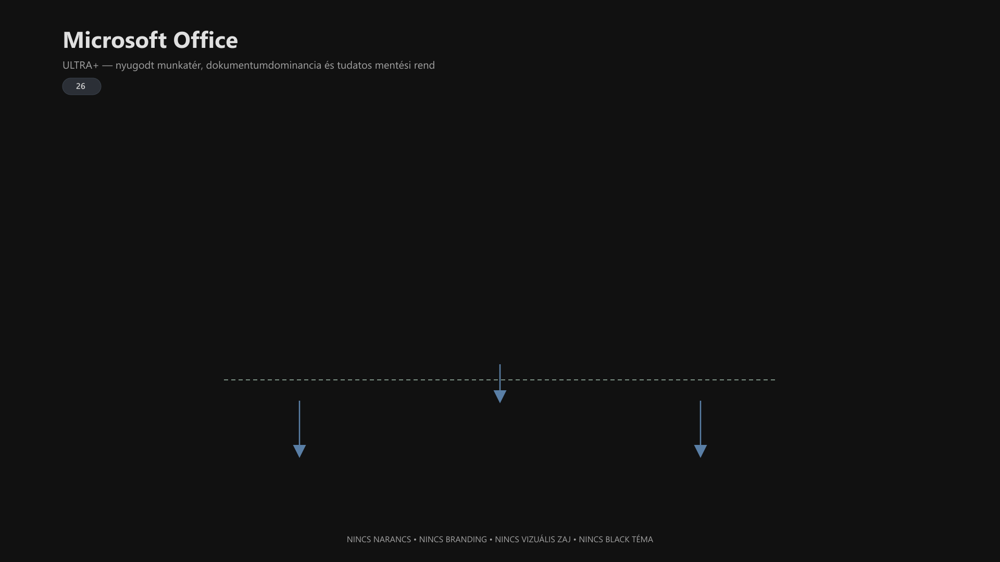

<div class="grid cards frostwood-header-cards" markdown>

-   <span class="fw-module-header-icon fw-module-26" aria-hidden="true"></span>

    # 26. Microsoft Office (Word / Excel) { #26-microsoft-office-word-excel }

    > Szerző: Hegedüs Gábor (@hege-g)<br>
    > Licenc: [MIT (Kód) / CC BY-NC-ND 4.0 (Docs)]<br>
    > Frostwood Docs: v1.0.0<br>
    > Rendszerverzió / Állapot: v1.0.5 / Stabil<br>
    > Blokk: <span class="fw-block-icon-main-alkalmazasok" aria-hidden="true"></span> Alkalmazások

</div>

<div class="grid cards frostwood-toc-cards" markdown>

-   ## Tartalomkártyák

    * [:material-infinity: 1. Cél](#1-cel)
    * [:material-infinity: 2. Telepítés](#2-telepites)
        * [:material-infinity: 2.1 Választható telepítés kérdése](#21-valaszthato-telepites-kerdese)
        * [:material-infinity: 2.2 Haladó megoldás: Office Deployment Tool (ODT)](#22-halado-megoldas-office-deployment-tool-odt)
        * [:material-infinity: 2.3 Az ODT letöltése](#23-az-odt-letoltese)
        * [:material-infinity: 2.4 Konfigurációs fájl elkészítése](#24-konfiguracios-fajl-elkeszitese)
        * [:material-infinity: 2.5 Telepítés indítása parancssorból](#25-telepites-inditasa-parancssorbol)
        * [:material-infinity: 2.6 Mi fog történni?](#26-mi-fog-tortenni)
        * [:material-infinity: 2.7 Aktiválás fiók nélkül](#27-aktivalas-fiok-nelkul)
    * [:material-infinity: 3. Téma és rendszerintegráció](#3-tema-es-rendszerintegracio)
        * [:material-infinity: 3.1 Alapelv](#31-alapelv)
        * [:material-infinity: 3.2 Otthon mód (Karakter)](#32-otthon-mod-karakter)
        * [:material-infinity: 3.3 Munka mód – Light WCAG](#33-munka-mod-light-wcag)
        * [:material-infinity: 3.4 Munka mód – Dark WCAG](#34-munka-mod-dark-wcag)
        * [:material-infinity: 3.5 Mit nem használunk](#35-mit-nem-hasznalunk)
    * [:material-infinity: 4. Dokumentumtér optimalizálás](#4-dokumentumter-optimalizalas)
        * [:material-infinity: 4.1 Word – háttérérzet](#41-word-hattererzet)
        * [:material-infinity: 4.2 Betűalap](#42-betualap)
        * [:material-infinity: 4.3 Sorköz és margó](#43-sorkoz-es-margo)
        * [:material-infinity: 4.4 Kijelölési szín](#44-kijelolesi-szin)
        * [:material-infinity: 4.5 Zoom és nézet](#45-zoom-es-nezet)
    * [:material-infinity: 5. Animációk és zajcsökkentés](#5-animaciok-es-zajcsokkentes)
    * [:material-infinity: 6. Frostwood Office összegzés](#6-frostwood-office-osszegzes)
    * [:material-infinity: 7. Mentési architektúra](#7-mentesi-architektura)
        * [:material-infinity: 7.1 Alapelv](#71-alapelv)
        * [:material-infinity: 7.2 Mentés közvetlenül a gépre](#72-mentes-kozvetlenul-a-gepre)
        * [:material-infinity: 7.3 Frostwood mentési út](#73-frostwood-mentesi-ut)
        * [:material-infinity: 7.4 Mappastruktúra](#74-mappastruktura)
        * [:material-infinity: 7.5 Mentési logika](#75-mentesi-logika)
    * [:material-infinity: 8. Sablonrendszer](#8-sablonrendszer)
        * [:material-infinity: 8.1 Alapelv](#81-alapelv)
        * [:material-infinity: 8.2 Word sablonok](#82-word-sablonok)
        * [:material-infinity: 8.3 Excel sablonok](#83-excel-sablonok)
        * [:material-infinity: 8.4 Elhelyezés](#84-elhelyezes)
    * [:material-infinity: 9. Fájlnév modell](#9-fajlnev-modell)
    * [:material-infinity: 10. Mentési workflow (Munka)](#10-mentesi-workflow-munka)
    * [:material-infinity: 11. OneDrive viselkedés](#11-onedrive-viselkedes)
    * [:material-infinity: 12. Mentális terhelés modell](#12-mentalis-terheles-modell)
    * [:material-infinity: 13. Tiltólista](#13-tiltolista)
    * [:material-infinity: 14. Gyors ellenőrző lista](#14-gyors-ellenorzo-lista)

</div>

## 1. Cél

Az Office a Frostwood rendszerben:

* hosszú fókuszmunkára optimalizált munkafelület
* nem design-hordozó réteg
* nem branding tér
* nem színezett UI

A cél:

* stabil, kiszámítható dokumentumtér
* alacsony vizuális zaj
* mentálisan fenntartható olvasási és szerkesztési ritmus
* hosszú távon is fáradáscsökkentett munkakörnyezet

???+ abstract "Összefoglaló"
    A Frostwood szemléletében az Office nem „látványos”, hanem **nyugodt és üzembiztos**.


---

## 2. Telepítés

<div class="grid cards frostwood-section-cards frostwood-numbered-card" markdown>

-   ### 2.1 Választható telepítés kérdése

    **Alapértelmezés szerint nem.**

    A modern Microsoft Office (különösen a 2019 utáni kiadásoktól) jellemzően úgynevezett **Click-to-Run** technológiát használ. Ez azt jelenti, hogy ha a hivatalos telepítőt elindítod, az többnyire a teljes csomagot telepíti fel, és nem kérdez rá részletesen, hogy pontosan mely komponenseket szeretnéd.

    Ez azért problémás lehet, mert:

    * olyan alkalmazások is felkerülnek, amelyeket nem használsz
    * felesleges ikonok jelennek meg a Start menüben
    * nagyobb lesz a csomag és a háttérkomplexitás
    * több lesz a vizuális és képernyőolvasós „zaj”

    A Frostwood szempontból ez nem ideális.

-   ### 2.2 Haladó megoldás: Office Deployment Tool (ODT)

    A tisztább telepítéshez a javasolt módszer az úgynevezett **Office Deployment Tool** használata.

    Ennek lényege:

    * te adod meg, mit szeretnél telepíteni
    * XML konfigurációval kizárhatók a felesleges appok
    * kialakítható egy tiszta Word + Excel környezet

    Ez különösen hasznos akkor, ha a rendszer célja:

    * alacsonyabb menü-zaj
    * kevesebb Start menü elem
    * egyszerűbb, célzott Office-készlet

-   ### 2.3 Az ODT letöltése

    1. Látogass el a Microsoft hivatalos oldalára
    2. Töltsd le az **Office Deployment Tool** csomagot
    3. Futtasd a letöltött `.exe` fájlt
    4. Csomagold ki például ebbe a mappába:

    ??? tip "Tipp"
        ```text title="Text"
        C:\OfficeTelepito
        ```


-   ### 2.4 Konfigurációs fájl elkészítése

    A kicsomagolt mappában több XML mintafájl is lehet. Ezek helyett létrehozhatsz egy saját konfigurációs fájlt.

    ??? example "XML példa"
        ```xml title="XML"
        <Configuration>
        <Add OfficeClientEdition="64" Channel="Current">
        <Product ID="Standard2024Volume">
        <Language ID="hu-hu" />
        <ExcludeApp ID="Access" />
        <ExcludeApp ID="Groove" />
        <ExcludeApp ID="Lync" />
        <ExcludeApp ID="OneDrive" />
        <ExcludeApp ID="OneNote" />
        <ExcludeApp ID="Outlook" />
        <ExcludeApp ID="PowerPoint" />
        <ExcludeApp ID="Publisher" />
        <ExcludeApp ID="Teams" />
        </Product>
        </Add>
        <Display Level="Full" AcceptEULA="TRUE" />
        </Configuration>
        ```


    ??? tip "Mentsd el ezen a néven"
        ```text title="Text"
        install.xml
        ```


    ???+ note "Fontos megjegyzések"
        * az `ExcludeApp` sorok mondják meg, hogy mit hagyjon ki a telepítő
        * így a célzott Word + Excel telepítés tisztábban kialakítható
        * ha a licenctípusod nem `Standard2024Volume`, akkor a `Product ID` értékét ennek megfelelően módosítani kell


-   ### 2.5 Telepítés indítása parancssorból

    1. Nyisd meg a Start menüt
    2. Írd be: `cmd`
    3. Nyomj **Ctrl + Shift + Enter**-t
    4. Lépj be a mappába:

    ??? tip "Tipp"
        ```cmd title="CMD"
        cd C:\OfficeTelepito
        ```


    5. Indítsd el a telepítést:

    ??? tip "Tipp"
        ```cmd title="CMD"
        setup.exe /configure install.xml
        ```


-   ### 2.6 Mi fog történni?

    A parancs után a Microsoft hivatalos telepítője a megadott konfiguráció szerint dolgozik.

    Ennek előnyei:

    * csak a szükséges programok kerülnek telepítésre
    * a Start menü tisztább marad
    * kevesebb fölösleges ikon és menüpont jelenik meg
    * képernyőolvasóval is egyszerűbb, nyugodtabb lesz a környezet

    Frostwood nézőpontból ez azért jó, mert:

    ???+ success "Eredmény"
        > A rendszerben csak az jelenik meg, amit tényleg használni szeretnél.


-   ### 2.7 Aktiválás fiók nélkül

    A Frostwood nem épít kötelező Microsoft-fiók használatra.

    Telepítés után előfordulhat, hogy az első indításkor az Office bejelentkezést kér. Ilyenkor jellemzően kereshető olyan útvonal, mint:

    * **Nem akarok bejelentkezni**
    * **Termékkulcs megadása helyette**

    Ha a licenced ezt támogatja, a 25 jegyű kulccsal aktiválható a szoftver úgy is, hogy a napi használat ne kapcsolódjon állandó online profillogikához.

</div>

---

## 3. Téma és rendszerintegráció

<div class="grid cards frostwood-section-cards frostwood-numbered-card" markdown>

-   ### 3.1 Alapelv

    Az Office:

    * kövesse a Windows Light / Dark módját, ahol ez kulturáltan megoldható
    * ne építsen saját külön dizájnvilágot
    * ne kapjon narancsos Frostwood-brandinget
    * ne legyen agresszíven kontrasztos

    ???+ quote "Alapelv"
        > A narancs a Frostwoodban **jelentés-szín**, nem dekoráció.


-   ### 3.2 Otthon mód (Karakter)

    Ajánlott Office téma:

    **White**

    Indok:

    * tiszta, világos felület
    * nem színezett
    * nem vonja el a figyelmet
    * nem teszi túl sötétté a munkafelületet
    * természetesebb kreatív vagy általános dokumentummunkához

    ???+ note "Megjegyzés"
        Ez jól illeszkedik az Otthon / Karakter logikához.


-   ### 3.3 Munka mód – Light WCAG

    Ajánlott:

    → **Use system setting**<br>
    → ha ez nem elérhető vagy nem ad stabil eredményt, akkor **White**

    Elv:

    * a felület világos marad
    * a dokumentumtér dominál
    * a Ribbon nem válik túl hangsúlyossá
    * nincs dekoratív vagy zavaró színezés

-   ### 3.4 Munka mód – Dark WCAG

    Ajánlott Office téma:

    → **Dark Gray**

    ???+ warning "Fontos"
        nem **Black**


    Word beállítás:

    → **Never change the document page color** → BE

    Indok:

    * a program kerete lehet sötétebb
    * a dokumentumoldal marad világos
    * a tartalom olvashatósága stabil marad
    * kisebb a kontrasztfáradás, mint teljes fekete témánál

-   ### 3.5 Mit nem használunk

    * Black téma
    * egyedi Office színsémák
    * narancsos UI-branding
    * túltervezett Ribbon-megjelenés
    * dekoratív témázás

</div>

---

## 4. Dokumentumtér optimalizálás



??? info "Vizuális leírás akadálymentesítéshez"
    Az ábra egy háromrétegű Office munkamodellt mutat be.

    A felső réteg a Microsoft Office alkalmazáskeretet jelöli, ahol a Word és Excel egy semleges, sötétszürke felületen jelenik meg. A felület nem tartalmaz színezett vagy dekoratív elemeket.

    A középső, domináns blokk a dokumentumtér. Ez világos, enyhén tört fehér háttérrel jelenik meg, amely a hosszú távú olvashatóságot és a vizuális stabilitást szolgálja. Ez a rész a legnagyobb az ábrán, jelezve, hogy a tartalom az elsődleges.

    Az alsó réteg a mentési struktúrát mutatja. Két logikai rész különül el: Otthon és Munka. Mindkettő külön Word és Excel almappákat tartalmaz egy közös alapútvonal alatt.

    Az ábra hangsúlyozza, hogy az Office nem vizuális élménytér, hanem egy stabil, alacsony zajszintű munkakörnyezet, ahol a dokumentum tartalma kerül előtérbe.


<div class="grid cards frostwood-section-cards frostwood-numbered-card" markdown>

-   ### 4.1 Word – háttérérzet

    #### Munka – Light WCAG

    Cél:

    * világos dokumentumtér
    * nem vakító
    * nem textúrázott
    * nem sárgás
    * nem szürke módon „piszkos”

    Irányérzetként:

    * `#FAFAFA`

    > A törtfehér árnyalat használata a Wordben vizuális kényelmi funkció, amely nem módosítja a dokumentum tényleges nyomtatási képét, így a fájl megőrzi professzionális fehér alapját más rendszereken is.

    Nem kötelező tényleges oldalszínt állítani, de hosszú munkánál megengedett, ha ez csökkenti a fáradást.

    #### Munka – Dark WCAG

    * a dokumentumoldal maradjon világos
    * nem használunk teljes sötét dokumentummódot
    * a UI lehet sötét, de a tartalomfelület maradjon stabilan olvasható

    Ez a Frostwood szerint a legbiztonságosabb hosszú olvasási modell.

-   ### 4.2 Betűalap

    Ajánlott:

    * **Calibri 11**
    * **Aptos**, ha elérhető

    Kerülendő:

    * túl vékony betűk
    * dekoratív betűk
    * túl kontrasztos, ideges ritmusú fontok

    ???+ quote "Alapelv"
        > A cél nem a látványosság, hanem a hosszú távon fenntartható olvashatóság.


-   ### 4.3 Sorköz és margó

    Munka módban ajánlott:

    * **Sorköz:** 1.15
    * **Bekezdés után:** 6 pt
    * **Margó:** Normál

    Indok:

    * csökkenti a sűrűséget
    * javítja a sorvezetést
    * kevésbé fárasztó hosszabb szerkesztésnél

-   ### 4.4 Kijelölési szín

    * a Windows rendszerből öröklődik
    * nem módosítjuk külön
    * narancs nem kerül be az Office kijelölési rendszerébe

-   ### 4.5 Zoom és nézet

    #### Word

    Ajánlott:

    * **100–110%**
    * **Oldalszélesség:** nézet

    #### Excel

    Ajánlott:

    * **100–110%** zoom
* **Rácsvonalak:** BE
    * **Fagyasztott panelek:** használata nagyobb tábláknál

    Kerülendő:

    * túl sűrű struktúra
    * túl sok színezett cella
    * túl erős vizuális kódolás kizárólag színekkel

</div>

---

## 5. Animációk és zajcsökkentés

Office → Beállítások → Speciális

Ajánlott:

* animációk kikapcsolása vagy minimalizálása, különösen Munka módban

Indok:

* kevesebb mikromozgás
* stabilabb fókusz
* alacsonyabb kognitív zaj

---

## 6. Frostwood Office összegzés

Az Office csomag (Word, Excel) vizuális konfigurációja a kognitív terhelés és a dokumentum-olvashatóság egyensúlyára épül.

<div class="grid cards frostwood-section-cards frostwood-numbered-card" markdown>

-   ### :material-cube-outline: Otthoni mód

    **Általános tartalomélvezés**

    * **UI felület:** Tiszta fehér (White).
    * **Dokumentum:** Normál fehér háttér.
    * **Narancs jelzés:** Nincs.
    * **Érzet:** Nappali, hagyományos papírszerű élmény.

-   ### :material-cube-scan: Munka Light (System)

    **Fókuszált nappali munka**

    * **UI felület:** Fehér vagy Rendszerszintű (System).
    * **Dokumentum:** `#FAFAFA` (törtfehér) érzet.
    * **Narancs jelzés:** Nincs.
    * **Érzet:** Tompított kontraszt a szem kímélése érdekében.

-   ### :material-cube: Munka Dark

    **Mély fókusz / Éjszakai műszak**

    * **UI felület:** Sötétszürke (Dark Gray / Slate).
    * **Dokumentum:** Fehér (hogy a szöveg kontrasztos maradjon).
    * **Narancs jelzés:** Nincs.
    * **Érzet:** "Sötét szoba" hatás, ahol csak a tartalom világít.

</div>

---

## 7. Mentési architektúra

<div class="grid cards frostwood-section-cards frostwood-numbered-card" markdown>

-   ### 7.1 Alapelv

    * a gyári Office mappák maradhatnak
    * nem irányítjuk át agresszíven a Dokumentumok mappát
    * nem módosítjuk ehhez a registry-t
    * a Frostwood mentési struktúra külön, tudatos rendként él

-   ### 7.2 Mentés közvetlenül a gépre

    A cél az, hogy a `Ctrl + S` ne kényszerítsen fölöslegesen felhős vagy Backstage-központú mentési körökre.

    Ajánlott Wordben és Excelben:

    1. **Fájl**
    2. **Opciók**
    3. **Mentés**

    Jelöld be:

    * **Ne jelenítse meg a Backstage nézetet fájlok megnyitásakor vagy mentésekor gyorsbillentyűk használatával**
    * **Alapértelmezés szerint a számítógépre mentés**

    Előnye:

    * a mentés gyorsabb és kiszámíthatóbb
    * a hagyományos Windows mentési ablak használható
    * kevesebb felhős kitérő jelenik meg
    * képernyőolvasóval is tisztább a folyamat

-   ### 7.3 Frostwood mentési út

    ??? tip "Tipp"
        ```text title="Text"
        D:\Dokumentumok\Mentések\Office\
        ```


-   ### 7.4 Mappastruktúra

    Ajánlott mappafelépítés:

    * :material-folder-table: **Office struktúra**

        * :material-folder-home: **Home struktúra**

            * `D:\Dokumentumok\Mentések\Office\Home\Word\`
            * `D:\Dokumentumok\Mentések\Office\Home\Excel\`

        * :material-briefcase-outline: **Work struktúra**

            * `D:\Dokumentumok\Mentések\Office\Work\Word\`
            * `D:\Dokumentumok\Mentések\Office\Work\Excel\`

        * :material-content-copy: **Templates struktúra**

            * `D:\Dokumentumok\Mentések\Office\Templates\Home\`
            * `D:\Dokumentumok\Mentések\Office\Templates\Work\`

-   ### 7.5 Mentési logika

    #### Otthon

    ??? tip "Word mentési út"
        ```text title="Text"
        D:\Dokumentumok\Mentések\Office\Home\Word
        ```


    ??? tip "Excel mentési út"
        ```text title="Text"
        D:\Dokumentumok\Mentések\Office\Home\Excel
        ```


    #### Munka

    ??? tip "Word mentési út"
        ```text title="Text"
        D:\Dokumentumok\Mentések\Office\Work\Word
        ```


    ??? tip "Excel mentési út"
        ```text title="Text"
        D:\Dokumentumok\Mentések\Office\Work\Excel
        ```


    Ez tudatos mentési rend, nem automatikus átirányítás.

</div>

---

## 8. Sablonrendszer

<div class="grid cards frostwood-section-cards frostwood-numbered-card" markdown>

-   ### 8.1 Alapelv

    A sablon:

    * ajánlott
    * nem kötelező
    * nem írja felül automatikusan a `Normal.dotm` fájlt
    * manuálisan elhelyezett és tudatosan használt elem

-   ### 8.2 Word sablonok

    Ajánlott fájlnevek:

    * `Frostwood_Munka.dotx`
    * `Frostwood_Otthon.dotx`

    Munka sablon javasolt tartalma:

    * 1.15 sorköz
    * 6 pt bekezdésköz
    * normál margó
    * alapstílusok:

        * Címsor 1
        * Címsor 2
        * Címsor 3
        * Normál
        * Felsorolás
        * Táblázat

-   ### 8.3 Excel sablonok

    Ajánlott munka sablonok:

    * `Frostwood_Adatlap.xlsx`
    * `Frostwood_Riport.xlsx`
    * `Frostwood_Táblázat.xlsx`

    Ettől függetlenül egyedi fájl természetesen bármikor használható.

-   ### 8.4 Elhelyezés

    ??? tip "Sablon mentési út"
        ```text title="Text"
        D:\Dokumentumok\Mentések\Office\Templates\
        ```


    A javaslat:

    * manuális másolás
    * nem módosítjuk automatikusan az Office sablon alapútvonalát

</div>

---

## 9. Fájlnév modell

Ajánlott séma:

* `YYYY-MM-DD_ProjektNev_V01.docx`

Példa:

* `2026-02-10_ProjektNev_V01.docx`

Előnyök:

* időrendi rendezhetőség
* egyszerű verziókövetés
* kisebb felülírási kockázat
* jobban kereshető archívum
* gyorsabb navigációt adnak képernyőolvasóval
* csökkentik a keresési időt

---

## 10. Mentési workflow (Munka)

Ajánlott folyamat:

1. Mentés a megfelelő Work mappába
2. Verzió kézi növelése
3. Nem felülírás, hanem új fájl létrehozása

Ez stabilabb, auditálhatóbb és visszakövethetőbb dokumentumtörténetet ad.

---

## 11. OneDrive viselkedés

A Frostwood:

* nem kényszerít OneDrive-használatot
* a lokális mentést alapvetően stabilabbnak tekinti
* a felhőhasználatot opcionálisnak hagyja

A cél itt a kontroll, nem az automatikus felhős munkamodell.

---

## 12. Mentális terhelés modell

Az Office hosszú munkaterület.

A Frostwood célja, hogy ez a tér:

* ne legyen túl fehér
* ne legyen túl kontrasztos
* ne legyen animált
* ne legyen színezett vagy túljelölt

???+ quote "Munka módban az alapelv"
    > A dokumentum tartalom, nem vizuális élmény.


---

## 13. Tiltólista

* Black theme
* színezett dokumentumháttér
* túl sok kiemelés
* túl erős cellaszínezés
* narancs UI
* dekoratív, funkciótlan megjelenési módok

---

## 14. Gyors ellenőrző lista

* :material-checkbox-blank-outline: Az Office téma a rendszerlogikához igazodik?
* :material-checkbox-blank-outline: Sötét módban Dark Gray van használva, nem Black?
* :material-checkbox-blank-outline: A sablonok manuálisan és tudatosan vannak elhelyezve?
* :material-checkbox-blank-outline: A mentés a megfelelő Work / Home mappába történik?
* :material-checkbox-blank-outline: Nincs narancs branding és felesleges vizuális zaj?