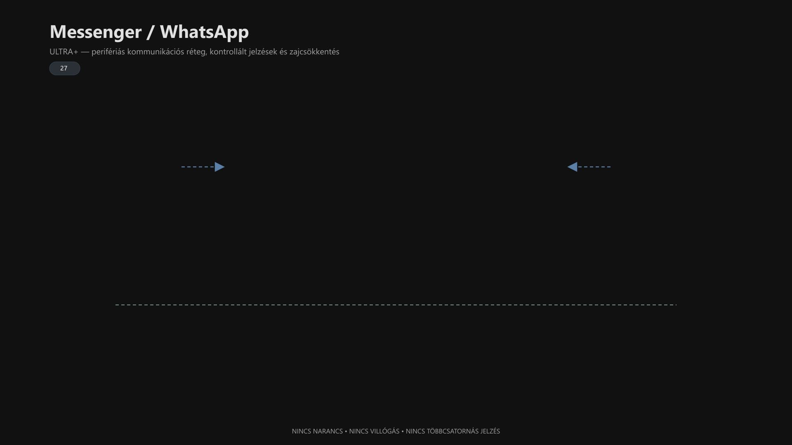

-   

    # 27. Messenger / WhatsApp (Meta chat réteg) { #27-messenger-whatsapp-meta-chat-reteg }

    > Szerző: Hegedüs Gábor (@hege-g) 
    > Licenc: [MIT (Kód) / CC BY-NC-ND 4.0 (Docs)] 
    > Frostwood Docs: v1.0.0 
    > Rendszerverzió / Állapot: v1.0.5 / Stabil 
    > Blokk:  Alkalmazások

-   ## Tartalomkártyák

    * [:material-infinity: 1. Cél](#1-cel)
    * [:material-infinity: 2. 2026. április utáni álláspont](#2-2026-aprilis-utani-allaspont)
    * [:material-infinity: 3. Hatókör](#3-hatokor)
    * [:material-infinity: 4. Otthon vs Munka modell](#4-otthon-vs-munka-modell)
    * [:material-infinity: 5. WhatsApp Desktop (ajánlott modell)](#5-whatsapp-desktop-ajanlott-modell)
        * [:material-infinity: 5.1 Telepítés](#51-telepites)
        * [:material-infinity: 5.2 Munka beállítás](#52-munka-beallitas)
        * [:material-infinity: 5.3 Accessibility finomhangolás](#53-accessibility-finomhangolas)
    * [:material-infinity: 6. Messenger fallback](#6-messenger-fallback)
    * [:material-infinity: 7. Időbeliség modell](#7-idobeliseg-modell)
    * [:material-infinity: 8. Zajszint modell](#8-zajszint-modell)
    * [:material-infinity: 9. WCAG kompatibilitás](#9-wcag-kompatibilitas)
    * [:material-infinity: 10. Rendszerszint vs alkalmazásszint](#10-rendszerszint-vs-alkalmazasszint)
    * [:material-infinity: 11. Tiltó / Engedélylista](#11-tilto-engedelylista)
    * [:material-infinity: 12. Mentális terhelés modell](#12-mentalis-terheles-modell)
    * [:material-infinity: 13. JAWS / NVDA ellenőrző lista](#13-jaws-nvda-ellenorzo-lista)

## 1. Cél

A Meta chat réteg a Frostwood rendszerben:

* nem vizuális identitás-hordozó
* nem design tér
* hanem potenciális **kognitív zajforrás**

Ezért a cél:

* értesítési zaj csökkentése
* vizuális inger minimalizálása
* stabil képernyőolvasó-kompatibilitás
* halk működés Munka asztalon
* narancsmentes UI-logika

???+ quote "Alapelv"
    > A narancs a Frostwoodban jelentés-szín, nem chat-dekoráció.

---

## 2. 2026. április utáni álláspont

A Frostwood 2026. április-tól:

> **WhatsApp-first rendszer.**

Ennek oka:

* stabilabb asztali kliens
* jobb JAWS-kompatibilitás
* dedikált alkalmazásélmény
* kevesebb Facebook-központú vizuális zaj

A Messenger szerepe ezzel szemben inkább:

* fallback megoldás
* böngészős elérés
* erősebben visszafogott használat

---

## 3. Hatókör

A modul lefedi:

* WhatsApp Desktop
* WhatsApp Web
* Messenger Web
* Messenger alkalmazás, ha még használatban van

A [Zoom](28-zoom.md#28-zoom-akadalymentesitett-modell) külön modulban szerepel.

---

## 4. Otthon vs Munka modell

A Frostwood rendszerben a kommunikációs csatornák viselkedése az aktuális állapothoz (Karakter vagy Fókusz) igazodik.

-   ### :material-cube-outline: **Otthon (Karakter mód)**

    A cél a tartalomélvezet és a szabadabb kapcsolattartás.

    * **WhatsApp:** Kulturált értesítések engedélyezve.
    * **Messenger:** Opcionális használat.
    * **Hangok:** Bekapcsolható jelzések.
    * **Előnézet:** Opcionális üzenet-betekintés.
    * **Branding:** Nincs narancs díszítés.

-   ### :material-cube: **Munka (Fókusz mód)**

    A cél a kognitív terhelés radikális csökkentése.

    * **WhatsApp:** Minimalizált jelenlét.
    * **Messenger:** Erősen visszafogott használat.
    * **Hangok:** **Szigorúan KI** (teljes csend).
    * **Előnézet:** **KI** (adatvédelem és fókusz).
    * **Branding:** Nincs vizuális zaj (narancs-mentes).

???+ quote "Munka asztalon az alapelv"
    > A chat munka közben nem közösségi tér, hanem kontrollált információs csatorna.

---

## 5. WhatsApp Desktop (ajánlott modell)

-   ### 5.1 Telepítés

    Ajánlott forrás:

    * **Microsoft Store → WhatsApp**

    A javasolt modell:

    * dedikált Desktop app
    * nem kizárólag webes használat
    * stabilabb fókusz és képernyőolvasó-viselkedés

-   ### 5.2 Munka beállítás

    Útvonal:

    **Beállítások → Értesítések**

    Ajánlott:

    * **Hangjelzés:** opcionális vagy KI
    * **Értesítési előnézet:** KI
    * **Badge:** opcionális, de visszafogott
    * **Automatikus indulás:** KI

    A cél az, hogy a WhatsApp ne telepedjen rá a Munka asztalra.

??? info "Vizuális leírás akadálymentesítéshez"
    Az ábra a Frostwood rendszer kommunikációs rétegét mutatja be.

    A középpontban egy nagy, stabil blokk látható, amely a fókusz munkateret jelöli. Ez a dokumentumokkal és aktív feladatokkal kapcsolatos fő működési tér.

    A központ körül kisebb elemekként jelennek meg a chatalkalmazások. A WhatsApp elsődleges, míg a Messenger fallback szerepet kap. Ezek a blokkok vizuálisan visszafogottabbak, jelezve, hogy nem központi elemek.

    Az ábra tartalmaz egy értesítési piramist is. Az alsó szint a néma jelvény, a középső a vizuális felugró értesítés, a felső szint pedig a hang és az előnézet kombinációja. Munka módban a felső szint tiltott.

    Egy külön jelölés mutatja az időbeli működést: a jelzés megjelenik, a felhasználó tudomásul veszi, majd eltűnik. Nem marad tartós vizuális jelenlét.

    Az ábra kiemeli, hogy a kommunikációs réteg nem dominálja a munkateret, hanem kontrollált, alacsony zajszintű csatornaként működik.

### 5.3 Accessibility finomhangolás

Fontos elvek:

* Preview legyen OFF
* a chat fókusza maradjon stabil
* ne legyen villogó vagy folyamatosan változó UI
* a jelzés csak arra utaljon, hogy történt valami, ne közölje agresszíven a tartalmat

#### Hasznos gyorsbillentyűk

* `Ctrl + N` → új csevegés
* `Ctrl + F` → keresés
* `Ctrl + Shift + ]` → következő chat
* `Ctrl + E` → archiválás

---

## 6. Messenger fallback

A Frostwoodban a Messenger nem elsődleges chatkliens.

Ajánlott működés:

* böngészőből használva
* Munka profilban értesítések tiltva
* preview kikapcsolva
* hangjelzés kikapcsolva

Ha mégis használod, akkor böngészőben célszerű az értesítéseket külön tiltani.

Példa:

* Chrome → lakat ikon → Értesítések → Tiltás

A Messenger célja itt nem az állandó jelenlét, hanem a minimális elérhetőség.

---

## 7. Időbeliség modell

A chatjelzés Frostwood logikában:

* megjelenik
* tudomásul veszed
* eltűnik

Nem marad tartós, vizuálisan uralkodó státuszként.

Munka módban ezért kerülendő:

* folyamatos olvasatlan-jelvény dominancia
* piros badge-ek állandó nyomása
* több csatornán egyszerre érkező ugyanazon jelzés

---

## 8. Zajszint modell

-   ### :material-cube-outline: **Otthon**

    * **Értesítés:** engedett
    * **Hang:** opcionális
    * **Preview:** opcionális

-   ### :material-cube: **Munka**

    * **Hang:** inkább KI
    * **Preview:** KI
    * **Badge:** minimalizált
    * **Popup:** lehetőleg KI vagy erősen visszafogott

    A cél, hogy csak a legszükségesebb jelzés maradjon aktív.

-   #### Színhasználat korlátozása

    A kommunikációs alkalmazások nem használják a Frostwood narancs fókuszszínt.

    Indok:

    * nem fókusz-horgony
    * párhuzamos jelzést okozna
    * növelné a kognitív terhelést

    A kommunikációs réteg:

    > Nem vezeti a felhasználót, csak jelzi az eseményt.

Kapcsolódó referencia:

* [03. Szín rendszer](03-szin-rendszer.md#03-szin-rendszer)

---

## 9. WCAG kompatibilitás

WCAG módban javasolt:

* Preview OFF
* animációk minimalizálása
* hangok kikapcsolása
* egyszerre csak egy jelzési csatorna használata

???+ quote "Alapelv"
    > A WCAG nem díszítés, hanem zajcsökkentés és kontroll.

---

## 10. Rendszerszint vs alkalmazásszint

A Frostwood nem erőszakos rendszerhackekre, hanem **visszafordítható beállításokra** épít. A beavatkozás mértéke rétegenként szabályozott.

-   ### Windows szint

    **Zéró globális módosítás**

    A Frostwood tiszteletben tartja az operációs rendszert. Nem nyúl globális policy-khez, nem módosít registry-t olyan módon, ami instabillá tenné a Windows-t. Csak a felhasználói felület (UI) és a kényelmi funkciók szintjén mozog.

-   ### Alkalmazás szint

    **Szoftverspecifikus finomhangolás**

    A beavatkozás itt a legmélyebb. Minden támogatott alkalmazás (pl. Total Commander, Chrome) egyedi, profil-alapú beállításokat kap, hogy illeszkedjen a választott állapothoz (Otthon/Munka).

-   ### Böngésző szint

    **Zajszűrés és figyelemkontroll**

    A legfelsőbb réteg, ahol a cél a webhelyértesítések és a vizuális zaj szűrése. Itt a beavatkozás a figyelem megóvását szolgálja, nem az adatok módosítását.

---

## 11. Tiltó / Engedélylista

-   ### Tiltott

    * narancs ikon vagy branding theme
    * hang + badge + popup egyszerre
    * villogó animációk
    * többszintű jelzés ugyanarra az eseményre
    * preview alapértelmezett használata Munka módban
    * Közösségi (Community) bejelentések push-értesítése Munka módban.

-   ### Engedélyezett

    * rendszer alapértelmezett téma
    * halk badge, ha tényleg szükséges
    * egyszeri popup, ha nincs más jelzési csatorna
    * stabil billentyűvezérlés
    * egyszerű, képernyőolvasó-barát működés
    * Csak a közvetlen (Direct Message) jelzések.

---

## 12. Mentális terhelés modell

A chatalkalmazások:

* folyamatos megszakítók
* kognitív kontextusváltók
* figyelemelvonó, sürgető érzetet tudnak kelteni

A Frostwood célja:

> A chat ne uralja a fókuszt.

Munka módban az alapelv:

* a kommunikáció reakció
* nem domináns inger
* nem vizuális központi elem

---

## 13. JAWS / NVDA ellenőrző lista

* :material-checkbox-blank-outline: Preview ki van kapcsolva?
* :material-checkbox-blank-outline: Hangjelzés nincs vagy minimális?
* :material-checkbox-blank-outline: A popup nem szakítja meg a dokumentumfókuszt?
* :material-checkbox-blank-outline: Billentyűvel jól vezérelhető?
* :material-checkbox-blank-outline: Nincs narancs dekoráció és fölösleges vizuális zaj?