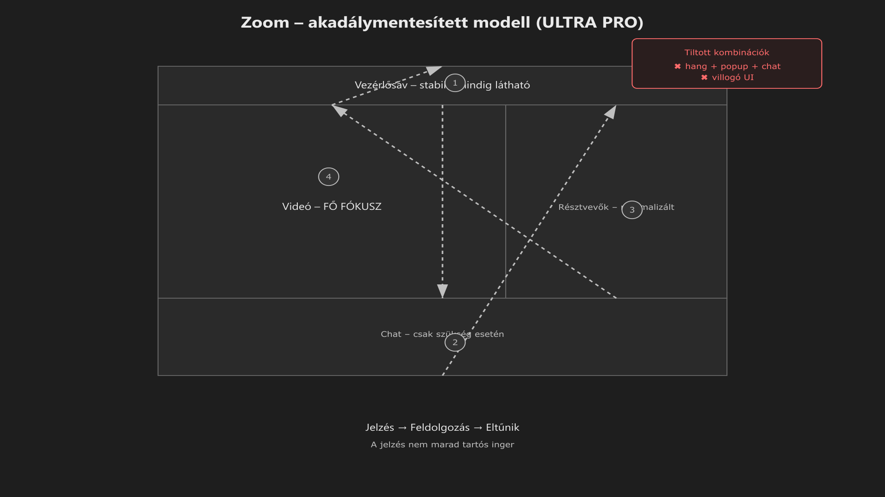

-   

    # 28. Zoom – akadálymentesített modell { #28-zoom-akadalymentesitett-modell }

    > Szerző: Hegedüs Gábor (@hege-g) 
    > Licenc: [MIT (Kód) / CC BY-NC-ND 4.0 (Docs)] 
    > Frostwood Docs: v1.0.0 
    > Rendszerverzió / Állapot: v1.0.5 / Stabil 
    > Blokk:  Alkalmazások

-   ## Tartalomkártyák

    * [:material-infinity: 1. Cél](#1-cel)
    * [:material-infinity: 2. Alapelv: meeting = fókuszzóna](#2-alapelv-meeting-fokuszzona)
    * [:material-infinity: 3. Telepítés és verzió](#3-telepites-es-verzio)
    * [:material-infinity: 4. Alapbeállítások (Munka)](#4-alapbeallitasok-munka)
        * [:material-infinity: 4.1 Általános](#41-altalanos)
        * [:material-infinity: 4.2 Audio](#42-audio)
        * [:material-infinity: 4.3 Video](#43-video)
    * [:material-infinity: 5. Accessibility panel (kritikus rész)](#5-accessibility-panel-kritikus-resz)
        * [:material-infinity: 5.1 Screen Reader Alerts](#51-screen-reader-alerts)
    * [:material-infinity: 6. Billentyűvezérlés (JAWS / NVDA fókusz)](#6-billentyuvezerles-jaws-nvda-fokusz)
        * [:material-infinity: 6.1 Fő vezérlés](#61-fo-vezerles)
        * [:material-infinity: 6.2 Navigáció](#62-navigacio)
        * [:material-infinity: 6.3 Chat kezelés (Munka fókusz)](#63-chat-kezeles-munka-fokusz)
    * [:material-infinity: 7. Zajszint modell](#7-zajszint-modell)
        * [:material-infinity: 7.1 Hang](#71-hang)
        * [:material-infinity: 7.2 Popup](#72-popup)
        * [:material-infinity:  7.3 Multi-signal tilalom](#73-multi-signal-tilalom)
    * [:material-infinity: 8. WCAG kompatibilitás](#8-wcag-kompatibilitas)
    * [:material-infinity: 9. Munka asztal viselkedés](#9-munka-asztal-viselkedes)
    * [:material-infinity: 10. Mit nem csinálunk](#10-mit-nem-csinalunk)
    * [:material-infinity: 11. Meeting fókusz protokoll (gyakorlati modell)](#11-meeting-fokusz-protokoll-gyakorlati-modell)
    * [:material-infinity: 12. Mentális terhelés modell](#12-mentalis-terheles-modell)
    * [:material-infinity: 13. Gyors ellenőrző lista](#13-gyors-ellenorzo-lista)

## 1. Cél

A Zoom a Frostwood rendszerben:

* nem vizuális identitás-hordozó
* nem branding tér
* hanem intenzív, potenciálisan zavaró kommunikációs eszköz

A cél:

* meeting alatti fókusz stabilizálása
* vizuális és hangjelzési zaj csökkentése
* képernyőolvasó-barát működés
* Munka asztalon halk, kontrollált jelenlét

> A narancs Frostwoodban jelentés-szín. Nem használjuk Zoom UI-dekorációra.

---

## 2. Alapelv: meeting = fókuszzóna

Egy Zoom meeting egyszerre több terhelési csatornát nyithat meg:

* beszédhang
* résztvevők belépése és kilépése
* chatüzenetek
* felugró panelek
* képernyőmegosztási állapotok
* gyors kontextusváltások

A Frostwood célja:

> Meeting közben csak a szükséges jelzések maradjanak aktívak.

---

## 3. Telepítés és verzió

Ajánlott:

* hivatalos Windows Desktop alkalmazás
* automatikus frissítés bekapcsolva

Indok:

* a Zoom új kiadásai gyakran javítanak billentyűkezelésen és értesítési viselkedésen
* az akadálymentességi javítások verziófüggők lehetnek
* JAWS / NVDA kompatibilitás idővel változhat

---

## 4. Alapbeállítások (Munka)

-   ### 4.1 Általános

    Zoom → **Beállítások**

    Ajánlott:

    * **Windows indításkor:** KI
    * **Automatikus frissítés:** BE
    * **Értesítések:** minimalizált

    A Zoom legyen elérhető, de ne éljen állandóan a háttérben.

-   ### 4.2 Audio

    Ajánlott Munka módban:

    * **Mikrofon némítás belépéskor:** BE
    * **Csatlakozási hang:** KI vagy csak Host esetén
    * **Press and hold SPACE to temporarily unmute:** opcionális, de hasznos

    Ez csökkenti a véletlen hangterhelést és a meetingindítási bizonytalanságot.

-   ### 4.3 Video

    Ajánlott:

    * **HD:** opcionális
    * **Filterek:** KI
    * **Virtuális háttér:** csak ha tényleg szükséges
    * **Résztvevőnevek folyamatos megjelenítése:** csak ha kell
    * **AI Summary / Companion:** KI (ha csak nem kötelező)
    * **Avatarok:** KI (felesleges renderelési zaj és kognitív teher).

    A Frostwood itt sem plusz vizuális rétegeket akar, hanem nyugodt működést.

---

## 5. Accessibility panel (kritikus rész)

Zoom → **Beállítások → Accessibility**

Ajánlott:

* **Always show meeting controls:** BE

Ez azért fontos, mert:

* a vezérlősáv nem tűnik el
* a fókusz stabilabb marad
* képernyőolvasóval kiszámíthatóbb a navigáció

-   ### 5.1 Screen Reader Alerts

    ???+ bug "Hiba"
        A képernyőolvasó jelzések túlterhelhetik a felhasználót.

    Csak a valóban hasznos riasztások maradjanak bekapcsolva.

    Jellemzően megtartható:

    * Participant joined / left — ha szükséges
    * Chat message received — ha releváns a meetinghez

    Jellemzően kikapcsolható, ha zavaró:

    * Screen sharing started / stopped
    * Reaction alerts
    * másodlagos, nem kritikus státuszjelzések

    A cél nem a teljes némítás, hanem a **jelzések rangsorolása**.

-   ### Képernyőolvasó zajcsökkentés

    Ajánlott:

    * Silence non-critical notifications

    Ez csökkenti:

    * belépési jelzések
    * váróterem események

    > Csak a releváns események maradjanak hallhatóak.

---

## 6. Billentyűvezérlés (JAWS / NVDA fókusz)

??? info "Vizuális leírás akadálymentesítéshez"
    Az ábra egy Zoom meeting ablak stilizált szerkezetét mutatja.

    Négy fő terület különül el: vezérlősáv, videóterület, résztvevők panel és chat panel.

    A diagram nyilakkal jelzi az F6 billentyűvel történő navigáció ciklusát. A fókusz a vezérlősávból indul, majd a chat panelre, onnan a résztvevők listájára, végül a videóterületre lép, majd visszatér a kiindulási pontra.

    A Frostwood modell szerint a videóterület a fő fókuszzóna. A vezérlősáv folyamatosan látható marad, így a vezérlés stabil. A chat és a résztvevők panel csak szükség esetén aktív.

    Az ábra külön kiemeli, hogy kerülendő a többcsatornás jelzés: Hang, felugró ablak és vizuális villogás egyidejű használata.

    Az alsó rész egy időbeliségi modellt mutat: A jelzés megjelenik, a felhasználó feldolgozza, majd az inger eltűnik, így nem marad tartós terhelés.

-   ### 6.1 Fő vezérlés

    * `Alt + A` → Mikrofon
    * `Alt + V` → Kamera
    * `Alt + U` → Résztvevők
    * `Alt + H` → Chat
    * `Alt + Q` → Kilépés
    * `Alt + Y` → Kézfelnyújtás

-   ### 6.2 Navigáció

    * `F6` → Panel váltás
    * `Ctrl + 2` → Aktuális beszélő neve
    * `Insert + T` → Ablakcím beolvasás
    * `Alt + Shift + T` → Fókusz a tálcára (Zoom meeting control-ra). Ez segít, ha a fókusz "elveszne" az ablakok között.

    Az `F6` különösen fontos, mert ezzel tudsz váltani a fő területek között:

    * vezérlősáv
    * chat panel
    * résztvevők listája
    *     videónézet

-   ### 6.3 Chat kezelés (Munka fókusz)

    Hasznos billentyűk:

    * `Alt + Shift + H` → utolsó chatüzenetek gyors olvasása
    * `Ctrl + F` → keresés a chatben
    * `Tab` → chatmező és üzenetlista közötti mozgás

    Munka módban ajánlott:

    * a chat panel ne maradjon nyitva feleslegesen
    * csak akkor legyen aktív, amikor valóban szükséges

---

## 7. Zajszint modell

-   ### 7.1 Hang

    Munka környezetben:

    * belépési hangok legyenek minimalizálva
    * üzenethang inkább KI
    * több hangcsatornás párhuzamos jelzés kerülendő

-   ### 7.2 Popup

    A popup viselkedés legyen:

    * nem villogó
    * nem fókuszszakító
    * nem uralkodó

    A cél az, hogy a dokumentum- vagy meetingfókusz ne essen szét.

-   ### 7.3 Multi-signal tilalom

    Tiltott kombináció:

    * hang + popup + chat-villogás egyszerre

    Engedélyezett modell:

    * egy jelzési csatorna
    * vagy legfeljebb nagyon visszafogott, jól elkülönített értesítés

---

## 8. WCAG kompatibilitás

WCAG módban ajánlott:

* minimális animáció
* fixen látható vezérlősáv
* minimalizált hangjelzések
* chat csak szükség esetén
* képernyőolvasó-jelzések szűrése

A Frostwood értelmezésében:

> A WCAG itt is zajcsökkentést és stabilitást jelent, nem színezést.

---

## 9. Munka asztal viselkedés

Munka asztalon a Zoom jelen lehet, de:

* ne induljon automatikusan
* ne kapjon narancsos ikont
* ne kapjon extra UI-módosítást
* ne váljon állandó figyelemközponttá

> A Zoom eszköz, nem környezeti díszlet.

---

## 10. Mit nem csinálunk

* nem injektálunk automatikusan JAWS scriptet
* nem módosítunk registry policy-ket
* nem hackeljük a Zoom UI-t
* nem tiltjuk le agresszíven a funkciókat
* nem próbálunk „Frostwoodos” külsőt erőltetni a programra

---

## 11. Meeting fókusz protokoll (gyakorlati modell)

???+ tip "Tipp"
    Ez segít, hogy a meeting ne essen szét több, egymással versengő fókuszrétegre.

Ajánlott Munka meeting előtt vagy elején:

1. Mikrofon némítva
2. Chat panel zárva
3. F6 navigáció tudatos használata
4. Értesítések minimalizálva
5. Jegyzetelés külön alkalmazásban történik  
*(például Office vagy Jegyzettömb)*

---

## 12. Mentális terhelés modell

Egy Zoom meeting jellemzően:

* nagy információs sűrűségű
* többcsatornás
* hang- és vizuális ingerekkel terhelt
* gyors kontextusváltásokat kényszerít ki

A Frostwood célja:

> A meeting legyen strukturált, ne ingeráradat.

---

## 13. Gyors ellenőrző lista

* :material-checkbox-blank-outline: Az **Always show meeting controls** be van kapcsolva?
* :material-checkbox-blank-outline: A hangjelzések minimalizáltak?
* :material-checkbox-blank-outline: Nincs többszintű párhuzamos jelzés?
* :material-checkbox-blank-outline: A chat nem villog és nem marad nyitva feleslegesen?
* :material-checkbox-blank-outline: A billentyűvezérlés stabilan használható képernyőolvasóval is?