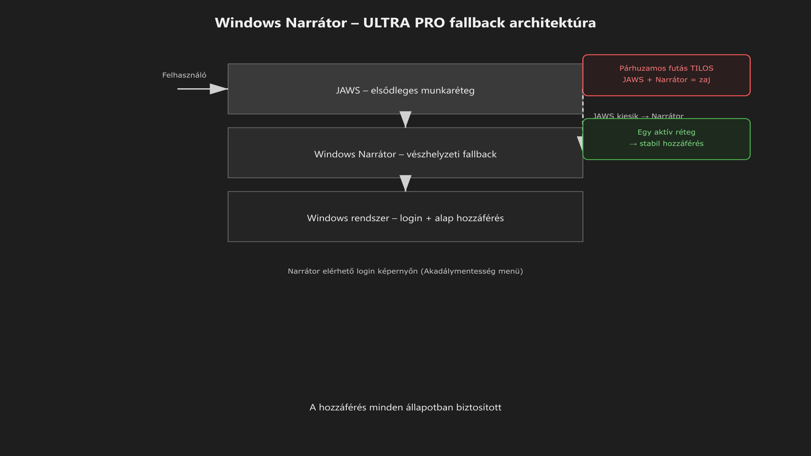

-   

    # 29. Windows Narrátor (rendszerszintű akadálymentességi réteg) { #29-windows-narrator-rendszerszintu-akadalymentessegi-reteg }

    > Szerző: Hegedüs Gábor (@hege-g) 
    > Licenc: [MIT (Kód) / CC BY-NC-ND 4.0 (Docs)] 
    > Frostwood Docs: v1.0.0 
    > Rendszerverzió / Állapot: v1.0.5 / Stabil 
    > Blokk:  Alkalmazások

-   ## Tartalomkártyák

    * [:material-infinity: 1. Cél](#1-cel)
    * [:material-infinity: 2. Frostwood álláspont](#2-frostwood-allaspont)
    * [:material-infinity: 3. Aktiválás](#3-aktivalas)
        * [:material-infinity: 3.1 Billentyűparancs](#31-billentyuparancs)
        * [:material-infinity: 3.2 Elérés a login képernyőn](#32-eleres-a-login-kepernyon)
    * [:material-infinity: 4. Narrátor és Frostwood módok](#4-narrator-es-frostwood-modok)
    * [:material-infinity: 5. Mikor használjuk?](#5-mikor-hasznaljuk)
        * [:material-infinity: 5.1 Vészhelyzetben](#51-veszhelyzetben)
        * [:material-infinity: 5.2 Diagnosztikai célra](#52-diagnosztikai-celra)
    * [:material-infinity: 6. Narrátor vs JAWS (Frostwood kontextus)](#6-narrator-vs-jaws-frostwood-kontextus)
    * [:material-infinity: 7. Ajánlott beállítások (ha használod)](#7-ajanlott-beallitasok-ha-hasznalod)
    * [:material-infinity: 8. Zajmodell](#8-zajmodell)
    * [:material-infinity: 9. Travel Mode kapcsolat](#9-travel-mode-kapcsolat)
    * [:material-infinity: 10. WCAG kapcsolat](#10-wcag-kapcsolat)
    * [:material-infinity: 11. Mit nem csinál a Frostwood](#11-mit-nem-csinal-a-frostwood)
    * [:material-infinity: 12. Mentális modell](#12-mentalis-modell)
    * [:material-infinity: 13. Gyors ellenőrző lista](#13-gyors-ellenorzo-lista)

## 1. Cél

A Windows Narrátor a Frostwood rendszerben:

* rendszerszintű **vészhelyzeti képernyőolvasó réteg**
* login-szintű hozzáférési eszköz
* fallback megoldás JAWS hiányában vagy hibája esetén
* diagnosztikai segédeszköz

A Frostwood a Narrátort:

* nem tematizálja
* nem cseréli le
* nem építi át külön Frostwood-eszközzé

A célja nem az, hogy fő munkakörnyezet legyen, hanem hogy:

???+ quote "Alapelv"
    > Bármely rendszerállapotban biztosítsa a legalapvetőbb hozzáférést.

---

## 2. Frostwood álláspont

A Narrátor a Frostwood szemléletben:

* nem elsődleges munkakörnyezet
* nem kap külön profilt
* nem kap állapotfüggő automatizmust
* nem reagál külön Karakter / WCAG / Travel állapotokra

A Narrátor szerepe tehát nem a finomhangolt napi használat, hanem a **rendszerszintű biztonsági hozzáférés**.

Ez különösen fontos akkor, ha:

* a fő képernyőolvasó nem indul
* a felhasználói profil hibás
* a bejelentkezés előtt kell hozzáférést biztosítani
* valamilyen diagnosztikai ellenőrzés szükséges

---

## 3. Aktiválás

-   ### 3.1 Billentyűparancs

    **A Narrátor gyorsindítása**: `Win + Ctrl + Enter`

    Ez:

    * azonnal indítja a Narrátort
    * rendszerszinten működik
    * normál Windows környezetben és több kritikus helyzetben is elérhető

    A Frostwood számára ez azért fontos, mert a hozzáférésnek nem szabad kizárólag egyetlen külső szoftvertől függenie.

-   ### 3.2 Elérés a login képernyőn

    A bejelentkezési képernyő jobb alsó sarkában található **Akadálymentesség** menüből a Narrátor közvetlenül elérhető.

    A Narrátor a bejelentkezési képernyőn a `Win + Ctrl + Enter` kombinációval is indítható, nem csak a menüből.

    Menüből jellemzően hozzáférhető többek között:

    * Narrátor
    * Nagyító
    * Kontrasztos témák
    * Képernyő-billentyűzet
    * Beragadó billentyűk
    * Billentyűszűrés
    * Hanghozzáférés

    Ez a Frostwood filozófiában kulcsfontosságú, mert:

    ???+ quote "Alapelv"
        > A hozzáférés már a belépési ponton sem szakadhat meg.

---

## 4. Narrátor és Frostwood módok

A Frostwood rendszer a Narrátor (Windows beépített képernyőolvasó) beállításait **tudatosan érintetlenül hagyja**. Ez biztosítja, hogy a felhasználó megszokott hangélménye és navigációs sebessége minden módban állandó maradjon.

* ### :material-microphone-off: Állandó hozzáférés

Minden üzemmódra érvényes:

* :material-cube-outline: **Karakter** (Otthon)
* :material-cube-scan: **WCAG** (Rendszer)
* :material-airplane: **Travel** (Utazás)
* :material-cube: **Munka** (Fókusz)

* **Viselkedés:** Rendszer alapértelmezett.
* **Státusz:** Változatlan.
* **Beavatkozás:** Zéró.

* ### :material-account-voice: Mi nem változik?

A módváltás során a Frostwood **nem módosítja**:

* A beszédtempót és hangmagasságot.
* A beszédkaraktert (választott hangot).
* A részletességi szintet (Verbosity).
* A Narrátor specifikus billentyűparancsait.

* ### :material-shield-check: Miért stabil?

A Narrátor mindig a felhasználó által a **Windows Gépházban** beállított paraméterek szerint működik. Ez garantálja a biztonságos tájékozódást akkor is, ha a vizuális rétegek (színek, háttérképek) éppen módosulnak.

???+ quote "Alapelv"
    > A Narrátor a Frostwoodban nem konfigurációs elem, hanem a hozzáférés alapvető garanciája.

---

## 5. Mikor használjuk?

-   ### 5.1 Vészhelyzetben

    Tipikus esetek:

    * a JAWS / NVDA nem indul
    * a JAWS / NVDA összeomlik
    * a rendszerprofil sérül
    * registry- vagy hozzáférési probléma jelentkezik
    * a fő munkaréteg valamilyen okból nem elérhető

    Ilyenkor a Narrátor nem kényelmi extra, hanem **mentőöv**.

-   ### 5.2 Diagnosztikai célra

    A Narrátor hasznos lehet olyan esetekben is, amikor nem napi munkára, hanem ellenőrzésre kell képernyőolvasós visszajelzés.

    Például:

    * Explorer viselkedés ellenőrzése
    * fókuszkezelés tesztelése
    * popup-zaj vizsgálata
    * alap hozzáférhetőségi hibák gyors ellenőrzése
    * bejelentkezési vagy rendszerindítási viselkedés tesztelése

    A Frostwoodnál ez különösen hasznos lehet akkor, amikor a cél nem az optimális munkasebesség, hanem az, hogy gyorsan kiderüljön: **a rendszer hozzáférhető-e egyáltalán**.

---

## 6. Narrátor vs JAWS (Frostwood kontextus)

A Frostwood kétlépcsős hozzáférési modellt használ. A Narrátor a **biztonsági alap**, a JAWS pedig a **professzionális munkavégzés** eszköze.

-   ### :material-microsoft-windows: Narrátor (Rendszer-alap)

    **A hozzáférés stabilitása**

    * **Login szint:** Teljes körű működés a bejelentkezési képernyőn is.
    * **Automatizáció:** Nincs (tiszta, gyári Windows élmény).
    * **Testreszabhatóság:** Alapszintű, a Windows Gépházból vezérelve.
    * **Frostwood szerep:** "Mindenkori biztonsági mentés" és rendszertelepítő segéd.

-   ### :material-keyboard-variant: JAWS for Windows

    **A hatékony munkavégzés**

    * **Login szint:** Korlátozott (függ a licenceléstől és a szolgáltatási állapottól).
    * **Automatizáció:** Opcionális tempóváltó és egyedi szkriptek támogatása.
    * **Testreszabhatóság:** Részletes, alkalmazásspecifikus konfigurációk.
    * **Frostwood szerep:** Elsődleges munkaeszköz komplex szoftverekhez (például: Office, Zoom).

A Frostwood szemléletében a két eszköz nem versenytárs, hanem eltérő szerepű réteg.

---

## 7. Ajánlott beállítások (ha használod)

Útvonal:

**Windows → Beállítások → Akadálymentesség → Narrátor**

Ajánlott alapelv:

* automatikus indulás: **KI**
* beszédsebesség: egyéni igény szerint
* hangkarakter: alap vagy megszokott
* fókuszkiemelés: **BE**, ha vizuális segítség is szükséges

A Frostwood azonban ezeket:

* nem állítja át automatikusan
* nem menti külön profilba
* nem igazítja állapotváltásokhoz

A Narrátor itt is **szuverén rendszerkomponens** marad.

---

## 8. Zajmodell

A Narrátor önmagában nem feltétlenül zajos, de problémássá válhat, ha más beszélő réteggel együtt fut.

Különösen zavaró lehet:

* Narrátor + JAWS egyidejű beszéd
* Narrátor + NVDA egyidejű beszéd
* párhuzamos beszédmotorok
* ugyanarra a fókuszmozgásra két külön visszajelzés

A Frostwood szabálya ezért:

???+ warning "Fontos"
    > Narrátor és JAWS ne fusson egyszerre aktív, párhuzamos képernyőolvasóként. 
    > A kettős beszéd nem biztonsági plusz, hanem tipikusan kognitív túlterhelés.

---

## 9. Travel Mode kapcsolat

A Narrátor nem része a Frostwood állapotmentési modellnek.

-   ### Travel ON

    * a Narrátor állapota nem mentődik külön
    * nem kapcsol be automatikusan
    * nem áll át más viselkedésre

-   ### Travel OFF

    * a Narrátor továbbra is változatlan marad

    Ez tudatos döntés: a Narrátor túl alapvető rendszerkomponens ahhoz, hogy a Frostwood állapotgépe „vezérelje”.

---

## 10. WCAG kapcsolat

A Narrátor:

* önmagában is hozzáférhetőségi alapeszköz
* nem igényel külön vizuális színezést
* nem függ a zebra modultól
* nem a téma- vagy designrendszer része

A Frostwood ebből azt a következtetést vonja le, hogy:

???+ quote "Alapelv"
    > A Narrátor nem vizuális modul, hanem elérhetőségi biztosíték.

---

## 11. Mit nem csinál a Frostwood

* Nem telepít Narrátor-scripteket
* Nem módosít Narrátor registry-kulcsokat
* Nem kényszerít automatikus indulást
* Nem tiltja le a Narrátort
* Nem épít köré külön Frostwood-profilt
* Nem próbálja a JAWS mintájára „áthangolni”
* Nem irányítja át a Narrátor fókuszát külső szkriptekkel.

---

## 12. Mentális modell

??? info "Vizuális leírás akadálymentesítéshez"
    Az ábra egy háromszintű, egymásra épülő rendszert mutat.

    A felső réteg a JAWS képernyőolvasó, amely a fő munkarétegként működik, és a napi használatra optimalizált.

    A középső réteg a Windows Narrátor, amely fallback, azaz tartalék hozzáférési rétegként jelenik meg. Ez nem elsődleges munkakörnyezet, hanem biztonsági háló.

    Az alsó réteg a Windows rendszer, amely már a bejelentkezési képernyőn is biztosít alap hozzáférést.

    A diagram jelzi, hogy normál működés során a felhasználó a JAWS-on keresztül éri el a rendszert. Ha a JAWS nem működik, a hozzáférés a Narrátoron keresztül továbbra is biztosított.

    Az ábra külön kiemeli, hogy a Narrátor és a JAWS egyidejű használata kerülendő, mert párhuzamos beszédet és kognitív zajt okoz.

    A modell alapelve, hogy a hozzáférés egyetlen rendszerállapotban sem szakadhat meg.

A Narrátor szerepe a Frostwoodban:

* gyors, alap információs hozzáférés
* vészhelyzeti használhatóság
* diagnosztikai kontroll
* rendszer-szintű hozzáférési biztosíték

Nem célja, hogy:

* a hosszú dokumentummunka fő eszköze legyen
* komplex, napi fókuszréteggé váljon
* finoman állapotfüggő Frostwood-logikát kövessen

A Frostwoodnál ezért:

???+ quote "Alapelv"
    > A Narrátor hozzáférési biztosíték, a JAWS pedig tényleges munkaréteg.

---

## 13. Gyors ellenőrző lista

* :material-checkbox-blank-outline: A login képernyőn elérhető a Narrátor?
* :material-checkbox-blank-outline: A `Win + Ctrl + Enter` gyorsindítás működik?
* :material-checkbox-blank-outline: Nincs automatikus indulás bekapcsolva, ha nincs rá szükség?
* :material-checkbox-blank-outline: Nem fut párhuzamosan aktívan a JAWS-szal?
* :material-checkbox-blank-outline: Vészhelyzetben valóban használható fallbackként?