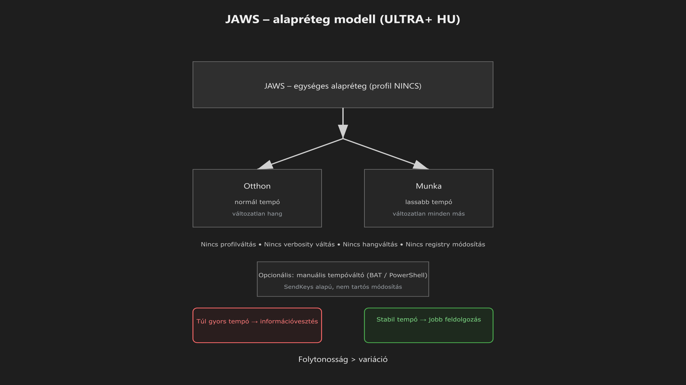

-   

    # 30. JAWS for Windows (alapréteg modell) { #30-jaws-for-windows-alapreteg-modell }

    > Szerző: Hegedüs Gábor (@hege-g) 
    > Licenc: [MIT (Kód) / CC BY-NC-ND 4.0 (Docs)] 
    > Frostwood Docs: v1.0.0 
    > Rendszerverzió / Állapot: v1.0.5 / Stabil 
    > Blokk:  Alkalmazások

-   ## Tartalomkártyák

    * [:material-infinity: 1. Cél](#1-cel)
    * [:material-infinity: 2. Profilmodell (Frostwood döntés)](#2-profilmodell-frostwood-dontes)
        * [:material-infinity: 2.1 Egyetlen profil logika](#21-egyetlen-profil-logika)
    * [:material-infinity: 3. Otthon vs Munka viselkedés](#3-otthon-vs-munka-viselkedes)
    * [:material-infinity: 4. Miért csak tempó?](#4-miert-csak-tempo)
    * [:material-infinity: 5. Opcionális gyorsváltó (manuális, ajánlott)](#5-opcionalis-gyorsvalto-manualis-ajanlott)
        * [:material-infinity: 5.1 Telepítési mappastruktúra](#51-telepitesi-mappastruktura)
        * [:material-infinity: 5.2 Használat](#52-hasznalat)
        * [:material-infinity: 5.3 Parancsikonok](#53-parancsikonok)
    * [:material-infinity: 6. Technikai működés (SendKeys modell)](#6-technikai-mukodes-sendkeys-modell)
    * [:material-infinity: 7. JAWS + Frostwood interakciós elvek](#7-jaws-frostwood-interakcios-elvek)
        * [:material-infinity: 7.1 Multi-signal tilalom](#71-multi-signal-tilalom)
        * [:material-infinity: 7.2 Stabil fókusz](#72-stabil-fokusz)
    * [:material-infinity: 8. Mit nem csinál a Frostwood](#8-mit-nem-csinal-a-frostwood)
    * [:material-infinity: 9. Munka asztal kapcsolat](#9-munka-asztal-kapcsolat)
    * [:material-infinity: 10. Travel Mode kapcsolat](#10-travel-mode-kapcsolat)
    * [:material-infinity: 11. Accessibility elvi kapcsolat](#11-accessibility-elvi-kapcsolat)
    * [:material-infinity: 12. Mentális terhelés modell](#12-mentalis-terheles-modell)
    * [:material-infinity: 13. Gyors ellenőrző lista](#13-gyors-ellenorzo-lista)

## 1. Cél

A Frostwood egyik legalapvetőbb elve:

???+ quote "Alapelv"
    > A rendszer képernyőolvasóval is stabil, kiszámítható és zajszegény legyen.

Ebben a modellben a JAWS nem kiegészítő elem, hanem **alapréteg**.

A Frostwood a JAWS-t:

* nem tematizálja
* nem próbálja „Frostwoodos külsejűvé” tenni
* nem automatizálja túl
* nem módosítja agresszíven registry-n keresztül

A cél:

* stabil napi működés
* kontrollált beszédtempó
* kiszámítható viselkedés
* Munka módban csökkentett kognitív terhelés

---

## 2. Profilmodell (Frostwood döntés)

### 2.1 Egyetlen profil logika

A Frostwood döntése szerint:

* nincs külön Otthon / Munka JAWS-profil
* nincs automatikus profilváltás
* nincs agresszív konfigurációs beavatkozás
* nincs registry-manipuláció a profilrendszer mögött

Indokok:

* verziófüggetlenebb működés
* kisebb hibalehetőség
* könnyebb karbantarthatóság
* kisebb kognitív eltérés két állapot között

A Frostwood itt tudatosan a **kevesebb változó = nagyobb stabilitás** elvét követi.

---

## 3. Otthon vs Munka viselkedés

??? info "Vizuális leírás akadálymentesítéshez"
    A diagram a JAWS képernyőolvasót a Frostwood rendszer alaprétegeként ábrázolja.

    A felhasználó bemenete a JAWS-on keresztül halad, amely egységes, változatlan konfigurációval működik. A rendszer két állapotot különböztet meg: Otthon és Munka.

    A két állapot között az egyetlen különbség a beszédtempó: Otthon módban normál tempó, Munka módban enyhén lassabb tempó használatos.

    A diagram külön kiemeli, hogy más paraméterek nem változnak: nincs profilváltás, nincs verbosity-módosítás, nincs hangkarakter-váltás, és nincs registry-szintű beavatkozás.

    A cél a megszokott működés megőrzése mellett a mentális terhelés csökkentése.

A Frostwood alapfilozófiája a kiszámíthatóság: a JAWS-élmény magja stabil marad, csak a befogadás ritmusa változik.

-   ### :material-cube-outline: Otthon (Karakter mód)

    **A megszokott dinamika**

    * **Beszédtempó:** Normál (felhasználói alapértelmezés).
    * **Verbózítás:** Alapértelmezett.
    * **Hangkarakter:** Változatlan.
    * **Szintaxis:** Standard.

-   ### :material-cube: Munka (Fókusz mód)

    **A tudatos lassítás**

    * **Beszédtempó:** **Lassabb (3 lépéssel csökkentve)**.
    * **Verbózítás:** Azonosság (nincs extra infózaj).
    * **Hangkarakter:** Azonosság (megszokott hang).
    * **Szintaxis:** Azonosság (konzisztens logika).

???+ quote "Alapelv"
    > Munka módban csak a tempó csökken, a rendszer identitása nem változik.

Ez nagyon fontos Frostwood-döntés.

A Munka mód **nem** jelent:

* új hangot
* másik beszédprofilt
* részletesebb vagy szegényebb verbosity-t
* szokatlan működési érzetet

A cél nem az, hogy új JAWS-élmény jöjjön létre, hanem hogy:

> Ugyanaz a megszokott rendszer kicsit lassabb, nyugodtabb ritmusban működjön.

---

## 4. Miért csak tempó?

Minél több beszédparaméter változik egyszerre, annál instabilabb lesz a használati élmény.

A beszédtempó azért ideális beavatkozási pont, mert:

* közvetlenül hat az információ feldolgozhatóságára
* nem bontja meg a megszokott hangkaraktert
* nem zavarja az izommemóriát
* nem kényszerít új hallási alkalmazkodást

Frostwood cél:

> Kevesebb inger, nem új inger.

Ez a különbség nagyon fontos a napi, hosszú használhatóság szempontjából.

---

## 5. Opcionális gyorsváltó (manuális, ajánlott)

A Frostwood opcionálisan adhat egy egyszerű, manuális gyorsváltó csomagot:

* `JAWS_WORK_SLOW.bat`
* `JAWS_HOME_NORMAL.bat`
* `JAWS_Speed.ps1`

Ez a modell:

* nem módosít külön JAWS-profilt
* nem ír át tartós konfigurációt
* nem telepít mély scriptelést
* csak a már futó JAWS tempóját változtatja

-   ### 5.1 Telepítési mappastruktúra

    Payload\Tools\JAWS\ 
        JAWS_WORK_SLOW.bat 
        JAWS_HOME_NORMAL.bat 
        JAWS_Speed.ps1

-   ### 5.2 Használat

    Munka esetén:

    * `JAWS_WORK_SLOW.bat`
    * `JAWS_HOME_NORMAL.bat`

    Otthon esetén:

    * `JAWS_HOME_NORMAL.bat`

    Ez a gyakorlatban azt jelenti, hogy a váltás:

    * tudatos
    * kézi
    * egyszerű
    * visszafordítható

-   ### 5.3 Parancsikonok

    Opcionálisan létrehozható például:

    * :material-speedometer: `JAWS_Normal.ico`
    * Normál – JAWS tempó

    * :material-speedometer-slow: `JAWS_Lassubb.ico`
    * Lassúbb – JAWS tempó

    Ajánlott elhelyezés:

    * Otthon asztal → normál tempó
    * Munka asztal → lassúbb tempó
    * Munka asztal → normál tempó
    * szükség esetén mindkét asztalon elérhető lehet a normál visszaállító ikon

---

## 6. Technikai működés (SendKeys modell)

A gyorsváltó technikai elve egyszerű:

* PowerShell-alapú `SendKeys` működés
* a JAWS felé tempóállító billentyűparancsot küld

???+ note "Megjegyzés"
    A tempóváltó szkript nem vált át Narrátorra, csak a JAWS belső paramétereit módosítja.

A leírás szerint ez jellemzően:

* `PageUp`
* `PageDown`

jellegű vezérlésre épül.

???+ warning "Fontos megjegyzések"
    * a JAWS-nak futnia kell
    * ha az aktuális alkalmazás elnyeli a `PgUp` / `PgDn` működést, szükség lehet fókuszváltásra
    * laptopon bizonyos esetekben `Fn` kombináció is érintett lehet

    A Frostwood itt nem mély integrációt akar, hanem egyszerű, praktikus vezérlést.

---

## 7. JAWS + Frostwood interakciós elvek

-   ### 7.1 Multi-signal tilalom

    ???+ warning "Figyelem"
        Ha egyszerre aktív:

        * Zoom hang
        * Windows értesítés
        * JAWS beszéd

        akkor könnyen létrejön a Frostwood által kerülendő állapot:

        > Kognitív túlterhelés több, egymással versengő jelzési csatornából.

    A Frostwood célja:

    * egy inger egyszerre
    * kevesebb párhuzamos jelzés
    * világos prioritások

-   ### 7.2 Stabil fókusz

    Munka módban különösen fontos:

    * kevesebb popup
    * kevesebb animáció
    * fix vezérlősávok
    * billentyűvezérelt navigáció
    * kiszámítható fókuszmozgás

    A JAWS önmagában is képes nagy információs sűrűséget közvetíteni, ezért a Frostwood az egész rendszer többi részét is ehhez igazítja.

---

## 8. Mit nem csinál a Frostwood

* Nem telepít JAWS-scripteket
* Nem módosít verbosity-profilt
* Nem állít át központozás / írásjelek módot
* Nem változtat hangkaraktert
* Nem hookolja a JAWS API-t
* Nem figyeli vagy írja a JAWS registry-beállításait
* Nem próbál automatikus, bonyolult állapotgépet építeni a JAWS köré

---

## 9. Munka asztal kapcsolat

Munka asztalon:

* a JAWS természetesen jelen lehet
* nem kap külön vizuális kezelést
* nem indul újra automatikusan a Frostwood miatt
* nem vált külön profilra
* ugyanaz az alapréteg marad, legfeljebb lassabb tempóval

Ez jól illeszkedik a Frostwood azon elvéhez, hogy a képernyőolvasó ne külön „üzemmódokat”, hanem **stabil használati folytonosságot** adjon.

---

## 10. Travel Mode kapcsolat

A JAWS nem része a Frostwood állapotmentési modellnek.

-   ### Travel ON

    * a JAWS állapota nem változik
    * a tempó nem resetelődik automatikusan
    * a Frostwood nem próbál képernyőolvasó-profilt menteni vagy visszatölteni

-   ### Travel OFF

    * a Frostwood egyéb állapotai visszaállhatnak
    * a JAWS viszont változatlan marad, hacsak a felhasználó kézzel nem módosítja

    Indok:

???+ quote "Alapelv"
        > A JAWS túl személyes és túl kritikus munkaréteg ahhoz, hogy rejtett automatika kezelje.

---

## 11. Accessibility elvi kapcsolat

Kapcsolódó dokumentum:

[06. Rendszerszintű akadálymentességi alapelvek](06-rendszerszintu-akadalymentessegi-alapelvek.md#06-rendszerszintu-akadalymentessegi-alapelvek)

A JAWS a Frostwoodban:

* az akadálymentességi alapréteg része
* nem opcionális „extra feature”
* nem külön dizájnmodul
* nem vizuális elem

Ez a teljes rendszer logikáját befolyásolja:

* kevesebb popup
* kevesebb párhuzamos jelzés
* stabilabb fókusz
* nyugodtabb munkaritmus

---

## 12. Mentális terhelés modell

Ha a beszédtempó túl gyors:

* nő az információvesztés esélye
* több a visszagörgetés igénye
* nagyobb a stressz
* gyorsabban jön a mentális kifáradás

Ha a tempó enyhén lassabb:

* stabilabb feldolgozás
* kevesebb hiba
* nyugodtabb ritmus
* hosszú munka során fenntarthatóbb figyelem

A Frostwood ezért Munka módban nem teljes karakterváltást, hanem csak **enyhe ritmuslassítást** javasol.

---

## 13. Gyors ellenőrző lista

* :material-checkbox-blank-outline: Egyetlen JAWS-profil logika van használatban?
* :material-checkbox-blank-outline: Munka módban a tempó lassabb, de minden más lényegében azonos?
* :material-checkbox-blank-outline: A verbosity nem változik automatikusan?
* :material-checkbox-blank-outline: Nincs scripttelepítés és nincs registry-manipuláció?
* :material-checkbox-blank-outline: A rendszer egésze támogatja a nyugodt, megszakítás-szegény képernyőolvasós munkát?