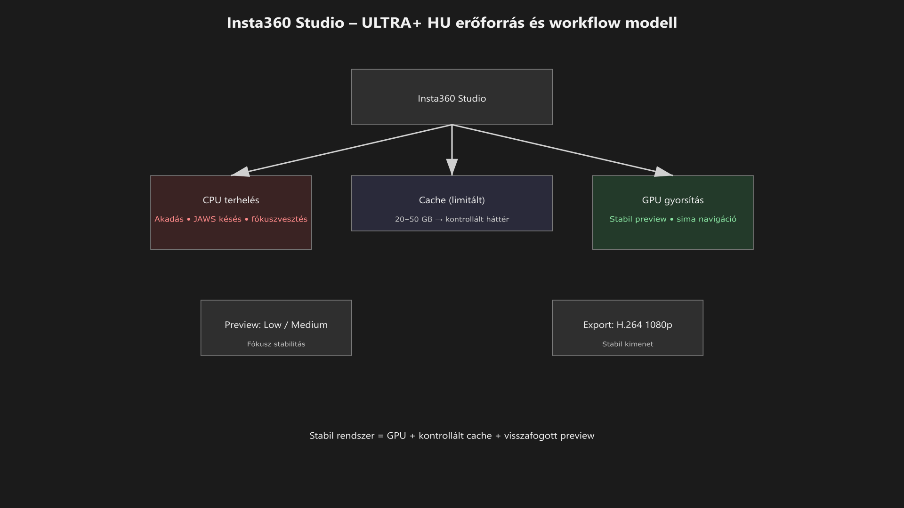

<div class="grid cards frostwood-header-cards" markdown>

-   <span class="fw-module-header-icon fw-module-31" aria-hidden="true"></span>

    # 31. Insta360 Studio (csak „Munka” asztalon) { #31-insta360-studio-csak-munka-asztalon }

    > Szerző: Hegedüs Gábor (@hege-g)<br>
    > Licenc: [MIT (Kód) / CC BY-NC-ND 4.0 (Docs)]<br>
    > Frostwood Docs: v1.0.0<br>
    > Rendszerverzió / Állapot: v1.0.5 / Stabil<br>
    > Blokk: <span class="fw-block-icon-main-alkalmazasok" aria-hidden="true"></span> Alkalmazások

</div>

<div class="grid cards frostwood-toc-cards" markdown>

-   ## Tartalomkártyák

    * [:material-infinity: 1. Cél](#1-cel)
    * [:material-infinity: 2. Hatókör és szerep](#2-hatokor-es-szerep)
    * [:material-infinity: 3. Teljesítmény – elsődleges beállítások](#3-teljesitmeny-elsodleges-beallitasok)
        * [:material-infinity: 3.1 Hardveres gyorsítás (kötelező alap)](#31-hardveres-gyorsitas-kotelezo-alap)
        * [:material-infinity: 3.2 Cache (gyorsítótár) – kontrollált méret](#32-cache-gyorsitotar-kontrollalt-meret)
    * [:material-infinity: 4. Előnézet (Preview) – „ne fagyjon le a fókusz”](#4-elonezet-preview-ne-fagyjon-le-a-fokusz)
    * [:material-infinity: 5. Mentés és könyvtárstruktúra (Frostwood ajánlás)](#5-mentes-es-konyvtarstruktura-frostwood-ajanlas)
    * [:material-infinity: 6. Nyelv (Language) – miért ajánlott az English](#6-nyelv-language-miert-ajanlott-az-english)
    * [:material-infinity: 7. Gyorsbillentyűk (Windows)](#7-gyorsbillentyuk-windows)
        * [:material-infinity: 7.1 Lejátszás és navigáció](#71-lejatszas-es-navigacio)
        * [:material-infinity: 7.2 Vágás, jelölés, mentés](#72-vagas-jeloles-mentes)
        * [:material-infinity: 7.3 Import / export](#73-import-export)
    * [:material-infinity: 8. JAWS / NVDA használati tippek](#8-jaws-nvda-hasznalati-tippek)
        * [:material-infinity: 8.1 Ha a billentyűk „nem hatnak”](#81-ha-a-billentyuk-nem-hatnak)
        * [:material-infinity: 8.2 Trim gyorsan](#82-trim-gyorsan)
        * [:material-infinity: 8.3 Akadás = terhelés](#83-akadas-terheles)
    * [:material-infinity: 9. Export preset iPhone 13 mini használathoz](#9-export-preset-iphone-13-mini-hasznalathoz)
    * [:material-infinity: 10. „Munka” szabályok és kivételek](#10-munka-szabalyok-es-kivetelek)
        * [:material-infinity: 10.1 Szabályok](#101-szabalyok)
        * [:material-infinity: 10.2 Kivételek](#102-kivetelek)
    * [:material-infinity: 11. Mentális terhelés modell](#11-mentalis-terheles-modell)
    * [:material-infinity: 12. Gyors ellenőrző lista (Munka)](#12-gyors-ellenorzo-lista-munka)

</div>

## 1. Cél

Az Insta360 Studio a Frostwood rendszerben **nem vizuális identitás-réteg**, hanem egy **nagy erőforrásigényű, specializált munkaeszköz**.

A Frostwood célja ennél az alkalmazásnál nem az, hogy kinézetben alakítsa át, hanem az, hogy:

* stabilan használható maradjon képernyőolvasó mellett
* export és előnézet közben se akassza meg indokolatlanul a rendszert
* a mentés és export mindig kiszámítható helyre történjen
* a Munka asztalon halk, semleges, fókuszbarát eszközként működjön

A vizuális irány itt:

* nincs extra témázás
* nincs narancsos Frostwood-branding
* nincs agresszív finomhangolás
* csak a szükséges beállításokkal dolgozunk

???+ quote "Alapelv"
    > **Frostwood elv:** itt beállításokkal dolgozunk, nem hackkel, nem injektálással, nem instabil kerülőmegoldásokkal.


---

## 2. Hatókör és szerep

Az Insta360 Studio a Frostwoodban:

???+ warning "Fontos"
    Csak Munka asztalon javasolt


* nem kap külön Otthon-profilt
* nem válik általános médiaböngésző alkalmazássá
* nem része a halk, napi alapalkalmazás-rétegnek

Ennek oka kettős:

* teljesítményigényes
* fókuszszempontból könnyen túlterhelő lehet

A program kezelőfelülete részben saját rajzolt UI-elemeket használhat, ezért képernyőolvasóval nem minden elem lesz egyformán kényelmes vagy következetes. Emiatt a Frostwood szemléletben a siker kulcsa:

* a stabil workflow
* az ismert mentési útvonal
* az egyszerű, ismételhető beállításkészlet
* és a gyorsbillentyű-alapú munkamód

---

## 3. Teljesítmény – elsődleges beállítások

A legfontosabb Frostwood-elv ennél a programnál:

> Az Insta360 Studio lehetőleg ne a CPU-t terhelje túl, mert az közvetlenül rontja a képernyőolvasó reakcióidejét és a teljes rendszer válaszkészségét.

A szükséges beállításokat keresd itt:

**Settings → Preferences**



??? info "Vizuális leírás akadálymentesítéshez"
    A diagram az Insta360 Studio erőforrás-használatának modelljét mutatja.

    A rendszer két fő feldolgozási réteget különböztet meg: a CPU-t és a GPU-t.
    A CPU a kritikus erőforrás, amely a Windows és a képernyőolvasó működését is befolyásolja.

    Az ábra kiemeli, hogy ha az Insta360 Studio túlzottan a CPU-t terheli, akkor a képernyőolvasó késni kezdhet, a fókusz instabillá válhat, és a rendszer reakcióideje romlik.

    Ezzel szemben a GPU használata – hardware acceleration bekapcsolásával – tehermentesíti a CPU-t, így a teljes rendszer stabilabb marad.

    A diagram ezért javasolja: a hardware acceleration bekapcsolását, valamint az alacsony vagy közepes preview minőséget, hogy a navigáció és a képernyőolvasó működése folyamatos és kiszámítható maradjon.


<div class="grid cards frostwood-section-cards frostwood-numbered-card" markdown>

-   ### 3.1 Hardveres gyorsítás (kötelező alap)

    Ajánlott beállítás:

    * **Hardware Acceleration – Decoding:** On / Enable
    * **Hardware Acceleration – Encoding:** On / Enable

    Miért fontos?

    * előnézet közben a GPU veszi át a terhelés jelentős részét
    * exportnál kisebb az esélye annak, hogy a rendszer „megül”
    * a Windows felület és a JAWS / NVDA reakcióideje stabilabb maradhat
    * kisebb lesz a fókuszvesztésből eredő használati bizonytalanság

    A Frostwood itt nem a maximális nyers teljesítményt, hanem a **stabil, több komponens együttélésére alkalmas működést** keresi.

-   ### 3.2 Cache (gyorsítótár) – kontrollált méret

    Ajánlott:

    * **Limit Cache Size:** 20 GB

    Ha külön gyors SSD áll rendelkezésre és nagy mennyiségű anyaggal dolgozol:

    * 30–50 GB is lehet elfogadható

    De szabály:

    > Cache-limit mindig legyen.

    Miért fontos?

    * megakadályozza, hogy a gyorsítótár észrevétlenül túl nagyra nőjön
    * csökkenti a háttértároló túlterhelésének esélyét
    * kisebb a váratlan lassulás vagy helyhiány kockázata
    * könnyebben átlátható marad a rendszerállapot

    ???+ quote "Alapelv"
        > A Frostwood szempontból a cache nem „majd lesz valahogy” terület, hanem kontrollált háttérmechanizmus.


</div>

---

## 4. Előnézet (Preview) – „ne fagyjon le a fókusz”

**Playback Quality**

Ajánlott:

* **Low**
* vagy **Medium**

Indoklás:

Ez kizárólag az előnézet minőségére vonatkozik, nem a végső export minőségére.
A cél az, hogy navigáció, vágás, idővonal-kezelés és fókuszváltás közben ne nőjön meg indokolatlanul a rendszerterhelés.

Előnyök:

* kisebb akadás
* gyorsabb reakció
* kényelmesebb billentyűs navigáció
* stabilabb képernyőolvasó-visszajelzés

A Frostwood itt azt mondja:

???+ quote "Alapelv"
    > Az előnézet legyen elég jó a munkához, de ne olyan nehéz, hogy szétessen a fókusz.


---

## 5. Mentés és könyvtárstruktúra (Frostwood ajánlás)

A cél az, hogy export után **mindig ismert helyen legyen a fájl**, és ne kelljen keresgélni, hogy hová mentett a program.

??? tip "Ajánlott gyökérmappa"
    ```text title="Text"
    d:\Dokumentumok\Insta360\Studio\
    ```


??? tip "Ajánlott mappastruktúra"
    ```text title="Text"
    d:\Dokumentumok\Insta360\Studio\Projects\
    d:\Dokumentumok\Insta360\Studio\Exports\
    d:\Dokumentumok\Insta360\Studio\Download\
    d:\Dokumentumok\Insta360\Studio\Cache\
    ```


Ez a struktúra azért jó, mert:

* szétválasztja a projektfájlokat és a kész exportokat
* könnyebb archiválást ad
* kisebb az esélye a fájlok összekeverésének
* támogatja a Frostwood általános mentési logikáját

<div class="grid cards frostwood-section-cards frostwood-numbered-card" markdown>

-   ### Default Export Path

    A Frostwood elv itt egyszerű:

    ???+ quote "Alapelv"
        > Az         export mindig kiszámítható, ismert, visszakereshető helyre menjen.


-   ### Auto-save

    Ajánlott:

    * **Auto-save Project:** On
    * **Időköz:** 5 perc

    Miért fontos?

    * nagy fájloknál vagy hosszabb munkafolyamatnál nő a hibakockázat
    * előfordulhat fagyás, export közbeni instabilitás vagy váratlan bezáródás
    * az autosave csökkenti az adatvesztés esélyét

    A Frostwood ezt nem kényelmi funkciónak, hanem **munkabiztonsági rétegnek** tekinti.

</div>

---

## 6. Nyelv (Language) – miért ajánlott az English

Ajánlott:

* **Language:** English

Indoklás képernyőolvasós használatnál:

* az angol UI-feliratok gyakran következetesebbek
* kisebb az esélye a félrefordított vagy furcsán felolvasott vezérlőknek
* a programhoz kapcsolódó útmutatók és billentyűlisták jellemzően angol terminológiára épülnek
* könnyebb az internetes segítségek és fórumok követése is

A Frostwood itt nem nyelvi elvet mond ki, hanem gyakorlati stabilitási elvet:

???+ quote "Alapelv"
    > Azt a nyelvet érdemes használni, amelyik a legkevesebb bizonytalanságot okozza.


---

## 7. Gyorsbillentyűk (Windows)

???+ note "Megjegyzés"
    Verziónként eltérhet néhány billentyű. Ha valamelyik nem működik, a listát iránymutatásként kezeld, és ellenőrizd a program aktuális menüjében vagy billentyű-beállításaiban.


A gyorsbillentyűk azért különösen fontosak, mert ennél az alkalmazásnál a képernyőolvasós használat sokszor gyorsabb és stabilabb, ha nem egérrel, hanem ismert billentyű-alapú munkamenettel haladsz.

<div class="grid cards frostwood-section-cards frostwood-numbered-card" markdown>

-   ### 7.1 Lejátszás és navigáció

    * `Space` → Lejátszás / Szünet
    * `J` → Vissza
    * `L` → Előre
    * `K` → Megállítás
    * `Bal nyíl` → 1 képkocka vissza
    * `Jobb nyíl` → 1 képkocka előre
    * `Shift + Bal nyíl` → 1 másodperc vissza
    * `Shift + Jobb nyíl` → 1 másodperc előre

-   ### 7.2 Vágás, jelölés, mentés

    * `I` → Kezdőpont (In)
    * `O` → Végpont (Out)
    * `Ctrl + S`         → Mentés (projekt)
    * `Ctrl + Z` → Visszavonás
    * `Ctrl + Shift + Z` → Mégis

-   ### 7.3 Import / export

    * `Ctrl + I` → Import
    * `Ctrl + E` → Export

</div>

---

## 8. JAWS / NVDA használati tippek

Frostwood szempontból itt nem az a cél, hogy minden UI-elemet tökéletesen felolvasott, hagyományos asztali alkalmazásként kezeljünk, hanem az, hogy kialakuljon egy **stabil munkaritmus**.

<div class="grid cards frostwood-section-cards frostwood-numbered-card" markdown>

-   ### 8.1 Ha a billentyűk „nem hatnak”

    Előfordulhat, hogy a program csak akkor veszi át megfelelően a billentyűparancsokat, ha az előnézeti videófelület van fókuszban.

    Ilyenkor:

    * fókuszold újra az előnézetet
    * kattints az előnézeti felületre
    * próbáld meg utána újra a lejátszás- vagy navigációs billentyűket
    * ha a `Space` nem indítja a lejátszást, az `Alt` billentyű egyszeri megnyomása, majd a fókusz visszavitele a videóra gyakran „felszabadítja” a billentyűzetet a JAWS számára.

-   ### 8.2 Trim gyorsan

    Ha csak egy részletre van szükség, használd az:

    * `I` — kezdőpont
    * `O` — végpont

    jelölést, és ne a teljes nyers anyagot exportáld.

    Ez:

    * gyorsabb
    * kisebb terheléssel jár
    * rövidebb exportidőt ad
    * kevesebb hibalehetőséget hordoz

-   ### 8.3 Akadás = terhelés

    Ha export vagy nehéz előnézet közben a JAWS vagy NVDA késik, akadozik vagy lassabban reagál, azt nem érdemes önmagában képernyőolvasó-hibának tekinteni.

    ??? tip "Tipp"
        Exportálás közben javasolt a JAWS beszédet ideiglenesen elnémítani `Insert + Space`, majd `S`, hogy a rendszer minden erejét a kódolásra fordíthassa, és elkerüljük az akadozó beszéd okozta stresszt.


    Gyakori ok:

    * túl magas preview minőség
    * gyenge vagy kikapcsolt GPU-gyorsítás
    * túl nagy aktuális projektterhelés
    * háttértár- vagy cache-probléma

    Ilyenkor az első lépések:

    * Preview Quality visszavétele
    * Hardware Acceleration ellenőrzése
    * cache-limit és tárhely ellenőrzése

</div>

---

## 9. Export preset iPhone 13 mini használathoz

A cél:

* jó minőség
* nem túl nagy fájlméret
* stabil lejátszhatóság
* könnyű kezelhetőség telefonon és általános környezetben is

??? tip "Ajánlott preset név"
    ```text title="Text"
    I360_iPhone13mini
    ```


Ajánlott paraméterek:

* **Resolution:** 1080p (Full HD)
* **Frame rate:** 30 fps
* **Bitrate:** kb. 20–25 Mbps
* **Encoding:** H.264

???+ note "Megjegyzés"
    * sportosabb vagy gyorsabb mozgású anyagnál a `60 fps` indokolt lehet
    * ha egy adott projektben a `H.265` stabilan működik és előnyt ad, használható
    * Frostwood v1.0.x alapon viszont a **H.264 a biztos, kompatibilis kiindulópont**


Ez illeszkedik ahhoz a Frostwood-elvhez, hogy:

???+ quote "Alapelv"
    > Az alapbeállítás legyen megbízhatóbb, mint látványosan „modern”, de kiszámíthatatlan.


---

## 10. „Munka” szabályok és kivételek

<div class="grid cards frostwood-section-cards frostwood-numbered-card" markdown>

-   ### 10.1 Szabályok

    * **Insta360 Studio** csak Munka asztalon
    * :material-check-circle-outline: **Hardveres gyorsítás:** BE
    * :material-monitor-screenshot: **Preview Quality:** Low / Medium
    * :material-folder-alert: **Export hely:** fix, ismert mappa
    * Auto-save: **bekapcsolva**
    * nincs narancsos branding
    * nincs extra vizuális díszítés

-   ### 10.2 Kivételek

    * ha egy projekt miatt nagyobb preview kell, ideiglenesen használható `Medium` vagy `High`
    * ha a cache-limit a tényleges munkához túl kicsi, növelhető
    * de a limitet nem hagyjuk el teljesen

    A Frostwood kivétellogikája itt is ugyanaz:

    ???+ quote "Alapelv"
        > Ideiglenes eltérés megengedett, állandó bizonytalanság nem.


</div>

---

## 11. Mentális terhelés modell

???+ note "Megjegyzés"
    Az Insta360 Studio nem könnyű, „háttérben is elvan” típusú alkalmazás.


Jellemzően:

* nagy erőforrást igényel
* több párhuzamos terhelést generál
* könnyen rontja a rendszer reakcióidejét
* képernyőolvasó mellett különösen érzékeny lehet a túlterhelésre

A Frostwood célja ezért:

* ne legyen belőle általános használatú alkalmazás
* ne fusson fölöslegesen
* ne legyen több szerepe, mint ami kell
* maradjon specializált, kontrollált munkaeszköz

Munka módban az alapelv:

???+ quote "Alapelv"
    > A videoszerkesztő nem vizuális élménytér, hanem terhelésérzékeny munkafelület.


---

## 12. Gyors ellenőrző lista (Munka)

* :material-checkbox-blank-outline: Export után a fájl mindig az `Exports` mappába kerül?
* :material-checkbox-blank-outline: Preview közben a Windows és a JAWS / NVDA nem „ül le”?
* :material-checkbox-blank-outline: A **Hardware Acceleration – Decoding** és **Encoding** be van kapcsolva?
* :material-checkbox-blank-outline: A cache méretlimit be van állítva?
* :material-checkbox-blank-outline: Az AutoSave aktív, 5 perces mentéssel?
* :material-checkbox-blank-outline: A program English nyelven fut?
* :material-checkbox-blank-outline: A használat valóban csak Munka asztalra korlátozódik?