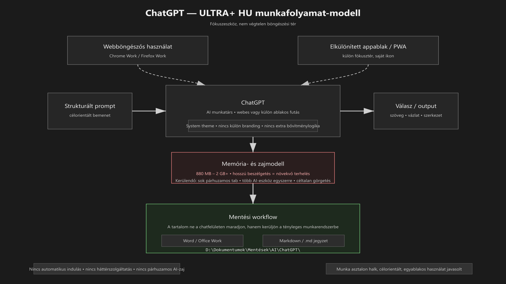

<div class="grid cards frostwood-header-cards" markdown>

-   <span class="fw-module-header-icon fw-module-32" aria-hidden="true"></span>

    # 32. OpenAI ChatGPT { #32-openai-chatgpt }

    > Szerző: Hegedüs Gábor (@hege-g)<br>
    > Licenc: [MIT (Kód) / CC BY-NC-ND 4.0 (Docs)]<br>
    > Frostwood Docs: v1.0.0<br>
    > Rendszerverzió / Állapot: v1.0.5 / Stabil<br>
    > Blokk: <span class="fw-block-icon-main-alkalmazasok" aria-hidden="true"></span> Alkalmazások

</div>

<div class="grid cards frostwood-toc-cards" markdown>

-   ## Tartalomkártyák

    * [:material-infinity: 1. Cél](#1-cel)
    * [:material-infinity: 2. Használati modell](#2-hasznalati-modell)
        * [:material-infinity: 2.1 Webböngészőből futtatva](#21-webbongeszobol-futtatva)
        * [:material-infinity: 2.2 Telepítési modell (PWA / elkülönített webapp)](#22-telepitesi-modell-pwa-elkulonitett-webapp)
        * [:material-infinity: 2.3 Ikonkezelés](#23-ikonkezeles)
    * [:material-infinity: 3. Erőforrás-használat](#3-eroforras-hasznalat)
    * [:material-infinity: 4. Light / Dark viselkedés](#4-light-dark-viselkedes)
        * [:material-infinity: 4.1 Webes modell](#41-webes-modell)
        * [:material-infinity: 4.2 Elkülönített appablak modell](#42-elkulonitett-appablak-modell)
    * [:material-infinity: 5. Zajmodell](#5-zajmodell)
    * [:material-infinity: 6. Billentyűhasználat](#6-billentyuhasznalat)
        * [:material-infinity: 6.1 Webböngészős kezelés](#61-webbongeszos-kezeles)
        * [:material-infinity: 6.2 Elkülönített appablak használat](#62-elkulonitett-appablak-hasznalat)
    * [:material-infinity: 7. Munka asztal viselkedés](#7-munka-asztal-viselkedes)
    * [:material-infinity: 8. Mentési workflow](#8-mentesi-workflow)
    * [:material-infinity: 9. Travel Mode kapcsolat](#9-travel-mode-kapcsolat)
    * [:material-infinity: 10. Mit nem csinál a Frostwood](#10-mit-nem-csinal-a-frostwood)
    * [:material-infinity: 11. Mentális terhelés modell](#11-mentalis-terheles-modell)
    * [:material-infinity: 12. Gyors ellenőrző lista](#12-gyors-ellenorzo-lista)

</div>

## 1. Cél

A ChatGPT a Frostwood rendszerben:

* nem közösségi alkalmazás
* nem vizuális identitás-hordozó
* nem háttérben futó szolgáltatás

hanem:

> Strukturált gondolkodási, szöveg-előkészítési és munkatámogató eszköz.

A cél:

* tiszta, stabil használat
* minimális vizuális zaj
* képernyőolvasó-barát működés
* Munka asztalon fókuszeszközként jelenjen meg
* ne váljon „végtelen görgetésű” figyelemelvonó felületté

A Frostwood szempontjából a ChatGPT nem böngészési célpont, hanem **munkafolyamatba illesztett segédeszköz**.

---

## 2. Használati modell



??? info "Vizuális leírás akadálymentesítéshez"
    Az ábra a ChatGPT Frostwood szerinti használati modelljét mutatja.

    A bal oldalon egy strukturált prompt blokk látható, amely célorientált bemenetet jelöl. Ez nyíllal kapcsolódik a középen elhelyezett ChatGPT blokkhoz, amely az AI munkatársi szerepet képviseli.

    A középső blokk jobb oldalán a válasz vagy kimenet jelenik meg, amely szöveget, szerkezetet vagy előkészített tartalmat jelent. A diagram ezzel azt mutatja, hogy a ChatGPT nem végállomás, hanem köztes munkaréteg.

    A középső tengely alatt külön blokk jelzi a memória-terhelést. Ez arra utal, hogy a hosszabb vagy nagyobb beszélgetések számottevő rendszerterhelést okozhatnak.

    Az alsó blokk a mentési workflow-t mutatja. Itt a válasz már nem a chatfelületen marad, hanem Word vagy Markdown alapú, strukturált munkafájlba kerül.

    Az ábra lényege, hogy a ChatGPT a Frostwood rendszerben fókuszeszköz, nem pedig folyamatos, végtelen görgetésű böngészési tér.


<div class="grid cards frostwood-section-cards frostwood-numbered-card" markdown>

-   ### 2.1 Webböngészőből futtatva

    A Frostwood elsődleges modellje szerint a ChatGPT:

    * webes alkalmazásként használható
    * nem igényel külön, önálló klienslogikát
    * ugyanazzal a fiókkal működhet Otthon és Munka asztalon is

    Ajánlott böngészőprofil:

    #### Munka asztalon

    * **Chrome Work**
    * vagy **Firefox Work**

    #### Otthon asztalon

    * **Chrome Home**
    * vagy **Firefox Home**

    Frostwood elv:

    > Ugyanaz a fiók használható, de a böngészőprofil legyen külön.

    Ez azért fontos, mert így:

    * nem keveredik a munkakörnyezet és az általános böngészési tér
    * a tabok, előzmények és egyéb kísérőelemek tisztábban elválnak
    * a ChatGPT használata jobban illeszthető a Home / Work munkalogikába

-   ### 2.2 Telepítési modell (PWA / elkülönített webapp)

    A ChatGPT külön alkalmazásszerű ablakként is használható.

    Ennek célja:

    * külön ablakban fusson
    * ne keveredjen a böngésző egyéb tabjaival
    * tisztább fókuszteret adjon
    * saját ikonnal jelenhessen meg a Munka asztalon
    * az `Alt + Tab` navigáció így sokkal tisztább, mert a ChatGPT nem "vész el" a többi 20 nyitott böngészőfül között.

    A Frostwood ezt azért kedveli, mert:

    > A dedikált AI-eszköz nem olvad bele a böngészési zajba.

-   ### 2.3 Ikonkezelés

    Munka asztalon ajánlott:

    * saját ChatGPT ikon
    * hivatalos, tiszta megjelenés
    * nincs narancsos Frostwood-branding
    * nincs extra színezés

    Ez követi a Frostwood általános elvét:

    ???+ quote "Alapelv"
        > A különbség a működésben legyen, ne a dekorációban.


</div>

---

## 3. Erőforrás-használat

A ChatGPT felülete jellemzően:

* erősen JavaScript-alapú
* nagy DOM-struktúrát használ
* hosszabb beszélgetésnél jelentős memóriaterhelést okozhat
* folyamatosan frissülő, dinamikus interfész

Tapasztalati használat szerint a memóriaigény:

* kb. **800 MB – 2 GB**
* hosszabb vagy nagyobb kontextusú beszélgetésnél ennél magasabb is lehet
* több párhuzamos ablak vagy tab esetén tovább nőhet

### Frostwood ajánlás

Munka módban:

* egyetlen aktív ChatGPT ablak legyen
* ne legyen sok párhuzamosan megnyitott AI-beszélgetés
* hosszú, lezárt projekt után a beszélgetés bezárható vagy archiválható
* ne fusson mellette több másik AI platform ugyanabban a pillanatban

A cél:

> A ChatGPT legyen fókuszeszköz, ne háttérben nyitva felejtett terhelési forrás.

---

## 4. Light / Dark viselkedés

<div class="grid cards frostwood-section-cards frostwood-numbered-card" markdown>

-   ### 4.1 Webes modell

    A ChatGPT felület:

    * követheti a rendszer vagy böngésző témáját
    * vagy manuálisan is állítható

    Ajánlott beállítás:

    * **System theme**

    Ez jól illeszkedik a Frostwood rendszerlogikához:

    * Light jellegű környezetben világos
    * Dark jellegű környezetben sötét
    * nincs szükség külön színezésre
    * narancs nem jelenik meg mint branding elem

-   ### 4.2 Elkülönített appablak modell

    Ha a ChatGPT külön alkalmazásszerű ablakban fut, ott is ugyanaz az elv ajánlott:

    * **System theme**
    * világos állapotban világos felület
    * sötét állapotban sötét felület

    Frostwood elv:

    > Az AI-eszköz kövesse a rendszert, ne építsen külön látványvilágot.

</div>

---

## 5. Zajmodell

A ChatGPT önmagában nem klasszikus értesítési zajforrás, de más módon mégis tud mentális terhelést okozni.

Potenciális zajforrások:

* animált válaszmegjelenés
* hosszú, nehezen áttekinthető chatlista
* több projekt összecsúszása egy beszélgetésben
* memóriahasználat miatti általános rendszerlassulás
* túl sok párhuzamos AI-ablak

Frostwood ajánlás:

* ne legyen sok párhuzamos tab
* régi beszélgetések legyenek lezárva vagy archiválva
* egy projekt lehetőleg egy beszélgetéshez kapcsolódjon
* ne fusson egyszerre több AI-platform Munka módban
* a használat legyen célorientált, ne „scrolling-böngészés”

???+ warning "Figyelem"
    Ez azért fontos, mert a ChatGPT könnyen átcsúszhat segédeszközből **folyamatos ingerterévé** a munkának.


---

## 6. Billentyűhasználat

<div class="grid cards frostwood-section-cards frostwood-numbered-card" markdown>

-   ### 6.1 Webböngészős kezelés

    A konkrét működés részben böngészőfüggő, de az alaplogika jellemzően:

    * `Tab` → fókusznavigáció
    * `Shift + Tab` → visszalépés
    * `Ctrl + L` → címsor
    * `Enter` → prompt küldése
    * `Ctrl + Enter` → bizonyos környezetekben küldés vagy alternatív bevitel

    Képernyőolvasóval ajánlott:

    * régiók közötti navigáció
    * címsorok közötti ugrás
    * az üzenetmező és a beszélgetésrész tudatos elkülönítése

-   ### 6.2 Elkülönített appablak használat

    Alaplogika:

    * `Enter` → küldés
    * `Shift + Enter` → új sor
    * `Tab` → navigáció
    * `Ctrl + L` → címsor vagy felső vezérlési fókusz, ahol releváns

    Képernyőolvasóval:

    * régiók közötti mozgás
    * címsor-ugrás
    * strukturált, blokkos olvasás

    A Frostwood itt is azt támogatja, hogy a használat ne egércentrikus, hanem **fókuszvezérelt** legyen.

</div>

---

## 7. Munka asztal viselkedés

<div class="grid cards frostwood-section-cards frostwood-numbered-card" markdown>

-   ### Webböngészős használat esetén

    * jelen lehet
    * nem indul automatikusan
    * nem küldjön rendszerértesítést
    * ne maradjon folyamatosan háttérben nyitva fölöslegesen

-   ### Elkülönített alkalmazásszerű ablak esetén

    Munka asztalon ajánlott:

    * dedikált ikon
    * külön ablak
    * nem indul automatikusan
    * nem küld rendszerértesítést
    * nem fut több példányban egyszerre

    Cél:

    > A ChatGPT jelen legyen, amikor kell, és tűnjön el a munkatérből, amikor már nincs rá szükség.

</div>

---

## 8. Mentési workflow

Ha a ChatGPT-ből származó tartalom munkadokumentumba kerül, a Frostwood nem a chatfelületen hagyja „szétszórva” az eredményt.

Ajánlott lépések:

1. Jelöld ki a szükséges részt
2. Másold át:

   * Word-be
   * Jegyzettömbbe vagy Markdown-fájlba

3. Mentsd strukturált helyre

??? tip "Ajánlott mentési útvonalak"
    ```text title="Text"
    D:\Dokumentumok\Mentések\Office\Work\
    D:\Dokumentumok\Mentések\AI\ChatGPT\
    ```


Ajánlott fájlnév:

* `YYYY-MM-DD_Projekt_AI_Notes_V01.docx`
* `YYYY-MM-DD_Projekt_AI_Notes_V01.md`

A Frostwood elve:

???+ quote "Alapelv"
    > A gondolkodási segéd eredménye ne csak a chatfelületen éljen, hanem kerüljön át a tényleges munkarendszerbe.


---

## 9. Travel Mode kapcsolat

<div class="grid cards frostwood-section-cards frostwood-numbered-card" markdown>

-   ### Travel ON

    * a böngészős tab bezáródhat, ha a böngésző bezár
    * az elkülönített appablak bezárható
    * a ChatGPT nem része a Frostwood állapotmentési logikának
    * nincs külön lokális „ChatGPT-állapot” visszatöltés

-   ### Travel OFF

    * kézi visszatérés szükséges
    * a használat ugyanott folytatható, ahol a webes vagy alkalmazásszerű környezet ezt lehetővé teszi

    Frostwood elv:

    ???+ quote "Alapelv"
        > A ChatGPT nem rendszerállapot, hanem eszközhasználat.


</div>

---

## 10. Mit nem csinál a Frostwood

* Nem telepít külön, módosított ChatGPT-klienst
* Nem scripteli az oldalt
* Nem injektál egyedi CSS-t
* Nem próbálja lokálisan cache-elni a tartalmat
* Nem telepít külső plugint csak a Frostwood kedvéért
* Nem módosítja az OpenAI felületét
* Nem futtat párhuzamos AI-eszközöket Munka módban indokolatlanul

---

## 11. Mentális terhelés modell

A ChatGPT:

* gyors gondolkodási segéd
* jó vázlatoló és előkészítő eszköz
* nem végleges dokumentumtár

Munka módban az ajánlott hozzáállás:

* célorientált használat
* egyértelmű feladat
* strukturált promptolás
* nincs céltalan görgetés
* nincs „még ezt is megnézem” jellegű elkalandozás

???+ quote "Frostwood alapelv"
    > A ChatGPT munkatárs, nem tartalomfolyam.


---

## 12. Gyors ellenőrző lista

* :material-account-circle-outline: Külön böngészőprofilban használod?
* :material-eye-off-outline: Nincs indokolatlan vizuális zaj vagy extra bővítményhatás?
* :material-monitor-share: Elkülönített ablakként (PWA) fut, ha ez a kényelmesebb?
* :material-identifier: Saját ikonja van a Munka asztalon?
* :material-layers-off-outline: Nem fut több AI-eszköz egyszerre?
* :material-memory: A memóriahasználat kontrollált?
* :material-content-save-move-outline: A válasz mentése strukturált?
* :material-volume-variant-off: Munka asztalon halk, fókuszbarát környezetben fut?