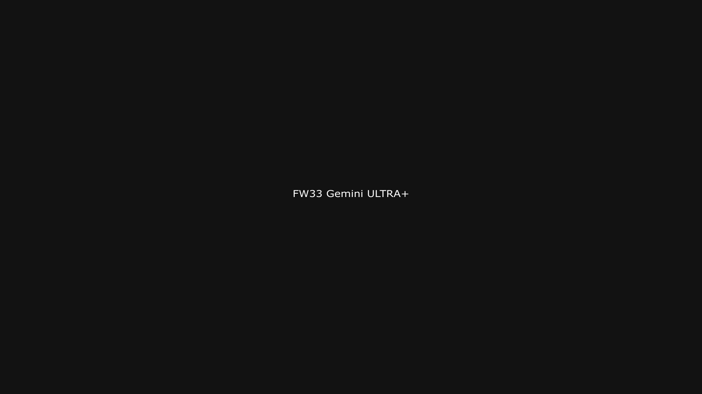

<div class="grid cards frostwood-header-cards" markdown>

-   <span class="fw-module-header-icon fw-module-33" aria-hidden="true"></span>

    # 33. Google Gemini { #33-google-gemini }

    > Szerző: Hegedüs Gábor (@hege-g)<br>
    > Licenc: [MIT (Kód) / CC BY-NC-ND 4.0 (Docs)]<br>
    > Frostwood Docs: v1.0.0<br>
    > Rendszerverzió / Állapot: v1.0.5 / Stabil<br>
    > Blokk: <span class="fw-block-icon-main-alkalmazasok" aria-hidden="true"></span> Alkalmazások

</div>

<div class="grid cards frostwood-toc-cards" markdown>

-   ## Tartalomkártyák

    * [:material-infinity: 1. Cél](#1-cel)
    * [:material-infinity: 2. Használati modell](#2-hasznalati-modell)
        * [:material-infinity: 2.1 Webböngészőből futtatva](#21-webbongeszobol-futtatva)
        * [:material-infinity: 2.2 Telepítési modell (PWA / elkülönített webapp)](#22-telepitesi-modell-pwa-elkulonitett-webapp)
        * [:material-infinity: 2.3 Ikonkezelés](#23-ikonkezeles)
    * [:material-infinity: 3. Erőforrás-használat](#3-eroforras-hasznalat)
    * [:material-infinity: 4. Google integráció](#4-google-integracio)
    * [:material-infinity: 5. Light / Dark viselkedés](#5-light-dark-viselkedes)
        * [:material-infinity: 5.1 Webes modell](#51-webes-modell)
        * [:material-infinity: 5.2 Elkülönített appablak modell](#52-elkulonitett-appablak-modell)
    * [:material-infinity: 6. Zajmodell](#6-zajmodell)
    * [:material-infinity: 7. Billentyűhasználat](#7-billentyuhasznalat)
        * [:material-infinity: 7.1 Webböngészős kezelés](#71-webbongeszos-kezeles)
        * [:material-infinity: 7.2 Elkülönített appablak használat](#72-elkulonitett-appablak-hasznalat)
    * [:material-infinity: 8. Mentési workflow](#8-mentesi-workflow)
    * [:material-infinity: 9. Munka asztal viselkedés](#9-munka-asztal-viselkedes)
    * [:material-infinity: 10. Travel Mode kapcsolat](#10-travel-mode-kapcsolat)
    * [:material-infinity: 11. Mit nem csinál a Frostwood](#11-mit-nem-csinal-a-frostwood)
    * [:material-infinity: 12. Mentális terhelés modell](#12-mentalis-terheles-modell)
    * [:material-infinity: 13. Gyors ellenőrző lista](#13-gyors-ellenorzo-lista)

</div>

## 1. Cél

A Gemini a Frostwood rendszerben:

* nem közösségi alkalmazás
* nem vizuális identitás-hordozó
* nem háttérben futó, állandó jelenlétű szolgáltatás

hanem:

* Google-alapú AI munkatárs
* strukturált gondolkodási és szöveg-előkészítési eszköz
* Google Drive / Docs környezetben is hasznos segéd

A cél:

* tiszta, stabil használat
* minimális vizuális zaj
* képernyőolvasó-barát működés
* Munka asztalon fókuszeszközként jelenjen meg
* ne olvadjon össze a teljes Google-ökoszisztéma figyelemelvonó rétegeivel

A Frostwoodban a Gemini nem „mindenre ráengedett AI”, hanem **célzott munkasegéd**.

---

## 2. Használati modell



??? info "Vizuális leírás akadálymentesítéshez"
    Az ábra a Gemini helyét mutatja a Frostwood rendszerben, különös tekintettel a böngészőprofilokra és a Google-ökoszisztémára.

    A felső rész a böngészőprofilokat mutatja két külön ágra bontva: Home és Work.

    Mindkét profil külön fut, és nem osztanak meg közös böngészési állapotot.

    A Work profil alatt jelenik meg a Gemini, mint külön ablakban vagy külön webalkalmazásként futó eszköz.

    A Gemini nem egy nagy Google-tabhalmaz részeként jelenik meg, hanem izolált, fókuszált felületként.

    A jobb oldalon a Google-ökoszisztéma elemei láthatók, például Gmail, Drive és Docs. Ezek kapcsolatban lehetnek a Gemini-vel, de nem dominálják annak működését. A kapcsolat iránya kontrollált, nem automatikus és nem folyamatos.

    Az ábra külön jelzi, hogy nem fut egyszerre több AI-eszköz Munka módban, és nincs párhuzamos AI-zaj.

    A teljes modell célja, hogy a Gemini munkatárs maradjon, ne váljon általános böngészési vagy értesítési zajforrássá.


<div class="grid cards frostwood-section-cards frostwood-numbered-card" markdown>

-   ### 2.1 Webböngészőből futtatva

    A Gemini elsődlegesen webes alkalmazásként használható.

    A Frostwood logika szerint:

    * ugyanaz a Google-fiók használható Otthon és Munka környezetben is
    * de a böngészőprofil legyen elkülönítve
    * ne keveredjen a munka és az általános Google-használat

    Ajánlott:

    #### Munka asztalon

    * **Chrome Work**
    * vagy **Firefox Work**

    #### Otthon asztalon

    * **Chrome Home**
    * vagy **Firefox Home**

    ???+ quote "Frostwood alapelv"
        > Ugyanaz a fiók megengedett, de a használati tér legyen külön.


-   ### 2.2 Telepítési modell (PWA / elkülönített webapp)

    A Gemini külön alkalmazásszerű ablakként is használható.

    Ennek előnye:

    * saját ikon
    * elkülönített ablak
    * nem keveredik a böngésző többi tabjával
    * fókuszáltabb munkatér jön létre

    A Frostwood ezt azért kedveli, mert a Gemini így kevésbé válik a teljes Google-böngészési környezet részévé.

-   ### 2.3 Ikonkezelés

    Munka asztalon ajánlott:

    * saját Gemini ikon
    * hivatalos Google-ikon
    * nincs narancsos Frostwood-branding
    * nincs extra színezés

    Ez illeszkedik a Frostwood általános szabályához:

    ???+ quote "Alapelv"
        > A megkülönböztetés működésbeli legyen, ne dekoratív.


</div>

---

## 3. Erőforrás-használat

A Gemini jellemzői:

* erősen webalkalmazás-alapú
* Google-fiókhoz kötődő háttérlogikákat is használhat
* Drive / Docs környezetben további terhelést hozhat
* több Google-tab mellett könnyen megnő a memóriahasználat

Tapasztalati memóriahasználat:

* kb. **600 MB – 1.6 GB**
* hosszabb kontextus vagy összetettebb munkamenet esetén nőhet
* több párhuzamos Google-tab jelentősen emelheti

### Frostwood ajánlás

Munka módban:

* a Gemini lehetőleg külön ablakban fusson
* a Drive, Gmail, Docs és egyéb Google oldalak ne legyenek indokolatlanul nagy számban nyitva
* projekt után a Gemini bezárható
* egyszerre csak az a Google-réteg maradjon nyitva, amely tényleg kell

Cél:

> A Gemini ne egy „Google-tabhalom” része legyen, hanem célzott munkafelület.

---

## 4. Google integráció

A Gemini egyik erőssége:

* Google Docs-kapcsolat
* Drive-közelség
* Workspace-jellegű környezetben való használhatóság

A Frostwood ezt nem tiltja, de szabályozza.

Frostwood elv:

* strukturált használat
* célhoz kötött munkamenet
* a Google-integráció legyen segítség, ne plusz zajforrás

Ezért a Gemini akkor működik jól Frostwood környezetben, ha:

* egy adott projekt támogatására használod
* nem hagyod, hogy a teljes Google-ökoszisztéma figyelmedet széthúzza
* a kapott eredményt a saját mentési rendszeredbe is kivezeted

---

## 5. Light / Dark viselkedés

<div class="grid cards frostwood-section-cards frostwood-numbered-card" markdown>

-   ### 5.1 Webes modell

    A Gemini felület:

    * követheti a rendszer vagy böngésző témáját
    * vagy kézzel is állítható

    Ajánlott:

    * **System theme**

    Ez biztosítja, hogy:

    * világos állapotban világos felületet kapj
    * sötét állapotban sötétet
    * ne kelljen külön vizuális szabályrendszert fenntartani

    Narancs itt sem használatos.

-   ### 5.2 Elkülönített appablak modell

    Ajánlott:

    * **System theme**

    Ez biztosítja, hogy:

    * világos környezetben világos
    * sötét környezetben sötét

    A Frostwood elv ugyanaz, mint a ChatGPT-nél:

    > Az AI-felület kövesse a rendszert, ne hozzon létre külön esztétikai világot.

</div>

---

## 6. Zajmodell

???+ warning "Figyelem"
    A Gemini önmagában és a Google-környezeten keresztül is okozhat zajt.


Potenciális zajforrások:

* Google-értesítések
* Drive-aktivitás
* Gmail párhuzamos jelenléte
* több Google szolgáltatás egyszerre nyitva
* animált válaszmegjelenés
* hosszú chatlista
* memóriahasználatból eredő lassulás

Frostwood ajánlás:

* a Google-értesítések legyenek minimalizálva
* a Gmail ne fusson feleslegesen aktív külön tabhalomban
* ne legyen túl sok párhuzamos Google-szolgáltatás
* a régi beszélgetések legyenek rendszerezve
* ne fusson egyszerre több AI-platform Munka módban
* egy projekt lehetőleg egy beszélgetéshez kötődjön

Cél:

> A Gemini munkafelület maradjon, ne Google-zajgyűjtő központ.

---

## 7. Billentyűhasználat

<div class="grid cards frostwood-section-cards frostwood-numbered-card" markdown>

-   ### 7.1 Webböngészős kezelés

    Alaplogika:

    * `Tab` → fókusznavigáció
    * `Shift + Tab` → vissza
    * `Ctrl + L` → címsor
    * `Enter` → prompt küldése
    * `Ctrl + Enter` → böngésző- vagy felületfüggő alternatív működés

    Képernyőolvasóval ajánlott:

    * régiók közti navigáció
    * címsorok közötti ugrás
    * az inputmező és a választerület elkülönített kezelése

-   ### 7.2 Elkülönített appablak használat

    Alap:

    * `Enter` → küldés
    * `Shift + Enter` → új sor
    * `Tab` → navigáció
    * `Ctrl + L` → felső címsor vagy felső vezérlés, ahol releváns

</div>

---

## 8. Mentési workflow

A Gemini egyik erőssége lehet a Google-kapcsolat, de Frostwood szempontból nem szerencsés, ha a munkaeredmény csak online környezetben marad.

Ajánlott lépések:

1. Jelöld ki a szükséges részt
2. Másold át:

   * Word-be
   * Jegyzettömbbe vagy Markdown-fájlba

3. Mentsd strukturált helyre

Ajánlott útvonalak:

??? tip "Tipp"
    ```text title="Text"
    D:\Dokumentumok\Mentések\Office\Work\
    D:\Dokumentumok\Mentések\AI\GEMINI\
    ```


Ajánlott fájlnév:

* `YYYY-MM-DD_Projekt_AI_Notes_V01.docx`
* `YYYY-MM-DD_Projekt_AI_Notes_V01.md`

Frostwood elv:

???+ quote "Alapelv"
    > A válasz ne csak a Google-felületen maradjon, hanem kerüljön át a saját munkarendszerbe is.


---

## 9. Munka asztal viselkedés

<div class="grid cards frostwood-section-cards frostwood-numbered-card" markdown>

-   ### Webböngésző

    * jelen lehet
    * nem indul automatikusan
    * nem küldjön rendszerértesítést
    * ne maradjon fölöslegesen háttérben nyitva

-   ### Elkülönített alkalmazásszerű ablak

    Munka asztalon ajánlott:

    * dedikált ikon
    * külön ablak
    * nem indul automatikusan
    * nem küld rendszerértesítést
    * nem fut több példányban egyszerre

    A Gemini itt is akkor működik jól, ha:

    > Jelen van, amikor kell, és nem marad zajforrásként a háttérben.

</div>

---

## 10. Travel Mode kapcsolat

<div class="grid cards frostwood-section-cards frostwood-numbered-card" markdown>

-   ### Travel ON

    * a Gemini-tabok bezáródhatnak, ha a böngésző bezár
    * az elkülönített appablak bezárható
    * nem része a Frostwood állapotmentési logikának
    * nincs külön Gemini-állapot visszatöltés

-   ### Travel OFF

    * manuális visszatérés szükséges

    A Gemini sem rendszerállapot, hanem használati eszköz.

</div>

---

## 11. Mit nem csinál a Frostwood

* Nem scripteli a Google felületét
* Nem injektál egyedi CSS-t
* Nem cache-el külön Drive-adatot lokálisan Frostwood-logika szerint
* Nem kényszerít Google Workspace-használatot
* Nem kényszerít Drive-használatot
* Nem futtat több AI-rendszert egyszerre Munka módban indokolatlanul

---

## 12. Mentális terhelés modell

A Gemini különösen hasznos lehet:

* strukturált szöveghez
* Google-környezetben végzett munkához
* vázlatoláshoz és gondolat-előkészítéshez

Munka módban az ajánlott modell:

* célorientált használat
* egy projekt = egy beszélgetés
* minimalizált Google-értesítési zaj
* nincs céltalan böngészés
* nincs túl sok párhuzamos Google-jelenlét

???+ quote "Frostwood alapelv"
    > A Gemini legyen munkatárs, ne a Google-ökoszisztéma újabb figyelemelvonó rétege.


---

## 13. Gyors ellenőrző lista

* :material-account-circle-outline: Külön böngészőprofilban használod?
* :material-bell-off-outline: A Google-értesítések minimalizálva vannak?
* :material-tab-remove: Nem fut sok párhuzamos Google-tab?
* :material-monitor-share: Elkülönített ablakként (PWA) fut?
* :material-identifier: Saját ikonja van a Munka asztalon?
* :material-memory: A memóriahasználat kontrollált?
* :material-layers-off-outline: Nem fut több AI-eszköz egyszerre?
* :material-content-save-move-outline: A válasz mentése strukturált?
* :material-volume-variant-off: Munka asztalon halk, fókuszbarát környezetben fut?