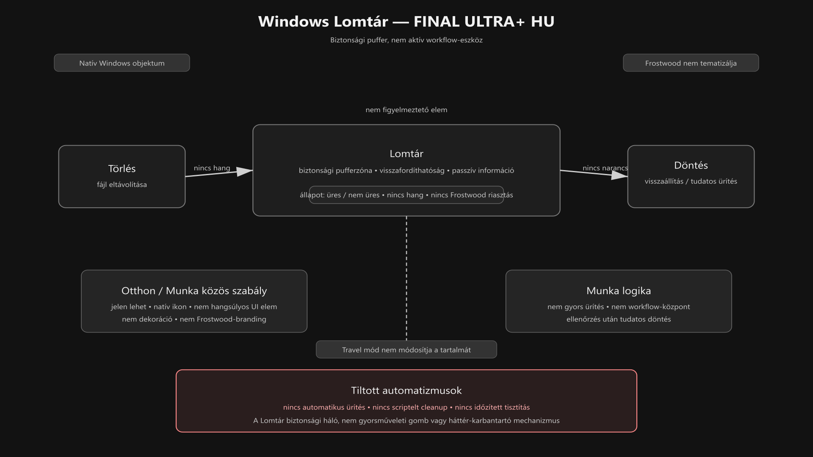

<div class="grid cards frostwood-header-cards" markdown>

-   <span class="fw-module-header-icon fw-module-34" aria-hidden="true"></span>

    # 34. Windows Lomtár (Recycle Bin) { #34-windows-lomtar-recycle-bin }

    > Szerző: Hegedüs Gábor (@hege-g)<br>
    > Licenc: [MIT (Kód) / CC BY-NC-ND 4.0 (Docs)]<br>
    > Frostwood Docs: v1.0.0<br>
    > Rendszerverzió / Állapot: v1.0.5 / Stabil<br>
    > Blokk: <span class="fw-block-icon-main-alkalmazasok" aria-hidden="true"></span> Alkalmazások

</div>

<div class="grid cards frostwood-toc-cards" markdown>

-   ## Tartalomkártyák

    * [:material-infinity: 1. Cél](#1-cel)
    * [:material-infinity: 2. Ikonviselkedés](#2-ikonviselkedes)
        * [:material-infinity: 2.1 Otthon asztal](#21-otthon-asztal)
        * [:material-infinity: 2.2 Munka asztal](#22-munka-asztal)
    * [:material-infinity: 3. Zajmodell](#3-zajmodell)
    * [:material-infinity: 4. Munka asztal logika](#4-munka-asztal-logika)
    * [:material-infinity: 5. Travel Mode kapcsolat](#5-travel-mode-kapcsolat)
    * [:material-infinity: 6. WCAG kapcsolat](#6-wcag-kapcsolat)
    * [:material-infinity: 7. Rendszerszint vs alkalmazásszint](#7-rendszerszint-vs-alkalmazasszint)
    * [:material-infinity: 8. Szabályok](#8-szabalyok)
    * [:material-infinity: 9. Ajánlott karbantartási séma](#9-ajanlott-karbantartasi-sema)
    * [:material-infinity: 10. Mit nem csinál a Frostwood](#10-mit-nem-csinal-a-frostwood)
    * [:material-infinity: 11. Mentális modell](#11-mentalis-modell)
    * [:material-infinity: 12. Gyors ellenőrző lista](#12-gyors-ellenorzo-lista)

    * [:material-infinity: A) Függelék: A Lomtár tálcára helyezésének pontos menete](#a-fuggelek-a-lomtar-talcara-helyezesenek-pontos-menete)
        * [:material-infinity: A/1. Parancsikon létrehozása](#a1-parancsikon-letrehozasa)
        * [:material-infinity: A/2. Cél megadása](#a2-cel-megadasa)
        * [:material-infinity: A/3. Elnevezés](#a3-elnevezes)
        * [:material-infinity: A/4. Ikon módosítása](#a4-ikon-modositasa)
        * [:material-infinity: A/5. Ikon kiválasztása](#a5-ikon-kivalasztasa)
        * [:material-infinity: A/6. Rögzítés a tálcára](#a6-rogzites-a-talcara)
        * [:material-infinity: A/7. Frostwood megjegyzés](#a7-frostwood-megjegyzes)

</div>

## 1. Cél

A Lomtár a Frostwood rendszerben:

* nem dekoráció
* nem ikon-hangsúly
* nem workflow-központ

hanem:

> **Biztonsági pufferzóna.**

A cél:

* a véletlen törlések visszafordíthatósága
* halk, zajmentes jelenlét
* stabil, kiszámítható működés Otthon és Munka módban is
* automatizálás nélküli, tudatos törlési kultúra

???+ quote "Alapelv"
    > Frostwood szempontjából a Lomtár nem aktív eszköz, hanem **védőréteg**.


---

## 2. Ikonviselkedés

<div class="grid cards frostwood-section-cards frostwood-numbered-card" markdown>

-   ### 2.1 Otthon asztal

    Otthon asztalon a Lomtár:

    * jelen lehet
    * a Windows alap ikonját használja
    * nem kap Frostwood-brandinget
    * nem kap narancsos kiemelést
    * nem válik hangsúlyos vizuális elemmé

-   ### 2.2 Munka asztal

    Munka asztalon a Lomtár:

    * szintén jelen lehet
    * nem kap külön színezést
    * nem kerül hangsúlyos pozícióba
    * nem válik gyorsműveleti elemmé

    A Frostwood itt is tudatosan visszafogott.

    ???+ quote "Alapelv"
        > A Frostwood nem módosítja a Lomtár grafikai megjelenését.


</div>

---

## 3. Zajmodell

A Lomtár nem klasszikus értesítési elem, de mégis hordoz állapotot.

Vizuálisan két alapállapota van:

* üres
* nem üres

A Frostwood ezt az állapotot **passzív információként** kezeli.

Ez azt jelenti, hogy:

* nem használunk figyelmeztető Frostwood-színeket
* nem emeljük ki külön
* nem társítunk hozzá hangjelzést
* nem alakítjuk át riasztásszerű elemé

A Lomtár szerepe tehát nem az, hogy állandóan emlékeztessen magára, hanem az, hogy szükség esetén rendelkezésre álljon.

---

## 4. Munka asztal logika

Munka asztalon a Lomtár nem kerülhet előtérbe mint gyorsműveleti elem.

Ezért:

* nem használjuk „gyors ürítés” ikonként
* nem workflow-eszköz
* nem lesz napi műveleti központ
* nem válik a munkavégzés látható fő részévé

Munka környezetben a törlés ajánlott modellje:

* tudatos törlés
* késleltetett véglegesítés
* időszakos kézi ellenőrzés
* csak utána ürítés

A Frostwood elv itt:

???+ warning "Fontos"
    > A törlés ne legyen reflex, hanem döntés.




??? info "Vizuális leírás akadálymentesítéshez"
    Az ábra a Windows Lomtár Frostwood-alapú működési modelljét mutatja.

    A bal oldalon a törlés jelenik meg mint kiinduló művelet. Innen a folyamat a középen elhelyezett Lomtár elemhez vezet.

    A központi blokk azt jelzi, hogy a Lomtár biztonsági pufferzóna. A törölt elem nem tűnik el azonnal, hanem ideiglenesen visszaállítható állapotban marad.

    A jobb oldalon döntési pont látható. Itt két lehetőség van: visszaállítás vagy tudatos, kézi ürítés.

    A Lomtár körül rövid viselkedési jelölések szerepelnek: passzív információ, üres vagy nem üres állapot, nincs hangjelzés, nincs narancsos kiemelés, és a Lomtár natív Windows-objektum marad.

    Az alsó külön blokk azt hangsúlyozza, hogy nincs automatikus ürítés, nincs scriptelt cleanup, és nincs időzített tisztítás.

    Az ábra lényege, hogy a Lomtár a Frostwood rendszerben nem aktív workflow-eszköz, hanem csendes, visszafordítható biztonsági réteg.


---

## 5. Travel Mode kapcsolat

<div class="grid cards frostwood-section-cards frostwood-numbered-card" markdown>

-   ### Travel BE

    * a Lomtár állapota nem változik
    * nincs automatikus ürítés
    * nincs háttérmódosítás
    * nincs állapotátírás

-   ### Travel KI

    * a Lomtár továbbra is változatlan marad
    * a Frostwood nem végez utólagos tisztítást

    Ez fontos alapelv:

    ???+ quote "Alapelv"
        > A Travel mód nem töröl adatot.<br>
        > A Travel nem „karbantartó” vagy „tisztító” funkció, hanem állapotkezelési réteg.


</div>

---

## 6. WCAG kapcsolat

WCAG szempontból a Lomtár a Frostwoodban azért marad egyszerű, mert a legegyszerűbb működés itt a legbiztonságosabb.

WCAG módban:

* az ikon kontrasztja a natív Windows logikát követi
* nincs extra színezés
* nincs villogás
* nincs állapot-színkódolás Frostwood oldalról
* nincs mesterséges kiemelés

A Frostwood itt is a zajcsökkentési elvet követi:

> Nem kell minden állapotból látványos jelzést csinálni.

---

## 7. Rendszerszint vs alkalmazásszint

A Lomtár kezelésekor a Frostwood a „legkisebb beavatkozás” elvét követi.

<div class="grid cards frostwood-section-cards frostwood-numbered-card" markdown>

-   ### :material-microsoft-windows: Windows szint

    **Natív rendszerikon és natív működés.**

    A Lomtár magja az operációs rendszer része. A Frostwood nem kényszerít rá külső szoftveres skineket vagy módosítókat, amelyek lassíthatnák a rendszert vagy rontanák az akadálymentességet.

-   ### :material-cube-outline: Frostwood szint

    **Nem módosítja.**

    A Frostwood nem írja felül a rendszer alapvető binárisait. A mi szintünkön a **protokoll** és a **vizuális fegyelem** a meghatározó, nem a kódmódosítás.

-   ### :material-application-cog: Alkalmazás szint

    **Nincs külön réteg.**

    Mivel a Lomtár közvetlen rendszerelem, nincs szükség harmadik féltől származó takarító alkalmazások állandó jelenlétére vagy beépülésére.

</div>

???+ quote "Alapelv"
    > Ami rendszerszinten jól és biztonságosan működik, azt nem kell feleslegesen újratervezni.


---

## 8. Szabályok

<div class="grid cards frostwood-section-cards frostwood-numbered-card" markdown>

-   ### Kötelező

    * nincs automatikus ürítés
    * nincs script alapú törlés
    * nincs időzített tisztítás
    * a Lomtár biztonsági pufferként marad meg

-   ### Tilos

    * Munka asztalon narancs színezés
    * figyelmeztető vagy agresszív ikoncsere
    * automatizált cleanup modul
    * a Lomtár workflow-elemmé emelése

    A Frostwood itt kifejezetten a **visszafordíthatóságot** védi.

</div>

---

## 9. Ajánlott karbantartási séma

Munka rendszerben ajánlott:

* hetente egyszer manuális ellenőrzés
* ürítés csak tudatos döntés alapján
* nagyobb törlés előtt ellenőrzés
* végleges ürítés előtt gyors átnézés

Ez különösen fontos akkor, ha a rendszerben:

* projektfájlokkal dolgozol
* exportok és ideiglenes anyagok is keveredhetnek
* több mentési mappa között mozogsz

A Frostwood itt nem automatizál, hanem **döntési pontot hagy a felhasználónál**.

---

## 10. Mit nem csinál a Frostwood

* Nem figyeli a Lomtár tartalmát
* Nem küld róla értesítést
* Nem üríti automatikusan
* Nem integrálja a Signal Systembe
* Nem készít háttérben cleanup logikát
* Nem teszi a Lomtárat aktív vezérlőelemmé
* Nem távolítja el és nem módosítja a jobb gombos „Lomtár ürítése” opciót.

---

## 11. Mentális modell

A Lomtár Frostwood értelmezésben:

> Biztonsági háló, nem akciógomb.

Nem kell róla folyamatosan tudni.<br>
Nem kell állandóan szem előtt tartani.<br>
Nem kell interaktív elemként kezelni.

Csak akkor válik fontossá, amikor:

* véletlen törlés történt
* vissza kell állítani valamit
* tudatos ürítés előtt ellenőrzés szükséges

Ez a csendes jelenlét jól illeszkedik a Frostwood teljes filozófiájához.

---

## 12. Gyors ellenőrző lista

* :material-checkbox-blank-outline: A Lomtár natív Windows-objektumként maradt meg?
* :material-checkbox-blank-outline: Nincs rajta Frostwood-branding vagy narancsos kiemelés?
* :material-checkbox-blank-outline: Nincs automatikus ürítés?
* :material-checkbox-blank-outline: Nincs időzített vagy scriptelt cleanup?
* :material-checkbox-blank-outline: A Travel mód nem módosítja a tartalmát?
* :material-checkbox-blank-outline: Munka asztalon sem válik gyorsműveleti elemmé?
* :material-checkbox-blank-outline: Az ürítés tudatos, kézi döntéshez kötött?

---

<div class="grid cards frostwood-header-cards" markdown>

-   <span class="fw-appendix-header-icon fw-appendix-a" aria-hidden="true"></span>

    # A) Függelék: A Lomtár tálcára helyezésének pontos menete { #a-fuggelek-a-lomtar-talcara-helyezesenek-pontos-menete }

    > Szerző: Hegedüs Gábor (@hege-g)<br>
    > Licenc: [MIT (Kód) / CC BY-NC-ND 4.0 (Docs)]<br>
    > Frostwood Docs: v1.0.0<br>
    > Rendszerverzió / Állapot: v1.0.5 / Stabil<br>
    > Blokk: <span class="fw-block-icon-main-alkalmazasok" aria-hidden="true"></span> Alkalmazások<br>
    > Kiegészítő függelék a `34. Windows Lomtár (Recycle Bin)` modulhoz.

</div>

<div class="grid cards frostwood-toc-cards" markdown>

-   ## Tartalomkártyák

    * [:material-infinity: A/1. Parancsikon létrehozása](#a1-parancsikon-letrehozasa)
    * [:material-infinity: A/2. Cél megadása](#a2-cel-megadasa)
    * [:material-infinity: A/3. Elnevezés](#a3-elnevezes)
    * [:material-infinity: A/4. Ikon módosítása](#a4-ikon-modositasa)
    * [:material-infinity: A/5. Ikon kiválasztása](#a5-ikon-kivalasztasa)
    * [:material-infinity: A/6. Rögzítés a tálcára](#a6-rogzites-a-talcara)
    * [:material-infinity: A/7. Frostwood megjegyzés](#a7-frostwood-megjegyzes)

</div>

??? abstract "Összefoglaló"
    Ez a dokumentáció a Windows Lomtár elhelyezését mutatja be a Frostwood rendszeren belül, hogy közvetlenül elérhető legyen a tálcáról.

    A Windows 11 alapból nem engedi, hogy a Lomtárat közvetlenül a tálcára húzd. Ehhez egy külön parancsikont kell létrehozni, amely a Lomtár mappanézetét nyitja meg.


<div class="grid cards frostwood-section-cards frostwood-numbered-card" markdown>

-   ## A/1. Parancsikon létrehozása

    1. Kattints jobb egérgombbal az asztalon
    2. Válaszd az **Új** lehetőséget
    3. Ezután a **Parancsikon** lehetőséget

-   ## A/2. Cél megadása

    Az elem helyéhez másold be pontosan ezt:

    ??? tip "Parancs a Lomtár megnyitására"
        ```text title="Text"
        explorer.exe shell:RecycleBinFolder
        ```


-   ## A/3. Elnevezés

    ??? tip "A parancsikont nevezd el például így"
        ```text title="Text"
        Lomtár
        ```


-   ## A/4. Ikon módosítása

    1. Kattints jobb gombbal a létrehozott parancsikonra
    2. Válaszd a **Tulajdonságok** menüpontot
    3. Kattints az **Ikoncsere...** gombra

-   ## A/5. Ikon kiválasztása

    ??? tip "Az ikonforrás mezőbe ezt az elérési utat add meg"
        ```text title="Text"
        %SystemRoot%\system32\imageres.dll
        ```


    Ezután:

    1. nyomj **Enter**t
    2. válaszd ki a Lomtárhoz tartozó ikont
    3. erősítsd meg az **OK** gombbal

-   ## A/6. Rögzítés a tálcára

    Miután a parancsikon elkészült és megfelelő ikont kapott:

    * húzd rá a tálcára
    * vagy használd a helyi menü megfelelő rögzítési lehetőségét, ha elérhető

    Így a Lomtár közvetlenül elérhető lesz a tálcáról is.

</div>

---

## A/7. Frostwood megjegyzés

A tálcára helyezés megengedett, de Frostwood szempontból továbbra is ez az ajánlott elv:

* ne legyen hangsúlyos vizuális elem
* ne kapjon külön Frostwood-színezést
* ne váljon „gyors ürítés” gombbá
* maradjon elérhető, de halk rendszerobjektum