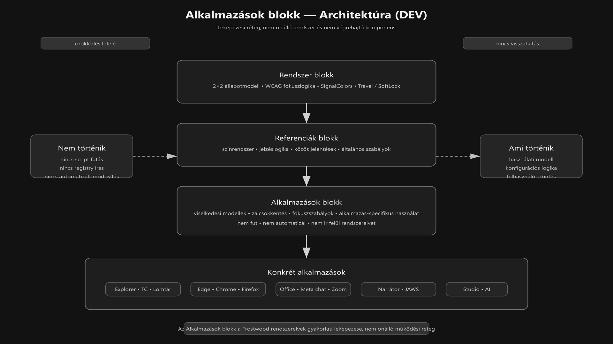

-   

    # 89. Alkalmazások blokk – Architektúra (DEV) { #89-alkalmazasok-blokk-architektura-dev }

    > Szerző: Hegedüs Gábor (@hege-g) 
    > Licenc: [MIT (Kód) / CC BY-NC-ND 4.0 (Docs)] 
    > Frostwood Docs: v1.0.0 
    > Rendszerverzió / Állapot: v1.0.5 / Fejlesztői 
    > Blokk:  Alkalmazások 
    > Belső fejlesztői dokumentum 
    > Kapcsolódik: `19. Rendszer blokk – Architektúra térkép (DEV AUDIT)` 
    > Kapcsolódik: `99. Referenciák blokk – Architektúra (DEV)`

-   ## Tartalomkártyák

    * [:material-infinity: 1. Cél](#1-cel)
    * [:material-infinity: 2. Pozíció a teljes dokumentációban](#2-pozicio-a-teljes-dokumentacioban)
    * [:material-infinity: 3. Fő elv](#3-fo-elv)
    * [:material-infinity: 4. Az Alkalmazások blokk szerepe](#4-az-alkalmazasok-blokk-szerepe)
    * [:material-infinity: 5. Jelenlegi struktúra (validált)](#5-jelenlegi-struktura-validalt)
    * [:material-infinity: 6. Modulcsoportok](#6-modulcsoportok)
        * [:material-infinity: 6.1 Rendszerközeli és fájlkezelési réteg](#61-rendszerkozeli-es-fajlkezelesi-reteg)
        * [:material-infinity: 6.2 Böngésző réteg](#62-bongeszo-reteg)
        * [:material-infinity: 6.3 Irodai és kommunikációs réteg](#63-irodai-es-kommunikacios-reteg)
        * [:material-infinity: 6.4 Kisegítő technológiai réteg](#64-kisegito-technologiai-reteg)
        * [:material-infinity: 6.5 Speciális munkaeszközök és AI réteg](#65-specialis-munkaeszkozok-es-ai-reteg)
    * [:material-infinity: 7. Adatáramlás és kapcsolat a rendszerrel](#7-adataramlas-es-kapcsolat-a-rendszerrel)
    * [:material-infinity: 8. Függőségi modell](#8-fuggosegi-modell)
        * [:material-infinity: 8.1 Az Alkalmazások blokk függ a következőktől](#81-az-alkalmazasok-blokk-fugg-a-kovetkezoktol)
        * [:material-infinity: 8.2 Az Alkalmazások blokk nem írja felül a rendszert](#82-az-alkalmazasok-blokk-nem-irja-felul-a-rendszert)
    * [:material-infinity: 9. Mi kerülhet ide](#9-mi-kerulhet-ide)
    * [:material-infinity: 10. Mi nem kerülhet ide](#10-mi-nem-kerulhet-ide)
    * [:material-infinity: 11. Modulonkénti szerepek röviden](#11-modulonkenti-szerepek-roviden)
        * [:material-infinity: 11.1 21 — Windows 11 Fájlkezelő](#111-21-windows-11-fajlkezelo)
        * [:material-infinity: 11.2 22 — Total Commander](#112-22-total-commander)
        * [:material-infinity: 11.3 23 — Microsoft Edge](#113-23-microsoft-edge)
        * [:material-infinity: 11.4 24 — Google Chrome](#114-24-google-chrome)
        * [:material-infinity: 11.5 25 — Mozilla Firefox](#115-25-mozilla-firefox)
        * [:material-infinity: 11.6 26 — Microsoft Office](#116-26-microsoft-office)
        * [:material-infinity: 11.7 27 — Meta chat](#117-27-meta-chat)
        * [:material-infinity: 11.8 28 — Zoom](#118-28-zoom)
        * [:material-infinity: 11.9 29 — Windows Narrátor](#119-29-windows-narrator)
        * [:material-infinity: 11.10 30 — JAWS for Windows](#1110-30-jaws-for-windows)
        * [:material-infinity: 11.11 31 — Insta360 Studio](#1111-31-insta360-studio)
        * [:material-infinity: 11.12 32 — ChatGPT](#1112-32-chatgpt)
        * [:material-infinity: 11.13 33 — GEMINI](#1113-33-gemini)
        * [:material-infinity: 11.14 34 — Windows Lomtár](#1114-34-windows-lomtar)
    * [:material-infinity: 12. Kapcsolat a Referenciák blokkal](#12-kapcsolat-a-referenciak-blokkal)
    * [:material-infinity: 13. Kapcsolat a Rendszer blokkal](#13-kapcsolat-a-rendszer-blokkal)
    * [:material-infinity: 14. Verziókezelési elv](#14-verziokezelesi-elv)
    * [:material-infinity: 15. Dokumentációs szabályok](#15-dokumentacios-szabalyok)
    * [:material-infinity: 16. Bővíthetőség](#16-bovithetoseg)
    * [:material-infinity: 17. Az Alkalmazások blokk belső logikája](#17-az-alkalmazasok-blokk-belso-logikaja)
    * [:material-infinity: 18. Összegzés](#18-osszegzes)
    * [:material-infinity: 19. Alapelv (DEV)](#19-alapelv-dev)

## 1. Cél

Az Alkalmazások blokk a Frostwood rendszer:

> Alkalmazásszintű leképezési rétege.

Ez a blokk azt írja le, hogy a Frostwood alapelvei hogyan jelennek meg 
konkrét Windows- és felhasználói alkalmazásokban.

Ez a blokk nem:

* nem általános rendszerleírás
* nem referencia-gyűjtemény
* nem telepítési specifikáció

Hanem:

* viselkedési réteg
* használati réteg
* profil- és zajszabályozási réteg

---

## 2. Pozíció a teljes dokumentációban

Az Alkalmazások blokk a következő helyen áll:

**Rendszer blokk → Referenciák blokk → Alkalmazások blokk**

Jelentése:

* **Rendszer blokk** → hogyan működik a Frostwood
* **Referenciák blokk** → milyen közös szabályok és jelentések érvényesek
* **Alkalmazások blokk** → ez hogyan valósul meg konkrét alkalmazásokban

Az Alkalmazások blokk tehát:

> Nem önálló filozófia, hanem a rendszerelvek konkrét kiterjesztése.

??? info "Vizuális leírás akadálymentesítéshez"
    Az ábra a Frostwood dokumentációs architektúra rétegzett felépítését mutatja az Alkalmazások blokk szempontjából.

    A legfelső réteg a Rendszer blokk. Ez tartalmazza az alap működési elveket, például a 2×2 állapotmodellt,
    a WCAG fókuszlogikát, valamint a SignalColors és Travel szabályait.

    Ez alatt helyezkedik el a Referenciák blokk. Ez a réteg a közös jelentéseket, például a színrendszert, a jelzéslogikát és az általános szabályokat tartalmazza.

    A harmadik szint az Alkalmazások blokk. Ez a réteg nem hoz létre új rendszerlogikát, hanem a felsőbb rétegek elveit alkalmazásokra vetíti le. Itt jelennek meg a viselkedési modellek, a zajcsökkentési szabályok és a fókuszkezelési elvek.

    Az alsó réteg a konkrét alkalmazásokat mutatja, például az Explorer, a Total Commander, a böngészők, az Office, a Zoom, a képernyőolvasók, valamint a speciális és AI-alapú eszközök csoportját.

    A rétegek között lefelé mutató nyilak láthatók. Ezek azt jelzik, hogy az elvek fentről lefelé öröklődnek. Nincs visszafelé mutató kapcsolat, vagyis az alkalmazások nem módosítják a rendszerelvet.

    Az ábra bal oldalán külön blokk jelzi, hogy nincs script futás, nincs registry írás, és nincs automatizált módosítás.

    A jobb oldalon külön blokk mutatja, hogy ami ténylegesen történik, az használati modell, konfigurációs logika és felhasználói döntés.

    Az ábra lényege, hogy az Alkalmazások blokk a Frostwood rendszerelvek gyakorlati leképezése, nem pedig önálló végrehajtó réteg.

---

## 3. Fő elv

???+ quote "Alapelv"
    > Az Alkalmazások blokk nem „skin gyűjtemény”.

Nem arról szól, hogy az alkalmazások hogyan nézzenek ki, hanem arról, hogy:

* hogyan viselkedjenek
* hogyan illeszkedjenek a Frostwood zajszabályozási modelljéhez
* hogyan támogassák a fókuszt
* hogyan maradjanak kompatibilisek képernyőolvasóval és billentyűzettel

Röviden:

> Nem dekoráció, hanem működési fegyelem.

---

## 4. Az Alkalmazások blokk szerepe

Ez a blokk alkalmazásonként dokumentálja:

* a Frostwood szempontjából releváns működési elveket
* a Home / Work vagy Munka / Otthon kontextusokat
* a zajforrásokat
* a WCAG-kompatibilis használati módot
* az adott alkalmazás határait

Ez azért fontos, mert a Frostwood:

> Nem hackeli az alkalmazásokat, hanem használati és konfigurációs modellt ad hozzájuk.

---

## 5. Jelenlegi struktúra (validált)

* `21-windows-11-fajlkezelo.md`
* `22-total-commander.md`
* `23-microsoft-edge.md`
* `24-google-chrome.md`
* `25-mozilla-firefox.md`
* `26-microsoft-office.md`
* `27-meta-chat.md`
* `28-zoom.md`
* `29-windows-narrator.md`
* `30-jaws-for-windows.md`
* `31-insta360-studio.md`
* `32-chatgpt.md`
* `33-gemini.md`
* `34-windows-lomtar.md`

Ez a sorrend logikus, mert:

1. rendszerközeli alkalmazásokkal indul
2. böngésző- és irodai rétegre lép
3. kommunikációs és kisegítő technológiákra vált
4. speciális munkaeszközökkel és AI réteggel folytatódik
5. végül rendszerobjektummal zárul

---

## 6. Modulcsoportok

Az Alkalmazások blokk nem véletlenszerű lista, hanem több alcsoportból áll.

-   ### 6.1 Rendszerközeli és fájlkezelési réteg

    * `21-windows-11-fajlkezelo.md`
    * `22-total-commander.md`
    * `34-windows-lomtar.md`

    Szerepük:

    * fájlkezelés
    * navigáció
    * kijelölési logika
    * struktúra és vizuális rend

    Ezek a modulok különösen fontosak, mert a Frostwood fókuszlogikája  
itt találkozik először a napi rendszerhasználattal.

-   ### 6.2 Böngésző réteg

    * `23-microsoft-edge.md`
    * `24-google-chrome.md`
    * `25-mozilla-firefox.md`

    Szerepük:

    * profil-szeparáció
    * értesítési zaj csökkentése
    * webes munkakörnyezet szétválasztása
    * Home / Work logika támogatása

    Ezeknél a moduloknál kulcsfontosságú:

    * popup viselkedés
    * értesítések
    * fókuszvesztés elkerülése
    * külön profilok használata

-   ### 6.3 Irodai és kommunikációs réteg

    * `26-microsoft-office.md`
    * `27-meta-chat.md`
    * `28-zoom.md`

    Szerepük:

    * dokumentum alapú munka
    * kommunikációs zaj kezelése
    * meeting és együttműködési környezet finomhangolása

    Itt a Frostwood fő célja:

    * kevesebb értesítés
    * kevesebb vizuális szétesés
    * jobban kontrollált használat

-   ### 6.4 Kisegítő technológiai réteg

    * `29-windows-narrator.md`
    * `30-jaws-for-windows.md`

    Ez különösen kritikus réteg.

    Nem egyszerű alkalmazások, hanem:

    > Elsődleges interfészek a rendszerhez.

    A cél itt nem az alkalmazások „testreszabása”, hanem:

    * stabil működés
    * kiszámítható felolvasás
    * alacsony zajszint
    * konfliktusmentes együttélés

-   ### 6.5 Speciális munkaeszközök és AI réteg

    * `31-insta360-studio.md`
    * `32-chatgpt.md`
    * `33-gemini.md`

    Szerepük:

    * speciális munkafolyamatok támogatása
    * fókusz-intenzív vagy elemző környezet kezelése
    * munka-specifikus viselkedési szabályok rögzítése

    Ezek a modulok már nem általános rendszerhasználatról szólnak, 
    hanem célzott workflow-ról.

---

## 7. Adatáramlás és kapcsolat a rendszerrel

Az Alkalmazások blokk:

> Nem része a runtime adatfolyamnak.

Ez fontos különbség.

Nem történik:

**App dokumentáció → közvetlen script futás** 
**App dokumentáció → registry írás** 
**App dokumentáció → automatizált módosítás**

Ami történik:

**Rendszerelv → alkalmazás-specifikus szabály → felhasználói / fejlesztői alkalmazás**

Vagyis az Alkalmazások blokk:

* nem fut
* nem végrehajt
* nem automatizál

Hanem:

> Használati és konfigurációs logikát ír le.

---

## 8. Függőségi modell

-   ### 8.1 Az Alkalmazások blokk függ a következőktől

    * Rendszer blokk
    * Referenciák blokk

    Mert az alkalmazásmodulok:

    * rendszerlogikára épülnek
    * közös szín- és jelzéselveket használnak
    * nem definiálnak saját Frostwood-szabályt a nulláról

-   ### 8.2 Az Alkalmazások blokk nem írja felül a rendszert

    ???+ warning "Fontos"
        Ez kritikus szabály.

        Az alkalmazásmodul:

        * nem vezethet be új globális állapotot
        * nem írhatja felül a 2×2 modellt
        * nem hozhat létre saját, külön Frostwood-logikát

        Ezért:

        > Az alkalmazás mindig alárendelt a rendszerelvnek.

---

## 9. Mi kerülhet ide

Az Alkalmazások blokkba kerülhet:

* alkalmazáson belüli zajforrások leírása
* Frostwood-kompatibilis használati mód
* Home / Work viselkedés
* értesítési és fókusz szabályok
* WCAG-kompatibilis használati szempontok
* kisegítő technológiás vonatkozások

---

## 10. Mi nem kerülhet ide

Az Alkalmazások blokkba nem kerülhet:

* globális rendszerlogika
* registry specifikáció
* installer működési részlet
* általános színrendszer definíció
* központi jelzés-architektúra
* rendszer-szintű filozófiai alapelv

Ezek helye:

* Rendszer blokk
* Referenciák blokk

Az Alkalmazások blokk csak:

> Alkalmazás-specifikus értelmezést adhat.

---

## 11. Modulonkénti szerepek röviden

-   ### 11.1 21 — Windows 11 Fájlkezelő

    Szerep:

    * natív fájlkezelési viselkedés Frostwood-értelmezése
    * kijelölés, hover, zebra és listaolvasás szabályai

    Ez a modul a natív Windows működés és a Frostwood zajszabályozás találkozási pontja.

-   ### 11.2 22 — Total Commander

    Szerep:

    * kétprofilos, fókuszalapú fájlkezelési modell
    * Munka / Otthon konfiguráció

    Ez a Frostwood egyik legerősebben profilalapú alkalmazásmodulja.

-   ### 11.3 23 — Microsoft Edge

    Szerep:

    * Microsoft-integrált böngészős környezet
    * profilok, értesítések, vállalati-kompatibilis működés

-   ### 11.4 24 — Google Chrome

    Szerep:

    * külön user-data-dir használat
    * Home / Work szeparáció
    * webes munkakörnyezet kezelése

-   ### 11.5 25 — Mozilla Firefox

    Szerep:

    * külön profilok
    * külön példányok
    * stabil, elkülönített használat

-   ### 11.6 26 — Microsoft Office

    Szerep:

    * sablon- és workflow-alapú irodai működés
    * Word / Excel mint külön fókuszeszközök

-   ### 11.7 27 — Meta chat

    Szerep:

    * kommunikációs zaj csökkentése
    * preview, hang és badge kontroll

-   ### 11.8 28 — Zoom

    Szerep:

    * meeting-fókusz
    * villogás és értesítési zaj minimalizálása
    * billentyűzetes használat támogatása

-   ### 11.9 29 — Windows Narrátor

    Szerep:

    * fallback képernyőolvasó
    * natív rendszer-hozzáférés biztosítása

    Ez nem elsődleges Frostwood-célalkalmazás, hanem:

    > Kompatibilitási és vészhelyzeti réteg.

-   ### 11.10 30 — JAWS for Windows

    Szerep:

    * elsődleges képernyőolvasó integráció
    * tempó, zajszint és használati kontextus dokumentálása

    Ez a Frostwood egyik legfontosabb alkalmazásmodulja.

-   ### 11.11 31 — Insta360 Studio

    Szerep:

    * speciális, vizuálisan intenzív munkaeszköz
    * Munka asztalhoz kötött workflow

-   ### 11.12 32 — ChatGPT

    Szerep:

    * elemző és gondolkodási réteg
    * webes, profil-alapú, alacsony ingerű használat

-   ### 11.13 33 — GEMINI

    Szerep:

    * AI-platform réteg
    * a ChatGPT-hez hasonló, de külön dokumentált használati modell

-   ### 11.14 34 — Windows Lomtár

    Szerep:

    * rendszerobjektum Frostwood-szabályok szerint kezelve
    * nem dekoráció, nem jelzőeszköz, hanem kezelési egység

---

## 12. Kapcsolat a Referenciák blokkal

Az Alkalmazások blokk használja:

* a színkódokat
* a jelzés-színeket
* a rendszeráttekintést
* a változáslogikát

De nem módosítja ezeket.

Példa:

* egy böngészőmodul hivatkozhat a narancs fókusz-szabályra
* de nem hozhat létre új, saját primer színt

Ezért a kapcsolat:

> Egyirányú függés.

---

## 13. Kapcsolat a Rendszer blokkal

Az Alkalmazások blokk a rendszerből örökli:

* 2×2 állapotmodellt
* WCAG fókuszlogikát
* SignalColors szabályokat
* Travel / SoftLock környezetet
* Munka asztal értelmezést

Ezért az alkalmazásmodulok:

> Nem magyarázzák újra a rendszert, csak leképezik azt.

---

## 14. Verziókezelési elv

Az Alkalmazások blokk gyorsabban változhat, mint a Referenciák blokk.

Ennek oka:

* az alkalmazások UI-ja és működése változhat
* a webes felületek frissülnek
* a használati workflow fejlődik

Ezért az Alkalmazások blokk:

* rugalmasabb
* gyakrabban frissülhet
* érzékenyebb a valós használati tapasztalatra

---

## 15. Dokumentációs szabályok

-   Az Alkalmazások blokk dokumentumai legyenek

    * konkrétak
    * használatcentrikusak
    * zaj- és fókuszalapúak
    * Frostwood-kompatibilisek

-   Kerülendő

    * túl általános alkalmazásismertető
    * marketing jellegű leírás
    * Frostwoodtól független funkciólista

A kérdés mindig ez:

> Hogyan viselkedik ez az alkalmazás Frostwood környezetben?

---

## 16. Bővíthetőség

Új alkalmazásmodul akkor adható hozzá, ha:

* valóban kapcsolódik a napi Frostwood használathoz
* saját viselkedési szabályt igényel
* nem oldható meg egy meglévő modul rövid megjegyzésével

Így elkerülhető:

* a dokumentáció szétfolyása
* a felesleges modulburjánzás

---

## 17. Az Alkalmazások blokk belső logikája

Az egész blokk három nagy viselkedési kérdésre ad választ:

1. hogyan csökkentsük a zajt
2. hogyan tartsuk meg a fókuszt
3. hogyan maradjon az alkalmazás kompatibilis a Frostwood alapelveivel

Minden modul ennek egy konkrét esete.

---

## 18. Összegzés

Az Alkalmazások blokk:

* nem külön rendszer
* nem plugin-réteg
* nem skin-gyűjtemény

Hanem:

> A Frostwood rendszerelvek konkrét alkalmazási térképe.

Ez a blokk teszi lehetővé, hogy a Frostwood 
ne csak elméleti rendszer legyen, hanem:

* használható
* következetes
* alkalmazásokra lefordítható

---

## 19. Alapelv (DEV)

> A Rendszer blokk megmondja, hogyan működik a Frostwood. 
> A Referenciák blokk megmondja, mit jelentenek a szabályai. 
> Az Alkalmazások blokk megmutatja, hogyan él mindez a gyakorlatban.