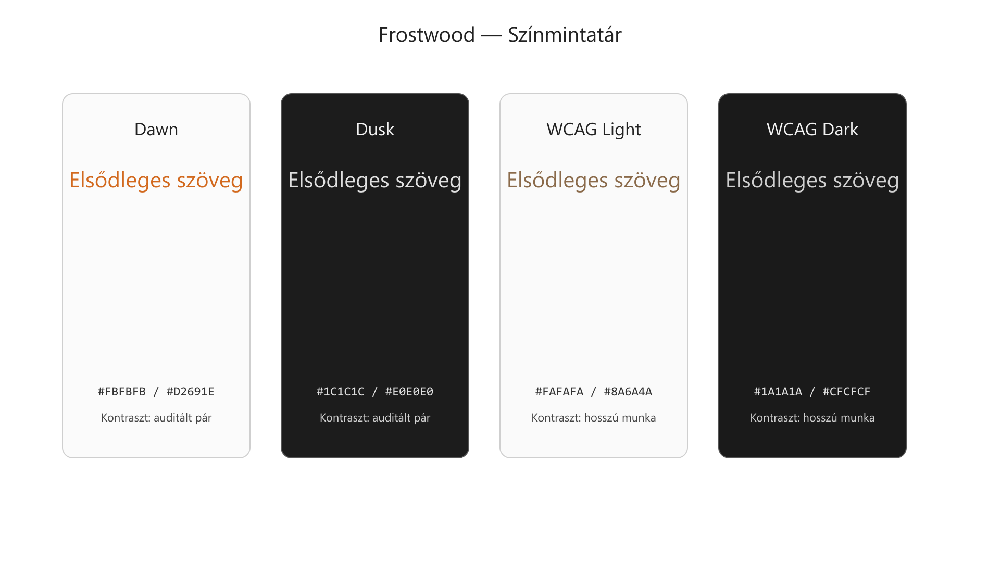
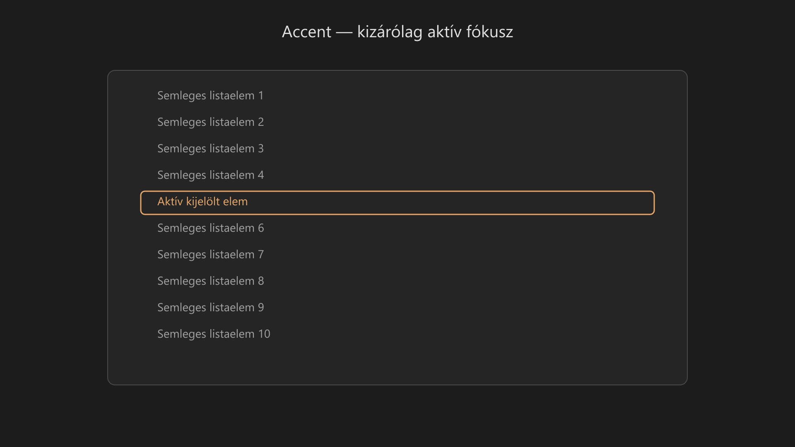
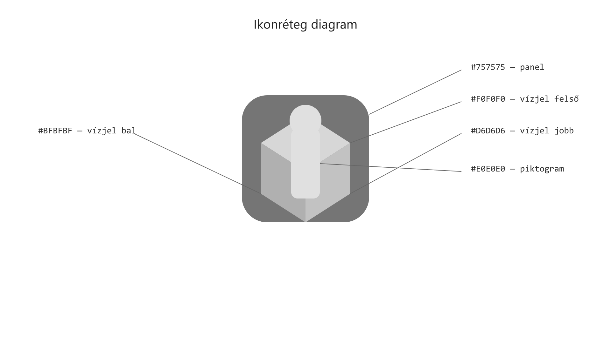
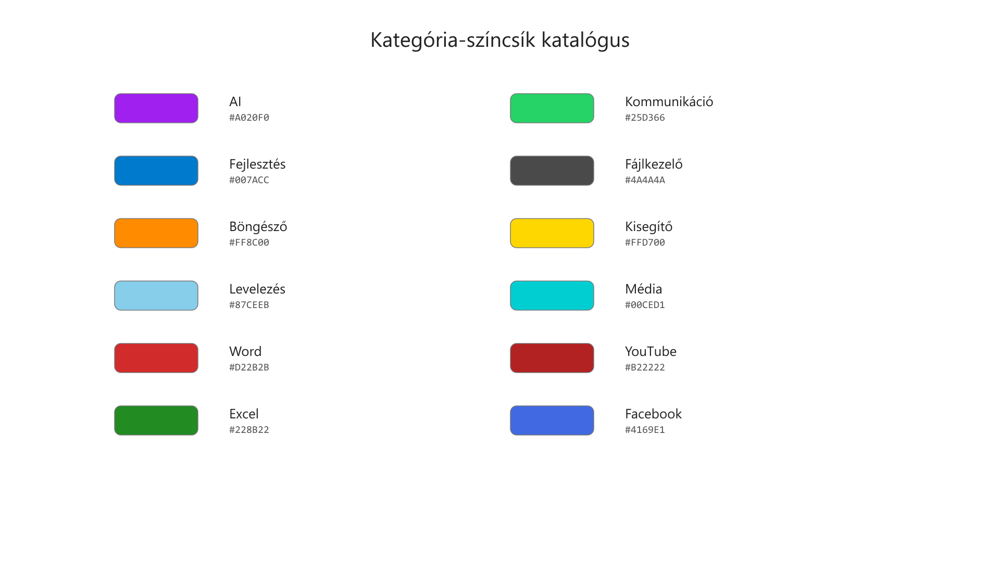
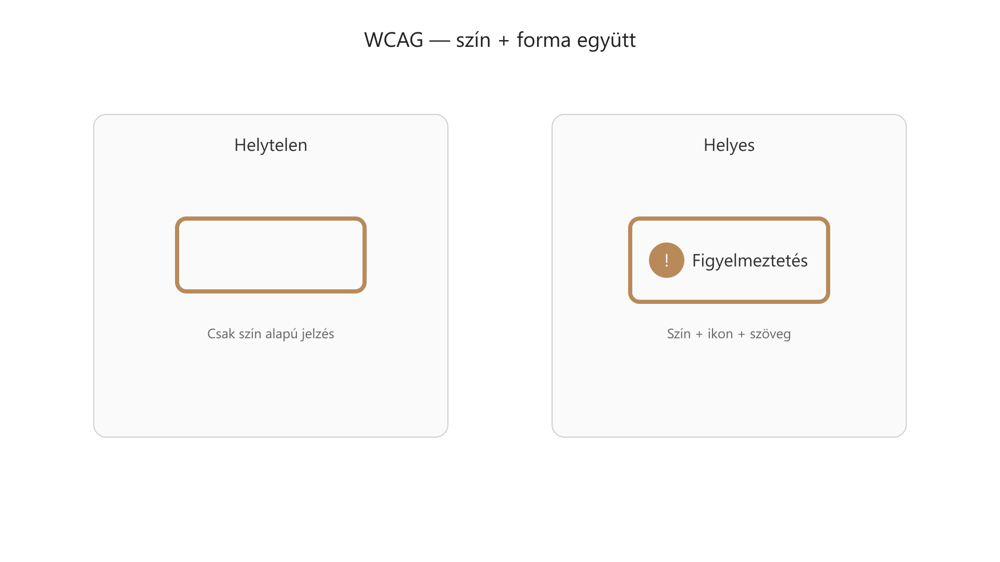

-   

    # 91. Használt színkódok – végleges { #91-hasznalt-szinkodok-vegleges }

    > Szerző: Hegedüs Gábor (@hege-g) 
    > Licenc: [MIT (Kód) / CC BY-NC-ND 4.0 (Docs)] 
    > Frostwood Docs: v1.0.0 
    > Rendszerverzió / Állapot: v1.0.5 / Stabil 
    > Blokk:  Referenciák

-   ## Tartalomkártyák

    * [:material-infinity: 1. Dokumentum célja](#1-dokumentum-celja)
    * [:material-infinity: 2. Forrás és kiindulási alap](#2-forras-es-kiindulasi-alap)
    * [:material-infinity: 3. Alap háttérszínek (Backgrounds)](#3-alap-hatterszinek-backgrounds)
        * [:material-infinity: 3.1 Világos – Karakter mód (Dawn)](#31-vilagos-karakter-mod-dawn)
        * [:material-infinity: 3.2 Sötét – Karakter mód (Dusk)](#32-sotet-karakter-mod-dusk)
        * [:material-infinity: 3.3 Világos – WCAG / hosszú munka / fókusz mód](#33-vilagos-wcag-hosszu-munka-fokusz-mod)
        * [:material-infinity: 3.4 Sötét – WCAG / hosszú munka / fókusz mód](#34-sotet-wcag-hosszu-munka-fokusz-mod)
    * [:material-infinity: 4. Szövegszínek (Typography)](#4-szovegszinek-typography)
        * [:material-infinity: 4.1 Világos mód](#41-vilagos-mod)
        * [:material-infinity: 4.2 Sötét mód](#42-sotet-mod)
        * [:material-infinity: 4.3 Világos – WCAG / fókusz mód](#43-vilagos-wcag-fokusz-mod)
        * [:material-infinity: 4.4 Sötét – WCAG / fókusz mód](#44-sotet-wcag-fokusz-mod)
    * [:material-infinity: 5. Fókusz és kijelölés (Meaningful Accent)](#5-fokusz-es-kijeloles-meaningful-accent)
    * [:material-infinity: 6. Hover és navigáció (Non-semantic)](#6-hover-es-navigacio-non-semantic)
    * [:material-infinity: 7. SignalColors – Jelzés színek](#7-signalcolors-jelzes-szinek)
    * [:material-infinity: 8. Explorer / lista rétegezés](#8-explorer-lista-retegezes)
    * [:material-infinity: 9. Ikonrendszerhez kapcsolódó színek](#9-ikonrendszerhez-kapcsolodo-szinek)
        * [:material-infinity: 9.1 Rendszer ikonok – fix alapszínek](#91-rendszer-ikonok-fix-alapszinek)
        * [:material-infinity: 9.2 Rendszer ikonok – állapotkapcsolat](#92-rendszer-ikonok-allapotkapcsolat)
        * [:material-infinity: 9.3 Rendszer ikonok – kötelező vizuális szabály](#93-rendszer-ikonok-kotelezo-vizualis-szabaly)
    * [:material-infinity: 10. Otthon / Munka ikonok kategória-színei](#10-otthon-munka-ikonok-kategoria-szinei)
    * [:material-infinity: 11. Ikonok és színek viszonya](#11-ikonok-es-szinek-viszonya)
    * [:material-infinity: 12. WCAG mód – tiltott színek](#12-wcag-mod-tiltott-szinek)
    * [:material-infinity: 13. WCAG viselkedés és tolerancia](#13-wcag-viselkedes-es-tolerancia)
    * [:material-infinity: 14. WCAG – nem szín alapú jelentés](#14-wcag-nem-szin-alapu-jelentes)
    * [:material-infinity: 15. Kontraszt követelmények (WCAG)](#15-kontraszt-kovetelmenyek-wcag)
    * [:material-infinity: 16. Állapot vs dekoráció](#16-allapot-vs-dekoracio)
    * [:material-infinity: 17. Windows vs alkalmazás szint](#17-windows-vs-alkalmazas-szint)
    * [:material-infinity: 18. Audit ellenőrzőlista](#18-audit-ellenorzolista)
    * [:material-infinity: 19. Elvi megjegyzés](#19-elvi-megjegyzes)

## 1. Dokumentum célja

Ez a dokumentum a Frostwood rendszerben **ténylegesen használt és jóváhagyott színek** kizárólagos forrása. A Frostwood nem egy hagyományos paletta-gyűjtemény, hanem egy hierarchikus, jelentésalapú ökoszisztéma.

-   ### :material-file-certificate-outline: Hiteles forrás

    * **Mérnöki referencia:** Pontos technikai értékek a fejlesztéshez.
    * **Auditálható alap:** Összehasonlítási pont a minőségellenőrzéshez.
    * **Verziókövethető:** Minden színmódosítás ebben a fájlban rögzül.

-   ### :material-map-check-outline: Alkalmazási terület

    * **Globális leírás:** A Total Commander-alapú Frostwood rendszer teljes körű színmeghatározása.
    * **Kötések és korlátok:** A színek egymáshoz való viszonyának és használati határainak rögzítése.

-   ### :material-comment-question-outline: Mit rögzít a dokumentum?

    * **Színszerepek:** Mi a feladata az adott árnyalatnak?
    * **Jelentés:** Mit közvetít a szín a felhasználó felé?
    * **NEM rögzít:** Programozási vagy működési logikai folyamatokat.

???+ quote "Rendszerszemlélet"
    A Frostwood filozófiája szerint a színek nem díszítőelemek, hanem funkcionális rétegek. Ez a dokumentum biztosítja, hogy a vizuális nyelv minden platformon (Windows, Total Commander, Web) azonos jelentéssel bírjon.

??? info "Vizuális leírás az akadálymentes használathoz"
    Ez a bevezető szakasz három kártyán keresztül határozza meg a dokumentum szerepét.

    * Az első kártya a technikai és hitelességi szempontokat emeli ki,
    * második a globális érvényességet és a Total Commander kontextust,
    * harmadik pedig pontosítja a dokumentum hatókörét (jelentés vs. logika).

    A leírás segít megérteni, hogy ez a fájl a rendszer "alkotmánya", amely nem a technikai megvalósítás mikéntjét, hanem a vizuális kommunikáció miértjét rögzíti.

---

## 2. Forrás és kiindulási alap

A Frostwood színrendszer nem elméleti síkon született; gyakorlati kiindulópontja a **Total Commander** fájlkezelő mélyen testreszabható színkonfigurációja. Ez biztosítja a rendszer robusztusságát és napi munkára való alkalmasságát.

-   ### :material-file-cog-outline: Referencia fájlok

    A rendszer magvát két kritikus konfigurációs állomány adja, amelyek a színek matematikai és vizuális definícióit tartalmazzák:

    * [**`wincmd.ini`**](22-total-commander.md#a-fuggelek-total-commander-wincmdini-konfiguracios-dokumentacio): A standard interfész és a napi alapműködés színei.
    * [**`wincmd_fokus.ini`**](22-total-commander.md#b-fuggelek-total-commander-wincmd-fokusini-konfiguracios-dokumentacio): A hosszú távú, koncentrációt igénylő munkára optimalizált WCAG-értékek.

-   ### :material-source-branch: Származtatott elemek

    Ezekből a forrásokból vezethető le a Frostwood teljes vizuális hierarchiája:

    * **Környezetek:** Az alap világos és sötét módok bázisa.
    * **Variánsok:** A fókuszolt munkára optimalizált (fáradtságcsökkentő) sémák.
    * **Akcentus:** A kijelölési hangsúlyszín és a zebra-lista alaplogikája.

???+ tip "Verziókezelés"
    Minden arculati változtatást először ezen a két konfigurációs fájlon vezetünk át, majd onnan kerülnek visszacsatolásra a globális specifikációba. Ez garantálja a szoftver és a dokumentáció közötti teljes összhangot.

??? info "Vizuális leírás az akadálymentes használathoz"
    Ez a szakasz két kártyán mutatja be a rendszer technikai alapjait.

    Az első kártya a két fő forrásfájlt nevezi meg (`wincmd.ini` és `wincmd_fokus.ini`), amelyek a rendszer „genetikai kódját” hordozzák.

    A második kártya azt részletezi, hogy mi mindent köszönhetünk ezeknek a fájloknak: innen erednek a világos/sötét módok, a fókusz-változatok és a listák kezelésének logikája.

    A leírás segít megérteni, hogy a Frostwood egy létező, konfigurációs alapú környezetből emelkedett ki globális szabvánnyá.

---

## 3. Alap háttérszínek (Backgrounds)

-   ### 3.1 Világos – Karakter mód (Dawn)

    A hajnali (Dawn) állapot a természetes fény melletti munkavégzésre optimalizált, ahol a cél a tisztaság és a rétegek közötti finom különbségtétel.

    * #### :material-square-outline: Alap háttér

    * **Szín:** `#FBFBFB` (Törtfehér / Off-white)
    * **Forrás:** `wincmd.ini`
    * **Megjegyzés:** *Clean Paper* hatás. Nem vakító fehér, hanem enyhén tört felület, amely csökkenti a szem fáradását.

    * #### :material-layers-outline: Kártya / panel

    * **Szín:** `#FFFFFF` (Fehér / White)
    * **Forrás:** Frostwood UI
    * **Megjegyzés:** A tiszta fehér szín a paneleknél a "felhasználó felé billenés" érzetét kelti, vizuálisan kiemelve a munkaterületet a háttérből.

    * #### :material-format-list-bulleted-type: Alternáló sor

    * **Szín:** `#F5F5F5` (Világosszürke / White smoke)
    * **Forrás:** `wincmd.ini`
    * **Megjegyzés:** Zebra csíkozás a listákban. Segíti a szemnek a sorok követését anélkül, hogy megtörné a felület egységét.

    ???+ warning "WCAG Megjegyzés"
        * A `#FFFFFF` használata nagy, homogén felületen **nem ajánlott** WCAG módban a fényszórás és a káprázás elkerülése érdekében.
        * A világos alap koncepciója a szem kímélése, ezért épül enyhén tört felületre a nyers fehér helyett.

    ??? info "Vizuális leírás az akadálymentes használathoz"
        Ez a szakasz három információs kártyát tartalmaz, amelyek a világos munkakörnyezet rétegeit határozzák meg.

        Az alap háttér egy enyhén törtfehér (`#FBFBFB`) felület, amely a papír természetes tónusát idézi.

        Erre kerülnek rá a tiszta fehér (`#FFFFFF`) panelek és kártyák, amelyek a fényesebb felületük miatt vizuálisan kiemelkednek, mintha közelebb lennének a felhasználóhoz.

        A listák olvashatóságát a `#F5F5F5` kódú, nagyon világosszürke alternáló sorok segítik, amelyek finom "zebra" mintázatot adnak a felületnek anélkül, hogy megtörnék a világos mód egységét.

-   ### 3.2 Sötét – Karakter mód (Dusk)

    Az alkonyati (Dusk) állapot a mélyebb fókuszhoz és a szem pihentetéséhez optimalizált, ahol a sötét tónusok nem a teljes feketére, hanem a rétegelhető szürke árnyalatokra épülnek.

    * #### :material-square-outline: Alap háttér

    * **Szín:** `#1C1C1C` (Éjfekete szürke / Dark charcoal)
    * **Forrás:** `wincmd.ini`
    * **Megjegyzés:** *Deep Obsidian* hatás. Ez az alap biztosítja a rendszer stabilitását anélkül, hogy a tiszta fekete okozta túlzott kontraszt vibrálna.

    * #### :material-layers-outline: Másodlagos réteg

    * **Szín:** `#252525` (Antracitszürke / Raisin black)
    * **Forrás:** `wincmd.ini`
    * **Megjegyzés:** Zebra csíkozáshoz és a panelek elkülönítéséhez használatos réteg, amely finom mélységet ad a felületnek.

    * #### :material-unfold-more-horizontal: Emelt kártya

    * **Szín:** `#2A2A2A` (Grafit / Jet black)
    * **Forrás:** Frostwood UI
    * **Megjegyzés:** Finom emelkedés (*elevation*) érzetét kelti. Ezt a színt használjuk az interaktív kártyákhoz, hogy vizuálisan közelebb kerüljenek a felhasználóhoz.

    ???+ warning "Design Szabály"
        * Tiszta fekete (`#000000`) használata a rendszerben **tilos**, mivel az gátolja a mélységérzetet és túl éles kontrasztot szül.
        * A sötét alap koncepciója, hogy enyhén meleg tónusú legyen, kerülve a digitálisan rideg, hideg fekete érzetet.

    ??? info "Vizuális leírás az akadálymentes használathoz"
        Ez a szakasz három információs kártyán mutatja be a sötét mód mélységi hierarchiáját.

        A rendszer a tiszta fekete helyett egy mély, sötétszürke alap háttérből indul ki (`#1C1C1C`), amely pihenteti a szemet.

        Ezen a felületen jelennek meg a másodlagos rétegek (panelek és alternáló sorok) egy valamivel világosabb, antracitszürke (`#252525`) tónussal.

        A legfelső réteget, az interaktív kártyákat egy még világosabb grafit árnyalat (`#2A2A2A`) jelöli. Ez a fokozatos világosodás hozza létre a "felhasználó felé billenés" (elevation) hatását sötét környezetben, segítve a térbeli tájékozódást a felületen.

-   ### 3.3 Világos – WCAG / hosszú munka / fókusz mód

    A WCAG világos mód a legmagasabb szintű vizuális stabilitást biztosítja. Ebben az állapotban a rendszer minimalizálja a kontrasztkülönbségeket a háttérelemek között, hogy segítse a hosszú távú, mély koncentrációt.

    * #### :material-image-filter-none: Egyszínű fókusz háttér

    * **Szín:** `#FAFAFA` (Hófehér szürke / Snow white)
    * **Forrás:** `wincmd_fokus.ini`
    * **Megjegyzés:** A cél a nyugodt, vizuálisan stabil környezet. Ez az árnyalat biztosítja a tiszta olvashatóságot anélkül, hogy a monitor fénye elvakítaná a felhasználót.

    * #### :material-format-line-spacing: Alternáló sor

    * **Szín:** `#FAFAFA` (Hófehér szürke / Snow white)
    * **Forrás:** `wincmd_fokus.ini`
    * **Megjegyzés:** Ebben a módban a „zebra” csíkozás gyakorlatilag megszűnik. A homogén felület segít abban, hogy a szem ne ugráljon a sorok között, hanem a tartalomra fókuszáljon.

    ???+ note "Összehasonlítás a Karakter móddal"
        * Míg a Karakter módban (3.1) különbséget teszünk a háttér és a panelek között, itt a homogenitás az elsődleges.
        * A cél a vizuális ingerek radikális csökkentése, így a fókuszszín (narancs) sokkal gyorsabban észlelhetővé válik a semleges háttéren.

    ??? info "Vizuális leírás az akadálymentes használathoz"
        A fenti szakasz két információs kártyát tartalmaz.

        * Az első a fókusz háttérszínét határozza meg,
        * második pedig az alternáló sorokét.

        Mindkét elem azonos, `#FAFAFA` hex kódú színt kapott, ami egy szinte tiszta, de lágyított fehér felületet eredményez. Ez a vizuális azonosság szünteti meg a listák sávosodását, létrehozva a "fókusz mód" zavartalan felületét.

-   ### 3.4 Sötét – WCAG / hosszú munka / fókusz mód

    A WCAG sötét mód a Frostwood rendszer referenciafelülete a mély fókuszú munkához. Ebben az állapotban a vizuális törések minimalizálódnak, létrehozva egy pihentető, de magas kontrasztú környezetet a kisegítő technológiák számára.

    * #### :material-image-filter-none: Egyszínű fókusz háttér

    * **Szín:** `#1A1A1A` (Mélyszürke / Eerie black)
    * **Forrás:** `wincmd_fokus.ini`
    * **Megjegyzés:** Hosszú munkára és olvasásra optimalizált sötét alap. Ez a szín biztosítja a legnyugodtabb felületet, ahol a szemnek nem kell alkalmazkodnia a változó háttérfényhez.

    * #### :material-format-line-spacing: Alternáló sor

    * **Szín:** `#1A1A1A` (Mélyszürke / Eerie black)
    * **Forrás:** `wincmd_fokus.ini`
    * **Megjegyzés:** Ebben a módban a sötét felület teljesen egységes. A sorok közötti színkülönbség megszüntetése csökkenti a vizuális zajt, így a fókuszban lévő elem (narancs jelzés) azonnal azonosítható.

    ???+ note "Frostwood Referencia"
        * Ez a beállítás tekinthető a rendszer sötét referenciafelületének.
        * A cél a vizuális ingerek radikális csökkentése és a kiszámítható, stabil környezet fenntartása.

    ??? info "Vizuális leírás az akadálymentes használathoz"
        A fenti szakasz két információs kártyát tartalmaz a sötét WCAG módhoz.

        Mind az egyszínű fókusz háttér, mind az alternáló sorok a #1A1A1A hex kódú színt használják. Ez egy nagyon sötét, de nem tiszta fekete árnyalat, amely homogén, sávmentes felületet alkot.

        Ez a megoldás megszünteti a listák vizuális tagoltságát, elősegítve a zavartalan olvasást.

??? info "Vizuális leírás akadálymentesítéshez"
    Az ábra négy különböző vizuális állapotot mutat egymás mellett.

    1. Világos háttéren meleg tónusú szöveget tartalmaz.
    2. Sötét háttéren világos szöveget mutat.
    3. Világos WCAG mód egységes felületet használ.
    4. Sötét WCAG mód visszafogott kontrasztú szöveget jelenít meg.

    Minden blokk tartalmaz kontrasztarány jelölést, amely az olvashatóságot igazolja.

---

## 4. Szövegszínek (Typography)

-   ### 4.1 Világos mód

    A világos módú tipográfia a Frostwood rendszer egyik legfontosabb stíluseleme. A cél nem a steril digitális megjelenés, hanem egy természetes, "nyomtatott papír" hatású olvashatóság elérése.

    * #### :material-format-text: Elsődleges szöveg

    * **Szín:** `#D2691E` (Csokoládébarna / Chocolate)
    * **Forrás:** `wincmd.ini`
    * **Megjegyzés:** Meleg tónusú, mélybarna árnyalat. Nem hideg feketét használunk, így a szöveg olvasása kevésbé fárasztja a szemet, és barátságosabb, papírszerű érzetet kelt.

    * #### :material-format-text-variant: Másodlagos / inaktív szöveg

    * **Szín:** `#787878` (Középszürke / Gray)
    * **Forrás:** Frostwood referencia
    * **Megjegyzés:** A kiegészítő információk és az inaktív elemek színe. Biztosítja a hierarchiát a felületen, elválasztva a lényeges tartalmat a technikai részletektől.

    ???+ tip "Design Filozófia"
        * A Frostwood világos módjának karakterét a barna-narancsos tónusok határozzák meg.
        * Ez a színválasztás szándékosan kerüli a modern operációs rendszerekre jellemző rideg, kék-szürke kontrasztokat.

    ??? info "Vizuális leírás az akadálymentes használathoz"
        A tipográfiai kártyák a szöveg hierarchiáját mutatják be világos módban.

        Az elsődleges szöveg a #D2691E kóddal egy sötét, meleg barna árnyalat, amely erős kontrasztot alkot a törtfehér háttérrel, de lágyabb a szemnek, mint a tiszta fekete.

        A másodlagos szöveg a #787878 középszürke színt kapta, ami vizuálisan háttérbe szorítja a kevésbé fontos elemeket.

-   ### 4.2 Sötét mód

    A sötét módú tipográfia a Frostwood rendszerben a maximális olvashatóságot célozza meg anélkül, hogy a túl erős kontraszt (nyers fehér a feketén) szemfáradtságot okozna.

    * #### :material-format-text: Elsődleges szöveg

    * **Szín:** `#E0E0E0` (Világosszürke / Platinum)
    * **Forrás:** `wincmd.ini`
    * **Megjegyzés:** Egy lágyított fehér árnyalat. A tiszta fehérnél (`#FFFFFF`) pihentetőbb a szemnek sötét háttéren, de elegendő kontrasztot biztosít a gyors olvasáshoz.

    * #### :material-format-text-variant: Másodlagos / inaktív szöveg

    * **Szín:** `#A0A0A0` (Ezüstszürke / Silver)
    * **Forrás:** Frostwood referencia
    * **Megjegyzés:** A segédinformációk és az inaktív állapotú elemek színe. Vizuálisan háttérbe szorítja a technikai részleteket, így a figyelem az elsődleges tartalomra irányul.

    ???+ tip "Olvasási Komfort"
        * A `#E0E0E0` választása szándékos: ez az árnyalat sötét környezetben "világít", de nem "vágja" a szemet.
        * A két szövegszín közötti különbség segít a felhasználónak abban, hogy pillanatok alatt felismerje a felület hierarchiáját.

    ??? info "Vizuális leírás az akadálymentes használathoz"
        A kártyák a sötét mód szöveghierarchiáját mutatják be.

        Az elsődleges szöveg a `#E0E0E0` kóddal egy majdnem fehér, de finoman szürkített tónus, amely stabil kontrasztot ad a mélyszürke háttéren.

        A másodlagos szöveg a `#A0A0A0` kóddal egy sötétebb ezüstszürke, ami jól jelzi az elemek inaktív vagy kiegészítő jellegét.

-   ### 4.3 Világos – WCAG / fókusz mód

    A WCAG fókusz mód tipográfiája a tartós, mély koncentrációt igénylő olvasáshoz lett kalibrálva. A cél itt nem a dekoráció, hanem a vizuális feszültség minimalizálása a háttér és a szöveg között.

    * #### :material-text-recognition: Elsődleges szöveg

    * **Szín:** `#8A6A4A` (Homokbarna / Deer brown)
    * **Forrás:** `wincmd_fokus.ini`
    * **Megjegyzés:** Ez a szín lágyabb és kevésbé tolakodó, mint a normál mód barna tónusa. A váltás célja a szem fáradásának radikális csökkentése: a betűk nem „ugranak le” élesen a papírszerű háttérről, hanem szervesen simulnak bele a felületbe.

    ???+ note "Fókusz Stratégia"
        * Ez a beállítás a hosszú olvasásra alkalmas: a csökkentett kontraszt miatt a monitor háttérvilágítása kevésbé irritálja a retinát.
        * Ideális választás, ha a tartalom befogadása fontosabb, mint a navigációs elemek gyors azonosítása.

    ??? info "Vizuális leírás az akadálymentes használathoz"
        A kártya a világos WCAG mód egyetlen elsődleges szövegszínét mutatja be.

        A `#8A6A4A` kód egy középbarna, sárgás-szürkés árnyalat, amely a törtfehér háttéren egy nagyon nyugodt, alacsonyabb intenzitású kontrasztot alkot.

        Ez a színvilág a régi könyvek patináját idézi, ahol a fekete tinta már kissé megszürkült, kímélve az olvasó látását.

-   ### 4.4 Sötét – WCAG / fókusz mód

    A sötét WCAG mód tipográfiája a Frostwood rendszer legnyugodtabb szöveges környezete. A cél a tartós olvashatóság biztosítása úgy, hogy a szöveg fénye ne terhelje túl a felhasználó látását sötét környezetben.

    * #### :material-text-recognition: Elsődleges szöveg

    * **Szín:** `#CFCFCF` (Ezüstszürke / Silver chalice)
    * **Forrás:** `wincmd_fokus.ini`
    * **Megjegyzés:** Ez a sötét fókusz mód elsődleges színe. A normál sötét mód `#E0E0E0` értékéhez képest ez egy kissé visszafogottabb, „halkabb” tónus. Ez a finom tompítás segít abban, hogy a szöveg ne vibráljon a mélyszürke háttéren.

    ???+ note "Fókusz és Kontraszt"
        * Bár a szín visszafogottabb, a WCAG AA kontrasztarány továbbra is biztosított.
        * A cél a vizuális „beégés” elkerülése, ami a túl fényes szövegek esetén jelentkezhet sötét szobában történő munkavégzéskor.

    ??? info "Vizuális leírás az akadálymentes használathoz"
        A kártya a sötét WCAG módhoz tartozó szövegszínt mutatja be.

        A `#CFCFCF` kód egy tiszta középszürke árnyalat. A normál sötét módhoz képest ez a szín kevésbé világít, így a karakterek élei lágyabbnak tűnnek, ami jelentősen növeli a komfortérzetet hosszú idejű szövegolvasás során.

---

## 5. Fókusz és kijelölés (Meaningful Accent)

Ez a szakasz definiálja a Frostwood rendszer egyetlen elsődleges akciószínét. Ez a szín nem dekorációs elem, hanem egy funkcionális jelzés, amely a felhasználó figyelmét a tényleges interakció helyére irányítja.

??? info "Vizuális leírás akadálymentesítéshez"
    Az ábra egy listát mutat több sorral.

    Minden sor szürke, kivéve egyetlen kiválasztott elemet.
    A kiválasztott elem narancs színnel van kiemelve.

    Ez jelzi, hogy a Frostwood narancs szín kizárólag aktív fókusz esetén jelenik meg.

* #### :material-focus-field: Frostwood Accent

* **Szín:** `#B05A2A` (Frostwood Narancs / Sandy copper)
* **Forrás:** `MarkColor`, `wincmd.ini` / `wincmd_fokus.ini`
* **Megjegyzés:** Ez a Frostwood legfontosabb jelentésszíne. A rendszerben ez hordozza a **valódi interakciós hangsúlyt**. Minden más elem semlegessége azt szolgálja, hogy ez az árnyalat azonnal észrevehető legyen.

???+ warning "Használati Szabályok (Narancs-szabály)"
    A vizuális zaj minimalizálása érdekében az Accent szín használata kötött:

    * **IGEN:** Csak aktív fókusz és tényleges kijelölés esetén használható.
    * **NEM:** Szigorúan tilos dekorációnak, passzív állapotok jelzésére vagy egérrel kiváltott *hover* (föléúszás) effektushoz használni.

??? info "Vizuális leírás az akadálymentes használathoz"
    A kártya a rendszer központi jelzőszínét mutatja be.

    A `#B05A2A` kódú Frostwood Narancs egy meleg, telített, de nem vakító rézvörös/narancs árnyalat. A dokumentáció kiemeli, hogy ez a szín kizárólag akkor jelenhet meg a képernyőn, ha a felhasználó aktívan kijelölt valamit, vagy egy beviteli mezőben áll. Ezáltal a szín jelenléte egyet jelent az akció lehetőségével.

---

## 6. Hover és navigáció (Non-semantic)

A hover (egérrel való rámutatás) színei a Frostwood rendszerben kizárólag a navigációt segítik, nem hordoznak rendszerszintű állapotot vagy jelentést. Céljuk a felhasználó pillanatnyi tartózkodási helyének visszajelzése anélkül, hogy elvonnák a figyelmet a tényleges fókusztól.

-   ### :material-cursor-default-click-outline: Világos mód hover

    * **Szín:** `#F1F3F6` (Jégszürke / Ice blue-grey)
    * **Megjegyzés:** Semleges, enyhén hideg tónusú hover. Ez az árnyalat elegendő kontrasztot biztosít a törtfehér háttéren ahhoz, hogy jelezze az interaktivitást, de nem zavarja az olvasást.

-   ### :material-cursor-default-outline: Sötét mód hover

    * **Szín:** `#2B2F36` (Palaszürke / Slate charcoal)
    * **Megjegyzés:** Semleges, enyhén hideg tónusú hover. Sötét környezetben ez a szín segít elkülöníteni az éppen érintett elemet a háttértől, megőrizve a felület mélységét.

???+ warning "Navigációs Szabályok"
    A vizuális hierarchia fenntartása érdekében a hover színekre szigorú megkötések vonatkoznak:

    * **NEM jelentésszín:** Nem hordozhat információt az elem állapotáról (pl. nem jelezhet hibát).
    * **NEM helyettesíti a fókuszt:** A billentyűzettel navigáló felhasználók számára továbbra is a Narancs fókuszszín (5. fejezet) az irányadó.
    * **NEM dekoráció:** Csak interaktív elemeknél jelenhet meg, nem használható figyelmeztetésként vagy kijelölésként.

??? info "Vizuális leírás az akadálymentes használathoz"
    A szakasz két kártyán mutatja be a navigációs visszajelzések színeit.

    Világos módban egy alig észrevehető jégszürke (`#F1F3F6`), sötét módban pedig egy sötétebb palaszürke (`#2B2F36`) jelzi az egérmutató pozícióját.

    Mindkét szín szándékosan semleges és kissé hűvös tónusú, hogy élesen elkülönüljön a Frostwood rendszer meleg barna szövegszíneitől és a narancssárga fókuszjelzéstől.

---

## 7. SignalColors – Jelzés színek

A Frostwood jelzésszínei szándékosan tompítottak. Céljuk nem a sokkolás vagy a felhasználó megijesztése, hanem a felismerhető, alacsony kognitív terhelésű visszajelzés biztosítása.

-   ### :material-information-outline: Információ

    * **Szín:** `#4A6D93` (Halk kék / Steel blue)
    * **Jelentés:** Általános tájékoztatás vagy rendszerüzenet.
    * **Megjegyzés:** Nyugodt, nem tolakodó kék, amely jelzi a közlendőt, de nem követel azonnali, sürgető figyelmet.

-   ### :material-check-circle-outline: Siker

    * **Szín:** `#5E7468` (Szürkészöld / Sage green)
    * **Jelentés:** Sikeres művelet vagy érvényes állapot.
    * **Megjegyzés:** Kerüli a rikító zöldet; a szürkés tónus stabilitást és befejezettséget sugall anélkül, hogy vibrálna a felületen.

-   ### :material-alert-outline: Figyelmeztetés

    * **Szín:** `#9B6C35` (Meleg okker / Muted ochre)
    * **Jelentés:** Odafigyelést igénylő állapot vagy lehetséges hiba.
    * **Megjegyzés:** Meleg, tompa árnyalat, amely jelzi a kockázatot, de nem vált ki stresszreakciót a felhasználóból.

???+ warning "Használati Szabályok"
    A jelzésszínek alkalmazása szigorúan korlátozott a vizuális egyensúly megőrzése érdekében:

    * **IGEN:** Csak kis felületen, pontszerűen vagy vékony sávként használható.
    * **NEM:** Szigorúan tilos háttérpanelnek, teljes oldalszínnek, villogó animációnak vagy agresszív riasztó színnek használni.

??? info "Vizuális leírás az akadálymentes használathoz"
    A szakasz három kártyán mutatja be a rendszer funkcionális jelzőszíneit.

    Az Információ színe egy matt, középkék (`#4A6D93`), 
    a Siker színe egy tompa, természetközeli zöld (`#5E7468`), 
    míg a Figyelmeztetés egy sárgásbarna, földszínű tónus (`#9B6C35`).

    Mindhárom szín közös jellemzője az alacsony telítettség, ami biztosítja, hogy a jelzések belesimuljanak a Frostwood pasztellvilágába, és ne váljanak zavaró zajforrássá.

---

## 8. Explorer / lista rétegezés

Ez a fejezet határozza meg a fájlkezelő listák és táblázatos nézetek rétegezési szabályait. A cél a sorok közötti vizuális ritmus szabályozása a választott üzemmód függvényében.

-   ### :material-format-list-bulleted-type: Normál világos

    * **Alapsor:** `#FBFBFB` (Törtfehér / Off-white)
    * **Alternáló sor:** `#F5F5F5` (Világosszürke / White smoke)
    * **Hatás:** Klasszikus „zebra” csíkozás, amely segíti a szemnek követni a sorokat nagy adathalmazok esetén.

-   ### :material-format-list-bulleted-type: Normál sötét

    * **Alapsor:** `#1C1C1C` (Éjfekete szürke / Dark charcoal)
    * **Alternáló sor:** `#252525` (Antracitszürke / Raisin black)
    * **Hatás:** Sötét környezetben alkalmazott rétegelés, amely mélységet ad a listának anélkül, hogy vibrálna.

-   ### :material-format-list-group: Fókusz világos

    * **Alapsor:** `#FAFAFA` (Hófehér szürke / Snow white)
    * **Alternáló sor:** `#FAFAFA` (Hófehér szürke / Snow white)
    * **Hatás:** Homogén felület. A zebra-váltakozás megszűnik a maximális vizuális nyugalom érdekében.

-   ### :material-format-list-group: Fókusz sötét

    * **Alapsor:** `#1A1A1A` (Mélyszürke / Eerie black)
    * **Alternáló sor:** `#1A1A1A` (Mélyszürke / Eerie black)
    * **Hatás:** Egységes sötét felület, amely megszünteti a sorok közötti kontrasztkülönbséget, segítve a tartalomra való koncentrálást.

???+ tip "Fókusz Stratégia"
    * A fókusz mód (WCAG) elsődleges célja a zebra-váltakozás radikális csökkentése vagy teljes megszüntetése.
    * Ez a beállítás különösen hasznos hosszú listák böngészése, intenzív olvasás és kisegítő technológiák (JAWS/NVDA) használata esetén, mivel csökkenti a képernyő „zaját”.

??? "Vizuális leírás az akadálymentes használathoz"
    A szakasz négy kártyán mutatja be a listaoldalak rétegezését.

    A normál módokban (világos és sötét) két-két egymáshoz közeli, de eltérő árnyalatot használunk, hogy a sorok jól elkülönüljenek.

    Ezzel szemben a fókusz módokban (világos és sötét) mindkét sor-típus azonos színt kap, így a táblázat egyetlen, sima és zavartalan felületként jelenik meg.

---

## 9. Ikonrendszerhez kapcsolódó színek

A Frostwood színrendszer nem csak felület-, hanem **ikonrendszer-szintű referencia** is.

A kapcsolódó modulok:

* [08. Rendszer ikonok](08-rendszer-ikonok.md#08-rendszer-ikonok)
* [09. Otthon / Munka ikonok](09-otthon-munka-ikonok.md#09-otthon-es-munka-ikonok)

Ebben a dokumentumban az ikonokhoz kötött **színszerepek** kerülnek rögzítésre.

### 9.1 Rendszer ikonok – fix alapszínek

A Frostwood rendszerikonok nem egyszerű sík piktogramok, hanem több rétegből felépülő vizuális egységek. Ezek a színek fixek, tehát nem változnak a világos vagy sötét mód váltásakor, biztosítva az állandó felismerhetőséget.

-   #### :material-rectangle-outline: Alap és Ikon

    * **Panel háttér:** `#757575` (Középszürke / Dark gray)
    * **Fő monokróm ikon:** `#E0E0E0` (Világosszürke / Platinum)
    * **Megjegyzés:** Ez a párosítás adja az ikonok stabil alapját és a központi szimbólum tiszta láthatóságát.

-   #### :material-cube-outline: Vízjel rétegek (3D hatás)

    * **Felső lap:** `#F0F0F0` (Majdnem fehér / White smoke)
    * **Jobb lap:** `#D6D6D6` (Ezüst / Light gray)
    * **Bal lap:** `#BFBFBF` (Betonszürke / Silver)
    * **Megjegyzés:** A három különböző szürke árnyalat hozza létre a vízjel plasztikus, térbeli kiterjedését a fény-árnyék viszonyok imitálásával.

-   #### :material-integrated-circuit-chip: Badge (Jelvény) felépítés

    * **Külső gyűrű:** `#FFFFFF` (Fehér / White)
    * **Belső közép:** `#5A5A5A` (Palaszürke / Dim gray)
    * **Belső szél:** `#3F3F3F` (Grafitszürke / Charcoal)
    * **Megjegyzés:** A badge-ek (pl. állapotjelzők) koncentrikus színezése biztosítja, hogy a kis méretű kiegészítő ikonok is élesen elkülönüljenek az alapikon felületétől.

???+ note "Konstans Megjelenés"
    Mivel ezek az adatok a piktogramok belső geometriáját és árnyékolását határozzák meg, ezek a színek **mód-függetlenek**. Ez segíti a vizuális memória stabilitását, mivel az ikonok formája és belső kontrasztja minden környezetben azonos marad.

??? info "Vizuális leírás az akadálymentes használathoz"
    A szakasz három kártyán mutatja be a Frostwood ikonok technikai színösszetételét.

    Az első kártya a hordozó panel és a rajta lévő fő szimbólum kontrasztját írja le (sötétszürke alapon világosszürke).

    A második kártya a vízjelek térbeliségét magyarázza meg: három különböző szürke árnyalat (`#F0F0F0`, `#D6D6D6`, `#BFBFBF`) segítségével jön létre a mélységérzet.

    A harmadik kártya a kiegészítő jelvények (badge-ek) felépítését részletezi, ahol egy tiszta fehér külső gyűrű foglalja keretbe a sötétebb, átmenetes belső részt, maximális kiemelést biztosítva a funkcionális jelzéseknek.

??? info "Vizuális leírás akadálymentesítéshez"
    Az ábra egy rendszerikon felépítését mutatja.

    Az alsó réteg egy szürke panel.
    Fölötte egy három részből álló vízjel látható.
    A legfelső réteg egy világos színű ikon.

    A rétegekhez tartozó színek külön jelölve vannak, ami bemutatja a rendszer konzisztens felépítését.

### 9.2 Rendszer ikonok – állapotkapcsolat

A Frostwood rendszerben az ikonok állapota (aktív vagy inaktív) nem új színek bevezetésével, hanem a meglévő formák vizuális tompításával változik. Ez biztosítja, hogy a felhasználó akkor is felismerje a funkciót, ha az éppen nem elérhető.

-   #### :material-toggle-switch: BE állapot

    * **Megjelenés:** Normál, teljesen olvasható ikon.
    * **Hatás:** Az ikon a 9.1-es pontban meghatározott fix színeivel, teljes kontraszttal jelenik meg. Ez jelzi a funkció azonnali elérhetőségét és aktív státuszát.

-   #### :material-toggle-switch-off-outline: KI állapot

    * **Megjelenés:** Statikusan kezelt 75% Opacity (átlátszóság) és 15% Desaturate (telítettség csökkentés) jellemzi. Az ikonfájlok már ezen paraméterek alapján lettek exportálva, így további szoftveres módosítást nem igényelnek.
    * **Hatás:** Az ikon finoman beleolvad a háttérbe. Ez a megoldás a Windows 11 inaktív állapotérzetéhez illeszkedik: a funkció látható marad, de vizuálisan „hátrébb lép”.

???+ note "Tervezési előnyök"
    * **Konzisztencia:** Nem használunk új, külön állapotszíneket, így a paletta tiszta marad.
    * **Felismerhetőség:** Mivel csak az átlátszóság és a telítettség változik, a formafelismerés (az ikon alakja) tökéletesen megmarad.
    * **Kisegítő technológia:** A kontraszt csökkenése egyértelmű vizuális jelzés a látássérült felhasználók számára az elem inaktív jellegéről.

??? info "Vizuális leírás az akadálymentes használathoz"
    Ez a szakasz két kártyán keresztül magyarázza el az ikonok működését.

    Az aktív (BE) állapotban az ikonok élesen, az eredeti szürkeárnyalatos színeikkel látszanak.

    Az inaktív (KI) állapotban az ikonok áttetszőbbé válnak (75%-os átlátszóság), és a színeik is veszítenek élénkségükből (15%-os szürkítés).

    Ez azt eredményezi, hogy az inaktív ikonok „elhalványulnak” a panelen, jelezve, hogy nem kattinthatóak, de a körvonaluk továbbra is segít a funkció azonosításában.

### 9.3 Rendszer ikonok – kötelező vizuális szabály

A rendszer ikonok **nem kapnak**:

* kalapács badge-et
* ház badge-et
* kategória színcsíkot

Mert ezek csak az **Otthon / Munka alkalmazásikonok** saját rétegei.

---

## 10. Otthon / Munka ikonok kategória-színei

??? info "Vizuális leírás akadálymentesítéshez"
    Az ábra több színes sávot tartalmaz egymás alatt.

    Minden sáv mellett a kategória neve és a színkód szerepel.  
    A színek egymástól jól elkülönülnek.

    Az ábra az ikonok alsó színcsíkjainak rendszerét mutatja.

Az itt szereplő értékek az ikonrendszer kategóriajelölő csíkjaihoz tartoznak. Fontos megjegyezni, hogy ezek a színek funkcionális csoportokat (pl. irodai munka, szórakozás) jelölnek, nem pedig a rendszer állapotát (mint a SignalColors).

-   ### :material-robot-outline: Technológia és Fejlesztés

    * **AI:** `#A020F0` (Középlila / Purple)
    * **Fejlesztés:** `#007ACC` (Középkék / Azure blue)
    * **Böngésző:** `#FF8C00` (Sötétnarancs / Dark orange)

-   ### :material-office-building-marker-outline: Irodai / Munka

    * **Word:** `#D22B2B` (Téglavörös / Brick red)
    * **Excel:** `#228B22` (Sötétzöld / Forest green)
    * **Levelezés:** `#87CEEB` (Égszínkék / Sky blue)

-   ### :material-chat-processing-outline: Kommunikáció és Hozzáférés

    * **Kommunikáció:** `#25D366` (Világoszöld / Light green)
    * **Kisegítő:** `#FFD700` (Aranysárga / Gold)
    * **Fájlkezelő:** `#4A4A4A` (Sötétszürke / Dark gray)

-   ### :material-play-circle-outline: Média és Web

    * **Média:** `#00CED1` (Sötét türkiz / Dark turquoise)
    * **YouTube:** `#B22222` (Sötétvörös / Firebrick)
    * **Facebook:** `#4169E1` (Királykék / Royal blue)

???+ quote "Kategória-színcsík szabály"
    * Ezek az értékek az ikonok alján megjelenő vékony jelzősávok színei.
    * Segítségükkel a felhasználó a szín alapján, az ikon formájának részletes elemzése nélkül is azonnal azonosíthatja az alkalmazás típusát (pl. zöld = táblázatkezelés, vörös = szövegszerkesztés).

??? info "Vizuális leírás az akadálymentes használathoz"
    A szakasz négy kategóriába sorolva mutatja be az alkalmazások azonosító színeit.

    Minden kártya egy-egy logikai csoportot (pl. Irodai munka vagy Média) tartalmaz a hozzájuk tartozó színes jelölőkkel. Ezek a színek telítettek és karakteresek, hogy élesen elkülönüljenek egymástól és a rendszer semleges szürke/barna alapjaitól.

    A leírás segít megérteni, hogy a szín itt egy "címkeként" funkcionál az ikonokon.

---

## 11. Ikonok és színek viszonya

A Frostwood rendszerben az ikonok vizuális felépítése három, egymástól jól elkülöníthető színrétegből áll. Ez a rétegezettség biztosítja, hogy a piktogramok egyszerre legyenek térbeliek, funkcionálisan besorolhatóak és szoftverkörnyezetbe illeszkedőek.

-   ### :material-layers-triple-outline: Alapszerkezeti színek

    Ezek a színek az ikon grafikai vázát és 3D hatását adják:

    * **Panel:** `#757575` (Középszürke / Dark gray)
    * **Monokróm figura:** `#E0E0E0` (Világosszürke / Platinum)
    * **Vízjel-lapok:** `#F0F0F0`, `#D6D6D6`, `#BFBFBF` (Szürke gradiensek)

-   ### :material-palette: Környezeti színek

    Ezek a színek az Otthon (Home) és Munka (Work) környezetek megkülönböztetését segítik:

    * **Badge:** Belső szürke gradiensek és fehér gyűrű a kiemeléshez.
    * **Meta-ikonok:** Ház / kalapács szimbólumok `#E0E0E0` színben a kontextus jelzésére.

-   ### :material-label-variant-outline: Funkcionális kategóriaszínek

    Az ikonok alsó részén megjelenő azonosító sávok (lásd: 10. fejezet):

    * **Példák:** AI (lila), Böngésző (narancs), Fejlesztés (kék), Média (türkiz).
    * **Cél:** Gyors vizuális csoportosítás a funkció típusa szerint.

???+ warning "Fontos Szabályok"
    A vizuális félreértések elkerülése érdekében az alábbi összefüggések szigorúan kötöttek:

    * **Nem állapot:** Az ikonok alsó kategóriaszíne soha nem jelent aktuális állapotot (pl. futó program).
    * **Nem fókusz:** Az ikonok szürke panelszíne nem tévesztendő össze a narancssárga fókuszszínnel.
    * **Nem helyettesítő:** A badge (jelvény) jelenléte nem váltja ki és nem helyettesíti a kategóriajelölő csíkot.
    * **Nem keverendő:** A `SignalColors` (jelzőszínek) logikája nem vegyíthető az ikonok kategóriacsíkjaival.

??? info "Vizuális leírás az akadálymentes használathoz"
    Ez a szakasz három kártyán keresztül mutatja be az ikonok összetett színvilágát.

    Az első kártya a fizikai felépítést (szürke alap és világos ábrák),

    a második a környezeti jelöléseket (kontextusjelző piktogramok és gyűrűk),

    a harmadik pedig a funkcionális sávokat részletezi.

    A leírás segít elkülöníteni a fix szerkezeti elemeket a változó kategóriajelzésektől, hangsúlyozva, hogy a színek különböző hierarchikus szinteken (szerkezet vs. csoportosítás) mozognak.

---

## 12. WCAG mód – tiltott színek

A WCAG fókusz mód egyik alapköve a vizuális agresszió kiszűrése. Az alábbi színek és árnyalatok használata nagy felületen szigorúan tilos, mivel gátolják a tartós koncentrációt és fizikai megterhelést (szemfáradtságot) okozhatnak.

-   ### :material-alert-octagon: Tiltott abszolút színek

    * **#FFFFFF** (Tiszta fehér)
    * **#000000** (Tiszta fekete)
    * **#FF0000** (Digitális piros)
    * **#00FF00** (Digitális zöld)
    * **#0000FF** (Digitális kék)
    * **Szabály:** Ezek a szélsőséges értékek túl magas kontrasztkülönbséget vagy vibrálást okoznak, ezért a Frostwood WCAG módban ezeket lágyított árnyalatokkal helyettesítjük.

-   ### :material-eye-off-outline: Kerülendő vizuális hatások

    * **Neon árnyalatok:** Túl magas telítettség.
    * **Telített digitális kék:** Kékfény-terhelés.
    * **Riasztó piros:** Stresszreakció kiváltása.
    * **Vibráló zöld:** Utóképhatás a retinán.
    * **Agresszív állapotjelölés:** Túl nagy kontrasztú villogás vagy sávosodás.

???+ warning "Tiltási Indoklás"
    * A tiszta fehér és fekete kerülése segít megelőzni a monitor háttérvilágítása okozta káprázást.
    * A digitális alapszínek (RGB maximumok) elutasítása biztosítja, hogy a felület ne legyen „zajos”, és a fókuszban lévő tartalom ne vesszen el a harsány színek között.

??? info "Vizuális leírás az akadálymentes használathoz"
    A szakasz két kártyán foglalja össze a tiltott elemeket.

    Az első kártya a konkrét technikai színkódokat (abszolút fehér, fekete, piros, zöld és kék) sorolja fel, amelyeket tilos nagy felületen alkalmazni.

    A második kártya a vizuális stílusokra vonatkozó tilalmakat részletezi, mint például a neon színek vagy a vibráló felületek.

    A leírás célja tudatosítani, hogy a WCAG mód a természetes, tompa tónusokra épül, elkerülve a digitális kijelzők legintenzívebb, szemrontó beállításait.

---

## 13. WCAG viselkedés és tolerancia

Bár a Frostwood rendszer fix HEX kódokra épül, bizonyos monitorok vagy speciális kisegítő beállítások esetén szükség lehet minimális korrekcióra. Ez a fejezet határozza meg a megengedett technikai mozgásteret.

-   ### :material-tune-variant: Megengedett finomítások

    A kijelzők eltérő kalibrációja miatt az alábbi kis mértékű módosítások elfogadottak:

    * **Fényesség (Brightness):** ±5% eltolás a környezeti fényviszonyokhoz való igazodás érdekében.
    * **Telítettség (Saturation):** ±3% korrekció, ha a panel színei túl tompák vagy túl élénkek lennének.
    * **Cél:** A vizuális komfort finomhangolása az olvashatóság megőrzése mellett.

-   ### :material-alert-octagon-outline: Szigorúan tiltott módosítások

    Az alábbi változtatások tönkreteszik a rendszer karakterét, ezért nem alkalmazhatóak:

    * **Hue (Színárnyalat) eltolás:** A barna nem válhat kékké, az okker nem válhat zölddé.
    * **Élénkítés:** A tompa Frostwood tónusok nem tehetőek harsánnyá.
    * **Vibráló árnyalat:** Szigorúan tilos bármilyen neonos hatás előidézése.
    * **Karakterváltás:** Minden olyan módosítás, amely megváltoztatja a felület "papírszerű" érzetét.

???+ quote "Referencia Stabilitás"
    A dokumentációban szereplő **referencia HEX értékek soha nem változnak**. A fenti toleranciaküszöbök kizárólag a technikai implementáció során fellépő (pl. hardveres) torzítások kezelésére szolgálnak, nem pedig egyéni stílusváltásra.

??? info "Vizuális leírás az akadálymentes használathoz"
    Ez a fejezet két kártyán határozza meg a színek technikai határait.

    Az első kártya a biztonságos mozgásteret írja le: a fényesség és telítettség minimális (pár százalékos) változtatása engedélyezett a szem kényelme érdekében.

    A második kártya a "vörös vonalakat" jelöli: tilos magát a színárnyalatot megváltoztatni vagy a rendszert a digitális élénkség irányába eltolni.

    A leírás hangsúlyozza a színek állandóságát, ami kulcsfontosságú a vizuális tájékozódáshoz.

---

## 14. WCAG – nem szín alapú jelentés

A Frostwood rendszerben **szín önmagában nem hordozhat kizárólagos jelentést**. Ez biztosítja, hogy a színvak, gyengénlátó vagy monokróm kijelzőt használó felhasználók is teljes értékű visszajelzést kapjanak.

??? info "Vizuális leírás akadálymentesítéshez"
    Az ábra két jelzést mutat egymás mellett.

    Az első csak színt használ a jelentés közvetítésére.
    A második szín, ikon és szöveg kombinációját alkalmazza.

    A második megoldás egyértelműbb és akadálymentesebb.

-   ### :material-checkbox-multiple-marked-outline: Kötelező kiegészítők

    * **Ikon:** Egyértelmű vizuális szimbólum.
    * **Szöveges címke:** Világos megnevezés az állapotról.
    * **Állapotleírás:** Részletesebb szöveges visszajelzés.
    * **Szerkezeti elkülönítés:** Pozícióval vagy kerettel való kiemelés.

-   ### :material-alert-circle-check-outline: Figyelmeztetés példa

    * **Nem elég:** Csak a barna (SignalColor) jelzés.
    * **Kötelező forma:** :material-alert-outline: Ikon + „Figyelmeztetés” felirat.

-   ### :material-information-variant-circle-outline: Információ példa

    * **Nem elég:** Csak a kék sáv megjelenítése.
    * **Kötelező forma:** :material-information-outline: Ikon + Rövid leíró szöveg.

-   ### :material-selection-marker: Kijelölés példa

    * **Nem elég:** Csak a narancs (Accent) szín használata.
    * **Kötelező forma:** Fókuszkeret + Jól látható, aktív állapotjelzés (pl. pipa vagy vastagított betűtípus).

???+ success "WCAG Megfelelőség"
    A redundáns jelzésrendszer (szín + forma + szöveg) garantálja, hogy az információátadás több csatornán történik meg. Ez nemcsak a kisegítő technológiát használóknak segítség, hanem minden felhasználó számára gyorsabb és egyértelműbb felismerést tesz lehetővé.

??? info "Vizuális leírás az akadálymentes használathoz"
    Ez a szakasz négy kártyán keresztül szemlélteti a többszörös jelzés elvét.

    Az első kártya felsorolja a kötelező elemeket (ikon, szöveg, szerkezet), amelyeknek kísérniük kell minden színkódot.

    A többi három kártya konkrét példákat mutat be: a figyelmeztetésnél a barna színt egy felkiáltójeles ikon és szöveg egészíti ki; az információnál a kéket egy információs piktogram; a kijelölésnél pedig a narancssárga színt egy fizikai keret és állapotjelző teszi egyértelművé.

---

## 15. Kontraszt követelmények (WCAG)

A Frostwood színek tervezésekor az elsődleges szempont nem a technikai maximum, hanem a **fenntartható kontraszt**. Ez azt jelenti, hogy a felület megfelel a nemzetközi szabványoknak, de elkerüli a szemfáradtságot okozó túlzott élességet.

-   ### :material-format-size: Szöveges tartalom

    * **Normál szöveg:** Minimum **4.5:1** kontrasztarány.
    * **Nagy szöveg (18pt+):** Minimum **3:1** kontrasztarány.
    * **Cél:** Garantált olvashatóság minden szöveges információ számára, a betűmérettől függően optimalizálva.

-   ### :material-gesture-tap-button: Grafikai elemek

    * **UI elemek:** Minimum **3:1** kontrasztarány.
    * **Fókuszjelek:** Minimum **3:1** kontrasztarány a környező színekhez képest.
    * **Cél:** Az interaktív komponensek és a navigációs fókusz biztos felismerhetősége.

???+ note "Fenntartható Kontraszt"
    * A vizuális kímélet nálunk elsődleges: a túl magas (pl. 21:1 arányú tiszta fekete-fehér) kontraszt helyett a Frostwood a lágyabb, de szabványos értékeket preferálja.
    * Ez a megközelítés lehetővé teszi a többórás munkavégzést anélkül, hogy a felhasználó szeme elfáradna a vibráló karakterektől.

??? info "Vizuális leírás az akadálymentes használathoz"
    Ez a szakasz két kártyán foglalja össze a minimálisan elvárt kontrasztarányokat a WCAG 2.1 szabvány szerint.

    Az első kártya a szövegekre vonatkozó szabályokat részletezi: a kisebb betűkhöz szigorúbb (4.5:1), a nagyobbakhoz megengedőbb (3:1) arány tartozik.

    A második kártya a kezelőelemekre (gombokra, beviteli mezőkre) és a fókuszkeretekre vonatkozik, egységesen minimum 3:1-es arányt előírva.

    A leírás hangsúlyozza, hogy ezek a minimumok, amelyeket a Frostwood színei minden esetben túlteljesítenek a kényelmes olvashatóság érdekében.

---

## 16. Állapot vs dekoráció

A Frostwood rendszerben a színek két, szigorúan elkülönített logikai csoportba tartoznak. Ez a felosztás garantálja, hogy a felhasználó soha ne keverje össze a felület díszítőelemeit a fontos rendszerüzenetekkel.

-   ### :material-alert-decagram-outline: Jelentésszínek (Semantic)

    Ezek a színek **közvetlen információt** hordoznak a rendszer állapotáról vagy a felhasználó akcióiról.

    * **SignalColors:** Információ, siker, figyelmeztetés.
    * **Frostwood Accent:** Az egyetlen aktív fókusz- és kijelölőszín.
    * **Auditált státuszszínek:** Egyedileg meghatározott, kritikus jelzések.

-   ### :material-palette-swatch-outline: Nem jelentésszínek (Non-semantic)

    Ezek a színek a **felület felépítését** és a navigáció kényelmét szolgálják, de nem jeleznek változást.

    * **Strukturális színek:** Háttérszínek, panelszürke, zebra-csíkozás.
    * **Interakciós segédek:** Hover (egér alatti) színek.
    * **Grafikai elemek:** Ikon-vízjel szürkéi, kategória-színcsíkok az ikonokon.

???+ warning "Összeférhetetlenségi Szabály"
    A két csoport közötti átjárás szigorúan tilos:

    * **NEM keverhető:** A jelentésszínek nem használhatók dekorációként, és fordítva.
    * **NEM állapot:** Egy dekoratív elem (pl. kategóriacsík) nem hordozhat állapotot.
    * **NEM hiba:** Egy kategóriajelölés (pl. barna kategória) nem értelmezhető hiba- vagy figyelmeztető jelzésként.

??? info "Vizuális leírás az akadálymentes használathoz"
    Ez a szakasz két nagy kategóriába rendezi a színeket.

    Az első kártya a "Jelentésszíneket" mutatja be, amelyek aktív visszajelzést adnak (mint a közlekedési lámpák).

    A második kártya a "Nem jelentésszíneket" sorolja fel, amelyek a felület "szövetét" alkotják (hátterek, árnyékok, díszítő sávok).

    A leírás hangsúlyozza, hogy a rendszer tisztasága érdekében a díszítőszínek soha nem vehetik át a funkcionális jelzések szerepét, így elkerülhető a vizuális félreértés.

---

## 17. Windows vs alkalmazás szint

A Frostwood rendszer implementálhatósága függ az adott szoftver technikai korlátaitól. Ez a fejezet rögzíti, hogy mely szinteken mennyire érvényesíthető a teljes arculati és akadálymentességi szabályrendszer.

-   ### :material-microsoft-windows: Rendszerszint és Alapok

    * **Windows natív:** Korlátozottan kényszeríthető. Bizonyos rendszerelemek (pl. tálca, keretek) a Microsoft saját sémáit követik.
    * **Frostwood ikonrendszer:** Teljesen szabályozott saját réteg. Ez a pont az, ahol a rendszer a leginkább konzisztens tud maradni minden környezetben.

-   ### :material-file-cabinet: Fájlkezelés és Iroda

    * **Total Commander:** Erősen konfigurálható. Itt a legmagasabb a Frostwood színek (háttér, zebra, szöveg) és a WCAG mód érvényesülése.
    * **Office alkalmazások:** Minimális / részben fix. Az Office saját témakezelése miatt a Frostwood elvek csak részlegesen alkalmazhatóak.

-   ### :material-web: Kommunikáció és Web

    * **Böngészők:** Részben CSS-alapú. A weboldalak tartalma saját stílust hordoz, de a böngésző kerete és a saját webes felületek követik a sémát.
    * **Messenger / Zoom:** Dekoráció erősen korlátozott. Ezekben az alkalmazásokban a Frostwood leginkább csak a kategóriajelölő ikonokon keresztül jelenik meg.

???+ note "Implementációs Hierarchia"
    Minél zártabb egy alkalmazás vizuális felülete (pl. Messenger), annál inkább az ikonrendszerre (11. fejezet) hárul a Frostwood karakter megőrzése.

    Ahol viszont a felület nyitott (pl. Total Commander), ott a teljes színfilozófia (3-8. fejezet) érvényesül.

??? info "Vizuális leírás az akadálymentes használathoz"
    Ez a szakasz három kártyán mutatja be a Frostwood rendszer alkalmazhatóságát.

    Az első kártya a Windows operációs rendszer és az ikonok kapcsolatát írja le, ahol az ikonok alkotják a legszilárdabb arculati elemet.

    A második kártya a produktivitási eszközöket vizsgálja, kiemelve a Total Commander kiemelkedő testreszabhatóságát.

    A harmadik kártya a kommunikációs szoftvereket és böngészőket sorolja fel, ahol a külső kényszerek miatt a Frostwood hatásköre mérsékeltebb.

---

## 18. Audit ellenőrzőlista

Ez az ellenőrzőlista a Frostwood rendszer végső minőségbiztosítási eszköze. Minden implementáció vagy módosítás után kötelező végigmenni ezeken a pontokon a szabványos és akadálymentes működés garantálása érdekében.

-   ### :material-palette: Szín- és mód-audit

    * :material-checkbox-blank-outline: A világos és sötét normál alapok a referenciának megfelelnek?
    * :material-checkbox-blank-outline: A világos és sötét WCAG / fókusz mód külön is szerepel?
    * :material-checkbox-blank-outline: Nincs tiltott, túl élénk vagy neon felület a felületen?

-   ### :material-cursor-default-click: Interakciós audit

    * :material-checkbox-blank-outline: A `MarkColor` (accent) csak valódi kijelölésre és fókuszra jelenik meg?
    * :material-checkbox-blank-outline: A fókusz jól látható és nem hoverrel (egér-föléúszással) van helyettesítve?
    * :material-checkbox-blank-outline: A fókusz mód célja (homogén háttér) teljesül?

-   ### :material-vector-square: Ikon- és jelzés-audit

    * :material-checkbox-blank-outline: A SignalColors (jelzőszínek) nincs összekeverve a kategória-színcsíkokkal?
    * :material-checkbox-blank-outline: A rendszerikonok panel-, ikon- és vízjelszínei helyesek?
    * :material-checkbox-blank-outline: Az alkalmazásikonok kategória-színcsíkjai a jóváhagyott értékeket használják?
    * :material-checkbox-blank-outline: A rendszerikonok nem kaptak szükségtelen Home / Work badge-et?

-   ### :material-eye-check: Akadálymentességi audit

    * :material-checkbox-blank-outline: Nincs sehol csak szín alapú jelentéshordozás?
    * :material-checkbox-blank-outline: Minden funkcionális szín mellett szerepel ikon vagy szöveges címke?

???+ tip "Záró Ellenőrzés"
    Az audit akkor sikeres, ha minden fenti ponthoz egyértelmű "Igen" válasz rendelhető. Ez biztosítja, hogy a Frostwood karakteres és fenntartható maradjon minden környezetben.

??? info "Vizuális leírás az akadálymentes használathoz"
    Ez a szakasz négy tematikus kártyára osztva tartalmazza az audit pontokat. Minden pont mellett egy üres jelölőnégyzet szimbóluma látható, jelezve a feladat jellegét.

    * Az első kártya az alapvető színeket,
    * második az interakciókat (fókusz, accent),
    * harmadik az ikonok technikai felépítését,
    * negyedik pedig a WCAG-megfelelőséget (redundáns jelzésrendszer) ellenőrzi.

    A lista célja a szubjektív döntések kiiktatása és a technikai fegyelem fenntartása.

---

## 19. Elvi megjegyzés

A Frostwood színrendszer nem csupán esztétikai választás, hanem egy mélyebben gyökerező tervezési filozófia eredménye. Minden pixel és árnyalat a felhasználó támogatását szolgálja.

-   ### :material-lightbulb: Kognitív kényelem

    * **Cél:** Alacsony kognitív terhelés.
    * **Megvalósítás:** A tompa, pasztell árnyalatok csökkentik a vizuális zajt, így az agy gyorsabban és kevesebb energiával dolgozza fel a lényegi információt.

-   ### :material-texture-box: Anyagszerűség

    * **Cél:** Nem digitális, természetes érzet.
    * **Megvalósítás:** A papírszerű textúrákat és természetes tónusokat idéző színek megnyugtató környezetet teremtenek, elkerülve a modern kijelzők hideg, steril jellegét.

-   ### :material-memory: Stabilitás

    * **Cél:** Stabil vizuális memória.
    * **Megvalósítás:** A következetes színalkalmazás és a fix kategória-jelölések segítik a felhasználót abban, hogy rutinból, keresés nélkül tájékozódjon a rendszerben.

-   ### :material-shield-check-outline: Etikus jelentésadás

    * **Cél:** WCAG-kompatibilis, nem agresszív kommunikáció.
    * **Megvalósítás:** A jelzések nem sokkolják vagy siettetik a felhasználót, hanem elegáns módon, több csatornán (szín + forma) keresztül nyújtanak visszajelzést.

???+ quote "Záró filozófia"
    > A szín nem vezet. 
    > A szín válaszol.

??? info "Vizuális leírás az akadálymentes használathoz"
    A modul záró fejezete négy kártyán foglalja össze a tervezési alapelveket: a kognitív tehermentesítést, a természetes hatást, a vizuális állandóságot és az akadálymentes jelzésrendszert.

    A szakasz végén egy kiemelt idézet olvasható, amely a rendszer passzív, támogató jellegét hangsúlyozza: a színek nem irányítják kényszeresen a figyelmet, hanem válaszként szolgálnak a felhasználó műveleteire és igényeire.
