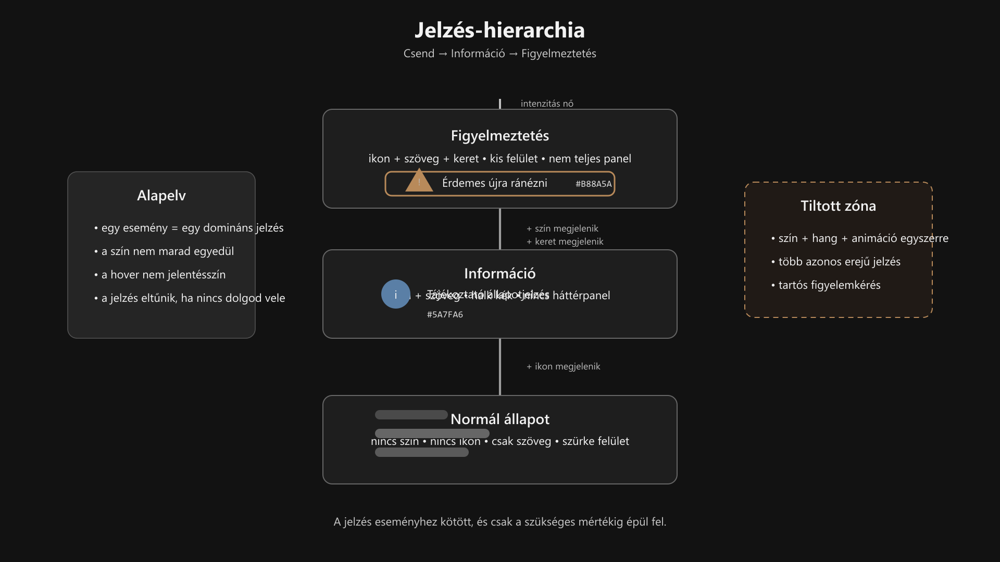

-   

    # 92. Jelzés-színek és Jelzés-viselkedés { #92-jelzes-szinek-es-jelzes-viselkedes }

    > Szerző: Hegedüs Gábor (@hege-g) 
    > Licenc: [MIT (Kód) / CC BY-NC-ND 4.0 (Docs)] 
    > Frostwood Docs: v1.0.0 
    > Rendszerverzió / Állapot: v1.0.5 / Stabil 
    > Blokk:  Referenciák

-   ## Tartalomkártyák

    * [:material-infinity: 1. Cél](#1-cel)
    * [:material-infinity: 2. Alapelv: hierarchia, nem paletta](#2-alapelv-hierarchia-nem-paletta)
    * [:material-infinity: 3. WCAG-kompatibilis jelzéselv](#3-wcag-kompatibilis-jelzeselv)
        * [:material-infinity: 3.1 Egy esemény = egy domináns jelzés](#31-egy-esemeny-egy-dominans-jelzes)
        * [:material-infinity: 3.2 Nem csak szín alapú jelentés](#32-nem-csak-szin-alapu-jelentes)
        * [:material-infinity: 3.3 Hover nem jelentésszín](#33-hover-nem-jelentesszin)
        * [:material-infinity: 3.4 Passzív kijelölés nem színes](#34-passziv-kijeloles-nem-szines)
        * [:material-infinity: 3.5 Időbeliség](#35-idobeliseg)
    * [:material-infinity: 4. Jelzési szerepek és referenciaárnyalatok](#4-jelzesi-szerepek-es-referenciaarnyalatok)
        * [:material-infinity: 4.1 Fókusz / Horgony (PRIMARY)](#41-fokusz-horgony-primary)
        * [:material-infinity: 4.2 Információ (INFO)](#42-informacio-info)
        * [:material-infinity: 4.3 Siker / Lezárás (SUCCESS)](#43-siker-lezaras-success)
        * [:material-infinity: 4.4 Figyelmeztetés (WARNING)](#44-figyelmeztetes-warning)
        * [:material-infinity: 4.5 Ikon referencia (kötelező társítás)](#45-ikon-referencia-kotelezo-tarsitas)
    * [:material-infinity: 5. Jelzési intenzitás és zajszint](#5-jelzesi-intenzitas-es-zajszint)
        * [:material-infinity: 5.1 Alacsony zaj](#51-alacsony-zaj)
        * [:material-infinity: 5.2 Közepes zaj](#52-kozepes-zaj)
        * [:material-infinity: 5.3 Tiltott zaj](#53-tiltott-zaj)
    * [:material-infinity: 6. Multi-signal szabály](#6-multi-signal-szabaly)
    * [:material-infinity: 7. WCAG / hosszú munka intenzitási modell](#7-wcag-hosszu-munka-intenzitasi-modell)
        * [:material-infinity: 7.1 Általános szabály](#71-altalanos-szabaly)
        * [:material-infinity: 7.2 Hosszú munkamenetben](#72-hosszu-munkamenetben)
    * [:material-infinity: 8. Rendszerszint vs alkalmazásszint](#8-rendszerszint-vs-alkalmazasszint)
    * [:material-infinity: 9. Registry és technikai realitás](#9-registry-es-technikai-realitas)
    * [:material-infinity: 10. Mentális terhelés modell](#10-mentalis-terheles-modell)
    * [:material-infinity: 11. Elvi lezárás](#11-elvi-lezaras)
    * [:material-infinity: 12. Gyors Audit Lista (Frostwood-megfelelőség)](#12-gyors-audit-lista-frostwood-megfeleloseg)

    * [:material-infinity: A) Függelék: Hol és hogyan jelenjenek meg a jelzés-színek](#a-fuggelek-hol-es-hogyan-jelenjenek-meg-a-jelzes-szinek)
        * [:material-infinity: A/1. A három hordozó](#a1-a-harom-hordozo)
        * [:material-infinity: A/2. Szövegben – a leghalkabb forma](#a2-szovegben-a-leghalkabb-forma)
        * [:material-infinity: A/3. Ikonban – célzottabb, de még halk](#a3-ikonban-celzottabb-de-meg-halk)
        * [:material-infinity: A/4. Felületen – ritka és erős](#a4-feluleten-ritka-es-eros)
        * [:material-infinity: A/5. Összefoglaló kártyák](#a5-osszefoglalo-kartyak)
        * [:material-infinity: A/6. Világos és sötét mód](#a6-vilagos-es-sotet-mod)
        * [:material-infinity: A/7. A narancs kivétel](#a7-a-narancs-kivetel)
    * [:material-infinity: B) Függelék: Kontraszt–fáradás térkép](#b-fuggelek-kontraszt-faradas-terkep)
        * [:material-infinity: B/1. Alapállapot – folyamatos munka](#b1-alapallapot-folyamatos-munka)
        * [:material-infinity: B/2. Hover – tapogatózás](#b2-hover-tapogatozas)
        * [:material-infinity: B/3. Aktív fókusz](#b3-aktiv-fokusz)
        * [:material-infinity: B/4. Információ](#b4-informacio)
        * [:material-infinity: B/5. Siker](#b5-siker)
        * [:material-infinity: B/6. Figyelmeztetés](#b6-figyelmeztetes)
        * [:material-infinity: B/7. Hosszú munkamenet szabálya](#b7-hosszu-munkamenet-szabalya)
    * [:material-infinity: C) Függelék: WCAG mód – tiltólista](#c-fuggelek-wcag-mod-tiltolista)
        * [:material-infinity: C/1. Tiltott hover-állapotok](#c1-tiltott-hover-allapotok)
        * [:material-infinity: C/2. Tiltott passzív kijelölés](#c2-tiltott-passziv-kijeloles)
        * [:material-infinity: C/3. Tiltott háttér-jelzések](#c3-tiltott-hatter-jelzesek)
        * [:material-infinity: C/4. Tiltott alapszínek](#c4-tiltott-alapszinek)
        * [:material-infinity: C/5. Tiltott mozgó jelzések](#c5-tiltott-mozgo-jelzesek)
        * [:material-infinity: C/6. Tiltott túlkommunikálás](#c6-tiltott-tulkommunikalas)
        * [:material-infinity: C/7. Tiltott állandó státuszszínezés](#c7-tiltott-allando-statuszszinezes)
        * [:material-infinity: C/8. Tiltott erős elválasztók](#c8-tiltott-eros-elvalasztok)
        * [:material-infinity: C/9. Tiltott dekoratív szín](#c9-tiltott-dekorativ-szin)
        * [:material-infinity: C/10. Tiltott többes fókusz](#c10-tiltott-tobbes-fokusz)
        * [:material-infinity: C/11. Rövid mantra](#c11-rovid-mantra)
    * [:material-infinity: D) Függelék: WCAG mód – engedélylista](#d-fuggelek-wcag-mod-engedelylista)
        * [:material-infinity: D/1. Aktív fókusz](#d1-aktiv-fokusz)
        * [:material-infinity: D/2. Hover](#d2-hover)
        * [:material-infinity: D/3. Információ](#d3-informacio)
        * [:material-infinity: D/4. Siker](#d4-siker)
        * [:material-infinity: D/5. Figyelmeztetés](#d5-figyelmeztetes)
        * [:material-infinity: D/6. Tér és tipográfia](#d6-ter-es-tipografia)
        * [:material-infinity: D/7. Statikus mélység](#d7-statikus-melyseg)
        * [:material-infinity: D/8. Levegővel történő elválasztás](#d8-levegovel-torteno-elvalasztas)
        * [:material-infinity: D/9. Időben korlátozott állapotjelzés](#d9-idoben-korlatozott-allapotjelzes)
        * [:material-infinity: D/10. Hang és mozgás](#d10-hang-es-mozgas)
        * [:material-infinity: D/11. Összefoglaló mondat](#d11-osszefoglalo-mondat)

## 1. Cél

Ez a dokumentum a Frostwood rendszer **jelzés-színeit és jelzés-viselkedését** rögzíti.

Ezek:

* nem UI-díszítőszínek
* nem branding elemek
* nem hangulatfestő színek

Csak akkor jelennek meg, ha **jelentést hordoznak**.

Ez a dokumentum a [91. Színkódok](91-szinkodok.md#91-hasznalt-szinkodok-vegleges) kiegészítése: ott a **jóváhagyott színek**, itt a **jelzéslogika és használati viselkedés** van rögzítve.

---

## 2. Alapelv: hierarchia, nem paletta

???+ quote "Alapelv"
    > A Frostwood nem „színes rendszer”. 
    > A Frostwood jelentés-rétegű rendszer.

A szín:

> Válasz egy eseményre.

Nem vezet. Nem díszít.

A jelzés célja:

* állapotot közölni
* döntést támogatni
* bizonytalanságot csökkenteni

Nem célja:

* látványosság
* jutalmazás
* állandó figyelemkérés

??? info "Vizuális leírás akadálymentesítéshez"
    Az ábra a Frostwood jelzésrendszerének hierarchikus működését mutatja.

    A diagram egy függőleges tengelyre épül, ahol lefelé a csendes, alapállapot, felfelé haladva pedig az egyre erősebb jelzések jelennek meg.

    Az alsó szinten a „Normál állapot” látható. Itt nincs szín és nincs ikon, csak semleges szöveg és szürke felületek.

    A középső szinten az „Információ” jelenik meg. Itt már megjelenik egy ikon és egy halk kék szín, de a jelzés még nem sürgető, és nem használ háttérkiemelést.

    A felső szinten a „Figyelmeztetés” található. Ebben az állapotban ikon, szín és egy vékony keret együtt jelenik meg, jelezve, hogy a felhasználónak érdemes figyelmet fordítania az eseményre.

    A szintek között lépcsőzetes átmenet mutatja, hogy a jelzés intenzitása fokozatosan nő: először ikon jelenik meg, majd szín, végül szerkezeti kiemelés.

    Az ábra kiemeli azt is, hogy több azonos erősségű jelzés egyszerre nem megengedett, például szín, hang és animáció kombinációja.

    A diagram célja annak bemutatása, hogy a Frostwood rendszerben a jelzés nem állandó, hanem eseményhez kötött, és fokozatosan épül fel a szükséges mértékig.

---

## 3. WCAG-kompatibilis jelzéselv

-   ### 3.1 Egy esemény = egy domináns jelzés

    Egy eseményhez **egy elsődleges jelzésréteg** tartozzon.

    Ez lehet például:

    * szöveg
    * ikon
    * finom felületi kiemelés

    Megengedett kiegészítésként:

    * ikon + szöveg
    * szín + szöveg

    Nem megengedett:

    * szín + hang + animáció + háttér egyszerre
    * több azonos erősségű, egymással versengő jelzés

-   ### 3.2 Nem csak szín alapú jelentés

    A Frostwood rendszerben a jelzés **nem maradhat kizárólag színre építve**.

    Ahol szükséges, a színt ki kell egészíteni:

    * szöveggel
    * ikonnal
    * szerkezeti elkülönítéssel

    Ez különösen fontos:

    * WCAG használatnál
    * hosszú munkamenetnél
    * kisegítő technológiák mellett

-   ### 3.3 Hover nem jelentésszín

    Hover soha nem jelentésszín.

    Különösen WCAG módban:

    * nincs kék hover
    * nincs narancs hover
    * nincs élénk reakció

    Hover csak irányérzékelés.

-   ### 3.4 Passzív kijelölés nem színes

    Csak az aktív fókusz kap PRIMARY színt.

    A háttérben maradt, nem aktív kijelölés:

    * nem lehet narancs
    * nem kaphat státusz-jellegű hangsúlyt

-   ### 3.5 Időbeliség

    A jelzés ideális életciklusa:

    > Megjelenik → értelmezed → elvégzed → eltűnik.

    A Frostwood nem támogat tartós, dekoratív státusz-színezést.

---

## 4. Jelzési szerepek és referenciaárnyalatok

A Frostwood jelzés-színei a [91. Színkódok](91-szinkodok.md#91-hasznalt-szinkodok-vegleges) referenciaértékeihez igazodnak.

-   ### 4.1 Fókusz / Horgony (PRIMARY)

    A **Frostwood Narancs** a rendszer vizuális horgonya. Ez az egyetlen szín, amely a navigáció során az aktuális pozíciót jelöli, függetlenül attól, hogy világos (Dawn) vagy sötét (Dusk) környezetben dolgozunk.

    #### :material-anchor: Technikai adatok

    * **Szín:** `#!color #B05A2A` (Frostwood Narancs)
    * **RGB:** `232, 168, 106`
    * **Stabilitás:** Fix érték, amely nem változik a környezeti módok (Light/Dark) váltásakor.

    #### :material-target: Funkcionális szerep

    * **Üzenet:** „Itt vagyok.”
    * **Aktív kijelölés:** A listában kiválasztott elem kiemelése.
    * **Fókusz-keret:** A billentyűzettel vezérelt elem körüli keret.
    * **Aktuális vezérlés:** A felhasználó figyelmének fókuszpontja.

    #### :material-alert-octagon-outline: Szigorú tiltások

    * **NEM hover:** Tilos egér-föléúszás (hover) jelzésére használni.
    * **NEM passzív:** Tilos inaktív vagy háttérben lévő kijelöléshez.
    * **NEM dekoráció:** Tilos díszítőelemként vagy tartós háttérszínként alkalmazni.

    ???+ note "Vizuális Horgony Szabály"
        A fókuszszín kizárólagos használata biztosítja, hogy a felhasználó soha ne vesszen el a felületen. Mivel ez az egyetlen ilyen intenzitású meleg árnyalat a rendszerben, a szem azonnal megtalálja az interakció helyét.

    ??? "Vizuális leírás az akadálymentes használathoz"
        Ez a szakasz három kártyán keresztül mutatja be a rendszer elsődleges interakciós színét, a Frostwood Narancsot (`#B05A2A`).

        Az első kártya a technikai kódokat rögzíti, a második a szín feladatát (fókusz és aktív kijelölés), a harmadik pedig a tiltott használati módokat sorolja fel.

        A leírás hangsúlyozza, hogy ez a szín egy "navigációs világítótorony": ritkán, de nagyon hangsúlyosan jelenik meg, jelezve a felhasználó aktuális helyét a szoftverben.

-   ### 4.2 Információ (INFO)

    A Frostwood információs színe szándékosan tompa, szürkéskék árnyalat. Nem akar versenyre kelni a fókuszszínnel; célja a csendes tájékoztatás, amely segít a kontextus megértésében anélkül, hogy megakasztaná a munkafolyamatot.

    #### :material-information-outline: Technikai adatok

    * **Szín:** `#!color #4A6D93` (Frostwood Info Kék)
    * **RGB:** `90, 127, 166`
    * **Karakter:** Alacsony telítettségű, szürkés tónus a vizuális nyugalom érdekében.

    #### :material-message-text-outline: Funkcionális szerep

    * **Üzenet:** „Tudd, de nem kell azonnal reagálnod.”
    * **Szöveg:** Kiegészítő magyarázatok, metaadatok megjelenítése.
    * **Kis ikon:** Tájékoztató jellegű piktogramok színezése.
    * **Státusz:** Halk, nem kritikus állapotvisszajelzés.

    #### :material-selection-off: Szigorú tiltások

    * **NEM nagy panel:** Tilos kiterjedt felületek színezésére használni.
    * **NEM háttérdoboz:** Kerülendő a teljes szövegdobozok háttereként.
    * **NEM tartós blokk:** Tilos olyan vizuális súlyt adni neki, amely elvonná a figyelmet a tartalomról.

    ???+ note "Tájékoztatás vs. Figyelem"
        Az Info szín közelebb áll a szürkéhez, mint a tiszta kékhez. Ez a tervezői döntés biztosítja, hogy a szín csak akkor legyen észlelhető, ha a felhasználó aktívan keresi az információt, egyébként pedig észrevétlenül simuljon bele a felületbe.

    ??? info "Vizuális leírás az akadálymentes használathoz"
        Ez a szakasz három kártyán mutatja be a rendszer tájékoztató színét, a Frostwood Info Kéket (`#4A6D93`).

        Az első kártya a technikai kódokat és a szín tompa karakterét rögzíti.

        A második kártya a diszkrét szerepkört (szöveg, kis ikonok) részletezi.

        A harmadik kártya a tiltásokat sorolja fel, megtiltva a szín használatát nagy felületeken.

        A leírás hangsúlyozza, hogy ez egy "halk" szín, amelynek célja a kiegészítő tájékoztatás a figyelem megragadása helyett.

-   ### 4.3 Siker / Lezárás (SUCCESS)

    A Frostwood rendszerben a siker nem egy harsány győzelmi jelzés, hanem a folyamat megnyugtató befejezése. A választott zsályazöld árnyalat célja a vizuális feszültség feloldása anélkül, hogy túlzott dopamin-választ vagy figyelemelterelést váltana ki.

    #### :material-check-decagram-outline: Technikai adatok

    * **Szín:** `#!color #5E7468` (Frostwood Zsályazöld)
    * **RGB:** `122, 143, 130`
    * **Karakter:** Tompa, természetközeli zöld, amely nem vibrál és nem dominál.

    #### :material-progress-check: Funkcionális szerep

    * **Üzenet:** „Kész. Lezárható.”
    * **Állapot:** Rövid, nyugodt állapot-visszajelzés egy sikeres művelet után.
    * **Szöveg:** Pozitív kimenetelű rendszermunka leírása.
    * **Kis ikon:** Lezárást vagy sikeres mentést jelző szimbólumok.

    #### :material-alert-octagon: Szigorú tiltások

    * **NEM ünneplés:** Tilos jutalmazó vizuális effektek (pl. konfetti, villogás) használata.
    * **NEM zöld háttér:** Kerülendő a teljes panelek vagy ablakok háttérszínezése.
    * **NEM animált pipa:** A vizuális nyugalom érdekében kerüljük a mozgó elemeket.
    * **NEM díszítés:** Tilos tartós díszítő állapotként alkalmazni.

    ???+ note "Funkcionális Lezárás"
        A siker nálunk nem ünneplés, hanem a munkafolyamat egy szakaszának lezárása. A szín azt üzeni: a feladat elvégezve, a figyelem továbbléphet a következő elemre.

    ??? info "Vizuális leírás az akadálymentes használathoz"
        Ez a szakasz három kártyán keresztül mutatja be a rendszer siker-színét, a Frostwood Zsályazöldet (`#5E7468`).

        Az első kártya a technikai kódokat és a tompa, természetes tónust rögzíti.

        A második kártya a funkcionális felhasználást (rövid visszajelzés, ikonok) mutatja be.

        A harmadik kártya a tiltásokat sorolja fel, hangsúlyozva a digitális „túlkapások” (animációk, harsány színek) mellőzését.

        A leírás segít megérteni, hogy a siker itt a folyamat végét jelző diszkrét jelzés, nem pedig figyelemfelkeltő effektus.

-   ### 4.4 Figyelmeztetés (WARNING)

    A Frostwood rendszerben a figyelmeztetés nem vészhelyzetet, hanem fokozott figyelmet igényel. A választott árnyalat egy mélyebb, barnás-arany tónus, amely jól látható, de nem vált ki stresszreakciót a felhasználóból.

    #### :material-alert-outline: Technikai adatok

    * **Szín:** `#!color #9B6C35` (Frostwood Óarany)
    * **RGB:** `184, 138, 90`
    * **Megkülönböztetés:** Bár közel áll a narancshoz, tónusában sötétebb és telítetlenebb, hogy ne legyen összetéveszthető az aktív fókusszal.

    #### :material-eye-check-outline: Funkcionális szerep

    * **Üzenet:** „Lassíts. Nézz rá újra.”
    * **Jelzés:** Ritka, de jól észrevehető jelzés a lehetséges következményekre.
    * **Szöveg/Ikon:** Figyelemfelkeltő feliratok vagy kisméretű figyelmeztető piktogramok színezése.
    * **Időtartam:** Rövid ideig tartó vagy lokális jelenlét.

    #### :material-alert-remove-outline: Szigorú tiltások

    * **NEM piros:** Tilos a klasszikus digitális „pánikvörös” használata.
    * **NEM villogás:** Kerülendő minden mozgó vagy villogó effektus.
    * **NEM halmozás:** Tilos több figyelmeztető jelzést egyszerre, zsúfoltan elhelyezni.
    * **NEM nagy felület:** Kerülendő a nagy, meleg tónusú háttérblokkok alkalmazása.

    ???+ warning "Kognitív Tudatosság"
        A Figyelmeztetés színe a Frostwood-logika szerint megállásra késztet, nem pedig menekülésre. Célja, hogy a felhasználó ne ijedjen meg, hanem nézze át az adatokat még egyszer a véglegesítés előtt.

    ??? info "Vizuális leírás az akadálymentes használathoz"
        Ez a szakasz három kártyán mutatja be a rendszer figyelmeztető színét, a Frostwood Óaranyat (`#9B6C35`).

        Az első kártya a technikai adatokat rögzíti, kiemelve a különbséget a fókuszszínhez képest.

        A második kártya a "lassító" funkciót és a diszkrét jelzési módokat (szöveg, ikon) írja le.

        A harmadik kártya a tiltásokat sorolja fel, kifejezetten tiltva a piros színt és a villogást.

        A leírás segít megérteni, hogy a figyelmeztetés itt egy tudatos döntési pontot jelöl, nem pedig egy szoftveres hibát.

-   ### 4.5 Ikon referencia (kötelező társítás)

    A Frostwood rendszerben a szín soha nem maradhat önmagában. A jelentésátvitel biztonsága érdekében minden funkcionális jelzéshez kötelezően egy kiegészítő vizuális elemet (ikont vagy szöveget) kell rendelni.

    #### :material-vector-combine: A redundancia szabálya

    A szín nem lehet az elsődleges és egyetlen jelentéshordozó.

    * **Szabály:** Minden állapotjelző szín mellett szerepelnie kell egy piktogramnak vagy egyértelmű feliratnak.
    * **Cél:** Teljes értékű használhatóság színvakság, kedvezőtlen fényviszonyok vagy technikai (pl. monokróm kijelző) korlátok esetén is.

    #### :material-image-filter-center-focus-strong-outline: Ajánlott ikonográfia

    A Segoe Fluent Icons alapú megfeleltetés szerint az alábbi szimbólumok használandók:

    * **Információ:** `Info` / körbe zárt "i" betű.
    * **Siker:** `Checkmark` / pipa szimbólum.
    * **Figyelmeztetés:** `Warning` / egyenlő szárú háromszögben lévő felkiáltójel.

    #### :material-rhombus-split: Konzisztencia és forma

    Az ikonok kiválasztásánál az egyszerűség az elsődleges szempont.

    * **Egyszerűség:** Kerüljük a túldíszített, többértelmű ábrákat.
    * **Konzisztencia:** Ugyanarra a jelentésre (pl. Siker) a rendszer minden pontján ugyanazt az ikoncsaládot kell alkalmazni.
    * **Ismertség:** Használjunk közismert, konvencionális szimbólumokat.

    ???+ warning "WCAG Megfelelőség"
        A "szín önmagában nem jelentés" elv (WCAG 1.4.1) betartása a Frostwood audit során kritikus pont. Egy olyan felület, ahol csak egy színes pötty jelzi a hibát ikon vagy szöveg nélkül, automatikusan bukik az ellenőrzésen.

    ??? info "Vizuális leírás az akadálymentes használathoz"
        Ez a szakasz három kártyán keresztül részletezi a vizuális redundancia követelményét.

        Az első kártya kimondja a fő szabályt: a szín mellé mindig kell egy másik csatorna (ikon vagy szöveg).

        A második kártya konkrét piktogram-típusokat rendel a 4.2, 4.3 és 4.4 pontokban megismert színekhez (info, siker, figyelmeztetés).

        A harmadik kártya a formavilág egységességét és az érthetőséget hangsúlyozza.

        A leírás segít megérteni, hogy a rendszer nem a látványra, hanem az információ biztos átadására épül.

---

## 5. Jelzési intenzitás és zajszint

A Frostwood jelzések zajszintje három kategóriára osztható.

-   ### 5.1 Alacsony zaj

    Jellemzően:

    * fókusz
    * halk info
    * státuszszöveg
    * finom ikonjelzés

    **Használat:** normál működés.

-   ### 5.2 Közepes zaj

    Jellemzően:

    * figyelmeztetés
    * workflow-megszakítást megelőző állapot
    * rövid idejű döntéskérés

    **Csak szükség esetén.**

-   ### 5.3 Tiltott zaj

    Nem megengedett:

    * villogás
    * pulzálás
    * több domináns jelzés egyszerre
    * szín + hang + animáció kombináció
    * agresszív, tartós státuszszínezés

    **Ez a Frostwood rendszerben tiltott.**

---

## 6. Multi-signal szabály

Egy eseményhez nem társulhat egyszerre több, azonos erejű domináns jelzés.

Nem megengedett kombinációk például:

* színes ikon + színes szöveg + színes háttér
* figyelmeztető szín + hang + animáció
* több egymástól független hangsúlyjel ugyanarra az eseményre

Megengedett:

* szöveg + kis ikon
* fókusz + szerkezeti kiemelés
* rövid figyelmeztető címke + semleges környezet

Szabály:

> Egy eseménynek egy domináns jelzése legyen.

---

## 7. WCAG / hosszú munka intenzitási modell

Hosszú munkánál a jelzésrendszer tovább halkul.

-   ### 7.1 Általános szabály

    * INFO ritkán
    * SUCCESS ritkán
    * WARNING csak indokoltan
    * PRIMARY stabil

-   ### 7.2 Hosszú munkamenetben

    #### 0–30 perc

    * info és success még elfogadható
    * a rendszer kevésbé restriktív

    #### 30–90 perc

    * info maradhat
    * success már legyen ritka
    * hover legyen még halkabb

    #### 90+ perc

    Csak:

    * aktív fókusz
    * valóban szükséges figyelmeztetés

    Minden más háttérbe húzódik.

---

## 8. Rendszerszint vs alkalmazásszint

A Frostwood rendszer implementációja során figyelembe kell venni a technikai környezet korlátait. A stratégia alapja a stabilitás: csak ott avatkozunk be mélyen a vizuális megjelenítésbe, ahol az hosszú távon is fenntartható.

-   ### :material-microsoft-windows: Rendszerszint

    A Windows 11 környezetben a globális jelzéscsatorna egységesítése technikai korlátokba ütközik.

    * **Korlátok:** Eltérő UI motorok, renderelési eljárások és fix natív elemek.
    * **Frostwood stratégia:** Nem kényszerítünk globális színcserét és nem alkalmazunk instabil UI-hackeléseket.
    * **Intervenció:** Csak ott avatkozunk be, ahol a rendszer stabilan és biztonságosan kontrollálható.

-   ### :material-application-cog-outline: Alkalmazásszint

    Ez a jelzések elsődleges terepe, ahol a Frostwood elvek közvetlenül érvényesülnek.

    * **Főbb platformok:** Total Commander, böngészők (Edge, Chrome, Firefox), valamint kommunikációs szoftverek (Zoom, Meta).
    * **Segédtechnológiák:** JAWS-hoz kapcsolódó vizuális visszajelzések és Insta360 státuszjelzések.
    * **Alapelv:** A jelzés mindig kis felületen, ritkán és sohasem teljes háttérpanelen jelenik meg.

???+ note "Implementációs Fegyelem"
    A rendszerszintű óvatosság és az alkalmazásszintű precizitás együtt biztosítja, hogy a Frostwood ne váljon instabillá, de minden kritikus munkafolyamatban jelen legyen a szabványosított jelzésrendszer.

??? info "Vizuális leírás az akadálymentes használathoz"
    Ez a szakasz két kártyán szemlélteti a Frostwood hatókörét.

    Az első kártya a Windows operációs rendszer korlátait mutatja be, ahol a rendszer csak "óvatos vendégként" van jelen a technikai kötöttségek miatt.

    A második kártya azokat az alkalmazásokat (fájlkezelők, böngészők, csevegők) sorolja fel, ahol a Frostwood szabályai teljes mértékben érvényesülnek.

    A leírás rögzíti a "kevesebb több" elvét: a jelzések pontszerűek és diszkrétek maradnak minden szoftverben.

---

## 9. Registry és technikai realitás

A Frostwood jelzésrendszere technikailag is realista.

Opcionálisan előfordulhat:

* bizonyos Windows színkulcsok finom állítása
* például HotTrackingColor jellegű paraméterezés

Nem cél:

* globális SUCCESS kényszerítés
* globális WARNING háttér
* agresszív rendszerszintű felületátfestés

Aggressive mód:

* több kulcsot érinthet
* de stabil rendszerben nem ajánlott

---

## 10. Mentális terhelés modell

A jelzés célja:

* csökkenteni a bizonytalanságot
* nem növelni a zajt
* segíteni a döntést
* nem megszakítani a gondolkodást, ha nem szükséges

A Frostwood rendszer alapelve:

???+ quote "Alapelv"
    > Kevesebb jelzés = stabilabb fókusz. 
    > Ha túl sok a szín, az rendszerhiba.

## 11. Elvi lezárás

> A Frostwood jelzésrendszer nem élénk, hanem pontos. 
> Nem jutalmaz, nem riogat, nem díszít.

Feladata:

* egyértelművé tenni az eseményt
* megtartani a fókuszt
* csökkenteni a mentális terhelést
* WCAG-kompatibilis maradni hosszú munkában is

---

## 12. Gyors Audit Lista (Frostwood-megfelelőség)

Mielőtt véglegesítenél egy fejlesztést vagy felületi módosítást, futtasd le az alábbi ellenőrzést. Ha bármelyik pontra **NEM** a válasz, a felület nem Frostwood-kompatibilis.

-   ### :material-eye-check-outline: Vizuális jelzésellenőrzés

    * :material-checkbox-blank-outline: **Csak színt használsz?** Minden jelzés mellett van ikon vagy szöveg is? (4.5 pont)
    * :material-checkbox-blank-outline: **A fókusz színe egyedi?** Csak a fókusz-pont használja a Frostwood Narancsot (#B05A2A)? (4.1 pont)
    * :material-checkbox-blank-outline: **Kerülöd a pánikszíneket?** Nincs a felületen tiszta piros vagy vibráló neon árnyalat? (C/4 függelék)

-   ### :material-timer-outline: Időbeliség és dinamika

    * :material-checkbox-blank-outline: **Elillan a sikerjelzés?** A szürkészöld (#5E7468) visszajelzés eltűnik 3-5 másodperc után? (D/4 függelék)
    * :material-checkbox-blank-outline: **Statikus a felület?** Mentes minden elem a villogástól, pulzálástól vagy mozgástól? (C/5 függelék)
    * :material-checkbox-blank-outline: **A figyelmeztetés korlátos?** A nem kritikus figyelmeztetés automatikusan távozik a képernyőről? (D/5 pont)

-   ### :material-layers-minus: Kognitív terhelés (WCAG)

    * :material-checkbox-blank-outline: **Csak egy fókusz van?** Biztosított, hogy egyszerre csak egy narancs színű elem látható? (C/10 függelék)
    * :material-checkbox-blank-outline: **Halk a rendszer?** Ha nincs esemény vagy döntési kényszer, a felület vizuálisan néma marad? (B/7 szabály)
    * :material-checkbox-blank-outline: **Levegős a tagolás?** Vastag vonalak helyett térközöket használsz az elválasztáshoz? (D/8 pont)

???+ tip "Frostwood-teszt"
    "Ha becsukom a szemem, és csak a képernyőolvasóra vagy a vizuális memóriámra hagyatkozom, akkor is tudom, hol vagyok és mi történt?" Ha a válasz igen, a rendszer jól működik.

??? "Vizuális leírás az akadálymentes használathoz"
    Ez a záró szakasz három kártyán foglalja össze a legfontosabb ellenőrzési pontokat :

    * **A) kártya:** Szín-ikon párosítás, fókusz egyedisége, tiltott színek szűrése.
    * **B) kártya:** Időablakok betartása (3-5-10 mp), mozgásmentesség ellenőrzése.
    * **C) kártya:** Egyedüli fókuszpont, passzív állapotok némasága, térköz-alapú tagolás.

    Segít a gyors önellenőrzésben, hogy a felület megfelel-e a "szín + ikon", a "statisztikus megjelenítés" és a "mentális csend" alapelveinek.

    A kártyák pontokba szedve tartalmazzák a technikai hivatkozásokat a korábbi fejezetekre.

---

-   

    # A) Függelék: Hol és hogyan jelenjenek meg a jelzés-színek { #a-fuggelek-hol-es-hogyan-jelenjenek-meg-a-jelzes-szinek }

    > Szerző: Hegedüs Gábor (@hege-g) 
    > Licenc: [MIT (Kód) / CC BY-NC-ND 4.0 (Docs)] 
    > Frostwood Docs: v1.0.0 
    > Rendszerverzió / Állapot: v1.0.5 / Stabil 
    > Blokk:  Referenciák 
    > Kiegészítő függelék a `92. Jelzés-színek és Jelzés-viselkedés` modulhoz.

-   ## Tartalomkártyák

    * [:material-infinity: A/1. A három hordozó](#a1-a-harom-hordozo)
    * [:material-infinity: A/2. Szövegben – a leghalkabb forma](#a2-szovegben-a-leghalkabb-forma)
    * [:material-infinity: A/3. Ikonban – célzottabb, de még halk](#a3-ikonban-celzottabb-de-meg-halk)
    * [:material-infinity: A/4. Felületen – ritka és erős](#a4-feluleten-ritka-es-eros)
    * [:material-infinity: A/5. Összefoglaló kártyák](#a5-osszefoglalo-kartyak)
    * [:material-infinity: A/6. Világos és sötét mód](#a6-vilagos-es-sotet-mod)
    * [:material-infinity: A/7. A narancs kivétel](#a7-a-narancs-kivetel)

??? abstract "Összefoglaló / Vizuális leírás az akadálymentes használathoz"
    Ez a függelék a Frostwood jelzésrendszerének gyakorlati felépítését mutatja be, a diszkrét szöveges közléstől a hangsúlyos felületi elemekig. 

    A leírás három fő hordozót különböztet meg: 

    1. A szöveget, amely a leggyakoribb és leghalkabb információs csatorna.
    2. Az ikonokat, amelyek közepes erősségű, gyorsító jelzések.
    3. A felületi elemeket (pl. fókusz), amelyek ritkák, de erős vizuális súlyukkal azonnali figyelmet követelnek.

    A rendszer dinamikáját a "fordított arányosság" elve határozza meg: minél erősebb egy vizuális inger, annál ritkábban fordul elő, így biztosítva a mentális csendet. 

    A környezeti módok (Dawn/Dusk) fejezet szemlélteti, hogy a színek intenzitása alkalmazkodik a fényviszonyokhoz (sötét módban lágyabbak), egyetlen kritikus kivétellel: a fókusz-narancs minden körülmények között állandó marad. Ez a stabilitás segíti a vizuális memória rögzülését, mivel a felhasználó agya ezt az egyetlen pontot tanulja meg fix orientációs horgonyként.

## A/1. A három hordozó

A jelzés három fő hordozója:

1. szöveg
2. ikon
3. felület

Ezek nem egyenrangúak.

---

## A/2. Szövegben – a leghalkabb forma

Ez az alapértelmezett jelzési forma.

-   ### Mikor?

    * állapotjelzés
    * kiegészítő információ
    * nem elsődleges művelet

-   ### Hogyan?

    * a szín csak a szövegen jelenik meg
    * nincs háttér
    * nincs túlzott tipográfiai hangsúly

Érzet:

> Ha elolvasod, tudod – ha nem, nem sürgős.

---

## A/3. Ikonban – célzottabb, de még halk

Másodlagos hangsúly.

-   ### Mikor?

    * státusz-ikon
    * visszajelzés egy művelet után
    * figyelmeztetés előjele

-   ### Hogyan?

    * csak az ikon színezett
    * a kísérő szöveg maradhat semleges
    * nincs glow
    * nincs erős kontúr

Érzet:

> Történt valami, de még nem sürgős.

---

## A/4. Felületen – ritka és erős

Ez a legerősebb jelzési forma.

-   ### Mikor?

    * aktív fókusz
    * aktív kijelölés
    * kivételes figyelmeztetés

-   ### Hogyan?

    * kis területen
    * enyhe eltéréssel
    * soha nem teljes oldalszinten
    * nem telített háttérként

Érzet:

> Most ezzel foglalkozz.

---

## A/5. Összefoglaló kártyák

A Frostwood ingerkezelési stratégiája a fokozatosságon alapul. Az alábbi kártyák bemutatják az információhordozók, az észlelési erősség és a megjelenési gyakoriság közötti kényes egyensúlyt.

-   ### :material-format-text: Szöveges hordozó

    Ez a rendszer legközvetlenebb, de legkevésbé tolakodó csatornája.

    * **Erősség:** Halk – Finom tájékoztatás, amely nem szakítja meg a gondolatmenetet.
    * **Gyakoriság:** Gyakori – Az elsődleges eszköz az adatok és állapotok közlésére.

-   ### :material-vector-square: Ikonográfia

    Vizuális megerősítés, amely segíti a gyors felismerést.

    * **Erősség:** Közepes – Határozottabb jelzés, amely vonzza a tekintetet, de nem uralja a teret.
    * **Gyakoriság:** Alkalmanként – Csak ott használjuk, ahol a szöveg értelmezését gyorsítani kell.

-   ### :material-layers-outline: Felületi elemek

    Nagyobb grafikai blokkok vagy háttérszínezések.

    * **Erősség:** Erős – Magas vizuális súly, amely azonnali figyelmet követel.
    * **Gyakoriság:** Ritka – Kizárólag kritikus fókuszpontok vagy rendszerszintű állapotváltások esetén alkalmazzuk.

???+ tip "Mentális Csend"
    Ez a fordított arányosság (minél erősebb egy jelzés, annál ritkábban használjuk) biztosítja a Frostwood-élményt: a felület csak akkor „szólal meg” hangosan, ha az valóban elkerülhetetlen.

??? info "Vizuális leírás az akadálymentes használathoz"
    Ez a szakasz három kártyán keresztül szemlélteti az információátadás hierarchiáját.

    Az első kártya a szöveget mint "halk", de "gyakori" elemet mutatja be.

    A második az ikonokat "közepes" erősségű, "alkalmi" jelzésként definiálja.

    A harmadik a felületi elemeket "erős", de "ritka" eszközként rögzíti.

    A leírás segít megérteni a rendszer dinamikáját: a legtöbb információ diszkrét szövegként jelenik meg, és csak a legfontosabb dolgok kapnak erős vizuális hangsúlyt, így elkerülhető a felhasználó túlterhelése.

---

## A/6. Világos és sötét mód

Az alapjelentés ugyanaz marad, de a fényérzet módosul.

???+ quote "Alapelv"
    > Sötét módban a szín halkabbnak hasson, világos módban valamivel jobban olvasható lehet.

Ez nem új jelentést ad, csak ugyanazon jelentés eltérő fényviszonybeli viselkedését.

---

## A/7. A narancs kivétel

A fókusz-narancs kivétel.

* világos módban is ugyanaz
* sötét módban is ugyanaz

Mert ez nem hangulati, hanem orientációs szín.

> Az agy ezt tanulja meg stabil pontként.

---

-   

    # B) Függelék: Kontraszt–fáradás térkép { #b-fuggelek-kontraszt-faradas-terkep }

    > Szerző: Hegedüs Gábor (@hege-g) 
    > Licenc: [MIT (Kód) / CC BY-NC-ND 4.0 (Docs)] 
    > Frostwood Docs: v1.0.0 
    > Rendszerverzió / Állapot: v1.0.5 / Stabil 
    > Blokk:  Referenciák 
    > Kiegészítő függelék a `92. Jelzés-színek és Jelzés-viselkedés` modulhoz. 
    > Világos WCAG mód – `#FAFAFA` (Hófehér szürke / Snow white) háttér, hosszú munkamenet.

-   ## Tartalomkártyák

    * [:material-infinity: B/1. Alapállapot – folyamatos munka](#b1-alapallapot-folyamatos-munka)
    * [:material-infinity: B/2. Hover – tapogatózás](#b2-hover-tapogatozas)
    * [:material-infinity: B/3. Aktív fókusz](#b3-aktiv-fokusz)
    * [:material-infinity: B/4. Információ](#b4-informacio)
    * [:material-infinity: B/5. Siker](#b5-siker)
    * [:material-infinity: B/6. Figyelmeztetés](#b6-figyelmeztetes)
    * [:material-infinity: B/7. Hosszú munkamenet szabálya](#b7-hosszu-munkamenet-szabalya)

??? abstract "Összefoglaló / Vizuális leírás az akadálymentes használathoz"
    Ez a függelék a Frostwood rendszer dinamikus állapotait és az interakciók hierarchiáját mutatja be, a teljes vizuális csendtől a kritikus döntési pontokig.

    A leírás hat állapotot és egy záró szabályt különít el:

    1. **Alapállapot:** A folyamatos munka tere, ahol a vizuális zaj zéró. Csak a térközök és a tipográfia dominál; a színes háttérszínek használata szigorúan tiltott.
    2. **Hover (Tapogatózás):** Az egérmutató mozgását kísérő, semleges és hideg szürke visszajelzés. Kerüli a meleg tónusokat és a narancsot, hogy ne tévessze meg a felhasználót.
    3. **Aktív fókusz:** A legerősebb vizuális jelzés, amely kizárólag a Frostwood Narancsot használja. Ez egy pontszerű, határozott horgony, amelyből egyszerre csak egy létezhet.
    4. **Információ:** A leggyakoribb, de halk jelzés. Deszaturált szürkéskék színe és diszkrét megjelenése (szöveg vagy kis ikon) nem szakítja meg a munkafolyamatot.
    5. **Siker:** A folyamatok megnyugtató lezárása tompított szürkészölddel. Kerül minden győzelmi effektust vagy tolakodó animációt.
    6. **Figyelmeztetés:** A rendszer legkritikusabb, de még mindig mértéktartó jelzése. Kerüli a "pánikvörös" színt és a villogást; egy meleg, tompa árnyalattal készteti lassításra a felhasználót.

    A szakasz a "Hosszú munkamenet szabályával" zárul, amely kimondja: a Frostwood egy passzív megfigyelő, amely csak akkor avatkozik be vizuálisan, ha a felhasználónak valódi döntést kell hoznia, ezzel óvva a mentális fókuszt.

## B/1. Alapállapot – folyamatos munka

Ez a legtöbb idő.

-   Jellemzői

    * nincs külön jelzés
    * nincs eseményszín
    * csak tipográfia és tér

-   Megengedett

    * nagyon finom zebra
    * enyhe rétegkülönbség

-   Tiltott

    * info-kék háttér
    * success-zöld háttér
    * figyelmeztető felület
    * állandó ikon-színezés

???+ quote "Alapelv"
    > Ha minden rendben van, semmi ne szóljon.

---

## B/2. Hover – tapogatózás

Ez még nem döntés, csak irányérzékelés.

-   Engedélyezett

    * semleges, hideg világosszürke
    * nagyon kis kontrasztlépés
    * csak felületi szinten

-   Tiltott

    * narancs
    * szöveg-színezés
    * ikon-színezés
    * meleg tónus

---

## B/3. Aktív fókusz

Ez a legerősebb, de ritka jelzés.

-   Engedélyezett

    * `#B05A2A` (Frostwood Narancs / Sandy copper)
    * csak egy helyen
    * csak aktív fókuszra

-   Tiltott

    * több fókusz egyszerre
    * hover-narancs
    * nagy felületű narancs háttér

---

## B/4. Információ

Ez a leggyakoribb halk jelzés.

Hordozó:

* szöveg
* kis ikon

Jellemző:

* deszaturált
* közelebb a szürkéhez, mint a tiszta kékhez
* nem sürgető

---

## B/5. Siker

Lezárást jelez.

-   Engedélyezett

    * szöveg
    * kis ikon
    * tompított szürkészöld

-   Tiltott

    * zöld háttér
    * animált pipa
    * jutalmazó vizuális hatás

---

## B/6. Figyelmeztetés

A legkritikusabb pont.

-   Engedélyezett

    * meleg, tompa árnyalat
    * kis terület
    * rövid idejű jelzés

-   Tiltott

    * piros riadó
    * villogás
    * háttér + ikon + szöveg egyszerre

---

## B/7. Hosszú munkamenet szabálya

> Hosszú munkában a rendszer csak akkor szól, ha a felhasználónak valóban döntést kell hoznia.

---

-   

    # C) Függelék: WCAG mód – tiltólista { #c-fuggelek-wcag-mod-tiltolista }

    > Szerző: Hegedüs Gábor (@hege-g) 
    > Licenc: [MIT (Kód) / CC BY-NC-ND 4.0 (Docs)] 
    > Frostwood Docs: v1.0.0 
    > Rendszerverzió / Állapot: v1.0.5 / Stabil 
    > Blokk:  Referenciák 
    > Kiegészítő függelék a `92. Jelzés-színek és Jelzés-viselkedés` modulhoz.

-   ## Tartalomkártyák

    * [:material-infinity: C/1. Tiltott hover-állapotok](#c1-tiltott-hover-allapotok)
    * [:material-infinity: C/2. Tiltott passzív kijelölés](#c2-tiltott-passziv-kijeloles)
    * [:material-infinity: C/3. Tiltott háttér-jelzések](#c3-tiltott-hatter-jelzesek)
    * [:material-infinity: C/4. Tiltott alapszínek](#c4-tiltott-alapszinek)
    * [:material-infinity: C/5. Tiltott mozgó jelzések](#c5-tiltott-mozgo-jelzesek)
    * [:material-infinity: C/6. Tiltott túlkommunikálás](#c6-tiltott-tulkommunikalas)
    * [:material-infinity: C/7. Tiltott állandó státuszszínezés](#c7-tiltott-allando-statuszszinezes)
    * [:material-infinity: C/8. Tiltott erős elválasztók](#c8-tiltott-eros-elvalasztok)
    * [:material-infinity: C/9. Tiltott dekoratív szín](#c9-tiltott-dekorativ-szin)
    * [:material-infinity: C/10. Tiltott többes fókusz](#c10-tiltott-tobbes-fokusz)
    * [:material-infinity: C/11. Rövid mantra](#c11-rovid-mantra)

??? abstract "Összefoglaló / Vizuális leírás az akadálymentes használathoz"
    Ez a függelék a Frostwood rendszer "vörös vonalait" és tiltott vizuális megoldásait foglalja össze 11 pontban, amelyek a kognitív túlterhelés és a vizuális zaj megelőzését szolgálják.

    A leírás a következő fő tiltási kategóriákat határozza meg:

    1. **Interakciós tisztaság:** Tiltja a színes egér-föléúszást (hover) és a háttérben maradó, inaktív kijelöléseket. A szín csak ott jelenhet meg, ahol tényleges interakció zajlik.
    2. **Strukturális fegyelem:** Megtiltja a nagy felületű háttér-jelzéseket és a domináns elválasztó vonalakat. A rendszer a tagolást nem "kemény" keretekkel, hanem térközökkel és levegős elrendezéssel oldja meg.
    3. **Kromatikus szigor:** Kizárja a tiszta, neon vagy "pánik-szerű" árnyalatok (pl. piros) használatát. Csak a Frostwood paletta engedélyezett, és a színek soha nem lehetnek pusztán dekoratív jellegűek.
    4. **Dinamikai korlátok:** A WCAG mód szellemében tilt minden mozgó, villogó vagy pulzáló jelzést. A vizuális visszajelzés minden esetben statikus.
    5. **Információs ökológia:** Tiltja a "túlkommunikálást" (amikor egyszerre több csatornán – szín, hang, animáció – érkezik ugyanaz a jelzés) és az állandó státuszszínezést. Ha a rendszer állapota megfelelő, a felületnek vizuálisan hallgatnia kell.
    6. **Fókusz egysége:** Szigorúan rögzíti, hogy a narancs színű fókuszpontból egyszerre csak egyetlen egy létezhet a teljes felületen.

    A szakasz a "Frostwood mantrával" zárul, amely összefoglalja a rendszer etikai alapállását: a figyelem el nem terelése és a döntési helyzetek tiszta vizuális támogatása az elsődleges cél.

## C/1. Tiltott hover-állapotok

Nem megengedett:

* narancs hover
* kék hover
* zöld hover
* bármilyen telített hover

???+ quote "Alapelv"
    > WCAG módban hover = semleges vagy semmi.

---

## C/2. Tiltott passzív kijelölés

Nem megengedett:

* háttérben maradt színes kijelölés
* nem aktív elem erős hangsúlyozása

???+ quote "Alapelv"
    > Ha nem aktív: ne legyen színes.

---

## C/3. Tiltott háttér-jelzések

WCAG módban nem megengedett:

* info háttérdoboz
* success háttérdoboz
* warning háttérdoboz nagy felületen

???+ quote "Alapelv"
    > Jelzés elsődlegesen szövegben vagy ikonban jelenjen meg.

---

## C/4. Tiltott alapszínek

Nem megengedett:

* tiszta kék
* tiszta zöld
* piros
* élénk narancs
* neon árnyalatok

---

## C/5. Tiltott mozgó jelzések

Nem megengedett:

* villanás
* pulzálás
* csúszás
* fade-jelzés, ha figyelemfelkeltésre szolgál

???+ quote "Alapelv"
    > WCAG módban a jelzés statikus.

---

## C/6. Tiltott túlkommunikálás

Nem megengedett ugyanarra az eseményre:

* színes ikon
* színes szöveg
* színes háttér
* hang
* animáció

???+ quote "Alapelv"
    > Együtt, domináns formában.

---

## C/7. Tiltott állandó státuszszínezés

Nem megengedett:

* folyamatos „OK”
* folyamatos „Ready”
* állandóan színes „Connected”

???+ quote "Alapelv"
    > Ha minden rendben van, a rendszer hallgasson.

---

## C/8. Tiltott erős elválasztók

Kerülendő:

* vastag vonalak
* kemény rácsok
* erős keretezés

???+ quote "Alapelv"
    > A Frostwood levegővel választ el, nem erős vonalakkal.

---

## C/9. Tiltott dekoratív szín

Nem megengedett olyan szín, amely:

* nem hordoz jelentést
* csak hangulati elem
* csak látvány

???+ quote "Alapelv"
    > Ha nincs jelentése: ne jelenjen meg.

---

## C/10. Tiltott többes fókusz

Nem megengedett:

* két narancs fókusz
* két egyidejű aktuális pont

???+ quote "Alapelv"
    > A fókusz mindig egy.

---

## C/11. Rövid mantra

> Ha nem kér döntést, ne kérjen figyelmet. 
> Ha nem aktív, ne legyen színes. 
> Ha hosszú munka van, a rendszer hallgasson.

---

-   

    # D) Függelék: WCAG mód – engedélylista { #d-fuggelek-wcag-mod-engedelylista }

    > Szerző: Hegedüs Gábor (@hege-g) 
    > Licenc: [MIT (Kód) / CC BY-NC-ND 4.0 (Docs)] 
    > Frostwood Docs: v1.0.0 
    > Rendszerverzió / Állapot: v1.0.5 / Stabil 
    > Blokk:  Referenciák 
    > Kiegészítő függelék a `92. Jelzés-színek és Jelzés-viselkedés` modulhoz.

-   ## Tartalomkártyák

    * [:material-infinity: D/1. Aktív fókusz](#d1-aktiv-fokusz)
    * [:material-infinity: D/2. Hover](#d2-hover)
    * [:material-infinity: D/3. Információ](#d3-informacio)
    * [:material-infinity: D/4. Siker](#d4-siker)
    * [:material-infinity: D/5. Figyelmeztetés](#d5-figyelmeztetes)
    * [:material-infinity: D/6. Tér és tipográfia](#d6-ter-es-tipografia)
    * [:material-infinity: D/7. Statikus mélység](#d7-statikus-melyseg)
    * [:material-infinity: D/8. Levegővel történő elválasztás](#d8-levegovel-torteno-elvalasztas)
    * [:material-infinity: D/9. Időben korlátozott állapotjelzés](#d9-idoben-korlatozott-allapotjelzes)
    * [:material-infinity: D/10. Hang és mozgás](#d10-hang-es-mozgas)
    * [:material-infinity: D/11. Összefoglaló mondat](#d11-osszefoglalo-mondat)

??? info "Vizuális leírás az akadálymentes használathoz"
    Ez a függelék a Frostwood rendszer időbeli dinamikáját, a térhasználat szabályait és a statikus interakciók rendjét foglalja össze 11 pontban.

    A leírás három meghatározó pillérre épül:

    1. **Időbeliség és elillanás:** Kritikus szabály, hogy a siker- és figyelmeztető jelzések nem maradnak állandóan a képernyőn. A siker (szürkészöld) maximum 3-5 másodpercig látható, a rövid figyelmeztetések pedig 5-10 másodperc után automatikusan eltűnnek. Ez megakadályozza, hogy a múltbéli események vizuális zajként maradjanak jelen a munkaterületen.
    2. **Térbeli tagolás (Levegő):** A rendszer elutasítja a vastag rácsokat és erős elválasztó vonalakat. Ehelyett bőséges térközöket (padding), finom rétegkülönbségeket és "levegőt" használ a tartalmi egységek elkülönítésére, ami csökkenti a vizuális zsúfoltság érzetét.
    3. **Statikus stabilitás:** Minden interakció (hover, fókusz, mélységérzet) mentes az animációktól és mozgásoktól. Az árnyékok és kiemelések állandóak, nem "ugrálnak", a hang és mozgás pedig alapértelmezetten ki van kapcsolva, hogy a vizuális csatorna ne versenyezzen más ingerekkel.

    Az összefoglalás rögzíti a Frostwood alapvetését: a jelzés csak addig létezik, amíg funkciója van. Amint a felhasználó tudomást szerzett az eseményről, a rendszer visszatér a néma, várakozó állapotba, biztosítva a zavartalan hosszú távú munkát.

-   ## D/1. Aktív fókusz

    Megengedett:

    * meleg, tompa narancs
    * csak egy helyen
    * csak aktív fókuszra

    Ez a legfontosabb kivétel.

-   ## D/2. Hover

    Megengedett:

    * semleges világosszürke
    * enyhén hideg tónus
    * kis felületi eltérés

    Nem megengedett:

    * színes hover
    * animációs figyelemkérés

---

-   ## D/3. Információ

    Megengedett:

    * szövegben
    * kis ikonban
    * halk, deszaturált árnyalattal

-   ## D/4. Siker

    Megengedett:

    * szöveg
    * kis ikon
    * tompított szürkészöld

    ### Időtartam (megjelenési ablak)

    A sikerjelzés időben korlátozott.

    Ajánlott megjelenési idő:

    * alapértelmezett: 3 másodperc
    * maximum: 5 másodperc

    Ezután:

    * automatikusan eltűnik
    * nem marad állandó státuszjelzésként
    * nem válik dekoratív elemmé

    Indok:

    * a siker nem tartós állapot, hanem rövid lezáró esemény
    * a túl hosszú jelenlét növeli a vizuális zajt

-   ## D/5. Figyelmeztetés

    Megengedett:

    * kis terület
    * tompa meleg árnyalat
    * rövid idejű megjelenés

    ### Időtartam (megjelenési ablak)

    A figyelmeztetés megjelenési ideje az esemény súlyától függ.

    #### Rövid figyelmeztetés

    * ajánlott időablak: 5–10 másodperc
    * automatikusan eltűnik

    #### Kritikus figyelmeztetés

    * felhasználói interakcióig maradhat látható
    * nem villog
    * nem ismétlődik
    * nem társul hozzá párhuzamos, azonos erejű vizuális inger

    Szabály:

    > A figyelmeztetés nem válhat tartós figyelemelvonássá.

---

-   ## D/6. Tér és tipográfia

    Megengedett:

    * bőséges tér
    * visszafogott kontraszt
    * nyugodt szövegjelenlét

    Nem megengedett:

    * túl sűrű szerkezet
    * túl sok egyidejű kiemelés

-   ## D/7. Statikus mélység

    Megengedett:

    * finom árnyék
    * állandó, nem animált mélységérzet

    Nem megengedett:

    * ugráló árnyék
    * mozgó kiemelés

-   ## D/8. Levegővel történő elválasztás

    Megengedett:

    * tér
    * padding
    * finom zebra

    Nem megengedett:

    * vastag rács
    * erős szeparátorok

---

## D/9. Időben korlátozott állapotjelzés

-   Megengedett

    * megjelenik → eltűnik
    * csak változáskor látszik (Kivéve a kritikus figyelmeztetéseket, amelyek interakciót igényelnek.)

-   Nem megengedett

    * állandó állapot-színezés

---

## D/10. Hang és mozgás

WCAG módban:

* **Hang:** off vagy ultra-minimális
* **Mozgás:** off

> A vizuális rendszer nem versenyezhet más csatornával.

---

## D/11. Összefoglaló mondat

> Szabad mindaz, ami halk, ritka, jelentést hordoz, és eltűnik, amint a felhasználónak nincs dolga vele.