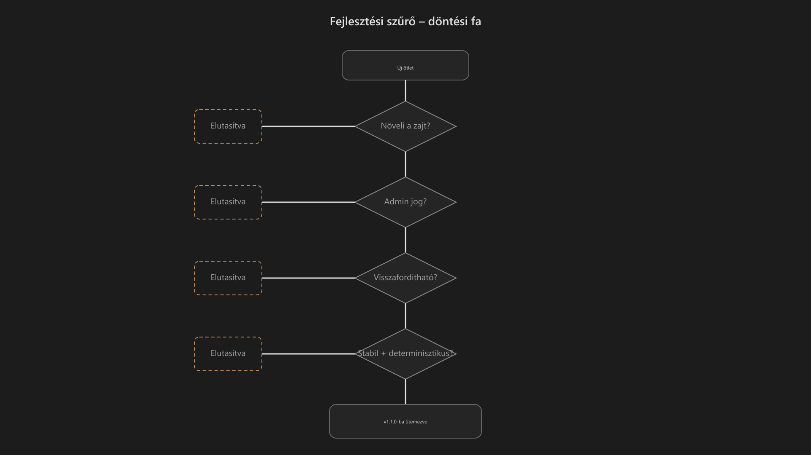

-   

    # 93. Útiterv / Ütemterv { #93-utiterv-utemterv }

    > Szerző: Hegedüs Gábor (@hege-g) 
    > Licenc: [MIT (Kód) / CC BY-NC-ND 4.0 (Docs)] 
    > Frostwood Docs: v1.0.0 
    > Rendszerverzió / Állapot: v1.0.5 / Stabil 
    > Blokk:  Referenciák

-   ## Tartalomkártyák

    * [:material-infinity: 1. Cél](#1-cel)
    * [:material-infinity: 2. Kiindulási állapot](#2-kiindulasi-allapot)
    * [:material-infinity: 3. A v1.1.0 tervezett jellege](#3-a-v110-tervezett-jellege)
    * [:material-infinity: 4. Belefér a v1.1.0 irányba](#4-belefer-a-v110-iranyba)
        * [:material-infinity: 4.1 Installer](#41-installer)
        * [:material-infinity: 4.2 Dokumentáció és README](#42-dokumentacio-es-readme)
        * [:material-infinity: 4.3 Windhawk profil / Explorer Zebra](#43-windhawk-profil-explorer-zebra)
        * [:material-infinity: 4.4 SoftLock](#44-softlock)
        * [:material-infinity: 4.5 SignalColors](#45-signalcolors)
    * [:material-infinity: 5. Nem fér bele a v1.1.0 irányba](#5-nem-fer-bele-a-v110-iranyba)
        * [:material-infinity: 5.1 Új vizuális irány](#51-uj-vizualis-irany)
        * [:material-infinity: 5.2 Shell-mély módosítás](#52-shell-mely-modositas)
        * [:material-infinity: 5.3 Hangcsomag integráció](#53-hangcsomag-integracio)
        * [:material-infinity: 5.4 Admin / policy lock rendszer](#54-admin-policy-lock-rendszer)
        * [:material-infinity: 5.5 Új módok és profilok](#55-uj-modok-es-profilok)
    * [:material-infinity: 6. Halasztott vagy külön projektként kezelendő elemek](#6-halasztott-vagy-kulon-projektkent-kezelendo-elemek)
    * [:material-infinity: 7. Döntési szabály](#7-dontesi-szabaly)
    * [:material-infinity: 8. Stabilitási prioritás](#8-stabilitasi-prioritas)
    * [:material-infinity: 9. Verzióelv](#9-verzioelv)
        * [:material-infinity: 9.1 A v1.x ág jellege](#91-a-v1x-ag-jellege)
        * [:material-infinity: 9.2 Mi nem fér bele a v1.x szemléletbe](#92-mi-nem-fer-bele-a-v1x-szemleletbe)
    * [:material-infinity: 10. Kapcsolat a változásnaplóval](#10-kapcsolat-a-valtozasnaploval)
    * [:material-infinity: 11. Rövid döntési mátrix](#11-rovid-dontesi-matrix)
    * [:material-infinity: 12. Elvi lezárás](#12-elvi-lezaras)

## 1. Cél

Ez a dokumentum a Frostwood rendszer **középtávú fejlesztési irányát és kiadási döntési elveit** rögzíti.

Feladata:

* megmutatni, mi fér bele a következő stabil ág fejlesztésébe
* elválasztani a reális finomításokat a túl nagy vagy túl kockázatos bővítésektől
* rögzíteni a döntési szempontokat
* megőrizni a Frostwood karakterét a bővítések során is

Ez a dokumentum **nem feladatlista**, hanem **kiadási és tervezési referencia**.

---

## 2. Kiindulási állapot

Aktuális dokumentált rendszerállapot:

* `v1.0.5`

Aktuális fejlesztési logika:

* a `v1.0.x` ág stabilizáló ág
* a következő vizsgált célverzió: `v1.1.0`

Ez azt jelenti, hogy a Frostwood jelenleg:

* stabilitásra
* kiszámíthatóságra
* telepíthetőségre
* visszafordíthatóságra

optimalizál.

Nem cél ebben a szakaszban:

* új vizuális korszak nyitása
* új működési módok bevezetése
* teljes rendszerkarakter-váltás
* látványos redesign

---

## 3. A v1.1.0 tervezett jellege

A `v1.1.0` a Frostwood logikája szerint:

* finomító
* stabilizáló
* konzisztencia-erősítő
* alacsony kockázatú bővítő kiadás

Ez nem teljes újratervezés, hanem a meglévő rendszer következetes továbbépítése.

A fő cél:

> A már létező Frostwood-rétegek megbízhatóbbá, tisztábbá és jobban karbantarthatóvá tétele.

---

## 4. Belefér a v1.1.0 irányba

Az alábbi területek reálisak, mert:

* nem törik meg a rendszer karakterét
* nem igényelnek mély rendszerszintű beavatkozást
* dokumentálhatók és visszafordíthatók

-   ### 4.1 Installer

    Lehetséges irányok:

    * részletesebb hibakezelés
    * logolás bővítése
    * képernyőolvasó-barátabb szövegezés
    * tisztább frissítési mód (`Upgrade` vs `Fresh install`)

    Cél:

    * determinisztikusabb telepítés
    * átláthatóbb hibadiagnosztika
    * jobb hozzáférhetőség

    ???+ note "Megjegyzés"
        Az Installer saját komponensverziója külön kezelendő a rendszerverziótól

-   ### 4.2 Dokumentáció és README

    Lehetséges irányok:

    * pontosítások
    * rövid gyors ellenőrző lista
    * modulonkénti hivatkozási egységesítés
    * verziószám-konzisztencia
    * fejléc-szabvány egységesítése

    Cél:

    * könnyebb karbantartás
    * jobb auditálhatóság
    * tisztább verziókövetés

-   ### 4.3 Windhawk profil / Explorer Zebra

    Lehetséges irányok:

    * build-függő célzás javítása
    * fallback selectorok
    * stabilitási ellenőrzés Windows-frissítés után

    Cél:

    * az Explorer UI ne törjön
    * a zebra-logika finoman megmaradjon
    * a rendszer buildfüggése csökkenjen

    #### Akadálymentességi és stabilitási kockázat

    A Windhawk-alapú UI-beavatkozás bizonyos környezetekben hatással lehet a kisegítő technológiák működésére.

    Különösen érintett lehet:

    * Windows Narrátor
    * UI Automation réteg
    * natív elemfelismerés a Fájlkezelőben

    Lehetséges kockázatok:

    * fókuszértelmezési eltérés
    * hibás elemfelismerés
    * megváltozott felolvasási sorrend
    * instabil navigációs viselkedés

    Szabály:

    * minden jelentős Windhawk-módosítás után Narrátor-teszt szükséges
    * fallback működésnek biztosítottnak kell maradnia

    Kapcsolódó modul:

    * [29. Windows Narrátor](29-windows-narrator.md#29-windows-narrator-rendszerszintu-akadalymentessegi-reteg)

-   ### 4.4 SoftLock

    Lehetséges irányok:

    * watcher megbízhatóság finomítása
    * indulás / kilépés edge case-ek kezelése
    * dupla példány elleni védelem

    Cél:

    * stabilabb virtuális asztal-logika
    * kiszámíthatóbb állapotkezelés
    * kevesebb rejtett futási hiba

-   ### 4.5 SignalColors

    Lehetséges irányok:

    * SAFE szint finomítása
    * Aggressive szint visszavonhatóságának javítása
    * registry restore megbízhatóságának növelése

    Cél:

    * kockázatcsökkentés
    * tisztább visszaállíthatóság
    * alacsonyabb rendszerterhelés

---

## 5. Nem fér bele a v1.1.0 irányba

Az alábbi területek nem illenek a `v1.1.0` jellegéhez, mert túl nagy, túl kockázatos vagy karaktertörő változást jelentenének.

-   ### 5.1 Új vizuális irány

    Nem cél:

    * új háttérvilág
    * új színrendszer
    * teljes redesign
    * új vizuális karakter

    Indok:

    * a Frostwood `v1.x` ág nem változtat karaktert
    * a meglévő vizuális identitás stabil referenciának tekintendő

-   ### 5.2 Shell-mély módosítás

    Nem cél:

    * ExplorerPatcher-jellegű mély shell-beavatkozás
    * Start menü mély hackelése
    * tálca radikális átalakítása

    Indok:

    * buildfüggő
    * törékeny
    * nehezen auditálható
    * rosszul visszafordítható

-   ### 5.3 Hangcsomag integráció

    Nem cél a `v1.1.0` ágban:

    * teljes Frostwood audio téma
    * rendszerhangok széles cseréje
    * mély hangcsomag-integráció

    Indok:

    * külön projektlogika
    * külön tesztelési réteg
    * külön visszaállítási fegyelem szükséges

-   ### 5.4 Admin / policy lock rendszer

    Nem cél:

    * csoportházirend-alapú tiltás
    * gépszintű zárolás
    * admin joghoz kötött policy-rendszer

    Indok:

    * a Frostwood alaplogikája felhasználói szintű (`HKCU`)
    * a no-admin filozófiával ez nem fér össze

-   ### 5.5 Új módok és profilok

    Nem cél:

    * Gaming mode
    * Presentation mode
    * extra horizontális profilok
    * módrobbanás

    Indok:

    * a rendszer nem bővülhet kontrollálatlanul oldalirányban
    * a túl sok mód gyengíti a Frostwood fókuszát

---

## 6. Halasztott vagy külön projektként kezelendő elemek

Az alábbi irányok nem feltétlenül elutasítottak, de nem a `v1.1.0` ág részei.

### Halasztott vagy külön projekt

* hangrendszer / audio téma
* mélyebb shell-integráció
* új vizuális korszak
* jelentősen új profil- és módrendszer
* admin- vagy policy-központú változat

Ezek csak akkor vizsgálhatók újra, ha:

* a stabil `v1.x` ág lezárt
* a visszafordíthatóság garantálható
* az új irány külön architekturális döntést kap

---

## 7. Döntési szabály

Egy változtatás csak akkor fér bele a `v1.1.0` irányba, ha:

* nem igényel admin jogot
* determinisztikus
* gépenként közel azonosan viselkedik
* képernyőolvasó mellett stabil
* visszafordítható
* nem növeli érdemben a mentális vagy technikai zajt

Ha ezek közül bármelyik sérül:

> A változtatás nem vállalható a v1.1.0 irányban.

---

## 8. Stabilitási prioritás

A fejlesztési sorrend:

1. telepítés stabilitása
2. dokumentáció konzisztencia
3. jelzés-zaj modell tisztasága
4. visszaállítás megbízhatósága
5. UI finomhangolás

Nem fordítva.

Ez azt jelenti, hogy a Frostwood előbb legyen:

* megbízható
* visszafordítható
* dokumentált

és csak utána finomhangolt.

---

## 9. Verzióelv

A `v1.0.x` és `v1.1.0` közötti logika a `95. Változásnapló` verzióelvéhez igazodik.

-   ### 9.1 A v1.x ág jellege

    * konzervatív
    * kis lépésekből építkező
    * dokumentált
    * nem kísérleti
    * stabilizáló

-   ### 9.2 Mi nem fér bele a v1.x szemléletbe

    * identitástörő redesign
    * mély rendszerhack
    * nehezen visszafordítható beavatkozás
    * auditálhatatlan automatizmus
    * túl sok új mód vagy profil

---

## 10. Kapcsolat a változásnaplóval

Az Útiterv nem önálló verzióforrás.

Kapcsolata a `95. Változásnapló`-val:

* az Útiterv előretekint
* a Változásnapló a megtörtént módosításokat rögzíti

Szabály:

* ami csak terv, az ide tartozik
* ami megvalósult és jóváhagyott, az a változásnaplóba kerül

---

## 11. Rövid döntési mátrix

??? info "Vizuális leírás akadálymentesítéshez"
    Az ábra a Frostwood fejlesztési döntési folyamatát mutatja.

    A folyamat egy „Új ötlet” blokkból indul.

    Az első döntési pont azt vizsgálja, hogy az ötlet növeli-e a rendszer zajszintjét. Ha igen, az ötlet elutasításra kerül. Ha nem, a folyamat tovább halad.

    A második döntési pont azt ellenőrzi, hogy az ötlet igényel-e adminisztrátori jogosultságot. Ha igen, az elutasításra kerül. Ha nem, tovább halad.

    A harmadik döntési pont azt vizsgálja, hogy a változtatás visszafordítható-e. Ha nem visszafordítható, az elutasításra kerül. Ha igen, tovább halad.

    A negyedik döntési pont a stabilitást és determinisztikus működést ellenőrzi. Ha a viselkedés nem stabil vagy nem kiszámítható, az ötlet elutasításra kerül.

    Ha az ötlet minden szűrőn átmegy, akkor a „v1.1.0-ba ütemezve” állapotba kerül.

    Az ábra lényege, hogy a Frostwood fejlesztés nem funkcióbővítés, hanem szigorú szűrés mentén történik.

Ez a mátrix rögzíti a v1.1.0-s verzióba beemelhető és az onnan szigorúan kizárt fejlesztési irányokat, biztosítva a kiadás stabilitását és a Frostwood filozófia megtartását.

-   ### :material-check-circle-outline: Vállalt fejlesztések (IGEN)

    Az alacsony kockázatú, a stabilitást vagy a konzisztenciát közvetlenül szolgáló feladatok.

    * **Installer finomítás:** Vállalható. *Megjegyzés:* Alacsony kockázatú technikai lépés.
    * **Docs konzisztencia:** Vállalható. *Megjegyzés:* Kötelező elem a dokumentáció egységességéért.
    * **SoftLock stabilitás:** Vállalható. *Megjegyzés:* Auditálható biztonsági és logikai alap.
    * **SignalColors restore javítás:** Vállalható. *Megjegyzés:* A korábbi állapotok visszafordíthatóságának biztosítása.
    * **Windhawk célzás javítása:** Vállalható. *Megjegyzés:* Óvatosan kezelendő, de szükséges finomítás.

-   ### :material-close-circle-outline: Elutasított / Halasztott elemek (NEM)

    Olyan fejlesztések, amelyek túlmutatnak a jelenlegi verzión, instabilitást okoznának, vagy idegenek a rendszertől.

    * **Új vizuális karakter:** Nem vállalható. *Megjegyzés:* Túl nagy arculati váltás lenne.
    * **Shell mély hack:** Nem vállalható. *Megjegyzés:* Instabillá tenné a környezetet.
    * **Hangcsomag integráció:** Nem vállalható. *Megjegyzés:* Teljesen különálló projektet igényel.
    * **Admin / policy lock:** Nem vállalható. *Megjegyzés:* Nem illeszkedik a rendszer szabadságelvű filozófiájába.
    * **Új módok tömeges bevezetése:** Nem vállalható. *Megjegyzés:* Nem kívánatos horizontális terjeszkedés.

???+ note "Hatóköri Fegyelem"
    A döntési mátrix szigorú betartása garantálja, hogy a v1.1.0-s verzió megőrizze a Frostwoodtól elvárt robusztusságot, és ne terhelje túl a fejlesztői és tesztelési kapacitásokat felesleges kockázatokkal.

??? info "Vizuális leírás az akadálymentes használathoz"
    Ez a szakasz kettő nagy logikai kártyára bontja szét a v1.1.0-s verzió tervezett feladatai alapján.

    Az első kártya az öt zöld utat kapott feladatot sorolja fel a hozzátartozó mérnöki megjegyzésekkel (telepítő, dokumentáció, SoftLock, SignalColors és Windhawk).

    A második kártya az öt elutasított vagy későbbre halasztott elemet tartalmazza (új karakter, mély hackelések, hangcsomag, adminisztrátori korlátozások és az új módok tömeges bevezetése), részletezve a nemleges döntés okait.

    A struktúra segít gyorsan elkülöníteni a fejlesztési fókuszokat a kizárt tényezőktől.

---

## 12. Elvi lezárás

A Frostwood következő lépése nem a hangosabbá, hanem a pontosabbá válás.

A `v1.1.0` iránya ezért:

* nem új személyiség
* nem új látvány
* nem új rendszerkategória

hanem:

* stabilabb működés
* jobb visszafordíthatóság
* tisztább dokumentáció
* megbízhatóbb viselkedés

???+ tip "v1.1.0 Fejlesztői Mantra"
    * Ha admin jog kell hozzá: **Engedd el.**
    * Ha nem fordítható vissza egy másodperc alatt: **Tervezd újra.**
    * Ha vizuális vagy audió zajt generál: **Töröld ki.**
