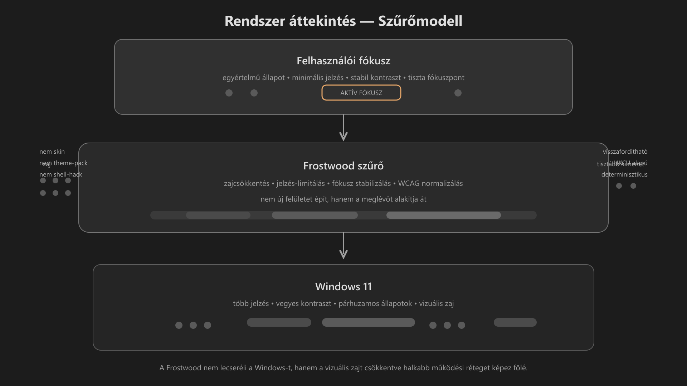

-   

    # 94. Rendszer áttekintés { #94-rendszer-attekintes }

    > Szerző: Hegedüs Gábor (@hege-g) 
    > Licenc: [MIT (Kód) / CC BY-NC-ND 4.0 (Docs)] 
    > Frostwood Docs: v1.0.0 
    > Rendszerverzió / Állapot: v1.0.5 / Stabil 
    > Blokk:  Referenciák

-   ## Tartalomkártyák

    * [:material-infinity: 1. Mi a Frostwood?](#1-mi-a-frostwood)
    * [:material-infinity: 2. A Frostwood alaplogikája](#2-a-frostwood-alaplogikaja)
    * [:material-infinity: 3. A rendszer szerkezete](#3-a-rendszer-szerkezete)
        * [:material-infinity: 3.1 Alaprendszer réteg](#31-alaprendszer-reteg)
        * [:material-infinity: 3.2 Fókuszréteg](#32-fokuszreteg)
        * [:material-infinity: 3.3 Alkalmazásréteg](#33-alkalmazasreteg)
    * [:material-infinity: 4. A rendszer két fő pillére](#4-a-rendszer-ket-fo-pillere)
        * [:material-infinity: 4.1 Karakter mód](#41-karakter-mod)
        * [:material-infinity: 4.2 WCAG mód](#42-wcag-mod)
    * [:material-infinity: 5. Mi adja a Frostwood érzetet?](#5-mi-adja-a-frostwood-erzetet)
        * [:material-infinity: 5.1 Jelentésalapú színhasználat](#51-jelentesalapu-szinhasznalat)
        * [:material-infinity: 5.2 Hover és fókusz különválasztása](#52-hover-es-fokusz-kulonvalasztasa)
        * [:material-infinity: 5.3 Base Elevation](#53-base-elevation)
        * [:material-infinity: 5.4 Explorer zebra (opcionális)](#54-explorer-zebra-opcionalis)
    * [:material-infinity: 6. Mentális terhelés modell](#6-mentalis-terheles-modell)
    * [:material-infinity: 7. Rendszerhatárok](#7-rendszerhatarok)
        * [:material-infinity: 7.1 Windows-korlátok](#71-windows-korlatok)
        * [:material-infinity: 7.2 Admin-határok](#72-admin-hatarok)
        * [:material-infinity: 7.3 Kompatibilitási határok](#73-kompatibilitasi-hatarok)
    * [:material-infinity: 8. Mikor működik jól?](#8-mikor-mukodik-jol)
    * [:material-infinity: 9. Stabilitási önellenőrző lista](#9-stabilitasi-onellenorzo-lista)
        * [:material-infinity: 9.1 Vizualitás](#91-vizualitas)
        * [:material-infinity: 9.2 Jelzés](#92-jelzes)
        * [:material-infinity: 9.3 Zajmodell](#93-zajmodell)
        * [:material-infinity: 9.4 Stabilitás](#94-stabilitas)
    * [:material-infinity: 10. Kapcsolat a többi referenciafájllal](#10-kapcsolat-a-tobbi-referenciafajllal)
    * [:material-infinity: 11. Végső megállapítás](#11-vegso-megallapitas)

## 1. Mi a Frostwood?

A Frostwood egy visszafogott, hierarchikus rendszer-réteg Windows 11-re, amely:

* csökkenti a vizuális zajt
* mérsékli a kognitív terhelést
* hosszú munka közben is nyugodt marad
* képernyőolvasóval is kiszámítható
* felhasználói szinten, visszafordítható módon működik

> Nem skin. 
> Nem theme-pack. 
> Nem vizuális trükk.

Hanem:

> Egy viselkedési és fókuszmodell.

??? info "Vizuális leírás akadálymentesítéshez"
    Az ábra egy háromszintű működési folyamatot mutat.

    Az alsó szinten a Windows 11 látható, ahol több párhuzamos jelzés, eltérő kontrasztok és vizuális zaj jelenik meg. Ez a rendszer nyers, feldolgozatlan állapota.

    A középső szinten a Frostwood szűrő helyezkedik el. Ez egy átmeneti zóna, amelyen keresztül az információ áthalad. Itt történik a zaj csökkentése, a jelzések ritkítása, valamint a fókusz stabilizálása. Ez a réteg nem új felületet hoz létre, hanem a meglévőt alakítja át.

    A felső szinten a felhasználói fókusz jelenik meg. Itt már kevesebb elem látható, a jelzések minimálisak, és egyetlen egyértelmű fókuszpont marad. A vizuális környezet nyugodtabb és könnyebben értelmezhető.

    Az ábra lényege, hogy a Frostwood nem lecseréli a Windows rendszert, hanem egy szűrőként működve csökkenti a vizuális zajt és tisztább működést biztosít.

---

## 2. A Frostwood alaplogikája

A Frostwood célja nem az, hogy a Windows 11-et teljesen átformálja, hanem az, hogy a meglévő környezetből:

* csendesebb
* kiszámíthatóbb
* visszafordíthatóbb
* WCAG-kompatibilisebb

működési réteget hozzon létre.

Alapelvei:

* no-admin működés
* HKCU-alapú beavatkozás
* dokumentált változtatások
* determinisztikus viselkedés
* lehetőség szerint teljes visszaállíthatóság

---

## 3. A rendszer szerkezete

A Frostwood három egymásra épülő fő rétegből áll.

-   ### 3.1 Alaprendszer réteg

    Feladata a működési keret biztosítása.

    Fő elemei:

    * Light / Dark követés
    * AutoDarkMode integráció
    * HKCU-alapú beállítások
    * visszafordíthatóság
    * adminmentes működés

    Ez a réteg adja a rendszer alapviselkedését.

-   ### 3.2 Fókuszréteg

    Feladata a vizuális zaj csökkentése és a koncentráció támogatása.

    Fő elemei:

    * WCAG manuális kapcsoló
    * azonnali háttérváltás
    * jelzéscsendesítés
    * SignalColors visszafogása
    * Travel logikával való kompatibilitás

    Ez a réteg nem új rendszert hoz létre, hanem a meglévőt halkítja el.

-   ### 3.3 Alkalmazásréteg

    Feladata, hogy a Frostwood elvei a ténylegesen használt programokban is következetesen megjelenjenek.

    Érintett alkalmazások:

    * Windows Fájlkezelő
    * Total Commander
    * Microsoft Edge
    * Google Chrome
    * Mozilla Firefox
    * Microsoft Office (Word / Excel)
    * Meta Chat
    * Zoom
    * Windows Narrátor
    * JAWS for Windows
    * Insta360 Studio
    * OpenAI ChatGPT
    * Google Gemini
    * Windows Lomtár

    Ezek nem külön dizájnok, hanem ugyanazon viselkedési rendszerhez igazított alkalmazásrétegek.

---

## 4. A rendszer két fő pillére

-   ### 4.1 Karakter mód

    Ez adja a Frostwood identitását.

    Jellemzői:

    * Dawn / Dusk háttérvilág
    * anyagszerű, meleg tónus
    * alacsony vizuális inger
    * nem marketing-szerű látvány
    * visszafogott, hosszú munkára alkalmas felületi érzet

    Ez a rendszer „tere”.

-   ### 4.2 WCAG mód

    Ez adja a Frostwood koncentrációs és akadálymentességi fókuszrétegét.

    Jellemzői:

    * egyszínűbb háttérvilág
    * minimális jelzés
    * a narancs csak aktív fókuszban jelenik meg
    * a hover semleges marad
    * a fölösleges vizuális hangsúlyok eltűnnek

    Fontos:

    * a WCAG mód a Frostwoodban alapvetően manuális fókuszréteg
    * nem azonos a light/dark automatikus követéssel

    Ez a rendszer „csendje”.

---

## 5. Mi adja a Frostwood érzetet?

-   ### 5.1 Jelentésalapú színhasználat

    A Frostwoodban a szín nem díszít, hanem jelentést hordoz.

    Alapszabályok:

    * narancs = aktív fókusz
    * hover = semleges
    * jelzés = kis felületen, ritkán
    * nincs öncélú színezés

    > A szín nem vezet. 
    > A szín válaszol.

-   ### 5.2 Hover és fókusz különválasztása

    A Frostwood külön kezeli az alábbi állapotokat:

    * „itt járok”
    * „itt vagyok”

    Ennek megfelelően:

    * a hover hideg, semleges, halk
    * a fókusz meleg, stabil, egyértelmű

    Ez csökkenti a mentális zajt és javítja a tájékozódást.

-   ### 5.3 Base Elevation

    A Frostwood nem lapos, de nem is látványcentrikus.

    Jellemzői:

    * finom árnyék
    * enyhe rétegezés
    * statikus mélységérzet
    * nincs túlzott blur
    * nincs figyelemkérő mozgás

    Ez térérzetet ad animáció nélkül.

-   ### 5.4 Explorer zebra (opcionális)

    A Frostwood egyik opcionális eleme a finom lista-rétegezés.

    Jellemzői:

    * enyhe sorváltás
    * nem csíkos
    * nem kontrasztos
    * Windhawk-alapú
    * visszafordítható

    Ha nincs telepítve, a rendszer akkor is stabil marad.

---

## 6. Mentális terhelés modell

A Frostwood a következő terhelési forrásokat csökkenti:

* állandó értesítési zaj
* agresszív színezés
* villogás
* túlkontraszt
* túlkommunikált állapotjelzések
* indokolatlan animáció

A rendszer célja:

* egy eseményhez egy domináns jelzés tartozzon
* ne legyenek egymással versengő hangsúlyok
* ne maradjon tartós, felesleges státuszszínezés
* a felület hosszú munka után is csendes maradjon

---

## 7. Rendszerhatárok

-   ### 7.1 Windows-korlátok

    A Windows 11 felülete nem minden ponton kontrollálható egységesen.

    Korlátok:

    * a Modern UI nem teljesen registry-szabályozható
    * globális zebra natívan nincs
    * build-eltérések léteznek
    * különböző UI motorok eltérően viselkednek

    A Frostwood ezért nem ígér teljes pixel-azonosságot.

-   ### 7.2 Admin-határok

    A Frostwood nem adminisztratív kontrollrendszer.

    Nem cél:

    * policy-kényszerítés
    * UAC-hack
    * gépszintű tiltás
    * rendszerszintű zárolási réteg

    A működés felhasználói szintű (`HKCU`).

-   ### 7.3 Kompatibilitási határok

    A Frostwood nem mély shell-átalakító rendszer.

    Nem ajánlott együtt használni olyan környezetben, ahol:

    * agresszív shell-tuning fut
    * ExplorerPatcher-jellegű mély módosítás van
    * pixel-azonos designkényszer a cél
    * vállalati policy-zárt környezet erősen korlátozza a felhasználói szintű beállításokat

---

## 8. Mikor működik jól?

A Frostwood akkor működik jól, ha a rendszer:

* csendes marad
* a fókusz egyértelmű
* a visszajelzések ritkák, de értelmezhetőek
* képernyőolvasó mellett sem válik kaotikussá
* hosszú munkában sem fárasztó

Ez nem a látvány intenzitásán, hanem a viselkedés fegyelmén múlik.

---

## 9. Stabilitási önellenőrző lista

-   ### 9.1 Vizualitás

    * :material-checkbox-blank-outline: Narancs csak aktív fókuszban jelenik meg
    * :material-checkbox-blank-outline: Hover nem jelentésszín
    * :material-checkbox-blank-outline: WCAG módban nincs dekoratív színezés
    * :material-checkbox-blank-outline: Nincs tiszta `#FFFFFF` nagy homogén felületen
    * :material-checkbox-blank-outline: Nincs tiszta `#000000` fő háttérként

-   ### 9.2 Jelzés

    * :material-checkbox-blank-outline: Egy eseményhez egy domináns jelzés tartozik
    * :material-checkbox-blank-outline: Nincs multi-signal túlkommunikálás
    * :material-checkbox-blank-outline: A jelzés végrehajtás után eltűnik
    * :material-checkbox-blank-outline: A szín nincs önmagában jelentéshordozóként hagyva

-   ### 9.3 Zajmodell

    * :material-checkbox-blank-outline: Messenger / chat jelzések halkak
    * :material-checkbox-blank-outline: Zoom nem használ agresszív figyelemkérést
    * :material-checkbox-blank-outline: Böngésző értesítések kontrolláltak
    * :material-checkbox-blank-outline: Office környezet nem válik túlkontrasztossá
    * :material-checkbox-blank-outline: Hosszú munkában a felület nem telítődik színes visszajelzésekkel

-   ### 9.4 Stabilitás

    * :material-checkbox-blank-outline: Admin jog nélkül működik
    * :material-checkbox-blank-outline: A restore logika működik
    * :material-checkbox-blank-outline: Travel visszaállítás determinisztikus
    * :material-checkbox-blank-outline: SoftLock nem indít dupla példányt
    * :material-checkbox-blank-outline: Opcionális komponens hiányában a rendszer nem omlik össze

??? info "Vizuális leírás az akadálymentes használathoz"
    Ez a stabilitási önellenőrző lista négy nagy logikai kártyára osztva tartalmazza a Frostwood-megfelelőségi feltételeket, üres jelölőnégyzetekkel (checkbox) ellátva a manuális auditáláshoz.
    
    A négy kártya felépítése a következő:

    1. **Vizualitás:** A tiszta fekete (#000000) és tiszta fehér (#FFFFFF) háttértiltások, a narancs fókusz és a semleges hover ellenőrzése.
    2. **Jelzés:** Az egy esemény – egy domináns jelzés elv, az elillanó visszajelzések és a redundancia meglétének verifikálása.
    3. **Zajmodell:** A külső alkalmazások (csevegők, Zoom, irodai programok) vizuális megregulázásának és csendesítésének ellenőrző listája.
    4. **Stabilitás:** A technikai alapok (adminmentesség, restore logika működése, SoftLock biztonság) megfelelőségi pontjai.
    
    A lista mint vizuális dashboard szolgál a fejlesztő számára, ahol az üres négyzetek a teljesített audit során válnak pipává, garantálva a kognitív terhelés sikeres csökkentését.

---

## 10. Kapcsolat a többi referenciafájllal

Ez a modul összefoglaló szerepű.

Kapcsolódó referenciafájlok:

* `91-szinkodok.md` – jóváhagyott színkódok
* `92-jelzes-szinek.md` – jelzéslogika és zajmodell
* `93-utiterv.md` – fejlesztési irány és döntési keret
* `95-valtozasnaplo.md` – megvalósult és verziózott változások
* `99-referenciak-blokk-architektura--dev.md` – fejlesztői architektúra-nézet

Ez a dokumentum ezek közé helyezi el a Frostwood egészét.

Ez a modul nem helyettesíti a többi referenciafájlt.

Szerepe:

* összefoglalni
* elhelyezni
* kapcsolatba rendezni

A részletes szabályok továbbra is a kapcsolódó modulokban találhatók.

---

## 11. Végső megállapítás

A Frostwood:

* nem látványprojekt
* nem shell-hack
* nem branding-rendszer
* nem theme-pack

Hanem:

* kontrollált
* visszafogott
* hosszú távra tervezett
* dokumentált
* visszafordítható rendszerlogika

Ha a rendszer 4–6 óra folyamatos munka után is csendes, érthető és stabil marad, akkor a Frostwood eléri a célját.