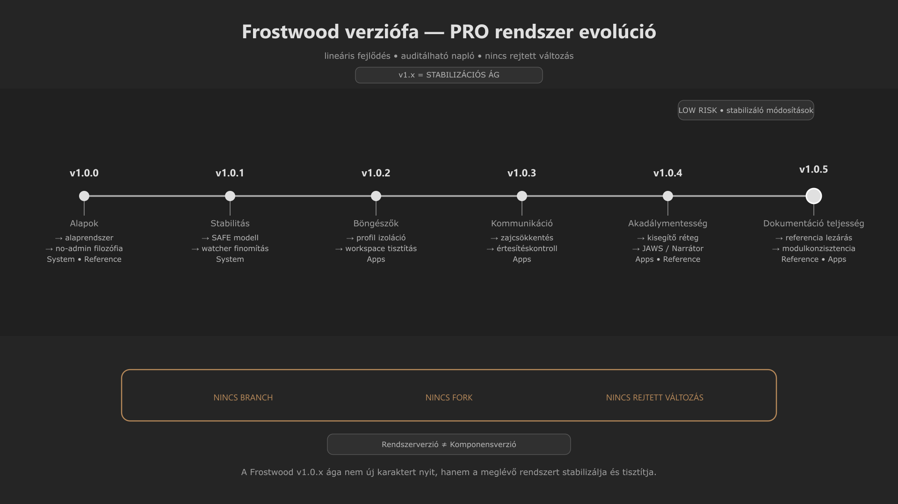

-   

    # 95. Változásnapló { #95-valtozasnaplo }

    > Szerző: Hegedüs Gábor (@hege-g) 
    > Licenc: [MIT (Kód) / CC BY-NC-ND 4.0 (Docs)] 
    > Frostwood Docs: v1.0.0 
    > Rendszerverzió / Állapot: v1.0.5 / Stabil 
    > Blokk:  Referenciák

-   ## Tartalomkártyák

    * [:material-infinity: 1. Dokumentum célja](#1-dokumentum-celja)
    * [:material-infinity: 2. Hatókör](#2-hatokor)
    * [:material-infinity: 3. Verzióelv](#3-verzioelv)
    * [:material-infinity: 4. Verziószintek (KRITIKUS SZABÁLY)](#4-verzioszintek-kritikus-szabaly)
        * [:material-infinity: 4.1 Rendszerverzió](#41-rendszerverzio)
        * [:material-infinity: 4.2 Komponensverzió](#42-komponensverzio)
        * [:material-infinity: 4.3 Szabály](#43-szabaly)
    * [:material-infinity: 5. Verziószám jelentése](#5-verzioszam-jelentese)
    * [:material-infinity: 6. Bejegyzési szabvány](#6-bejegyzesi-szabvany)
    * [:material-infinity: 7. Verziók részletes naplója](#7-verziok-reszletes-naploja)
    * [:material-infinity: 8. Verzióösszegzés](#8-verzioosszegzes)
    * [:material-infinity: 9. Mi számít verzióváltásnak](#9-mi-szamit-verziovaltasnak)
    * [:material-infinity: 10. Szerkesztési szabály](#10-szerkesztesi-szabaly)
    * [:material-infinity: 11. Kapcsolódó fájlok](#11-kapcsolodo-fajlok)
    * [:material-infinity: 12. Elvi megjegyzés](#12-elvi-megjegyzes)

## 1. Dokumentum célja

Ez a dokumentum a Frostwood rendszer és dokumentáció **hivatalos változásnaplója**.

Feladata:

* a kiadások visszakövethetősége
* a módosítások verziózott rögzítése
* a rendszer- és dokumentációszintű változások elkülönítése
* az auditálhatóság biztosítása

A változásnapló **referenciafájl**, nem fejlesztési jegyzet.

---

## 2. Hatókör

A változásnapló az alábbi módosításokat tartalmazza:

* rendszerelvi változások
* dokumentációs és strukturális módosítások
* modulbővítések
* referenciafájlok változásai
* audit szempontból releváns javítások

Nem tartalmaz:

* ideiglenes vázlatokat
* nem jóváhagyott ötleteket
* munkaközi jegyzeteket

---

## 3. Verzióelv

??? info "Vizuális leírás akadálymentesítéshez"
    Az ábra egy vízszintes idővonalat mutat, amely balról jobbra halad.

    A vonalon hat egymást követő pont jelenik meg, amelyek a Frostwood verzióit jelölik a v1.0.0-tól a v1.0.5-ig. Minden pont fölött a verziószám, alatta pedig egy rövid leírás szerepel:

    - v1.0.0 az alapok kialakítását,
    - v1.0.1 a stabilitást,
    - v1.0.2 a böngészők integrációját,
    - v1.0.3 a kommunikációs modell fejlesztését,
    - v1.0.4 az akadálymentességi réteget,
    - v1.0.5 pedig a dokumentáció teljességét jelöli.

    A teljes vonal egyenes, nincs elágazás vagy alternatív út, ami azt mutatja, hogy a rendszer fejlődése lineáris és visszakövethető.

    Az ábra külön hangsúlyozza, hogy nincs branch, nincs fork és nincs rejtett változtatás.

    Az ábra lényege, hogy a Frostwood verziókezelése determinisztikus, auditálható és egyetlen fejlődési vonalon halad.

A Frostwood verziózás **determinista és rétegzett**.

Alapelvek:

* nincs rejtett változás
* nincs visszadátumozás
* minden módosítás dokumentált
* a dokumentáció a rendszer része

---

## 4. Verziószintek (KRITIKUS SZABÁLY)

???+ warning "Figyelem"
    A Frostwood két külön verzióréteget használ.

-   ### 4.1 Rendszerverzió

    A teljes Frostwood állapotát jelöli.

    Példa:

    * Rendszerverzió: v1.0.5

-   ### 4.2 Komponensverzió

    Egy adott modul vagy eszköz saját verziója.

    Példa:

    * Installer komponens: v1.0.1
    * Uninstall komponens: v1.0.1

-   ### 4.3 Szabály

    * a komponensverzió **nem azonos** a rendszerverzióval
    * a kettő **nem írható felül egymással**
    * a változásnapló mindkettőt külön kezeli

??? info "Vizuális leírás az akadálymentes használathoz"
    Ez a szakasz egy háromosztatú számozott kártyablokk segítségével különíti el a Frostwood két futási verziószintjét.

    A 4.1-es kártya a globális rendszerverziót (példaként a v1.0.5-öt),

    a 4.2-es kártya a moduláris komponensverziót (példaként az Installer v1.0.1-et) mutatja be.

    A 4.3-as kártya rögzíti a szigorú elválasztási szabályt, amely megtiltja a két szint egymással való felcserélését, biztosítva a moduláris fejleszthetőséget.

---

## 5. Verziószám jelentése

A Frostwood a szemantikus verziókövetés (Semantic Versioning) elveit követi, de a kognitív zajmodellhez igazítva. A verziószám egyes elemei szigorúan meghatározzák a beavatkozás mélységét és kockázati szintjét.

-   ### :material-numeric-1-box-outline: Major verzió (X.0.0)

    A rendszer legalapvetőbb szerkezeti és filozófiai szintje.

    * **Jelentés:** Új rendszeralap vagy architektúra bevezetése.
    * **Hatás:** Olyan gyökeres változások, amelyek átalakítják a fókuszmodellt vagy a magkomponenseket (pl. v1.0.0).

-   ### :material-numeric-2-box-outline: Minor verzió (1.X.0)

    Funkcionális, de biztonságos horizontális és vertikális lépések.

    * **Jelentés:** Nagyobb, de kontrollált bővítés vagy új modul integrációja.
    * **Hatás:** Nem töri meg a meglévő alapok stabilitását, de új képességeket hoz be a rendszerbe.

-   ### :material-numeric-3-box-outline: Patch verzió (1.0.X)

    Mindennapi megbízhatóság és finomhangolás rétege.

    * **Jelentés:** Finomítás, hibajavítás, technikai pontosítás.
    * **Hatás:** Minimális kockázatú beavatkozások, amelyek a meglévő működést tökéletesítik.

???+ info "Aktuális Fejlesztési Ág: v1.0.x"
    A jelenlegi ág definíció szerint egy tisztán **stabilitási és dokumentációs fókuszú időszakot** jelent. Célja a dokumentációs teljesség elérése, a hibák elhárítása és a referenciakeret végleges lezárása a nagyobb funkcionális lépések előtt.

??? info "Vizuális leírás az akadálymentes használathoz"
    Ez a szakasz a verziószámozás struktúráját három különálló kártyán keresztül szemlélteti a növekvő kockázat és a módosítás mélysége szerint csoportosítva.

    * Az első kártya a Major verziót (új rendszeralap),
    * második a Minor verziót (nagyobb, kontrollált bővítések),
    * harmadik pedig a Patch verziót (finomítások, javítások) írja le.

    A kártyák alatt egy elkülönített információs doboz rögzíti az aktuális v1.0.x ág jelentését, amely a stabilitást és a dokumentáció lezárását jelöli ki elsődleges feladatként.

---

## 6. Bejegyzési szabvány

Minden verzió:

* tömör
* tényszerű
* visszakövethető
* strukturált

Ajánlott bontás:

* Dokumentáció
* Rendszer
* Struktúra
* Referencia
* Akadálymentesség
* Alkalmazások
* Ikonrendszer
* Javítás

---

## 7. Verziók részletes naplója

-   ### v1.0.5

    #### Dokumentáció

    * Office modul jelentős bővítése
    * sablonrendszer dokumentálása
    * fájlnév-séma rögzítése
    * mentési workflow egységesítése

    #### Struktúra

    * Alkalmazások blokk véglegesítve (21–34)
    * modulnevek egységesítése
    * belső hivatkozások konzisztensítése

    #### Hatás

    * teljesebb dokumentáció
    * jobb navigáció
    * stabilabb modulstruktúra

-   ### v1.0.4

    #### Akadálymentesség

    * Narrátor modul beemelése
    * JAWS modul véglegesítése
    * akadálymentességi alapelvek integrálása

    #### Rendszerelv

    * egyprofilos JAWS modell
    * Munka = lassabb tempó
    * opcionális gyorsváltó

    #### Hatás

    * stabilabb kisegítő rendszer
    * jobb auditálhatóság

-   ### v1.0.3

    #### Kommunikáció

    * Meta Chat modul véglegesítése
    * Zoom külön modul
    * zajcsökkentési elv egységesítése

    #### Rendszerelv

    * Otthon / Munka viselkedés különválasztása
    * értesítéskontroll pontosítása

    #### Hatás

    * csökkentett zajterhelés
    * tisztább kommunikációs modell

-   ### v1.0.2

    #### Böngészők

    * Firefox, Chrome véglegesítve
    * Edge modul hozzáadva
    * profil-szeparáció rögzítve

    #### Munka asztal

    * modell véglegesítve
    * alkalmazáslista
    * zajforrás audit

    #### Struktúra

    * linkek és hivatkozások javítása

    #### Hatás

    * stabil böngészőmodell
    * tisztább munkakörnyezet

-   ### v1.0.1

    #### Stabilitás

    * WCAG Instant pontosítás
    * AutoFocus finomítás
    * SignalColors SAFE modell
    * SoftLock watcher javítás

    #### Hatás

    * jobb kiszámíthatóság
    * stabilabb működés

-   ### v1.0.0

    #### Alaprendszer

    * Frostwood rendszer inicializálása
    * Windows 11 alap
    * no-admin filozófia

    #### Komponensek

    * Installer rendszer bevezetése

       * komponensverzió: v1.0.1

    * Uninstall rendszer bevezetése

        * komponensverzió: v1.0.1

    #### Vizuális rendszer

    * Karakter mód (Dawn / Dusk)
    * WCAG mód (manuális)
    * Base Elevation rendszer

    #### Rendszermodulok

    * Travel mód
    * SoftLock
    * Explorer zebra (Windhawk)

    #### Jelzésrendszer

    * SignalColors
    * ColorCodes (színkód rendszer)

    #### Dokumentáció

    * Design Manifesto
    * System Architecture
    * Color System
    * Accessibility Principles
    * Application modulok

    #### Hatás

    * teljes Frostwood alap létrejött
    * dokumentációs rendszer kialakult
    * moduláris struktúra megszületett

---

## 8. Verzióösszegzés

A Frostwood v1.0.x ágának fejlődési mérföldkövei. Minden alverzió egy-egy jól elkülöníthető fókuszterületet és stabilitási lépcsőfokot képvisel a teljes referenciakeret lezárásáig.

-   ### :material-folder-text-outline: Legfrissebb mérföldkövek (v1.0.4 – v1.0.5)

    A dokumentációs teljesség és a teljes körű akadálymentesítési réteg véglegesítése.

    * **V1.0.5:** Dokumentáció teljesség. *Jelleg:* A teljes referenciablokk (91–94) és az interakciós kódexek lezárása.
    * **V1.0.4:** Akadálymentesség. *Jelleg:* WCAG-kompatibilitási finomítások, képernyőolvasó (JAWS, NVDA, VoiceOver) optimalizációk.

-   ### :material-transit-connection-variant: Köztes stabilizáció (v1.0.2 – v1.0.3)

    A környezeti zajcsökkentés kiterjesztése a kommunikációs csatornákra és a külső szoftverekre.

    * **V1.0.3:** Kommunikáció. *Jelleg:* A csevegőalkalmazások és kollaborációs terek (Messenger, Zoom) vizuális elhalkítása.
    * **V1.0.2:** Böngészők + Workspace. *Jelleg:* Webes környezetek (Edge, Chrome, Firefox) és az irodai munkatér finomhangolása.

-   ### :material-git: Alapozó kiadások (v1.0.0 – v1.0.1)

    A rendszer technikai bázisának és alapvető működési fegyelmének megteremtése.

    * **V1.0.1:** Stabilitás. *Jelleg:* Az adminmentes (HKCU) működés és a biztonságos visszaállítási (restore) logika megerősítése.
    * **V1.0.0:** Alapkiadás. *Jelleg:* A Frostwood magrendszer, a Dawn/Dusk háttérvilág és a fókuszmodell első stabil verziója.

???+ note "Fejlődési Logika"
    Az összegzés világosan mutatja a Frostwood tervezési stratégiáját: az alapok technikai stabilitásától (v1.0.0) indultunk el a horizontális szoftveres kiterjesztésen át (v1.0.2–v1.0.3) egészen a legmagasabb szintű hozzáférhetőségig és elméleti teljességig (v1.0.4–v1.0.5).

??? info "Vizuális leírás az akadálymentes használathoz"
    Ez a szakasz a verzióösszegzőt három nagy logikai kártyára bontja szét, párosával csoportosítva az egymáshoz szorosan kapcsolódó kiadásokat az időrendi sorrend megfordításával.

    Az első kártya a csúcsverziókat tartalmazza (v1.0.5 dokumentációs zárás és v1.0.4 akadálymentesítés).

    A második kártya az alkalmazás- és kommunikációs rétegeket foglalja össze (v1.0.3 csevegők csendesítése és v1.0.2 böngészőfókusz).

    A harmadik kártya a rendszer fundamentumait rögzíti (v1.0.1 technikai stabilitás és v1.0.0 magkiadás).

    A struktúra segít egyetlen pillantással átlátni, hogy melyik verzió milyen minőségi ugrást hozott a rendszer életébe.

---

## 9. Mi számít verzióváltásnak

Új verzió szükséges, ha:

* új modul kerül be
* referenciafájl módosul
* struktúra változik
* WCAG vagy audit szempont sérül és javítva lesz
* rendszerelv pontosodik

Nem szükséges, ha:

* elütés javul
* formázás változik
* nem végleges tartalom módosul

---

## 10. Szerkesztési szabály

* verzió nem törölhető
* visszamenőleg nem írható át
* csak új verzióval módosítható

???+ note "Megjegyzés"
    Ez biztosítja az auditálhatóságot.

---

## 11. Kapcsolódó fájlok

* [91. Színkódok](91-szinkodok.md#91-hasznalt-szinkodok-vegleges)
* [92. Jelzés színek / viselkedés](92-jelzes-szinek.md#92-jelzes-szinek-es-jelzes-viselkedes)
* [93. Útiterv](93-utiterv.md#93-utiterv-utemterv)
* [94. Rendszer áttekintés](94-rendszer-attekintes.md#94-rendszer-attekintes)
* [97. Ikonarchitektúra](97-frostwood-ikonarchitektura-guide.md#97-frostwood-ikonarchitektura)
* [99. Referenciák blokk Architektúra (DEV)](99-referenciak-blokk-architektura--dev.md#99-referenciak-blokk-architektura-dev)

---

## 12. Elvi megjegyzés

A Frostwood rendszerben:

> A dokumentáció nem kísérőelem. 
> A dokumentáció maga is rendszerkomponens.

A változásnapló:

* megőrzi a fejlődési ívet
* rögzíti a döntéseket
* stabil referenciát ad