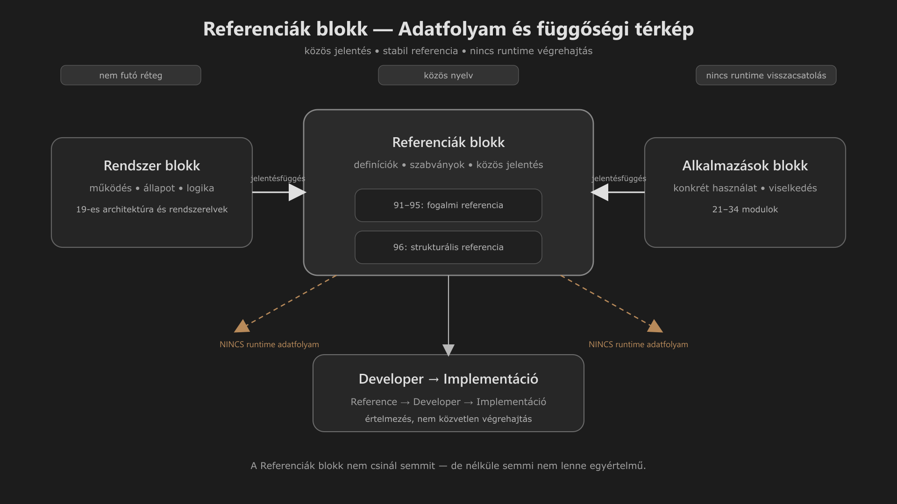

-   

    # 99. Referenciák blokk – Architektúra (DEV) { #99-referenciak-blokk-architektura-dev }

    > Szerző: Hegedüs Gábor (@hege-g) 
    > Licenc: [MIT (Kód) / CC BY-NC-ND 4.0 (Docs)] 
    > Frostwood Docs: v1.0.0 
    > Rendszerverzió / Állapot: v1.0.5 / Fejlesztői 
    > Blokk:  Referenciák 
    > Belső fejlesztői dokumentum 
    > Kapcsolódik: `19. Rendszer blokk – Architektúra térkép (DEV AUDIT)` 
    > Kapcsolódik: `89. Alkalmazások blokk – Architektúra (DEV)` 
    > Kapcsolódik: `97. Frostwood ikonarchitektúra`

-   ## Tartalomkártyák

    * [:material-infinity: 1. Cél](#1-cel)
    * [:material-infinity: 2. Pozíció a rendszerben](#2-pozicio-a-rendszerben)
        * [:material-infinity: 2.1 Jelentése](#21-jelentese)
    * [:material-infinity: 3. Fő elv](#3-fo-elv)
    * [:material-infinity: 4. Tartalmi kategóriák](#4-tartalmi-kategoriak)
        * [:material-infinity: 4.1 Definíciók](#41-definiciok)
        * [:material-infinity: 4.2 Irányelvek](#42-iranyelvek)
        * [:material-infinity: 4.3 Meta információ](#43-meta-informacio)
    * [:material-infinity: 5. Jelenlegi struktúra (validált)](#5-jelenlegi-struktura-validalt)
    * [:material-infinity: 6. Modulonkénti szerep](#6-modulonkenti-szerep)
        * [:material-infinity: 6.1 91 — Színkódok](#61-91-szinkodok)
        * [:material-infinity: 6.2 92 — Jelzés-színek és Jelzés-viselkedés](#62-92-jelzes-szinek-es-jelzes-viselkedes)
        * [:material-infinity: 6.3 93 — Útiterv](#63-93-utiterv)
        * [:material-infinity: 6.4 94 — Rendszer áttekintés](#64-94-rendszer-attekintes)
        * [:material-infinity: 6.5 95 — Változásnapló](#65-95-valtozasnaplo)
        * [:material-infinity: 6.6 96 — Telepítőcsomag struktúra és Mappatérkép](#66-96-telepitocsomag-struktura-es-mappaterkep)
        * [:material-infinity: 6.7 97 — Frostwood ikonarchitektúra](#67-97-frostwood-ikonarchitektura)
    * [:material-infinity: 7. Adatáramlás (fontos különbség)](#7-adataramlas-fontos-kulonbseg)
        * [:material-infinity: 7.1 Nem történik](#71-nem-tortenik)
        * [:material-infinity: 7.2 Ami történik](#72-ami-tortenik)
    * [:material-infinity: 8. Strukturális referenciafájlok szerepe](#8-strukturalis-referenciafajlok-szerepe)
        * [:material-infinity: 8.1 Mire használható](#81-mire-hasznalhato)
        * [:material-infinity: 8.2 Mire nem használható](#82-mire-nem-hasznalhato)
    * [:material-infinity: 9. Függőségi modell](#9-fuggosegi-modell)
        * [:material-infinity: 9.1 Egyirányú kapcsolat](#91-egyiranyu-kapcsolat)
        * [:material-infinity: 9.2 Nincs visszacsatolás](#92-nincs-visszacsatolas)
    * [:material-infinity: 10. Mi NEM kerülhet ide](#10-mi-nem-kerulhet-ide)
        * [:material-infinity: 10.1 Tiltott tartalom](#101-tiltott-tartalom)
        * [:material-infinity: 10.2 Miért](#102-miert)
    * [:material-infinity: 11. Generált referenciafájlok kezelése](#11-generalt-referenciafajlok-kezelese)
        * [:material-infinity: 11.1 Frissítés szabálya](#111-frissites-szabalya)
        * [:material-infinity: 11.2 Fejlesztői érték](#112-fejlesztoi-ertek)
    * [:material-infinity: 12. Kapcsolat az Alkalmazások blokkal](#12-kapcsolat-az-alkalmazasok-blokkal)
        * [:material-infinity: 12.1 Kapcsolat típusa](#121-kapcsolat-tipusa)
        * [:material-infinity: 12.2 Példa](#122-pelda)
    * [:material-infinity: 13. Verziókezelés](#13-verziokezeles)
    * [:material-infinity: 14. Dokumentációs szabályok](#14-dokumentacios-szabalyok)
    * [:material-infinity: 15. Bővíthetőség](#15-bovithetoseg)
    * [:material-infinity: 16. Kapcsolódás a DEV architektúrához](#16-kapcsolodas-a-dev-architekturahoz)
    * [:material-infinity: 17. A Referenciák blokk belső bontása](#17-a-referenciak-blokk-belso-bontasa)
        * [:material-infinity: 17.1 Fogalmi referencia](#171-fogalmi-referencia)
        * [:material-infinity: 17.2 Strukturális referencia](#172-strukturalis-referencia)
        * [:material-infinity: 17.3 Dokumentációs szabványréteg](#173-dokumentacios-szabvanyreteg)
        * [:material-infinity: 17.4 Fejlesztői és részben publikus szerep](#174-fejlesztoi-es-reszben-publikus-szerep)
    * [:material-infinity: 18. Összegzés](#18-osszegzes)
    * [:material-infinity: 19. Alapelv (DEV)](#19-alapelv-dev)

## 1. Cél

A Referenciák blokk a Frostwood rendszer:

> Stabil, ritkán változó, globálisan használt tudásrétege.

Ez a blokk nem végrehajt, nem állapotot kezel, nem módosít rendszert.

Hanem:

* definíciókat ad
* szabványokat rögzít
* közös jelentést biztosít

---

## 2. Pozíció a rendszerben

A Referenciák blokk a következő helyen áll:

**[Rendszer blokk] → [Referenciák blokk] → [Alkalmazások blokk]**

??? info "Vizuális leírás akadálymentesítéshez"
    Az ábra három fő csomópontot mutat: Rendszer blokk, Referenciák blokk és Alkalmazások blokk.

    A Referenciák blokk középen helyezkedik el, kiemelt, stabil csomópontként.

    Bal oldalon a Rendszer blokk látható, jobb oldalon az Alkalmazások blokk.

    Mindkét irányból nyilak mutatnak a Referenciák blokk felé, jelezve, hogy a rendszer és az alkalmazások a központi definíciókból, szabványokból és jelentésekből építkeznek.

    A Referenciák blokkból nem indulnak visszafelé mutató nyilak, ami azt jelzi, hogy nincs runtime adatfolyam vagy visszacsatolás.

    Az ábra alsó részén egy külön jelölés mutatja, hogy a kapcsolat nem közvetlen végrehajtás, hanem fejlesztői értelmezésen keresztül történik.

    A diagram célja annak bemutatása, hogy a Referenciák blokk stabil, nem futó réteg, amely egységes jelentést biztosít a teljes Frostwood rendszer számára.

### 2.1 Jelentése

* Rendszer blokk → működés
* Referenciák blokk → jelentés
* Alkalmazások blokk → konkrét használat

---

## 3. Fő elv

A Referenciák blokk:

> Nem tartalmaz viselkedést.

Ez kritikus.

Nem:

* nem futtat logikát
* nem ír registry-t
* nem hív scriptet

---

## 4. Tartalmi kategóriák

A Referenciák blokk három típusú információt tartalmaz:

-   ### 4.1 Definíciók

    Például:

    * színkódok
    * jelzés jelentések
    * fogalmak

-   ### 4.2 Irányelvek

    Például:

    * jelzés intenzitás
    * UI viselkedési elvek
    * WCAG megfelelés

-   ### 4.3 Meta információ

    Például:

    * változásnapló
    * útiterv
    * rendszer áttekintés

---

## 5. Jelenlegi struktúra (validált)

* `91-szinkodok.md`
* `92-jelzes-szinek.md`
* `93-utiterv.md`
* `94-rendszer-attekintes.md`
* `95-valtozasnaplo.md`
* `96-telepitocsomag-struktura.md`
* `97-frostwood-ikonarchitektura-guide.md`
* `99-referenciak-blokk-architektura--dev.md`

A Referenciák blokk így háromféle referenciaforrást tartalmaz:

* **Szöveges referenciafájlokat:** `.md`
* **Dokumentációs szabványfájlt:** `97-frostwood-ikonarchitektura-guide.md`
* **Struktúra-alapú referenciafájlt:** `.md → .html → .md`

---

## 6. Modulonkénti szerep

-   ### 6.1 91 — Színkódok

    Szerep:

    * globális színrendszer
    * UI és ikonok alapja

    Függnek tőle:

    * Visuals
    * Icons
    * SignalColors

-    ### 6.2 92 — Jelzés-színek és Jelzés-viselkedés

    Szerep:

    * jelentés → szín mapping
    * állapot visszajelzés

    Kapcsolat:

    * SignalColors modul
    * Installer hanglogika (közvetve)

-   ### 6.3 93 — Útiterv

    Szerep:

    * jövőbeli irány
    * nem futó logika

    ???+ warning "Fontos"
        > Nem kötelező érvényű rendszerkomponens.

-   ### 6.4 94 — Rendszer áttekintés

    Szerep:

    * magas szintű összefoglaló
    * onboarding támogatás

    Kapcsolat:

    * 19 DEV architektúra (részletesebb)

-   ### 6.5 95 — Változásnapló

    Szerep:

    * verzió követés
    * módosítások dokumentálása

    ???+ warning "Fontos"
        Nem tartalmaz implementációt.

-   ### 6.6 96 — Telepítőcsomag struktúra és Mappatérkép

    Szerep:

    * a teljes Frostwood csomag fájl- és mappaszerkezetének böngészhető nézete
    * gyors audit és ellenőrzés
    * vizuális és technikai keresési segédlet

    Formátum:

    * Markdown
    * HTML
    * részletezhető / lenyitható mappanézet
    * közvetlen fájlhivatkozásokkal

    A `96-mappaterkep.html → 96-telepitocsomag-struktura.md` nem működési dokumentum, hanem:

    > Strukturális referenciafájl.

    Kapcsolat:

    * támogatja a telepítőcsomag ellenőrzését
    * segíti a dokumentáció és a valós fájlrendszer összevetését
    * gyors hibakeresési támasz fejlesztői és karbantartói környezetben

    ???+ note "Megjegyzés a generált mappatérképhez"
        A `96-mappaterkep.html` tartalmazhat ideiglenes vagy munkakönyvtár-jellegű elemeket is, például:

        * `_tmp\`

        Ezek:

        * nem a Frostwood végleges runtime struktúrájának részei
        * audit és előkészítési nyomok lehetnek
        * külön kezelendők a végleges `Payload\` struktúrától

        **Fejlesztői olvasat során a `Payload\` tekintendő elsődleges forrásnak.**

-   ### 6.7 97 — Frostwood ikonarchitektúra

    Szerep:

    * a dokumentációs ikonrendszer hivatalos specifikációja
    * C1/C2 modulikonok, blokkikonok és függelék ikonok szabályrendszere
    * index ikonarchitektúra és speciális dokumentációs modulok leírása
    * Frostwood dokumentációs billentyűnavigáció szabványosítása

    Kapcsolat:

    * `frostwood-extra-icons.css`
    * `frostwood-architecture-fixes.css`
    * `frostwood-toggles.js`
    * Referenciák blokk vizuális és akadálymentességi szabályai

    A `97-frostwood-ikonarchitektura-guide.md` nem runtime modul, hanem:

    > Dokumentációs szabvány- és karbantartási referencia.

    ???+ note "Megjegyzés a 97. modul szerepéhez"
        A 97. modul a Referenciák blokkban különleges helyet foglal el.

        Nem színrendszer, nem mappatérkép és nem változásnapló, hanem a dokumentáció vizuális navigációs rétegének szabályozó dokumentuma.

        Ezért a 99-es DEV architektúrában a dokumentációs szabványréteg részeként kell kezelni.

---

## 7. Adatáramlás (fontos különbség)

A Referenciák blokk nem része a közvetlen, automatizált adatfolyamnak.

-   ### 7.1 Nem történik

    A blokk elemei nincsenek közvetlen funkcionális hatással a magrendszerre vagy az automatizmusokra.

    :material-close-circle-outline: Inaktív irányok:

    * **Reference → Engine:** Kizárt közvetlen szoftveres magkapcsolat.
    * **Reference → Script:** Nem történik dinamikus kód-szintű végrehajtás.
    * **Reference → Registry:** Nincs közvetlen konfigurációs rendszerbejegyzés.

-   ### 7.2 Ami történik

    A dokumentáció kizárólag a fejlesztői rétegen keresztül, manuális tervezéssel válik implementációvá.

    :material-check-circle-outline: Fejlesztői adatfolyam:
    * **Reference → Developer:** A fejlesztő feldolgozza, értelmezi a leírásokat és az arculatot.
    * **Developer → Implementáció:** Manuális konfigurációs hangolás és illesztés történik a célkörnyezetben.

---
	
## 8. Strukturális referenciafájlok szerepe

A Referenciák blokkban a `96-mappaterkep.html` külön kategóriát képvisel.

Ez a fájl nem definíciót rögzít, mint a `91–95` modulok, hanem:

* a csomag aktuális állapotát mutatja meg
* ellenőrizhetővé teszi a valós struktúrát
* navigációs segédletet ad a fejlesztőnek

Ezért a `96-mappaterkep.html` szerepe:

> Nem fogalmi referencia, hanem strukturális referencia.

-   ### 8.1 Mire használható

    * gyors ellenőrzésre, hogy a `Payload\` szerkezet teljes-e
    * annak ellenőrzésére, hogy egy dokumentált fájl ténylegesen létezik-e
    * annak áttekintésére, hogy a rendszer mely mappákra épül
    * verziók közötti szerkezeti különbségek felismerésére

-   ### 8.2 Mire nem használható

    * nem helyettesíti a működési dokumentációt
    * nem helyettesíti a rendszerlogikai leírást
    * nem tekinthető önmagában specifikációnak

    A `96-mappaterkep.html` azt mutatja meg:

    > Mi van a csomagban.

    de nem azt:

    > Mi miért van ott és hogyan működik.

---

## 9. Függőségi modell

-   ### 9.1 Egyirányú kapcsolat

    A Referenciák modul elemei egyoldalú függőséget alkotnak a főbb rendszerelemekkel.

    :material-arrow-right-bold-circle-outline: Függőségi irányok:

    * **Referenciák → Rendszer:** Az alapvető specifikációk meghatározzák a rendszer elveit.
    * **Referenciák → Alkalmazások:** A színek és ikonok keretet adnak a szoftverek felületének.

-   ### 9.2 Nincs visszacsatolás

    A célzott modulok működése nem hat vissza a referencia-dokumentáció szerkezetére.

    :material-alert-circle-outline: Kötöttségi korlátok:

    * **Rendszer → Referenciák:** A futásidejű magrendszer nem módosítja a dokumentált szabályokat (NINCS runtime).
    * **Alkalmazások → Referenciák:** A külső alkalmazások állapota független a leírt alapelvektől (NINCS runtime).

---

## 10. Mi NEM kerülhet ide

Ez kritikus blokk.

-   ### 10.1 Tiltott tartalom

    * script
    * registry művelet
    * telepítési lépés
    * parancsikon logika
    * watcher viselkedés

-   ### 10.2 Miért

    Mert:

    > A Referenciák blokk elvesztené a stabilitását.

---

## 11. Generált referenciafájlok kezelése

A Referenciák blokk tartalmazhat **generált, de stabilan használható** referenciafájlokat is.

Ilyen a:

* `96-mappaterkep.html`

Ez megengedett, mert:

* nem futtat logikát
* nem módosít állapotot
* nem része a runtime működésnek
* kizárólag megfigyelési és audit célt szolgál

-   ### 11.1 Frissítés szabálya

    A `96-mappaterkep.html` nem kézzel szerkesztett fődokumentum, hanem:

    > Újragenerálható referenciaállomány.

    Ezért a módosítási elv:

    * a tartalmát nem kézzel kell karbantartani
    * szükség esetén újra kell generálni a valós fájlrendszerből
    * a dokumentációban csak a szerepét kell leírni, nem a konkrét HTML-kódját

-   ### 11.2 Fejlesztői érték

    A generált mappatérkép különösen hasznos:

    * telepítőcsomag auditnál
    * hiányzó fájlok keresésénél
    * elnevezési hibák felismerésénél
    * dokumentáció ↔ valós csomag egyeztetésénél

---

## 12. Kapcsolat az Alkalmazások blokkal

* **Az Alkalmazások blokk:** 21–34 modul

-   ### 12.1 Kapcsolat típusa

    Az alkalmazások:

    * használják a referenciákat
    * nem módosítják azokat

-   ### 12.2 Példa

    Alkalmazás:

    * használja a színkódokat

    De:

    * nem definiál új színrendszert

---

## 13. Verziókezelés

A Referenciák blokk:

> Lassabban változik, mint a rendszer.

Következmény:

* stabil hivatkozási pont
* kisebb törési kockázat

---

## 14. Dokumentációs szabályok

A Referenciák blokk:

* leíró jellegű
* rövidebb
* definíció alapú

Kerülendő:

* hosszú narratíva
* implementációs részletek
* túl technikai script leírás

---

## 15. Bővíthetőség

Új referencia csak akkor kerülhet ide, ha:

* több modul használja
* nem viselkedés
* nem függ runtime állapottól

---

## 16. Kapcsolódás a DEV architektúrához

Ez a blokk:

* kiegészíti a 19-es modult
* nem duplikálja azt

---

## 17. A Referenciák blokk belső bontása

A Referenciák blokk két alrétegre bontható:

-   ### 17.1 Fogalmi referencia

    Ide tartozik:

    * `91-szinkodok.md`
    * `92-jelzes-szinek.md`
    * `93-utiterv.md`
    * `94-rendszer-attekintes.md`
    * `95-valtozasnaplo.md`

    Ez a réteg:

    * jelentést ad
    * fogalmat rögzít
    * irányt dokumentál

-   ### 17.2 Strukturális referencia

    Ide tartozik:

    * `96-telepitocsomag-struktura.md`
    * `96-mappaterkep.html`

    Ez a réteg:

    * a valós csomagstruktúrát mutatja
    * fájl- és mappaszinten segíti az auditot
    * nem elvi, hanem szerkezeti támasz

    A strukturális referencia jelenlegi eleme:

    * `96-mappaterkep.html`

    Ez generált, de referenciaértékű fájl, mert:

    * a dokumentáció és a valós fájlrendszer összevetését támogatja
    * audit célra használható
    * nem működési logikát, hanem szerkezeti állapotot rögzít

-   ### 17.3 Dokumentációs szabványréteg

    Ide tartozik:

    * `97-frostwood-ikonarchitektura-guide.md`

    Ez a réteg:

    * a dokumentáció vizuális navigációs szabályait rögzíti
    * meghatározza az ikonarchitektúra használatát
    * leírja a C1/C2, függelék, index és block icon mintákat
    * szabványosítja a Frostwood dokumentációs billentyűnavigációt

    A 97. modul nem működési logika, hanem dokumentációs szabvány.

    Ezért kapcsolódik:

    * a Referenciák blokkhoz mint hivatalos szabványforráshoz
    * a 99-es DEV architektúrához mint belső értelmezési kerethez
    * a CSS/JS réteghez mint megvalósítási felülethez

-   ### 17.4 Fejlesztői és részben publikus szerep

    A modul DEV jelölésű, de nem pusztán belső jegyzet.

    Tartalmaz:

    * fogalmi összefoglalást
    * blokk-szintű értelmezési keretet
    * más modulok közti kapcsolatokat

    Ezért:

    > Fejlesztői elsődlegességű, de részben publikus értelmezési szerepet is betölt.

---

## 18. Összegzés

A Referenciák blokk:

* nem aktív komponens
* nem végrehajtó réteg
* nem állapotkezelő

Hanem:

> A rendszer „közös nyelve”.

---

## 19. Alapelv (DEV)

> A Referenciák blokk nem csinál semmit, 
> de nélküle semmi nem lenne egyértelmű.

> Nem fut, 
> de minden futás rá épül.