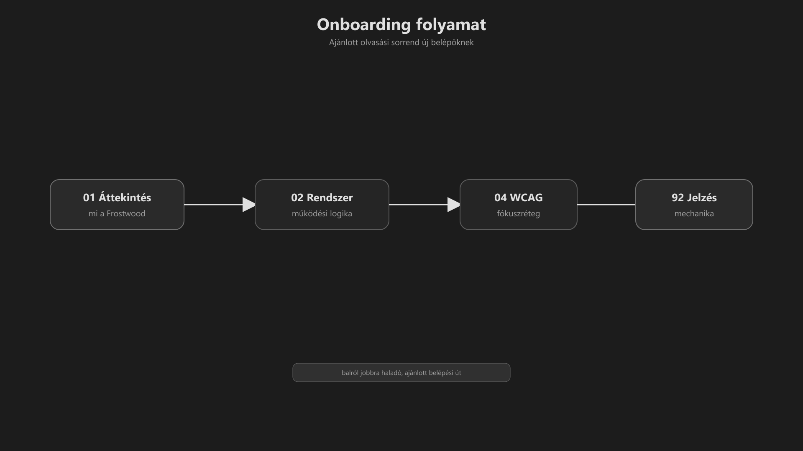
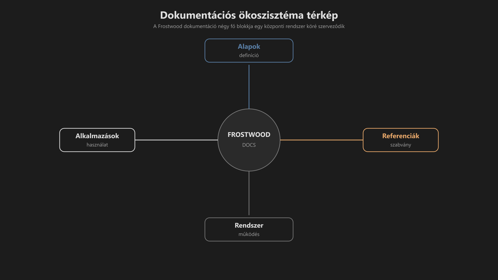

# Frostwood Dokumentáció

> A Frostwood egy állapotalapú, WCAG-központú Windows 11 munkakörnyezet-rendszer.

A dokumentáció célja:

* a rendszer működési logikájának rögzítése,
* a modulok közötti kapcsolatok bemutatása,
* az akadálymentes működés biztosítása,
* valamint a hosszú távon stabil, fókuszált használat támogatása.

-   ## Tartalomkártyák

    * [:material-infinity: Gyors belépési térkép](#gyors-belepesi-terkep)
    * [:material-infinity: Gyors rendszerszintű nézetek](#gyors-rendszerszintu-nezetek)
    * [:material-infinity: Dokumentációs blokkok](#dokumentacios-blokkok)
        * [:material-infinity: Alapok blokk](#alapok-blokk)
        * [:material-infinity: Rendszer blokk](#rendszer-blokk)
        * [:material-infinity: Alkalmazások blokk](#alkalmazasok-blokk)
        * [:material-infinity: Referenciák blokk](#referenciak-blokk)
    * [:material-infinity: Dokumentációs alapelvek](#dokumentacios-alapelvek)
    * [:material-infinity: Projektinformációk](#projektinformaciok)

??? info "Vizuális leírás akadálymentesítéshez"
    Az ábra egy lineáris olvasási útvonalat mutat.

    A bal oldalon az „Áttekintés” található, amely a rendszer alapjait ismerteti.

    Ezt követi a „Rendszerleírás”, majd a „WCAG fókusz”, végül a „Jelzésmechanika”.

    A nyilak az ajánlott haladási irányt jelölik.

    Az ábra célja, hogy az új felhasználó gyorsan és logikusan tudjon elindulni a dokumentációban.

-   ## :material-compass-outline: Gyors belépési térkép

    Ez a rész segít eldönteni, hol érdemes kezdeni a dokumentációt.

    ### Ha most telepíted

    1. [01. Áttekintés](01-attekintes.md#01-attekintes)
       → Megérted, mi a Frostwood.

    2. [02. Rendszerleírás](02-rendszerleiras.md#02-rendszerleiras)
       → Megérted a működési logikát.

    3. [04. WCAG fókusz](04-wcag-fokusz-reteg.md#04-wcag-fokusz-reteg)
       → Hogyan működik a fókuszréteg.

    4. [05. Jelzésmechanika](05-jelzesmechanika.md#05-jelzesmechanika)
       → Mit, hogyan és miért jelez a rendszer.

-   ## Gyors rendszerszintű nézetek

    * [Rendszerkártya](rendszerkartya.md#rendszerkartya-gyors-attekintes)
      → Egyoldalas technikai összefoglaló.

    * [Rendszerdiagram](rendszerdiagram.md#rendszerdiagram-gyors-attekintes)
      → A modulok és működési rétegek kapcsolati térképe.

    * [Letöltések](letoltesek.md#letoltesek)
      → A teljes Frostwood rendszer telepítő- és konfigurációs csomagja.

---

##  Dokumentációs blokkok

-   

    ### [Alapok blokk](alapok-blokk.md#alapok-blokk)

    A Frostwood filozófiája, működési logikája és vizuális alapjai.

    **Rendszerlogikai alapok:**

    * rendszeralapok
    * színrendszer
    * jelzésmechanika
    * WCAG fókuszréteg
    * ikonrendszer

    [:material-cube-send: Alapok blokk megnyitása](alapok-blokk.md#alapok-blokk){ .md-button }

-   

    ### [Rendszer blokk](rendszer-blokk.md#rendszer-blokk)

    A működési, telepítési és stabilizálási rétegek.

    **Működési mechanizmus:**

    * Munka asztal modell
    * AutoDarkMode integráció
    * SoftLock rendszer
    * telepítő és eltávolító
    * batch keretrendszer

    [:material-cube-send: Rendszer blokk megnyitása](rendszer-blokk.md#rendszer-blokk){ .md-button }

-   

    ### [Alkalmazások blokk](alkalmazasok-blokk.md#alkalmazasok-blokk)

    Frostwood-kompatibilis alkalmazásmodellek.

    **Integrációs környezet:**

    * fájlkezelő és biztonsági rétegek
    * böngészők és AI eszközök
    * irodai, kommunikációs és speciális eszközök
    * kisegítő technológiák

    [:material-cube-send: Alkalmazások blokk megnyitása](alkalmazasok-blokk.md#alkalmazasok-blokk){ .md-button }

-   

    ### [Referenciák blokk](referenciak-blokk.md#referenciak-blokk)

    Közös jelentésréteg, audit és referenciaarchitektúra.

    **Audit és referencia-keret:**

    * színkódok
    * jelzés-színek
    * útiterv
    * változásnapló
    * telepítőcsomag-struktúra
    * ikonarchitektúra

    [:material-cube-send: Referenciák blokk megnyitása](referenciak-blokk.md#referenciak-blokk){ .md-button }

??? info "Vizuális leírás akadálymentesítéshez"
    Az ábra a Frostwood dokumentáció felépítését mutatja.

    Középpontban a „Frostwood Docs” található. Innen négy irányba ágazik ki a struktúra:

    - Felfelé az „Alapok” blokk, amely definíciókat tartalmaz.
    - Lefelé a „Rendszer” blokk, amely a működést írja le.
    - Balra az „Alkalmazások” blokk, amely a konkrét használatot mutatja.
    - Jobbra a „Referenciák” blokk, amely szabványokat és közös jelentéseket rögzít.

    Az egyes blokkok eltérő szerepet töltenek be, de ugyanarra a működési logikára épülnek.

    A vonalak nem adatfolyamot, hanem logikai kapcsolatot jelölnek.

    Az ábra célja a dokumentáció gyors áttekinthetőségének biztosítása.

---

## :material-puzzle-outline: Dokumentációs alapelvek

* A dokumentáció moduláris.
* Nem kell mindent sorrendben elolvasni.
* Minden modul önállóan is értelmezhető.
* Az ismétlések szándékosak a stabil megértés érdekében.
* A rendszer dokumentáció nélkül is használható.

Alapelv:

> A Frostwood dokumentáció nem fájlok halmaza, 
> hanem rétegzett rendszerleírás.

---

## :material-scale-balance: Projektinformációk

* **Fejlesztő:** Hegedüs Gábor (@hege-g)
* **Dokumentáció:** Frostwood Docs v1.0.0
* **Rendszerverzió:** v1.0.5 Stabil
* **Licenc:**  [Projekt Licenc](license.md#projekt-licenc)

> A Frostwood egy hibrid licencelésű rendszer. A "motor" szabad, a "tudás" és a "név" védett.

???+ warning "Licenc-figyelmeztetés"
    A projekt szöveges dokumentációja, vizuális arculati elemei (beleértve az izometrikus kocka logót és vízjeleket) kereskedelmi forgalomba nem hozhatók, és nem módosíthatók a szerző írásos engedélye nélkül.
