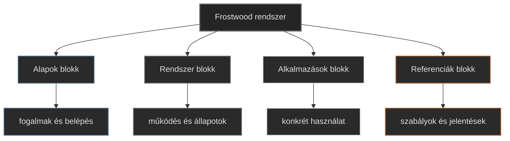

-   

    # Rendszerdiagram (gyors áttekintés) { #rendszerdiagram-gyors-attekintes }

    > Szerző: Hegedüs Gábor (@hege-g) 
    > Licenc: [MIT (Kód) / CC BY-NC-ND 4.0 (Docs)] 
    > Frostwood Docs: v1.0.0 
    > Rendszerverzió / Állapot: v1.0.5 / Stabil 

-   ## Tartalomkártyák

    * [:material-infinity: Rendszerdiagram](#rendszerdiagram)
        * [:material-infinity: Alapok blokk](#alapok-blokk-cel)
        * [:material-infinity: Rendszer blokk](#rendszer-blokk-cel)
        * [:material-infinity: Alkalmazások blokk](#alkalmazasok-blokk-cel)
        * [:material-infinity: Referenciák blokk](#referenciak-blokk-cel)

## Rendszerdiagram

Ez az ábra a Frostwood dokumentáció belépési térképe. Segít gyorsan eldönteni, hogy melyik blokkban érdemes kezdeni az olvasást.

??? info "Vizuális leírás akadálymentesítéshez"
    Az ábra a Frostwood dokumentáció fő belépési struktúráját mutatja.

    A középpontban a „Frostwood rendszer” található. Ebből négy fő blokk ágazik ki:

    1. Az Alapok blokk, amely a fogalmi bevezetést és az alapvető megértést szolgálja.  
    2. A Rendszer blokk, amely a működési logikát és az állapotmodelleket írja le.  
    3. Az Alkalmazások blokk, amely a konkrét használati eseteket és programokat mutatja be.  
    4. A Referenciák blokk, amely a szabályokat, definíciókat és közös jelentéseket tartalmazza.  

    Az ábra célja, hogy segítse a felhasználót a dokumentáció gyors és zavartalan bejárásában.