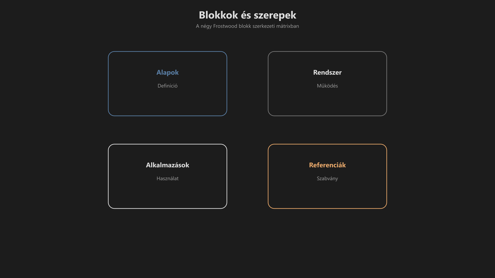
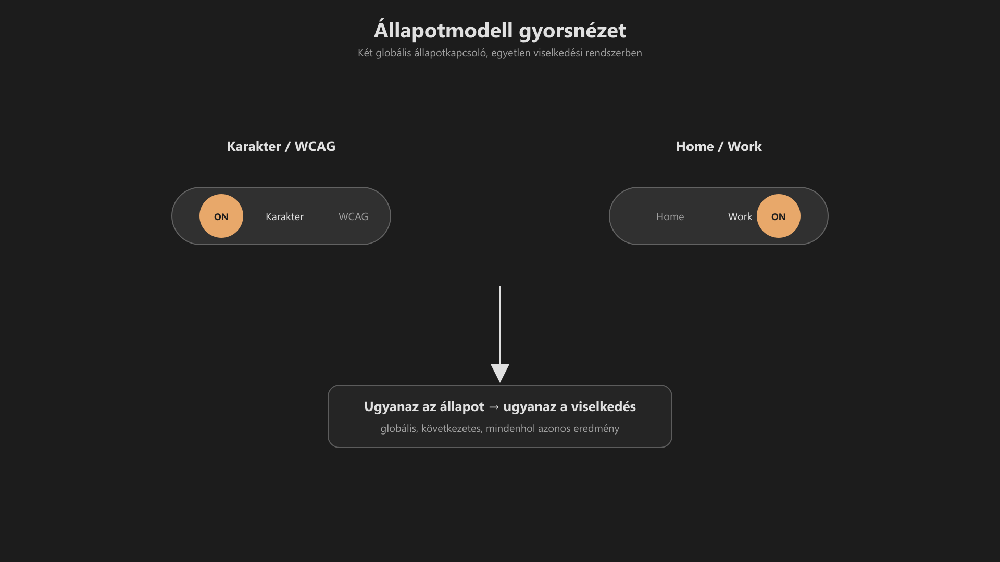

-   

    # Rendszerkártya (gyors áttekintés) { #rendszerkartya-gyors-attekintes }

    > Szerző: Hegedüs Gábor (@hege-g) 
    > Licenc: [MIT (Kód) / CC BY-NC-ND 4.0 (Docs)] 
    > Frostwood Docs: v1.0.0 
    > Rendszerverzió / Állapot: v1.0.5 / Stabil 
    > Cél: gyors megértés + audit támogatás

-   ## Tartalomkártyák

    * [:material-infinity: 1. Mi ez a dokumentum?](#1-mi-ez-a-dokumentum)
    * [:material-infinity: 2. A rendszer lényege](#2-a-rendszer-lenyege)
    * [:material-infinity: 3. Blokkok és szerepek](#3-blokkok-es-szerepek)
    * [:material-infinity: 4. Modul típusok (összkép)](#4-modul-tipusok-osszkep)
        * [:material-infinity: 4.1 Alapok blokk](#41-alapok-blokk)
        * [:material-infinity: 4.2 Rendszer blokk](#42-rendszer-blokk)
        * [:material-infinity: 4.3 Alkalmazások blokk](#43-alkalmazasok-blokk)
        * [:material-infinity: 4.4 Referenciák blokk](#44-referenciak-blokk)
    * [:material-infinity: 5. Állapotmodell (röviden)](#5-allapotmodell-roviden)
    * [:material-infinity: 6. Két fő pillér](#6-ket-fo-piller)
        * [:material-infinity: 6.1 Karakter mód](#61-karakter-mod)
        * [:material-infinity: 6.2 WCAG mód](#62-wcag-mod)
    * [:material-infinity: 7. Jelzésmodell](#7-jelzesmodell)
    * [:material-infinity: 8. Stabilitási alapelvek](#8-stabilitasi-alapelvek)
    * [:material-infinity: 9. Gyors audit lista](#9-gyors-audit-lista)
        * [:material-infinity: 9.1 Vizuális](#91-vizualis)
        * [:material-infinity: 9.2 Jelzés](#92-jelzes)
        * [:material-infinity: 9.3 Működés](#93-mukodes)
    * [:material-infinity: 10. Határok](#10-hatarok)
    * [:material-infinity: 11. Végső alapelv](#11-vegso-alapelv)

## 1. Mi ez a dokumentum?

Ez a fájl a Frostwood rendszer **egyoldalas összefoglalója**.

Nem részletes leírás, hanem:

* gyors belépési pont  
* rendszerkép  
* audit segédlet  

---

## 2. A rendszer lényege

A Frostwood:

* állapotalapú rendszer  
* zajcsökkentésre optimalizált  
* hosszú munkára tervezett  
* képernyőolvasóval is stabil  

Nem:

* skin  
* theme-pack  
* vizuális effekt rendszer  

---

## 3. Blokkok és szerepek

-   ### Alapok

    :material-book-open-page-variant: **Definíció**

    A rendszer elméleti és vizuális alappillérei.

-   ### Rendszer

    :material-cog: **Működés**

    A Frostwood technikai logikája és háttérfolyamatai.

-   ### Alkalmazások

    :material-apps: **Használat**

    Konkrét szoftverekhez tartozó beállítási útmutatók.

-   ### Referenciák

    :material-file-document-check: **Szabvány / Audit**

    Technikai szabványok, ellenőrzőlisták és kompatibilitási adatok.

??? info "Vizuális leírás akadálymentesítéshez"
    Az ábra négy blokkot mutat egy négyzetben elrendezve.

    - A bal felső sarokban az „Alapok” található, amely definíciókat tartalmaz.
    - A jobb felső sarokban a „Rendszer”, amely a működést írja le.
    - A bal alsó sarokban az „Alkalmazások”, amely a használatot mutatja.
    - A jobb alsó sarokban a „Referenciák”, amely szabványokat rögzít.

    Az elrendezés segít a blokkok szerepének gyors felismerésében.

---

## 4. Modul típusok (összkép)

-   ### 4.1 Alapok blokk

    A rendszer alapjait képező modulok logikai rendszere az alábbiak szerint épül fel:

    #### Bevezetés

    :material-information-outline: **01. Modul**

    #### Központi modell

    :material-sitemap: **02. Modul**

    #### Jelentésrendszer

    :material-bell-ring-outline: **03, 05. Modul**

    #### Fókuszréteg

    :material-focus-field: **04. Modul**

    #### Kötelező alapelv

    :material-gavel: **06. Modul**

    #### Interfész / input

    :material-keyboard-outline: **07. Modul**

    #### Vizuális szabvány

    :material-palette-outline: **08, 09. Modul**

-   ### 4.2 Rendszer blokk

    A rendszer működését támogató modulok logikai összessége:

    #### Állapotmodell

    :material-hexagon-slice-6: **11, 14. Modul**

    #### Trigger / integráció

    :material-database-sync: **12. Modul**

    #### Stabilizáló logika

    :material-shield-check-outline: **13. Modul**

    #### Inaktív réteg

    :material-lock-outline: **15. Modul**

    #### Telepítés / restore

    :material-backup-restore: **16, 17. Modul**

    #### Végrehajtási keret

    :material-cog-play-outline: **18. Modul**

    #### Architektúra

    :material-sitemap: **19. Modul**

-   ### 4.3 Alkalmazások blokk

    A rendszerbe integrált alkalmazások és kognitív rétegek logikai elrendezése:

    #### Rendszerközeli és fájlkezelés

    :material-folder-cog-outline: **21, 22, 34. Modul**

    #### Böngésző réteg

    :material-web: **23, 24, 25. Modul**

    #### Irodai és kommunikációs réteg

    :material-microsoft-office: **26, 27, 28. Modul**

    #### Kisegítő technológia

    :material-wheelchair-accessibility: **29, 30. Modul**

    #### Speciális munkaeszközök

    :material-toolbox-outline: **31. Modul**

    #### AI / kognitív réteg

    :material-brain: **32, 33. Modul**

    #### Fejlesztői architektúra (DEV)

    :material-code-tags: **89. Modul**

-   ### 4.4 Referenciák blokk

    A rendszer technikai, strukturális és szabványügyi dokumentációjának elérése:

    #### Fogalmi referencia

    :material-book-open-variant: **91, 92, 94. Modul**

    #### Jelzés- és színrendszer

    :material-palette-swatch-outline: **91, 92. Modul**

    #### Döntési és verziókeret

    :material-source-branch: **93, 95. Modul**

    #### Strukturális referencia

    :material-file-tree: **96. Modul**

    #### Ikon- és navigációs architektúra

    :material-keyboard-settings-outline: **97. Modul**

    #### Fejlesztői architektúra (DEV)

    :material-code-json: **99. Modul**

---

## 5. Állapotmodell (röviden)

A rendszer nem funkciók, hanem **állapotok mentén működik**:

* Home / Work  
* Light / Dark  
* WCAG fókusz  
* Travel mód  

???+ quote "Alapelv"
    > Ugyanaz az állapot → ugyanaz a viselkedés.

??? info "Vizuális leírás akadálymentesítéshez"
    Az ábra két kapcsolót jelenít meg.

    - Az egyik a „Karakter” és „WCAG” mód közötti váltást mutatja.
    - A másik a „Home” és „Work” környezet közötti különbséget jelzi.

    A két kapcsoló együtt határozza meg a rendszer viselkedését.

    Az ábra hangsúlyozza, hogy ugyanaz az állapot mindenhol következetesen ugyanazt az eredményt adja.

---

## 6. Két fő pillér

-   ### 6.1 Karakter mód

    * vizuális identitás  
    * meleg, anyagszerű tónus  
    * alacsony inger  

-   ### 6.2 WCAG mód

    * egyszínű háttér  
    * minimális jelzés  
    * fókuszált működés  

---

## 7. Jelzésmodell

* egy esemény = egy jelzés  
* nincs multi-signal  
* jelzés időben lecseng  
* szín nem dekoráció  

---

## 8. Stabilitási alapelvek

* determinisztikus működés  
* visszafordíthatóság  
* admin jog nélkül működik  
* nem módosít kritikus rendszerelemeket  

---

## 9. Gyors audit lista

-   ### 9.1 Vizuális

    * :material-checkbox-blank-outline: Nincs túlkontraszt?
    * :material-checkbox-blank-outline: Narancs csak fókuszban jelenik meg?
    * :material-checkbox-blank-outline: Hover nem jelentésszín?

-   ### 9.2 Jelzés

    * :material-checkbox-blank-outline: Egy esemény = egy jelzés?
    * :material-checkbox-blank-outline: Nincs párhuzamos inger?
    * :material-checkbox-blank-outline: Jelzés megszűnik használat után?

-   ### 9.3 Működés

    * :material-checkbox-blank-outline: Nem igényel admin jogot?
    * :material-checkbox-blank-outline: Állapotok stabilak?
    * :material-checkbox-blank-outline: Travel visszaállítás működik?

---

## 10. Határok

A Frostwood:

* nem shell hack rendszer  
* nem pixel-azonos UI  
* nem admin alapú kontroll  

---

## 11. Végső alapelv

> A rendszer akkor működik jól, 
> ha hosszú használat után is csendes marad.